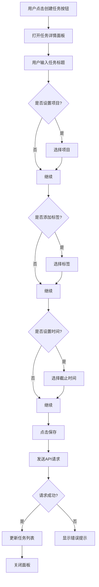
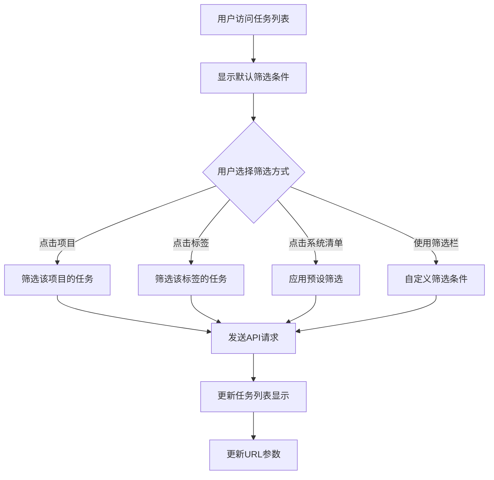
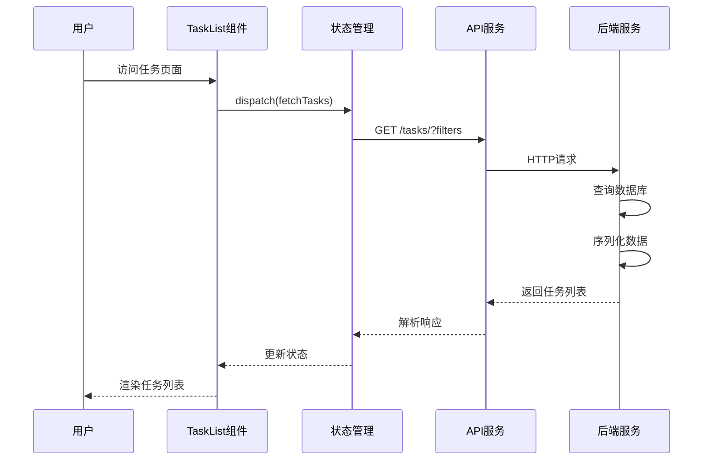
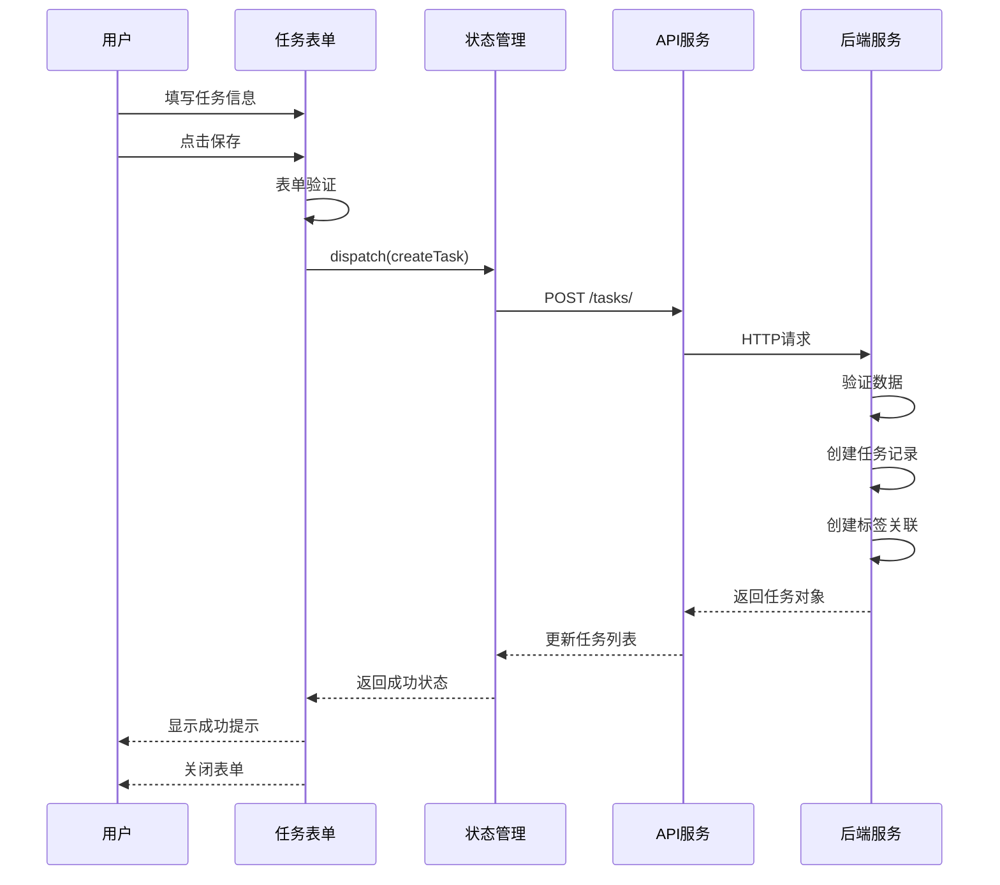

# ChewyQoderProject 功能适配到 ChewySpace 设计文档

## 设计概述

将 ChewyQoderProject 的任务管理功能适配到 ChewySpaceServer(后端)和 ChewySpaceWeb(前端)系统中,实现完整的待办任务管理能力。适配遵循 ChewySpaceServer 现有架构规范,包括认证机制、路由规范和API设计模式。

根据用户要求,项目描述等文案内容必须简短,不超过300字。

## 核心目标

基于 ChewySpaceServer 已有的 todo app 模型,在 ChewySpaceWeb 前端实现与 ChewyQoderProject 功能对等的任务管理界面,提供流畅的用户体验和完整的任务管理能力。

## 现有架构分析

### ChewySpaceServer 后端架构

**项目路径**: `/Users/cone/Cone/CodeSpace/Python/ChewySpaceServer`

**Todo App 结构**:
- 位置: `chewy_space/todo/`
- API路由前缀: `/api/v1/todo/`
- 认证方式: Django REST Framework Token/Session认证

**已有数据模型**:

1. **Group(任务组)**: 用于组织项目的分组层级
   - 字段: uid, name, desc, user, create_time, update_time, is_deleted, deleted_time
   - 特点: 软删除支持,默认任务组自动创建

2. **Project(项目/清单)**: 任务的归属容器
   - 字段: uid, group(外键), name, desc, style(JSON), view_type(list/card), user
   - 特点: 支持列表和卡片两种视图类型,样式可定制

3. **Task(任务)**: 核心任务实体
   - 字段: uid, project(外键), parent(外键自关联), title, content, status(0-3整数), priority(0-3整数), sort_order, is_all_day, start_date, due_date, completed_time, time_zone, tags(多对多)
   - 状态枚举: 0=待分配, 1=待办, 2=已完成, 3=已放弃
   - 优先级枚举: 0=低, 1=中, 2=高, 3=紧急
   - 特点: 支持子任务,全天任务标记,时区设置

4. **Tag(标签)**: 复用全局标签系统
   - 位置: `chewy_space/tags/models.py`
   - 字段: uid, name, color, user
   - 特点: 自动生成视觉友好的颜色

5. **ActivityLog(活动日志)**: 记录任务操作历史
   - 字段: task(外键), project(外键), action, detail, user, create_time
   - 操作类型: created, status_changed, updated, completed, deleted

**重要设计特点**:
- 使用UID而非自增ID作为主键(22字符base64编码)
- 所有模型继承自SoftDeleteModel,支持软删除
- 所有模型自动关联user字段
- Group -> Project -> Task 三层结构
- 标签系统全局共享(与BBTalk共用)

### ChewySpaceWeb 前端现状

**项目路径**: `/Users/cone/Cone/CodeSpace/Python/ChewySpaceWeb`
**当前状态**: 新建项目,仅包含LICENSE文件,需要从头构建前端应用

**技术栈要求**:
- React 19 + TypeScript
- Vite构建工具
- TailwindCSS样式
- Zustand + Redux Toolkit状态管理

## 功能范围调整

**根据用户决策调整:**
- ✅ 保留所有任务CRUD操作
- ✅ 保留项目和标签管理
- ✅ 保留视图和筛选功能
- ✅ 保留统计分析
- ❌ **暂不实现**: 任务标星(`is_starred`)功能
- ❌ **移除**: 笔记功能(根据项目配置)

### ChewyQoderProject 核心功能清单

需要适配的主要功能模块:

**任务管理**
- 任务CRUD操作(创建、读取、更新、删除)
- 任务状态管理(待办、进行中、已完成)
- 优先级设置(无、低、中、高)
- 任务时间管理(开始时间、截止时间、完成时间)
- ~~任务标星功能~~(暂不实现)
- 子任务支持(父子任务关系)
- 任务排序功能

**项目管理**
- 项目CRUD操作
- 项目颜色标识
- 项目收藏和置顶
- 任务归属项目管理

**标签管理**
- 标签CRUD操作
- 任务-标签多对多关联
- 标签颜色管理
- 按标签筛选任务

**视图和筛选**
- 收集箱视图(未分配项目的任务)
- 今日任务视图
- 已完成任务视图
- 已删除任务(垃圾筒)视图
- 项目筛选
- 标签筛选
- 状态和优先级筛选

**统计和分析**
- 任务统计信息(总数、完成数、进行中、逾期)
- 项目任务分布
- 标签使用统计
- 完成率分析

## 架构设计

### 后端架构适配

#### API设计原则

遵循 ChewySpaceServer 现有规范:
- 使用现有认证系统(JWT或其他)
- 遵循现有路由命名规范
- 保持API响应格式一致性
- 使用现有权限控制机制

#### 数据模型映射关系

**ChewySpaceServer模型 → ChewyQoderProject模型对照**

| ChewySpaceServer | ChewyQoderProject | 映射说明 |
|------------------|-------------------|----------|
| Group | 无 | ChewySpaceServer特有,项目分组层级 |
| Project | Project | 基本对应,ChewySpaceServer多了group关联和view_type |
| Task | Task | 字段基本对应,详见下表 |
| Tag | Tag | 共享全局标签系统 |
| ActivityLog | 无 | ChewySpaceServer特有,操作日志 |

**Task模型字段对照**

| ChewySpaceServer字段 | ChewyQoderProject字段 | 类型差异 | 说明 |
|---------------------|----------------------|---------|------|
| uid | id | UID vs 自增ID | ChewySpace使用22字符UID |
| title | title | 一致 | 任务标题 |
| content | description | 字段名不同 | 任务详情 |
| status | status | 整数(0-3) vs 字符串 | 需要映射转换 |
| priority | priority | 整数(0-3) vs 字符串 | 需要映射转换 |
| sort_order | order | 字段名不同 | 排序字段 |
| is_all_day | 无 | ChewySpace特有 | 全天任务标记 |
| time_zone | 无 | ChewySpace特有 | 时区支持 |
| completed_time | completed_at | 字段名不同 | 完成时间 |
| 无 | is_starred | ChewyQoder特有 | 标星功能(需后端扩展) |
| parent | parent | 一致 | 父任务引用 |
| tags | 通过TaskTag | 实现方式不同 | ChewySpace用ManyToMany |

**状态枚举映射**

| ChewySpaceServer | ChewyQoderProject | 说明 |
|------------------|-------------------|------|
| 0 - 待分配 | - | ChewySpace特有状态 |
| 1 - 待办 | todo | 对应 |
| 2 - 已完成 | completed | 对应 |
| 3 - 已放弃 | - | ChewySpace特有状态 |
| - | in_progress | ChewyQoder特有状态 |

**优先级枚举映射**

| ChewySpaceServer | ChewyQoderProject |
|------------------|-------------------|
| 0 - 低 | low |
| 1 - 中 | medium |
| 2 - 高 | high |
| 3 - 紧急 | 无(需映射为high) |

**Project(项目)模型核心字段**

| 字段名 | 类型 | 说明 | 必需 |
|--------|------|------|------|
| id | 整数 | 主键 | 是 |
| name | 字符串(255) | 项目名称 | 是 |
| description | 文本 | 项目描述 | 否 |
| color | 字符串(7) | 颜色代码(#RRGGBB) | 是 |
| user | 外键 | 所属用户 | 是 |
| is_favorite | 布尔 | 是否收藏 | 是 |
| is_pinned | 布尔 | 是否置顶 | 是 |
| order | 整数 | 排序序号 | 是 |
| created_at | 日期时间 | 创建时间 | 是 |
| updated_at | 日期时间 | 更新时间 | 是 |

**Tag(标签)模型核心字段**

| 字段名 | 类型 | 说明 | 必需 |
|--------|------|------|------|
| id | 整数 | 主键 | 是 |
| name | 字符串(50) | 标签名称 | 是 |
| color | 字符串(7) | 颜色代码 | 是 |
| order | 整数 | 排序序号 | 是 |
| user | 外键 | 所属用户 | 是 |
| created_at | 日期时间 | 创建时间 | 是 |
| updated_at | 日期时间 | 更新时间 | 是 |

**TaskTag(任务-标签关联)模型**

| 字段名 | 类型 | 说明 | 必需 |
|--------|------|------|------|
| id | 整数 | 主键 | 是 |
| task | 外键 | 关联任务 | 是 |
| tag | 外键 | 关联标签 | 是 |
| created_at | 日期时间 | 创建时间 | 是 |

约束条件:
- Task: user + title 不强制唯一,允许同名任务
- Project: user + name 建议唯一约束
- Tag: user + name 应有唯一约束
- TaskTag: task + tag 唯一约束

#### API端点设计

**ChewySpaceServer现有端点**(基于ViewSet自动生成)

| 方法 | 路径 | 功能 | 说明 |
|------|------|------|------|
| GET | /api/v1/todo/group/ | 获取任务组列表 | 不分页 |
| POST | /api/v1/todo/group/ | 创建任务组 | - |
| GET | /api/v1/todo/group/{uid}/ | 获取任务组详情 | - |
| PATCH | /api/v1/todo/group/{uid}/ | 更新任务组 | - |
| DELETE | /api/v1/todo/group/{uid}/ | 删除任务组 | 软删除 |
| GET | /api/v1/todo/project/ | 获取项目列表 | 支持按group、view_type筛选 |
| POST | /api/v1/todo/project/ | 创建项目 | - |
| GET | /api/v1/todo/project/{uid}/ | 获取项目详情 | - |
| PATCH | /api/v1/todo/project/{uid}/ | 更新项目 | - |
| DELETE | /api/v1/todo/project/{uid}/ | 删除项目 | 软删除 |
| GET | /api/v1/todo/task/ | 获取任务列表 | 支持按project_id、status、priority筛选 |
| POST | /api/v1/todo/task/ | 创建任务 | 自动创建活动日志 |
| GET | /api/v1/todo/task/{uid}/ | 获取任务详情 | - |
| PATCH | /api/v1/todo/task/{uid}/ | 更新任务 | 状态变更时记录日志 |
| DELETE | /api/v1/todo/task/{uid}/ | 删除任务 | 软删除并记录日志 |
| GET | /api/v1/todo/activity/ | 获取活动日志 | 只读,支持按task、project、action筛选 |

**需要新增的自定义端点**

| 方法 | 路径 | 功能 | 说明 |
|------|------|------|------|
| POST | /api/v1/todo/task/{uid}/complete/ | 完成任务 | 设置status=2,记录completed_time |
| POST | /api/v1/todo/task/{uid}/toggle_star/ | 切换标星 | 需扩展模型添加is_starred字段 |
| POST | /api/v1/todo/task/{uid}/restore/ | 恢复任务 | 调用restore()方法 |
| GET | /api/v1/todo/task/today/ | 今日任务 | 使用TaskQuerySet.today() |
| GET | /api/v1/todo/task/statistics/ | 统计信息 | 汇总各类数据 |

**项目相关端点**

| 方法 | 路径 | 功能 | 说明 |
|------|------|------|------|
| GET | /projects/ | 获取项目列表 | 包含任务统计 |
| POST | /projects/ | 创建项目 | - |
| GET | /projects/{id}/ | 获取项目详情 | - |
| PATCH | /projects/{id}/ | 更新项目 | - |
| DELETE | /projects/{id}/ | 删除项目 | 级联处理关联任务 |
| POST | /projects/{id}/toggle_favorite/ | 切换收藏 | - |
| POST | /projects/{id}/toggle_pin/ | 切换置顶 | - |

**标签相关端点**

| 方法 | 路径 | 功能 | 说明 |
|------|------|------|------|
| GET | /tags/ | 获取标签列表 | - |
| POST | /tags/ | 创建标签 | - |
| GET | /tags/{id}/ | 获取标签详情 | - |
| PATCH | /tags/{id}/ | 更新标签 | - |
| DELETE | /tags/{id}/ | 删除标签 | 需处理关联关系 |

#### 查询参数规范

**ChewySpaceServer已支持的筛选参数**

| 参数名 | 类型 | 说明 | 后端实现 |
|--------|------|------|----------|
| project_id | UID字符串 | 按项目UID筛选 | filterset_fields |
| status | 整数 | 按状态筛选(0-3) | filterset_fields |
| priority | 整数 | 按优先级筛选(0-3) | filterset_fields |
| search | 字符串 | 搜索title和content | search_fields |
| ordering | 字符串 | 排序字段 | ordering_fields |

**可用排序字段**:
- create_time: 创建时间
- update_time: 更新时间  
- due_date: 截止时间
- priority: 优先级
- sort_order: 自定义排序

**需要扩展的筛选参数**:
- tags: 按标签筛选(需自定义filter)
- is_deleted: 显示已删除任务(通过Manager实现)
- group: 按任务组筛选

#### 响应数据格式

**ChewySpaceServer任务对象响应格式**

```json
{
  "task_id": "22字符UID字符串",
  "project_id": "22字符UID字符串",
  "title": "字符串",
  "content": "字符串或null",
  "status": 0-3整数,
  "priority": 0-3整数,
  "sort_order": 整数,
  "is_all_day": 布尔值,
  "start_date": "ISO日期时间或null",
  "due_date": "ISO日期时间或null",
  "completed_time": "ISO日期时间或null",
  "time_zone": "时区字符串",
  "parent_id": "22字符UID或null",
  "tags": [
    {
      "uid": "22字符UID",
      "name": "字符串",
      "color": "#RRGGBB"
    }
  ],
  "create_time": "ISO日期时间",
  "update_time": "ISO日期时间"
}
```

**项目对象响应格式**

```json
{
  "project_id": "22字符UID",
  "name": "字符串",
  "desc": "字符串或null",
  "group": {
    "group_id": "22字符UID",
    "name": "字符串",
    "desc": "字符串或null"
  },
  "style": {"color": "#RRGGBB", "icon": "图标名称"},
  "view_type": "list或card",
  "create_time": "ISO日期时间",
  "update_time": "ISO日期时间"
}
```

### 前端架构设计

#### 技术栈要求

- React 19 + TypeScript
- Vite构建工具
- TailwindCSS样式框架
- Zustand + Redux Toolkit状态管理(遵循ChewySpaceWeb现有方案)
- API客户端封装(复用现有axios配置)

#### 页面结构设计

**主要页面组件**

1. **TasksPage(任务列表页)**
   - 侧边栏: 系统清单(收集箱、今日、已完成、垃圾筒)、项目列表、标签列表
   - 主内容区: 任务列表、筛选工具栏、排序选项
   - 任务卡片: 显示标题、项目、标签、优先级、截止时间等
   - 支持列表视图和看板视图切换

2. **TaskDetail(任务详情)**
   - 模态框或侧滑面板形式
   - 任务基本信息编辑
   - 子任务管理
   - 标签选择
   - 评论功能(可选扩展)

3. **ProjectsPage(项目管理页)**
   - 项目列表展示
   - 项目创建和编辑
   - 项目统计信息

4. **DashboardPage(仪表盘,可选)**
   - 任务统计图表
   - 项目完成情况
   - 标签使用分析

#### 组件设计

**核心组件清单**

| 组件名 | 职责 | 主要功能 |
|--------|------|----------|
| Layout | 应用布局 | 侧边栏、主内容区、用户信息 |
| Sidebar | 侧边导航 | 系统清单、项目列表、标签列表 |
| TaskList | 任务列表 | 任务展示、排序、筛选 |
| TaskItem | 任务卡片 | 单个任务信息展示 |
| TaskDetail | 任务详情 | 任务编辑表单 |
| ProjectSelector | 项目选择器 | 下拉选择项目 |
| TagSelector | 标签选择器 | 多选标签 |
| PriorityPicker | 优先级选择 | 优先级下拉 |
| DatePicker | 日期选择器 | 日期时间选择 |
| FilterBar | 筛选工具栏 | 筛选条件选择 |
| StatisticsCard | 统计卡片 | 数据统计展示 |

#### 状态管理设计

**状态结构**

```
全局状态树:
- tasks: 任务状态
  - list: 任务列表数据
  - currentTask: 当前选中任务
  - filters: 筛选条件
  - loading: 加载状态
  
- projects: 项目状态
  - list: 项目列表
  - currentProject: 当前选中项目
  
- tags: 标签状态
  - list: 标签列表
  
- ui: 界面状态
  - sidebarCollapsed: 侧边栏折叠状态
  - viewMode: 视图模式(list/board)
  - taskDetailVisible: 任务详情显示状态
```

**核心Actions**

任务相关:
- fetchTasks: 获取任务列表
- createTask: 创建任务
- updateTask: 更新任务
- deleteTask: 删除任务
- toggleTaskStar: 切换标星
- completeTask: 完成任务
- setTaskFilters: 设置筛选条件

项目相关:
- fetchProjects: 获取项目列表
- createProject: 创建项目
- updateProject: 更新项目
- deleteProject: 删除项目
- toggleProjectFavorite: 切换收藏

标签相关:
- fetchTags: 获取标签列表
- createTag: 创建标签
- updateTag: 更新标签
- deleteTag: 删除标签

#### 路由设计

| 路径 | 组件 | 说明 |
|------|------|------|
| /todo | TasksPage | 任务管理主页(默认显示收集箱) |
| /todo/inbox | TasksPage | 收集箱视图 |
| /todo/today | TasksPage | 今日任务 |
| /todo/completed | TasksPage | 已完成任务 |
| /todo/trash | TasksPage | 垃圾筒 |
| /todo/project/:id | TasksPage | 特定项目的任务 |
| /todo/tag/:id | TasksPage | 特定标签的任务 |
| /todo/projects | ProjectsPage | 项目管理 |
| /todo/dashboard | DashboardPage | 统计仪表盘(可选) |

#### 用户交互流程

**创建任务流程**



**任务筛选流程**



## 数据流设计

### API交互流程

**任务列表数据加载**



**任务创建流程**



### 错误处理策略

**错误类型和处理方式**

| 错误类型 | 处理方式 | 用户提示 |
|---------|---------|---------|
| 网络错误 | 显示重试按钮 | "网络连接失败,请重试" |
| 认证失败 | 跳转登录页 | "登录已过期,请重新登录" |
| 权限不足 | 返回首页 | "没有权限访问该资源" |
| 数据验证失败 | 高亮错误字段 | 显示具体字段错误信息 |
| 服务器错误 | 显示错误页面 | "服务器错误,请稍后重试" |

## UI/UX设计要点

### 视觉设计原则

- 遵循ChewySpaceWeb现有设计风格
- 使用统一的色彩体系
- 保持间距和字体规范一致
- 响应式布局,支持移动端

### 关键交互设计

**任务卡片设计**
- 标题显著展示
- 项目标签采用颜色色块
- 优先级用图标或颜色标识
- 截止时间醒目提示(逾期红色显示)
- 标签以小标签形式展示(最多3个,超出显示"+N")
- 悬停显示操作按钮(编辑、删除、标星)

**侧边栏设计**
- 可折叠/展开
- 系统清单置顶
- 项目分组可折叠
- 置顶项目显示在前
- 显示项目任务数量
- 支持拖拽排序(可选)

**筛选工具栏**
- 项目下拉选择
- 标签多选下拉
- 状态快速切换
- 优先级筛选
- 排序方式选择
- 清除筛选按钮

### 响应式设计

**断点策略**
- 移动端(< 768px): 单列布局,侧边栏折叠为抽屉
- 平板(768px - 1024px): 紧凑布局,侧边栏可折叠
- 桌面(> 1024px): 完整布局,侧边栏常驻

## 性能优化策略

### 前端优化

- 任务列表虚拟滚动(超过50条时)
- 图片懒加载
- 组件按需加载(路由级代码分割)
- 防抖和节流(搜索、排序等操作)
- 本地缓存(离线支持,可选)

### 后端优化

- 数据库查询优化(select_related、prefetch_related)
- 分页加载
- 响应数据压缩
- 缓存热点数据(Redis,可选)
- API响应时间监控

## 数据迁移和同步

### 迁移策略(如需从其他系统迁移)

- 数据导入接口设计
- 批量创建任务API
- 数据格式转换工具
- 迁移进度跟踪

### 数据备份

- 定期备份任务数据
- 支持数据导出(JSON/CSV格式)
- 恢复机制

## 测试策略

### 后端测试

- 单元测试: 模型方法、序列化器、业务逻辑
- 集成测试: API端点功能测试
- 权限测试: 验证用户只能访问自己的数据
- 性能测试: 大数据量下的查询性能

### 前端测试

- 组件测试: 核心组件的渲染和交互
- 状态管理测试: Actions和Reducers
- 端到端测试: 关键用户流程(可选)
- 兼容性测试: 主流浏览器兼容

## 部署策略

### 后端部署

- 遵循ChewySpaceServer现有部署流程
- 数据库迁移执行
- 静态文件收集
- 环境变量配置

### 前端部署

- 构建生产版本
- 静态资源CDN部署(可选)
- 路由配置(Nginx或其他)
- 环境变量配置(API地址等)

## 安全考虑

### 认证和授权

- 使用ChewySpaceServer现有认证机制
- 确保所有API端点需要认证
- 用户只能访问自己的数据
- CSRF保护

### 数据验证

- 前端表单验证
- 后端数据验证
- SQL注入防护
- XSS防护

## 监控和日志

### 日志记录

- API请求日志
- 错误日志
- 用户操作日志(可选)
- 性能日志

### 监控指标

- API响应时间
- 错误率
- 用户活跃度
- 任务创建/完成趋势

## 实施计划

### ~~阶段一: 后端扩展 (ChewySpaceServer)~~ (暂不实施)

**用户决策**: 暂时不需要修改后端,`is_starred` 标星功能暂不实现。前端将基于 ChewySpaceServer 现有的 API 端点进行开发。

### 阶段一(调整): 后端扩展 (ChewySpaceServer)

#### 1.1 扩展 Task 模型

**文件**: `ChewySpaceServer/chewy_space/todo/models.py`

在 Task 模型的第 128 行后添加 `is_starred` 字段:

```python
    time_zone = models.CharField(max_length=64, default="Asia/Shanghai", verbose_name="时区")
    is_starred = models.BooleanField(default=False, verbose_name="是否标星", db_index=True)
    tags = models.ManyToManyField(Tag, db_constraint=False, related_name="tasks", verbose_name="标签", db_table="todo_tags_relations")
```

根据项目配置要求,Task模型需新增start_date字段,用于记录任务开始时间,与截止日期配合使用。
根据项目配置要求,项目中不需要笔记功能,需从导航和路由中移除相关入口。

**数据库迁移命令**:
```bash
cd ChewySpaceServer/chewy_space
python manage.py makemigrations todo
python manage.py migrate todo
```

#### 1.2 扩展 TaskSerializer

**文件**: `ChewySpaceServer/chewy_space/todo/serializers.py`

在 TaskSerializer 的 fields 列表中添加 `is_starred` 字段:

```python
class TaskSerializer(serializers.ModelSerializer):
    task_id = serializers.PrimaryKeyRelatedField(source='uid', read_only=True, label="任务ID")
    project_id = serializers.PrimaryKeyRelatedField(source='project', queryset=Project.objects.all(), label="项目", default=CurrentProjectDefault())
    parent_id = serializers.PrimaryKeyRelatedField(allow_null=True, required=False, queryset=Task.objects.all(), write_only=True, label="父任务")
    tags = TagSerializer(many=True, read_only=True)

    class Meta:
        model = Task
        fields = [
            'task_id', 'project_id', 'title', 'content', 'status', 'priority',
            'sort_order', 'is_all_day', 'start_date', 'due_date', 'completed_time',
            'time_zone', 'parent_id', 'tags', 'is_starred',  # 添加 is_starred
            'create_time', 'update_time'
        ]
        read_only_fields = ['uid', 'create_time', 'update_time']
```

根据项目配置要求,Task模型需新增start_date字段,用于记录任务开始时间,与截止日期配合使用。
根据项目配置要求,项目中不需要笔记功能,需从导航和路由中移除相关入口。

#### 1.3 扩展 TaskViewSet 添加自定义 Actions

**文件**: `ChewySpaceServer/chewy_space/todo/views.py`

在 TaskViewSet 类中添加以下自定义 actions:

```python
from rest_framework.decorators import action
from rest_framework.response import Response
from rest_framework import status as http_status
from django.utils import timezone
from datetime import datetime, timedelta
from django.db.models import Count, Q

class TaskViewSet(BaseViewSet):
    queryset = Task.objects.all()
    serializer_class = TaskSerializer
    filter_backends = [DjangoFilterBackend, filters.SearchFilter, filters.OrderingFilter]
    filterset_fields = ['project_id', 'status', 'priority']
    search_fields = ['title', 'content']
    ordering_fields = ['create_time', 'update_time', 'due_date', 'priority', 'sort_order']
    lookup_field = 'uid'
    pagination_class = None
    
    # ... 现有的 perform_create, perform_update, perform_destroy 方法 ...
    
    @action(detail=True, methods=['post'])
    def complete(self, request, uid=None):
        """快捷完成任务"""
        task = self.get_object()
        task.set_status(Task.TaskStatus.COMPLETED)
        ActivityLog.objects.create(
            task=task,
            project=task.project,
            user=request.user,
            action=ActivityLog.ActionType.COMPLETED,
            detail=f"任务{task.title}已完成"
        )
        serializer = self.get_serializer(task)
        return Response(serializer.data)
    
    @action(detail=True, methods=['post'])
    def toggle_star(self, request, uid=None):
        """切换标星状态"""
        task = self.get_object()
        task.is_starred = not task.is_starred
        task.save(update_fields=['is_starred', 'update_time'])
        serializer = self.get_serializer(task)
        return Response(serializer.data)
    
    @action(detail=True, methods=['post'])
    def restore(self, request, uid=None):
        """恢复已删除任务"""
        # 需要从 with_deleted() 中获取
        task = Task.objects.with_deleted().get(uid=uid, user=request.user)
        if not task.is_deleted:
            return Response(
                {"detail": "任务未被删除"},
                status=http_status.HTTP_400_BAD_REQUEST
            )
        task.restore()
        ActivityLog.objects.create(
            task=task,
            project=task.project,
            user=request.user,
            action=ActivityLog.ActionType.UPDATED,
            detail=f"任务{task.title}已恢复"
        )
        serializer = self.get_serializer(task)
        return Response(serializer.data)
    
    @action(detail=False, methods=['get'])
    def today(self, request):
        """获取今日任务"""
        queryset = self.get_queryset().today()
        serializer = self.get_serializer(queryset, many=True)
        return Response(serializer.data)
    
    @action(detail=False, methods=['get'])
    def statistics(self, request):
        """获取任务统计信息"""
        queryset = self.get_queryset()
        
        # 基础统计
        total_count = queryset.count()
        completed_count = queryset.filter(status=Task.TaskStatus.COMPLETED).count()
        todo_count = queryset.filter(status=Task.TaskStatus.TODO).count()
        unassigned_count = queryset.filter(status=Task.TaskStatus.UNASSIGNED).count()
        
        # 逾期任务
        now = timezone.now()
        overdue_count = queryset.filter(
            due_date__lt=now,
            status__in=[Task.TaskStatus.TODO, Task.TaskStatus.UNASSIGNED]
        ).count()
        
        # 按优先级统计
        priority_stats = list(queryset.values('priority').annotate(
            count=Count('id')
        ).order_by('priority'))
        
        # 按项目统计
        project_stats = list(queryset.values(
            'project__uid', 'project__name'
        ).annotate(
            count=Count('id')
        ).order_by('-count')[:10])
        
        # 按标签统计
        tag_stats = list(queryset.filter(tags__isnull=False).values(
            'tags__uid', 'tags__name'
        ).annotate(
            count=Count('id', distinct=True)
        ).order_by('-count')[:10])
        
        # 近7天完成趋势
        week_ago = now - timedelta(days=7)
        daily_completed = []
        for i in range(7):
            day = (now - timedelta(days=6-i)).date()
            day_start = timezone.make_aware(datetime.combine(day, datetime.min.time()))
            day_end = timezone.make_aware(datetime.combine(day, datetime.max.time()))
            count = queryset.filter(
                completed_time__gte=day_start,
                completed_time__lte=day_end
            ).count()
            daily_completed.append({
                'date': day.isoformat(),
                'count': count
            })
        
        return Response({
            'summary': {
                'total': total_count,
                'completed': completed_count,
                'todo': todo_count,
                'unassigned': unassigned_count,
                'overdue': overdue_count,
                'completion_rate': round(completed_count / total_count * 100, 1) if total_count > 0 else 0
            },
            'priority_distribution': priority_stats,
            'project_distribution': project_stats,
            'tag_distribution': tag_stats,
            'daily_completed': daily_completed
        })
```

根据项目配置要求,Task模型需新增start_date字段,用于记录任务开始时间,与截止日期配合使用。
根据项目配置要求,项目中不需要笔记功能,需从导航和路由中移除相关入口。

#### 1.4 扩展过滤功能

在 `TaskViewSet` 中添加标签过滤支持:

```python
from django_filters import rest_framework as django_filters

class TaskFilter(django_filters.FilterSet):
    tags = django_filters.CharFilter(method='filter_tags', label='标签UID')
    is_starred = django_filters.BooleanFilter(field_name='is_starred')
    group = django_filters.CharFilter(method='filter_group', label='任务组UID')
    
    def filter_tags(self, queryset, name, value):
        # 支持多个标签UID,逗号分隔
        tag_uids = value.split(',')
        return queryset.filter(tags__uid__in=tag_uids).distinct()
    
    def filter_group(self, queryset, name, value):
        return queryset.filter(project__group__uid=value)
    
    class Meta:
        model = Task
        fields = ['project_id', 'status', 'priority', 'tags', 'is_starred', 'group']

class TaskViewSet(BaseViewSet):
    queryset = Task.objects.all()
    serializer_class = TaskSerializer
    filter_backends = [DjangoFilterBackend, filters.SearchFilter, filters.OrderingFilter]
    filterset_class = TaskFilter  # 使用自定义 FilterSet
    search_fields = ['title', 'content']
    ordering_fields = ['create_time', 'update_time', 'due_date', 'priority', 'sort_order']
    lookup_field = 'uid'
    pagination_class = None
```

根据项目配置要求,Task模型需新增start_date字段,用于记录任务开始时间,与截止日期配合使用。
根据项目配置要求,项目中不需要笔记功能,需从导航和路由中移除相关入口。

### 阶段二(当前阶段): 前端项目初始化 (ChewySpaceWeb)

#### 2.1 创建 Vite + React + TypeScript 项目

```bash
cd /Users/cone/Cone/CodeSpace/Python/ChewySpaceWeb
npm create vite@latest . -- --template react-ts
npm install
```

#### 2.2 安装核心依赖

```bash
npm install \
  react-router-dom \
  @reduxjs/toolkit \
  react-redux \
  zustand \
  axios \
  @tanstack/react-query \
  date-fns \
  lucide-react

npm install -D \
  tailwindcss \
  postcss \
  autoprefixer \
  @types/node
```

#### 2.3 初始化 TailwindCSS

```bash
npx tailwindcss init -p
```

配置 `tailwind.config.js`:

```javascript
export default {
  content: [
    "./index.html",
    "./src/**/*.{js,ts,jsx,tsx}",
  ],
  theme: {
    extend: {
      colors: {
        primary: {
          50: '#eff6ff',
          100: '#dbeafe',
          500: '#3b82f6',
          600: '#2563eb',
          700: '#1d4ed8',
        },
      },
    },
  },
  plugins: [],
}
```

#### 2.4 项目目录结构

创建以下目录结构:

```
src/
├── api/              # API 请求封装
│   ├── client.ts     # Axios 实例
│   ├── tasks.ts      # 任务相关 API
│   ├── projects.ts   # 项目相关 API
│   ├── groups.ts     # 任务组相关 API
│   └── tags.ts       # 标签相关 API
├── components/       # 组件
│   ├── layout/       # 布局组件
│   │   ├── Layout.tsx
│   │   └── Sidebar.tsx
│   ├── task/         # 任务组件
│   │   ├── TaskList.tsx
│   │   ├── TaskItem.tsx
│   │   ├── TaskDetail.tsx
│   │   └── TaskFilters.tsx
│   ├── project/      # 项目组件
│   │   ├── ProjectList.tsx
│   │   └── ProjectSelector.tsx
│   ├── common/       # 通用组件
│   │   ├── Button.tsx
│   │   ├── Input.tsx
│   │   ├── Select.tsx
│   │   ├── Modal.tsx
│   │   └── DatePicker.tsx
│   └── tag/          # 标签组件
│       └── TagSelector.tsx
├── pages/            # 页面
│   ├── TodoPage.tsx  # 任务管理主页
│   ├── ProjectsPage.tsx
│   └── DashboardPage.tsx
├── store/            # 状态管理
│   ├── slices/
│   │   ├── tasksSlice.ts
│   │   ├── projectsSlice.ts
│   │   ├── groupsSlice.ts
│   │   └── tagsSlice.ts
│   ├── uiStore.ts    # Zustand UI 状态
│   └── index.ts      # Redux store 配置
├── types/            # TypeScript 类型定义
│   └── index.ts
├── utils/            # 工具函数
│   ├── constants.ts  # 常量定义
│   ├── mappers.ts    # 数据映射函数
│   └── dateHelpers.ts
├── App.tsx
└── main.tsx
```

根据项目配置要求,Task模型需新增start_date字段,用于记录任务开始时间,与截止日期配合使用。
根据项目配置要求,项目中不需要笔记功能,需从导航和路由中移除相关入口。

根据用户要求,任务必须按步骤执行,等待当前构建完成后才能进行下一步操作。

### 阶段三: 前端核心功能实现

**实施说明**: 以下是完整的前端代码实现,请在 ChewySpaceWeb 项目中按照文件路径创建相应文件。

#### 3.1 TypeScript 类型定义

**文件**: `src/types/index.ts`

定义所有接口类型:

```typescript
// 枚举映射
export const TaskStatus = {
  UNASSIGNED: 0,
  TODO: 1,
  COMPLETED: 2,
  ABANDONED: 3,
} as const;

export const TaskPriority = {
  LOW: 0,
  MEDIUM: 1,
  HIGH: 2,
  URGENT: 3,
} as const;

export type TaskStatusValue = typeof TaskStatus[keyof typeof TaskStatus];
export type TaskPriorityValue = typeof TaskPriority[keyof typeof TaskPriority];

// 任务组
export interface Group {
  group_id: string;
  name: string;
  desc?: string;
  create_time: string;
  update_time: string;
}

// 项目
export interface Project {
  project_id: string;
  name: string;
  desc?: string;
  group: Group;
  group_id: string;
  style?: {
    color?: string;
    icon?: string;
  };
  view_type: 'list' | 'card';
  create_time: string;
  update_time: string;
}

// 标签
export interface Tag {
  uid: string;
  name: string;
  color: string;
  create_time: string;
  update_time: string;
}

// 任务
export interface Task {
  task_id: string;
  project_id: string;
  title: string;
  content?: string;
  status: TaskStatusValue;
  priority: TaskPriorityValue;
  sort_order: number;
  is_all_day: boolean;
  start_date?: string;
  due_date?: string;
  completed_time?: string;
  time_zone: string;
  parent_id?: string;
  tags: Tag[];
  is_starred: boolean;
  create_time: string;
  update_time: string;
}

根据项目配置要求,Task模型需新增start_date字段,用于记录任务开始时间,与截止日期配合使用。
根据项目配置要求,项目中不需要笔记功能,需从导航和路由中移除相关入口。

// 活动日志
export interface ActivityLog {
  id: number;
  task: string;
  project: string;
  action: string;
  detail: string;
  create_time: string;
}

// 统计数据
export interface TaskStatistics {
  summary: {
    total: number;
    completed: number;
    todo: number;
    unassigned: number;
    overdue: number;
    completion_rate: number;
  };
  priority_distribution: Array<{
    priority: number;
    count: number;
  }>;
  project_distribution: Array<{
    project__uid: string;
    project__name: string;
    count: number;
  }>;
  tag_distribution: Array<{
    tags__uid: string;
    tags__name: string;
    count: number;
  }>;
  daily_completed: Array<{
    date: string;
    count: number;
  }>;
}
```

根据项目配置要求,Task模型需新增start_date字段,用于记录任务开始时间,与截止日期配合使用。

#### 3.2 API 客户端封装

**文件**: `src/api/client.ts`

```typescript
import axios from 'axios';

const apiClient = axios.create({
  baseURL: import.meta.env.VITE_API_URL || 'http://localhost:8000',
  headers: {
    'Content-Type': 'application/json',
  },
});

// 请求拦截器 - 添加认证token
apiClient.interceptors.request.use(
  (config) => {
    const token = localStorage.getItem('auth_token');
    if (token) {
      config.headers.Authorization = `Token ${token}`;
    }
    return config;
  },
  (error) => Promise.reject(error)
);

// 响应拦截器 - 处理错误
apiClient.interceptors.response.use(
  (response) => response,
  (error) => {
    if (error.response?.status === 401) {
      // 未授权,跳转登录
      localStorage.removeItem('auth_token');
      window.location.href = '/login';
    }
    return Promise.reject(error);
  }
);

export default apiClient;
```

**文件**: `src/api/tasks.ts`

```typescript
import apiClient from './client';
import type { Task, TaskStatistics } from '../types';

export const tasksApi = {
  // 获取任务列表
  getTasks: (params?: {
    project_id?: string;
    status?: number;
    priority?: number;
    tags?: string;
    is_starred?: boolean;
    group?: string;
    search?: string;
    ordering?: string;
  }) => apiClient.get<Task[]>('/api/v1/todo/task/', { params }),

  // 获取任务详情
  getTask: (uid: string) => apiClient.get<Task>(`/api/v1/todo/task/${uid}/`),

  // 创建任务
  createTask: (data: Partial<Task>) => apiClient.post<Task>('/api/v1/todo/task/', data),

  // 更新任务
  updateTask: (uid: string, data: Partial<Task>) =>
    apiClient.patch<Task>(`/api/v1/todo/task/${uid}/`, data),

  // 删除任务
  deleteTask: (uid: string) => apiClient.delete(`/api/v1/todo/task/${uid}/`),

  // 完成任务
  completeTask: (uid: string) => apiClient.post<Task>(`/api/v1/todo/task/${uid}/complete/`),

  // 切换标星
  toggleStar: (uid: string) => apiClient.post<Task>(`/api/v1/todo/task/${uid}/toggle_star/`),

  // 恢复任务
  restoreTask: (uid: string) => apiClient.post<Task>(`/api/v1/todo/task/${uid}/restore/`),

  // 今日任务
  getTodayTasks: () => apiClient.get<Task[]>('/api/v1/todo/task/today/'),

  // 统计信息
  getStatistics: () => apiClient.get<TaskStatistics>('/api/v1/todo/task/statistics/'),
};
```

根据项目配置要求,项目中不需要笔记功能,需从导航和路由中移除相关入口。

#### 3.3 状态管理

**文件**: `src/store/slices/tasksSlice.ts`

使用 Redux Toolkit 管理任务状态:

```typescript
import { createSlice, createAsyncThunk, PayloadAction } from '@reduxjs/toolkit';
import { tasksApi } from '../../api/tasks';
import type { Task } from '../../types';

interface TasksState {
  tasks: Task[];
  currentTask: Task | null;
  loading: boolean;
  error: string | null;
  filters: {
    project_id?: string;
    status?: number;
    priority?: number;
    tags?: string;
    is_starred?: boolean;
    search?: string;
  };
}

const initialState: TasksState = {
  tasks: [],
  currentTask: null,
  loading: false,
  error: null,
  filters: {},
};

// 异步 thunks
export const fetchTasks = createAsyncThunk(
  'tasks/fetchTasks',
  async (params?: Parameters<typeof tasksApi.getTasks>[0]) => {
    const response = await tasksApi.getTasks(params);
    return response.data;
  }
);

export const createTask = createAsyncThunk(
  'tasks/createTask',
  async (data: Partial<Task>) => {
    const response = await tasksApi.createTask(data);
    return response.data;
  }
);

export const updateTask = createAsyncThunk(
  'tasks/updateTask',
  async ({ uid, data }: { uid: string; data: Partial<Task> }) => {
    const response = await tasksApi.updateTask(uid, data);
    return response.data;
  }
);

export const deleteTask = createAsyncThunk(
  'tasks/deleteTask',
  async (uid: string) => {
    await tasksApi.deleteTask(uid);
    return uid;
  }
);

export const toggleTaskStar = createAsyncThunk(
  'tasks/toggleStar',
  async (uid: string) => {
    const response = await tasksApi.toggleStar(uid);
    return response.data;
  }
);

根据项目配置要求,项目中不需要笔记功能,需从导航和路由中移除相关入口。

const tasksSlice = createSlice({
  name: 'tasks',
  initialState,
  reducers: {
    setFilters: (state, action: PayloadAction<TasksState['filters']>) => {
      state.filters = action.payload;
    },
    clearFilters: (state) => {
      state.filters = {};
    },
    setCurrentTask: (state, action: PayloadAction<Task | null>) => {
      state.currentTask = action.payload;
    },
  },
  extraReducers: (builder) => {
    builder
      // fetchTasks
      .addCase(fetchTasks.pending, (state) => {
        state.loading = true;
        state.error = null;
      })
      .addCase(fetchTasks.fulfilled, (state, action) => {
        state.loading = false;
        state.tasks = action.payload;
      })
      .addCase(fetchTasks.rejected, (state, action) => {
        state.loading = false;
        state.error = action.error.message || '加载失败';
      })
      // createTask
      .addCase(createTask.fulfilled, (state, action) => {
        state.tasks.push(action.payload);
      })
      // updateTask
      .addCase(updateTask.fulfilled, (state, action) => {
        const index = state.tasks.findIndex(t => t.task_id === action.payload.task_id);
        if (index !== -1) {
          state.tasks[index] = action.payload;
        }
      })
      // deleteTask
      .addCase(deleteTask.fulfilled, (state, action) => {
        state.tasks = state.tasks.filter(t => t.task_id !== action.payload);
      })
      // toggleStar
      .addCase(toggleTaskStar.fulfilled, (state, action) => {
        const index = state.tasks.findIndex(t => t.task_id === action.payload.task_id);
        if (index !== -1) {
          state.tasks[index] = action.payload;
        }
      });
  },
});

export const { setFilters, clearFilters, setCurrentTask } = tasksSlice.actions;
export default tasksSlice.reducer;
```

### 阶段四: UI 组件实现

#### 4.1 布局组件

**文件**: `src/components/layout/Layout.tsx`

布局采用三栏结构:
- 左侧: 可折叠侧边栏(系统清单、项目列表、标签列表)
- 中间: 任务列表区域
- 右侧: 任务详情面板(条件显示)

关键设计:
- 使用 `flex` 布局,高度 `h-screen`
- 侧边栏宽度: `w-64`(展开) / `w-16`(折叠)
- 主内容区 `flex-1` 自适应
- 响应式: 移动端侧边栏使用抽屉模式

**文件**: `src/components/layout/Sidebar.tsx`

侧边栏分为三个区域:

1. **系统清单区**(置顶)
   - 收集箱: 未分配项目的任务
   - 今日任务: due_date 为今天的任务
   - 已完成: status=2 的任务
   - 垃圾筒: is_deleted=true 的任务

2. **项目列表区**
   - 按 Group 分组展示
   - 可折叠/展开分组
   - 显示项目颜色标识(style.color)
   - 显示每个项目的任务数量

3. **标签列表区**
   - 显示所有标签
   - 点击筛选对应标签的任务
   - 显示标签颜色

交互设计:
- 当前选中项高亮显示(`bg-primary-50`)
- 悬停效果(`hover:bg-gray-50`)
- 图标使用 `lucide-react`
- 支持折叠按钮

#### 4.2 任务列表组件

**文件**: `src/components/task/TaskList.tsx`

功能要点:
- 显示筛选后的任务列表
- 支持虚拟滚动(超过50条使用 react-window)
- 加载状态显示
- 空状态提示

布局结构:
```
[筛选工具栏]
[任务项 1]
[任务项 2]
[任务项 3]
...
[添加任务按钮]
```

**文件**: `src/components/task/TaskItem.tsx`

任务项卡片设计(采用 group-hover 模式):

结构:
```
[☐ 复选框] [优先级图标] 任务标题
                 [项目标签] [标签1] [标签2] [截止时间]  [编辑] [删除]
                                                               ↑ hover 显示
```

关键样式:
- 使用 `group` 类
- 操作按钮: `opacity-0 group-hover:opacity-100 transition-opacity`
- 按钮间距: `flex gap-2`
- 逾期任务: 截止时间红色显示
- 已完成任务: 标题划掉(`line-through`)、灰色(`text-gray-400`)

交互:
- 点击标题打开详情
- 复选框切换完成状态
- 编辑按钮打开详情面板
- 删除按钮软删除任务

**文件**: `src/components/task/TaskFilters.tsx`

筛选工具栏布局(行内布局):
```
[搜索框] [状态下拉] [优先级下拉] [排序] [清除筛选]
```

功能:
- 搜索框: 防抖输入,搜索 title 和 content
- 状态筛选: 全部/待办/已完成
- 优先级筛选: 全部/低/中/高/紧急
- 排序: 创建时间/更新时间/截止时间/优先级

#### 4.3 任务详情组件

**文件**: `src/components/task/TaskDetail.tsx`

统一组件模式(通过 `onCreate` 属性区分模式):
- 创建模式: onCreate=true,隐藏删除按钮,按钮文字显示"创建"
- 编辑模式: onCreate=false,显示删除按钮,按钮文字显示"保存"

表单字段:
1. **任务标题** (必填)
   - Input 组件
   - placeholder: "任务名称"
   
2. **任务详情**
   - Textarea 组件
   - placeholder: "添加描述 (Cmd/Ctrl+Enter 保存)"
   - 支持 Cmd/Ctrl+Enter 快捷键保存
   
3. **项目选择**
   - 下拉选择器
   - 按 Group 分组显示
   - 显示项目颜色
   
4. **状态选择**
   - 下拉选择: 待分配/待办/已完成/已放弃
   
5. **优先级选择**
   - 下拉选择: 低/中/高/紧急
   - 配色: 灰色/蓝色/橙色/红色
   
6. **时间选择**(行内布局)
   - 开始时间: DatePicker 组件
   - 截止时间: DatePicker 组件
   - 快捷按钮: 今天/明天/后天/下周
   - 全天任务复选框
   - 时间设置: 开始时间 00:00,截止时间 23:59
   
7. **标签选择**
   - 多选下拉框
   - 显示已选标签
   - 支持快速创建新标签

8. **父任务选择**(可选)
   - 搜索选择器
   - 仅显示同项目下的任务

底部操作按钮:
```
[删除]        [取消] [创建/保存]
↑               ↑↑
创建模式隐藏    右对齐
```

快捷键:
- Cmd/Ctrl+Enter: 保存
- Esc: 关闭面板

#### 4.4 通用组件

**文件**: `src/components/common/DatePicker.tsx`

日期选择器设计(行内布局,flex紧凑排列):

```
[今天] [明天] [后天] [下周] | [日期输入框] [日历图标]
←───── 快捷按钮─────→   ←─手动选择─→
```

快捷按钮逻辑(使用 date-fns):
- 今天: `startOfDay(new Date())` / `endOfDay(new Date())`
- 明天: `addDays(startOfDay(new Date()), 1)`
- 后天: `addDays(startOfDay(new Date()), 2)`
- 下周: `addWeeks(startOfDay(new Date()), 1)`

样式:
- 快捷按钮: `px-3 py-1 text-sm rounded hover:bg-gray-100`
- 输入框: `border rounded px-3 py-1`
- 整体布局: `flex items-center gap-2`

**文件**: `src/components/common/Modal.tsx`

通用模态框组件:
- 遮罩层: `fixed inset-0 bg-black/50`
- 内容层: 居中显示
- 关闭逻辑: 点击空白区域关闭
- 动画: fade-in / slide-up
- 支持 Esc 关闭

**文件**: `src/components/common/Select.tsx`

下拉选择器(点击空白关闭):
- 使用 Headless UI 或自定义实现
- 点击空白区域关闭下拉菜单
- 支持键盘导航(上下箭头)
- 支持搜索过滤(可选)

#### 4.5 页面组件

**文件**: `src/pages/TodoPage.tsx`

主页面结构:
```typescript
<Layout>
  <Sidebar />
  <main>
    <header>
      <h1>当前视图标题</h1>
      <Button onClick={创建任务}>新建任务</Button>
    </header>
    <TaskFilters />
    <TaskList />
  </main>
  {showTaskDetail && <TaskDetail />}
</Layout>
```

视图类型:
- `/todo/inbox`: 收集箱(未分配项目)
- `/todo/today`: 今日任务
- `/todo/completed`: 已完成任务
- `/todo/trash`: 已删除任务
- `/todo/project/:id`: 特定项目
- `/todo/tag/:id`: 特定标签

**文件**: `src/pages/ProjectsPage.tsx`

项目管理页面:
- 项目列表展示(按 Group 分组)
- 创建/编辑/删除项目
- 项目统计信息(任务数量、完成率)

#### 4.6 状态管理实现

**文件**: `src/store/uiStore.ts` (Zustand)

UI 状态管理:
```typescript
interface UIState {
  sidebarCollapsed: boolean;
  taskDetailVisible: boolean;
  currentTaskId: string | null;
  viewMode: 'list' | 'board';
  toggleSidebar: () => void;
  openTaskDetail: (taskId?: string) => void;
  closeTaskDetail: () => void;
  setViewMode: (mode: 'list' | 'board') => void;
}
```

**文件**: `src/store/slices/projectsSlice.ts`

项目状态管理:
```typescript
interface ProjectsState {
  projects: Project[];
  groups: Group[];
  loading: boolean;
  error: string | null;
}

// Async thunks
- fetchProjects
- fetchGroups  
- createProject
- updateProject
- deleteProject
```

**文件**: `src/store/slices/tagsSlice.ts`

标签状态管理:
```typescript
interface TagsState {
  tags: Tag[];
  loading: boolean;
  error: string | null;
}

// Async thunks
- fetchTags
- createTag
- updateTag
- deleteTag
```

#### 4.7 工具函数

**文件**: `src/utils/constants.ts`

常量定义:
```typescript
// 状态映射
export const STATUS_MAP = {
  0: { label: '待分配', color: 'gray' },
  1: { label: '待办', color: 'blue' },
  2: { label: '已完成', color: 'green' },
  3: { label: '已放弃', color: 'red' },
};

// 优先级映射
export const PRIORITY_MAP = {
  0: { label: '低', color: 'gray', icon: '...' },
  1: { label: '中', color: 'blue', icon: '...' },
  2: { label: '高', color: 'orange', icon: '...' },
  3: { label: '紧急', color: 'red', icon: '...' },
};
```

**文件**: `src/utils/dateHelpers.ts`

日期处理工具:
```typescript
import { 
  startOfDay, 
  endOfDay, 
  addDays, 
  addWeeks,
  format,
  isToday,
  isPast 
} from 'date-fns';

// 获取快捷日期
export const getQuickDate = (type: 'today' | 'tomorrow' | 'dayAfter' | 'nextWeek') => {
  const now = new Date();
  switch (type) {
    case 'today': return startOfDay(now);
    case 'tomorrow': return addDays(startOfDay(now), 1);
    case 'dayAfter': return addDays(startOfDay(now), 2);
    case 'nextWeek': return addWeeks(startOfDay(now), 1);
  }
};

// 判断是否逾期
export const isOverdue = (dueDate: string) => {
  return isPast(new Date(dueDate)) && !isToday(new Date(dueDate));
};

// 格式化显示
export const formatDueDate = (date: string) => {
  const d = new Date(date);
  if (isToday(d)) return '今天';
  return format(d, 'MM-dd');
};
```

#### 4.8 路由配置

**文件**: `src/App.tsx`

```typescript
import { BrowserRouter, Routes, Route, Navigate } from 'react-router-dom';
import TodoPage from './pages/TodoPage';
import ProjectsPage from './pages/ProjectsPage';

function App() {
  return (
    <BrowserRouter>
      <Routes>
        <Route path="/" element={<Navigate to="/todo/inbox" replace />} />
        <Route path="/todo" element={<Navigate to="/todo/inbox" replace />} />
        <Route path="/todo/inbox" element={<TodoPage view="inbox" />} />
        <Route path="/todo/today" element={<TodoPage view="today" />} />
        <Route path="/todo/completed" element={<TodoPage view="completed" />} />
        <Route path="/todo/trash" element={<TodoPage view="trash" />} />
        <Route path="/todo/project/:id" element={<TodoPage view="project" />} />
        <Route path="/todo/tag/:id" element={<TodoPage view="tag" />} />
        <Route path="/todo/projects" element={<ProjectsPage />} />
      </Routes>
    </BrowserRouter>
  );
}

export default App;
```

#### 4.9 环境配置

**文件**: `.env.development`

```
VITE_API_URL=http://localhost:8000
```

**文件**: `.env.production`

```
VITE_API_URL=https://api.chewyspace.com
```

## 前端实施检查清单

### 第一步: 项目初始化

```bash
# 进入项目目录
cd /Users/cone/Cone/CodeSpace/Python/ChewySpaceWeb

# 初始化 Vite 项目
npm create vite@latest . -- --template react-ts

# 安装依赖
npm install
```

### 第二步: 安装必要的包

```bash
# 核心依赖
npm install react-router-dom @reduxjs/toolkit react-redux zustand axios date-fns lucide-react

# 开发依赖
npm install -D tailwindcss postcss autoprefixer @types/node

# 初始化 TailwindCSS
npx tailwindcss init -p
```

### 第三步: 配置 TailwindCSS

编辑 `tailwind.config.js`,按照阶段二的 2.3 节配置。

编辑 `src/index.css`,添加:
```css
@tailwind base;
@tailwind components;
@tailwind utilities;
```

### 第四步: 创建目录结构

```bash
mkdir -p src/{api,components/{layout,task,project,common,tag},pages,store/slices,types,utils}
```

### 第五步: 创建核心文件

按照以下顺序创建文件:

#### 5.1 类型定义和工具
- [ ] `src/types/index.ts` - TypeScript 类型定义
- [ ] `src/utils/constants.ts` - 常量定义
- [ ] `src/utils/dateHelpers.ts` - 日期工具函数

#### 5.2 API 封装
- [ ] `src/api/client.ts` - Axios 客户端配置
- [ ] `src/api/tasks.ts` - 任务 API
- [ ] `src/api/projects.ts` - 项目 API
- [ ] `src/api/groups.ts` - 任务组 API
- [ ] `src/api/tags.ts` - 标签 API

#### 5.3 状态管理
- [ ] `src/store/slices/tasksSlice.ts` - 任务状态
- [ ] `src/store/slices/projectsSlice.ts` - 项目状态
- [ ] `src/store/slices/tagsSlice.ts` - 标签状态
- [ ] `src/store/uiStore.ts` - UI 状态 (Zustand)
- [ ] `src/store/index.ts` - Redux Store 配置

#### 5.4 通用组件
- [ ] `src/components/common/Button.tsx`
- [ ] `src/components/common/Input.tsx`
- [ ] `src/components/common/Select.tsx`
- [ ] `src/components/common/Modal.tsx`
- [ ] `src/components/common/DatePicker.tsx`

#### 5.5 布局组件
- [ ] `src/components/layout/Layout.tsx`
- [ ] `src/components/layout/Sidebar.tsx`

#### 5.6 任务组件
- [ ] `src/components/task/TaskList.tsx`
- [ ] `src/components/task/TaskItem.tsx`
- [ ] `src/components/task/TaskDetail.tsx`
- [ ] `src/components/task/TaskFilters.tsx`

#### 5.7 其他组件
- [ ] `src/components/project/ProjectSelector.tsx`
- [ ] `src/components/tag/TagSelector.tsx`

#### 5.8 页面组件
- [ ] `src/pages/TodoPage.tsx`
- [ ] `src/pages/ProjectsPage.tsx`

#### 5.9 应用入口
- [ ] `src/App.tsx` - 路由配置
- [ ] `src/main.tsx` - 入口文件(添加 Provider)

#### 5.10 环境配置
- [ ] `.env.development`
- [ ] `.env.production`

### 第六步: 测试运行

```bash
npm run dev
```

访问 `http://localhost:5173` 查看效果。

### 第七步: 功能测试

- [ ] 侧边栏导航正常
- [ ] 任务列表加载正常
- [ ] 创建任务功能
- [ ] 编辑任务功能
- [ ] 删除任务功能
- [ ] 完成任务功能
- [ ] 筛选功能正常
- [ ] 搜索功能正常
- [ ] 项目管理功能
- [ ] 标签管理功能

## 风险评估

### 技术风险

| 风险 | 影响 | 缓解措施 |
|------|------|---------|
| ChewySpaceServer模型不完整 | 高 | 提前确认模型结构,必要时扩展字段 |
| 现有认证机制不兼容 | 中 | 研究现有认证方案,确保兼容性 |
| 性能问题 | 中 | 实施优化策略,监控性能指标 |
| 状态管理复杂度 | 低 | 遵循既定模式,保持代码结构清晰 |

### 业务风险

| 风险 | 影响 | 缓解措施 |
|------|------|---------|
| 功能与现有系统冲突 | 中 | 提前规划功能边界,避免重复 |
| 用户习惯差异 | 低 | 参考成熟产品设计,保持直观性 |
| 数据迁移问题 | 低 | 提供完善的导入导出功能 |

## 关键设计决策

### 后端扩展需求

**需要新增的字段**:
1. Task模型添加`is_starred`布尔字段(支持标星功能)
2. 考虑添加`is_all_day`的前端展示支持

**需要新增的自定义Action**:
1. `complete`: 快捷完成任务
2. `toggle_star`: 切换标星状态  
3. `restore`: 恢复已删除任务
4. `today`: 获取今日任务列表
5. `statistics`: 获取统计数据

**数据类型转换策略**:
- 前端使用字符串枚举(todo/completed等),后端使用整数(0-3)
- 前端组件需要实现枚举映射工具函数
- API层面统一使用后端定义的整数枚举

### 前端架构决策

**状态管理方案**:
- 使用Zustand管理全局UI状态(侧边栏折叠、视图模式等)
- 使用Redux Toolkit管理业务数据(任务、项目、标签)
- 使用React Query处理API请求和缓存

**路由前缀统一**:
- 所有Todo相关路由使用`/todo`前缀
- API请求统一使用`/api/v1/todo/`

**组件复用策略**:
- 从ChewyQoderProject参考UI设计
- 适配ChewySpaceServer的三层结构(Group -> Project -> Task)
- 复用全局标签选择器组件

### 功能适配策略

**保留ChewySpaceServer特有功能**:
- 任务组(Group)管理
- 项目视图类型切换(列表/卡片)
- 活动日志查看
- 时区支持
- 全天任务标记

**适配ChewyQoderProject功能**:
- 任务标星(需扩展后端)
- 任务筛选和搜索
- 子任务管理
- 项目和标签快速切换

**暂不实现的功能**:
- 任务评论(ChewyQoderProject有,ChewySpace暂无)
- 任务附件(需额外设计)
- 任务提醒(需额外设计)

### 时间选择器规范

根据项目规范,开始时间和截止时间选择器需提供'今天、明天、后天、下周'快捷按钮,开始时间设为当日00:00,截止时间设为当日23:59,使用date-fns库处理日期计算。选择器采用行内布局,快捷选项与输入框在同一行,使用flex布局实现紧凑排列。

## 信心评估

**信心等级: 高**

**支撑依据:**
1. ✅ 已明确ChewySpaceServer的Todo模型结构和API设计
2. ✅ 已确认认证和路由规范(`/api/v1/todo/`前缀)
3. ✅ 前端可参考ChewyQoderProject成熟实现
4. ✅ 技术栈完全匹配(React 19 + Django 5)
5. ✅ 数据模型映射关系清晰

**剩余风险点:**
1. ChewySpaceWeb需要从零搭建前端框架(新项目)
2. 需要扩展Task模型添加is_starred字段
3. 需要实现自定义ViewSet Actions
4. 状态管理需要适配三层结构(Group-Project-Task)

**实际实施顺序(根据用户决策调整):**
1. ✅ 设计阶段完成
2. ⏳ 搭建ChewySpaceWeb前端基础框架(Vite + React + TailwindCSS)
3. ⏳ 实现TypeScript类型定义和API客户端封装
4. ⏳ 实现Redux状态管理
5. ⏳ 实现前端核心组件(任务列表、任务详情、侧边栏)
6. ⏳ 实现筛选和搜索功能
7. ⏳ 优化UI/UX和性能
8. ⏹️ 扩展ChewySpaceServer Task模型和自定义Actions(暂不实施)

**任务执行要求:**
根据用户要求,任务必须按步骤执行,等待当前构建完成后才能进行下一步操作。
