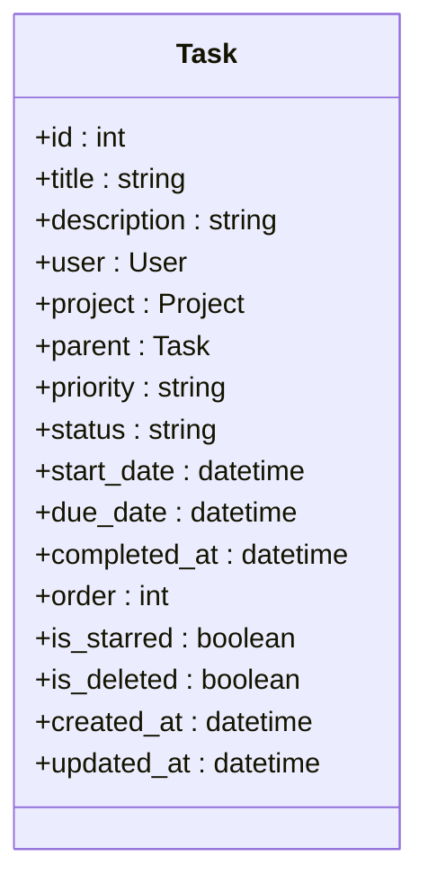
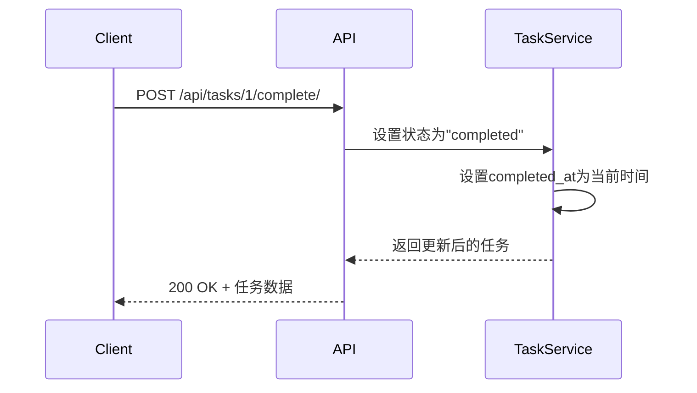
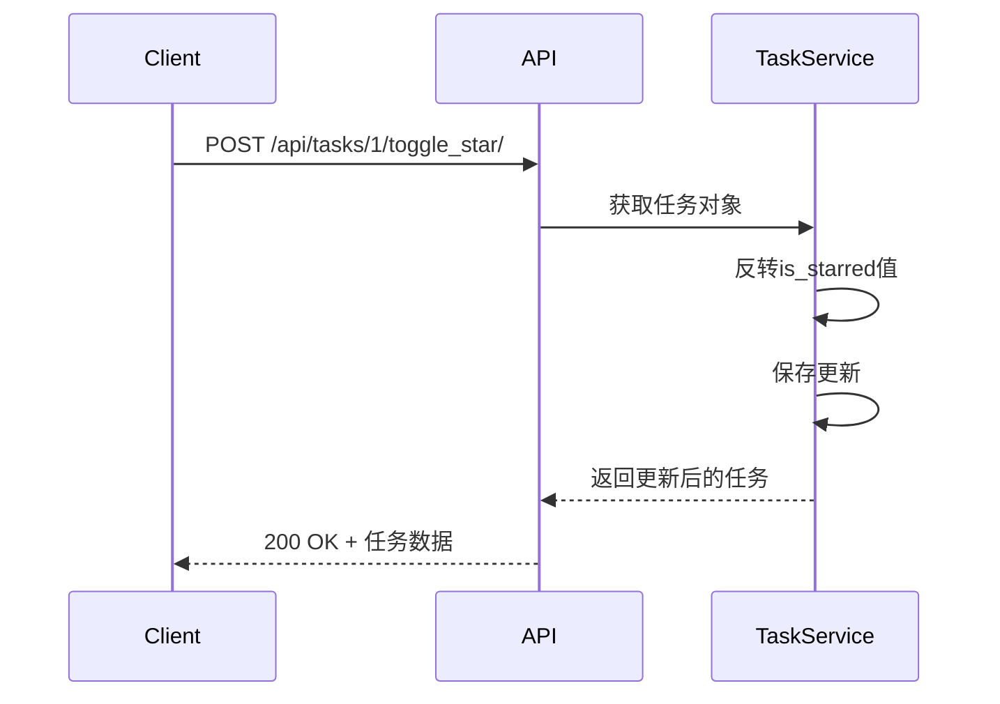
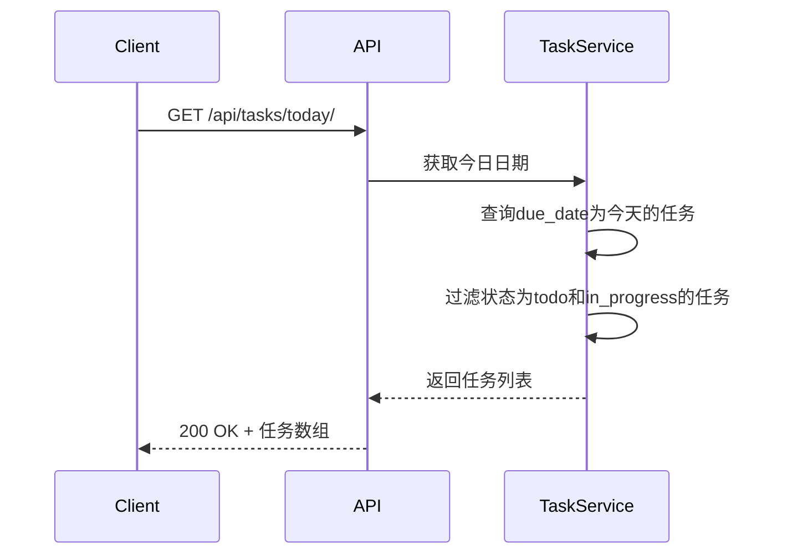
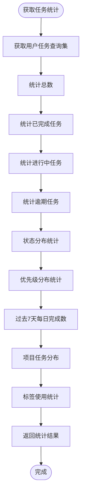

# 任务API

<cite>
**本文档引用文件**   
- [TaskViewSet.py](file://backend/apps/tasks/views.py)
- [TaskSerializer.py](file://backend/apps/tasks/serializers.py)
- [TaskModel.py](file://backend/apps/tasks/models.py)
- [task.ts](file://frontend/src/services/task.ts)
- [tasksSlice.ts](file://frontend/src/store/slices/tasksSlice.ts)
</cite>

## 目录
1. [简介](#简介)
2. [核心数据结构](#核心数据结构)
3. [基础CRUD操作](#基础crud操作)
4. [特殊功能端点](#特殊功能端点)
5. [查询过滤与搜索](#查询过滤与搜索)
6. [前端调用示例](#前端调用示例)

## 简介
任务API提供了一套完整的任务管理功能，支持创建、读取、更新和删除任务等基础操作，同时包含完成任务、切换标星、获取今日任务和任务统计等特殊功能。API基于Django REST Framework构建，支持过滤、搜索和排序功能，并通过React Query在前端实现高效的数据管理。

## 核心数据结构

### 任务模型
任务模型包含以下核心字段：

**任务字段定义**
- `id`: 任务唯一标识符
- `title`: 任务标题（最大长度255字符）
- `description`: 任务描述（可选）
- `user`: 所属用户（外键）
- `project`: 所属项目（外键，可为空）
- `parent`: 父任务（自引用外键，用于子任务）
- `priority`: 优先级（可选值：none, low, medium, high）
- `status`: 状态（可选值：todo, in_progress, completed）
- `start_date`: 开始时间（可为空）
- `due_date`: 截止时间（可为空）
- `completed_at`: 完成时间（可为空）
- `order`: 排序序号（默认0）
- `is_starred`: 是否标星（布尔值，默认False）
- `is_deleted`: 是否删除（布尔值，默认False）
- `created_at`: 创建时间（自动添加）
- `updated_at`: 更新时间（自动更新）

**状态选项**
- 待办（todo）
- 进行中（in_progress）
- 已完成（completed）

**优先级选项**
- 无（none）
- 低（low）
- 中（medium）
- 高（high）



**Diagram sources**
- [TaskModel.py](file://backend/apps/tasks/models.py#L5-L75)

**Section sources**
- [TaskModel.py](file://backend/apps/tasks/models.py#L5-L75)

## 基础CRUD操作

### 端点模式
基础CRUD操作遵循标准的RESTful API设计模式，所有任务相关端点均以`/api/tasks/`为前缀。

### HTTP方法与端点
| 操作 | HTTP方法 | 端点 | 描述 |
|------|----------|------|------|
| 创建任务 | POST | `/api/tasks/` | 创建新任务 |
| 获取任务列表 | GET | `/api/tasks/` | 获取任务列表（支持分页） |
| 获取单个任务 | GET | `/api/tasks/{id}/` | 获取指定ID的任务详情 |
| 更新任务 | PATCH | `/api/tasks/{id}/` | 部分更新任务信息 |
| 删除任务 | DELETE | `/api/tasks/{id}/` | 软删除任务（移入垃圾筒） |

### 请求/响应Schema
**创建/更新任务请求体**
```json
{
  "title": "任务标题",
  "description": "任务描述",
  "project": 1,
  "priority": "medium",
  "status": "todo",
  "start_date": "2023-01-01T09:00:00Z",
  "due_date": "2023-01-02T17:00:00Z",
  "tags": [1, 2, 3]
}
```

**任务响应体**
```json
{
  "id": 1,
  "title": "任务标题",
  "description": "任务描述",
  "user": 1,
  "project": 1,
  "parent": null,
  "priority": "medium",
  "status": "todo",
  "start_date": "2023-01-01T09:00:00Z",
  "due_date": "2023-01-02T17:00:00Z",
  "completed_at": null,
  "order": 0,
  "is_starred": false,
  "is_deleted": false,
  "tags": [1, 2, 3],
  "subtasks_count": 2,
  "created_at": "2023-01-01T08:00:00Z",
  "updated_at": "2023-01-01T08:00:00Z"
}
```

**Section sources**
- [TaskViewSet.py](file://backend/apps/tasks/views.py#L13-L235)
- [TaskSerializer.py](file://backend/apps/tasks/serializers.py#L5-L51)

## 特殊功能端点

### 完成任务
将任务状态设置为"已完成"，并记录完成时间。

**端点信息**
- **URL**: `/api/tasks/{id}/complete/`
- **HTTP方法**: POST
- **认证**: 需要用户认证
- **权限**: 仅任务所有者可操作

**请求示例**
```bash
curl -X POST https://api.example.com/api/tasks/1/complete/ \
  -H "Authorization: Bearer <token>" \
  -H "Content-Type: application/json"
```

**响应示例**
```json
{
  "id": 1,
  "title": "完成项目文档",
  "status": "completed",
  "completed_at": "2023-01-01T10:30:00Z",
  "is_starred": true,
  "updated_at": "2023-01-01T10:30:00Z"
}
```



**Diagram sources**
- [TaskViewSet.py](file://backend/apps/tasks/views.py#L35-L42)

### 切换标星
切换任务的标星状态（标星/取消标星）。

**端点信息**
- **URL**: `/api/tasks/{id}/toggle_star/`
- **HTTP方法**: POST
- **认证**: 需要用户认证
- **权限**: 仅任务所有者可操作

**请求示例**
```bash
curl -X POST https://api.example.com/api/tasks/1/toggle_star/ \
  -H "Authorization: Bearer <token>" \
  -H "Content-Type: application/json"
```

**响应示例**
```json
{
  "id": 1,
  "title": "重要会议",
  "is_starred": true,
  "updated_at": "2023-01-01T09:15:00Z"
}
```



**Diagram sources**
- [TaskViewSet.py](file://backend/apps/tasks/views.py#L45-L51)

### 获取今日任务
获取今天截止且未完成的任务列表。

**端点信息**
- **URL**: `/api/tasks/today/`
- **HTTP方法**: GET
- **认证**: 需要用户认证
- **权限**: 仅任务所有者可查看

**请求示例**
```bash
curl -X GET https://api.example.com/api/tasks/today/ \
  -H "Authorization: Bearer <token>"
```

**响应示例**
```json
[
  {
    "id": 1,
    "title": "提交周报",
    "due_date": "2023-01-01T18:00:00Z",
    "status": "todo",
    "priority": "high"
  },
  {
    "id": 2,
    "title": "团队会议",
    "due_date": "2023-01-01T14:00:00Z",
    "status": "in_progress",
    "priority": "medium"
  }
]
```



**Diagram sources**
- [TaskViewSet.py](file://backend/apps/tasks/views.py#L54-L62)

### 任务统计
获取任务的统计信息，包括总数、完成数、进行中数、逾期数等。

**端点信息**
- **URL**: `/api/tasks/statistics/`
- **HTTP方法**: GET
- **认证**: 需要用户认证
- **权限**: 仅任务所有者可查看

**请求示例**
```bash
curl -X GET https://api.example.com/api/tasks/statistics/ \
  -H "Authorization: Bearer <token>"
```

**响应示例**
```json
{
  "summary": {
    "total": 25,
    "completed": 15,
    "in_progress": 5,
    "overdue": 3,
    "completion_rate": 60.0
  },
  "status_distribution": [
    {"status": "todo", "count": 7},
    {"status": "in_progress", "count": 5},
    {"status": "completed", "count": 15}
  ],
  "priority_distribution": [
    {"priority": "none", "count": 5},
    {"priority": "low", "count": 3},
    {"priority": "medium", "count": 8},
    {"priority": "high", "count": 9}
  ],
  "weekly_data": [
    {"date": "2023-01-01", "completed": 3, "total": 10},
    {"date": "2023-01-02", "completed": 2, "total": 8},
    {"date": "2023-01-03", "completed": 4, "total": 12}
  ],
  "project_distribution": [
    {"project__id": 1, "project__name": "项目A", "count": 10},
    {"project__id": 2, "project__name": "项目B", "count": 8}
  ],
  "tag_stats": [
    {"tag__id": 1, "tag__name": "重要", "count": 12},
    {"tag__id": 2, "tag__name": "紧急", "count": 8}
  ]
}
```



**Diagram sources**
- [TaskViewSet.py](file://backend/apps/tasks/views.py#L65-L142)

**Section sources**
- [TaskViewSet.py](file://backend/apps/tasks/views.py#L35-L142)

## 查询过滤与搜索

### 查询过滤
支持按多个字段进行过滤，通过查询参数实现。

**支持的过滤字段**
- `status`: 按任务状态过滤（todo, in_progress, completed）
- `priority`: 按优先级过滤（none, low, medium, high）
- `project`: 按项目ID过滤
- `is_starred`: 按标星状态过滤（true/false）
- `include_deleted`: 是否包含已删除任务（true/false，默认false）

**过滤示例**
```bash
# 获取所有高优先级的待办任务
curl -X GET "https://api.example.com/api/tasks/?status=todo&priority=high" \
  -H "Authorization: Bearer <token>"

# 获取特定项目的任务
curl -X GET "https://api.example.com/api/tasks/?project=1" \
  -H "Authorization: Bearer <token>"

# 包含已删除的任务
curl -X GET "https://api.example.com/api/tasks/?include_deleted=true" \
  -H "Authorization: Bearer <token>"
```

### 搜索功能
支持在任务标题和描述中进行全文搜索。

**搜索示例**
```bash
# 搜索包含"会议"的任务
curl -X GET "https://api.example.com/api/tasks/?search=会议" \
  -H "Authorization: Bearer <token>"

# 搜索包含"报告"且为高优先级的任务
curl -X GET "https://api.example.com/api/tasks/?search=报告&priority=high" \
  -H "Authorization: Bearer <token>"
```

### 排序功能
支持按多个字段进行排序。

**支持的排序字段**
- `created_at`: 按创建时间排序
- `due_date`: 按截止时间排序
- `order`: 按自定义排序序号排序
- `priority`: 按优先级排序

**排序示例**
```bash
# 按截止时间升序排序
curl -X GET "https://api.example.com/api/tasks/?ordering=due_date" \
  -H "Authorization: Bearer <token>"

# 按优先级降序排序
curl -X GET "https://api.example.com/api/tasks/?ordering=-priority" \
  -H "Authorization: Bearer <token>"

# 按创建时间降序和优先级升序组合排序
curl -X GET "https://api.example.com/api/tasks/?ordering=-created_at,priority" \
  -H "Authorization: Bearer <token>"
```

**Section sources**
- [TaskViewSet.py](file://backend/apps/tasks/views.py#L15-L18)

## 前端调用示例

### React Query配置
在前端使用React Query管理任务数据的获取和更新。

```typescript
import { useQuery, useMutation, useQueryClient } from 'react-query'
import { taskService } from '@/services/task'

// 获取任务列表
const useTasks = (params?: Record<string, any>) => {
  return useQuery(['tasks', params], () => taskService.getTasks(params))
}

// 获取单个任务
const useTask = (id: number) => {
  return useQuery(['task', id], () => taskService.getTask(id))
}

// 创建任务
const useCreateTask = () => {
  const queryClient = useQueryClient()
  
  return useMutation(taskService.createTask, {
    onSuccess: () => {
      queryClient.invalidateQueries('tasks')
    }
  })
}

// 更新任务
const useUpdateTask = () => {
  const queryClient = useQueryClient()
  
  return useMutation(
    ({ id, data }: { id: number; data: Partial<Task> }) => 
      taskService.updateTask(id, data),
    {
      onSuccess: () => {
        queryClient.invalidateQueries('tasks')
      }
    }
  )
}

// 完成任务
const useCompleteTask = () => {
  const queryClient = useQueryClient()
  
  return useMutation(taskService.completeTask, {
    onSuccess: () => {
      queryClient.invalidateQueries('tasks')
      queryClient.invalidateQueries('statistics')
    }
  })
}
```

### 组件中使用示例
```tsx
import React from 'react'
import { useTasks, useCreateTask } from './hooks'

const TasksPage: React.FC = () => {
  const { data: tasks, isLoading } = useTasks()
  const createTaskMutation = useCreateTask()
  
  const handleCreateTask = (title: string) => {
    createTaskMutation.mutate({
      title,
      status: 'todo',
      priority: 'medium'
    })
  }
  
  if (isLoading) return <div>加载中...</div>
  
  return (
    <div>
      <h1>任务列表</h1>
      {tasks?.map(task => (
        <div key={task.id}>{task.title}</div>
      ))}
      <button onClick={() => handleCreateTask('新任务')}>
        创建任务
      </button>
    </div>
  )
}
```

### 任务服务封装
前端任务服务封装了所有API调用。

```typescript
// task.ts
export const taskService = {
  getTasks: async (params?: Record<string, any>): Promise<Task[]> => {
    const response = await apiClient.get<PaginatedResponse<Task>>('/tasks/', { params })
    return response.data.results || (response.data as any)
  },

  getTask: async (id: number): Promise<Task> => {
    const response = await apiClient.get<Task>(`/tasks/${id}/`)
    return response.data
  },

  createTask: async (data: Partial<Task>): Promise<Task> => {
    const response = await apiClient.post<Task>('/tasks/', data)
    return response.data
  },

  updateTask: async (id: number, data: Partial<Task>): Promise<Task> => {
    const response = await apiClient.patch<Task>(`/tasks/${id}/`, data)
    return response.data
  },

  deleteTask: async (id: number): Promise<void> => {
    await apiClient.delete(`/tasks/${id}/`)
  },

  completeTask: async (id: number): Promise<Task> => {
    const response = await apiClient.post<Task>(`/tasks/${id}/complete/`)
    return response.data
  },

  toggleStar: async (id: number): Promise<Task> => {
    const response = await apiClient.post<Task>(`/tasks/${id}/toggle_star/`)
    return response.data
  },

  getTodayTasks: async (): Promise<Task[]> => {
    const response = await apiClient.get<Task[]>('/tasks/today/')
    return response.data
  },

  getStatistics: async (): Promise<any> => {
    const response = await apiClient.get('/tasks/statistics/')
    return response.data
  }
}
```

**Section sources**
- [task.ts](file://frontend/src/services/task.ts#L11-L77)
- [tasksSlice.ts](file://frontend/src/store/slices/tasksSlice.ts#L4-L72)