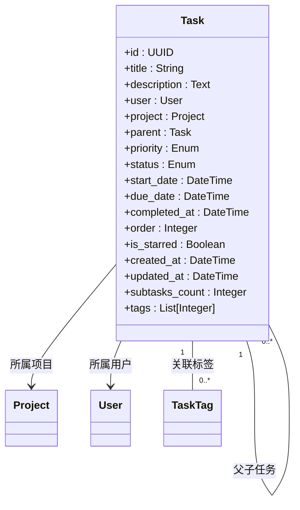
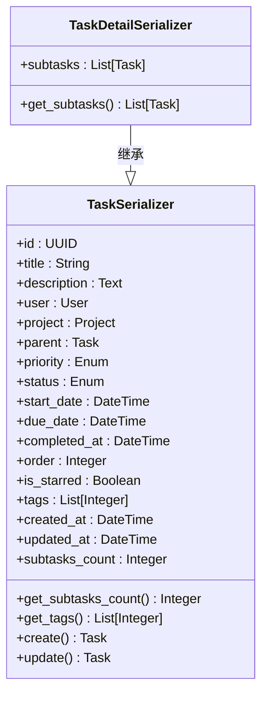
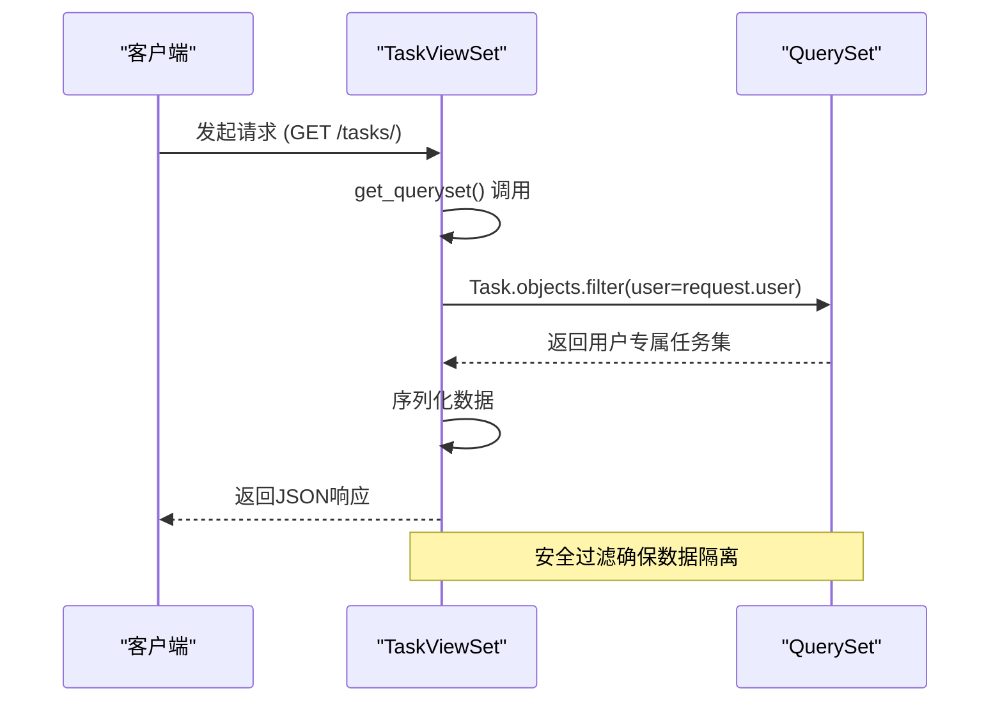
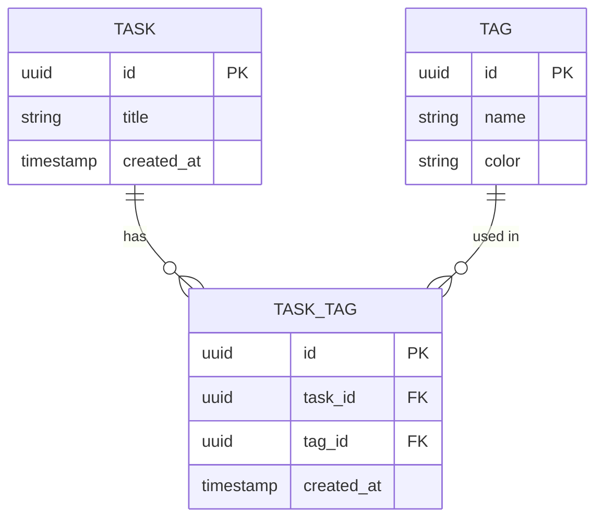

# 基础任务操作

<cite>
**本文档引用的文件**  
- [models.py](file://backend/apps/tasks/models.py)
- [serializers.py](file://backend/apps/tasks/serializers.py)
- [views.py](file://backend/apps/tasks/views.py)
- [tags/models.py](file://backend/apps/tags/models.py)
</cite>

## 目录
1. [简介](#简介)
2. [任务模型结构](#任务模型结构)
3. [序列化器设计](#序列化器设计)
4. [视图集与REST端点](#视图集与rest端点)
5. [数据访问安全控制](#数据访问安全控制)
6. [标签关联处理](#标签关联处理)
7. [HTTP请求示例](#http请求示例)
8. [结论](#结论)

## 简介
本文档详细说明任务管理模块的核心CRUD操作机制。系统基于Django REST Framework构建，通过`ModelViewSet`自动提供标准的RESTful接口，支持任务的创建、读取、更新和删除功能。重点阐述了任务数据隔离、标签多对多关系处理以及用户权限控制等关键设计。

## 任务模型结构

任务模型定义了任务的核心属性和关系结构，支持丰富的任务管理功能。



**Diagram sources**  
- [models.py](file://backend/apps/tasks/models.py#L5-L74)

**Section sources**  
- [models.py](file://backend/apps/tasks/models.py#L5-L74)

## 序列化器设计

任务序列化器负责数据的序列化与反序列化，包含字段定义、只读字段设置以及自定义逻辑处理。



**Diagram sources**  
- [serializers.py](file://backend/apps/tasks/serializers.py#L6-L51)

**Section sources**  
- [serializers.py](file://backend/apps/tasks/serializers.py#L6-L51)

## 视图集与REST端点

`TaskViewSet`继承自`ModelViewSet`，自动提供完整的CRUD操作端点，并通过自定义动作扩展功能。

```mermaid
flowchart TD
A[HTTP请求] --> B{请求方法}
B --> |GET /tasks/| C[获取任务列表]
B --> |POST /tasks/| D[创建新任务]
B --> |GET /tasks/{id}/| E[获取单个任务]
B --> |PUT /tasks/{id}/| F[完全更新任务]
B --> |PATCH /tasks/{id}/| G[部分更新任务]
B --> |DELETE /tasks/{id}/| H[删除任务]
B --> |POST /tasks/{id}/complete/| I[完成任务]
B --> |POST /tasks/{id}/toggle_star/| J[切换标星]
B --> |GET /tasks/today/| K[获取今日任务]
B --> |GET /tasks/statistics/| L[获取统计信息]
C --> M[调用get_queryset]
D --> N[调用create方法]
E --> O[调用retrieve方法]
F --> P[调用update方法]
G --> Q[调用partial_update方法]
H --> R[调用destroy方法]
```

**Diagram sources**  
- [views.py](file://backend/apps/tasks/views.py#L13-L135)

**Section sources**  
- [views.py](file://backend/apps/tasks/views.py#L13-L135)

## 数据访问安全控制

`get_queryset`方法是核心的安全控制机制，确保用户只能访问自己的任务数据。



**Diagram sources**  
- [views.py](file://backend/apps/tasks/views.py#L20-L21)

**Section sources**  
- [views.py](file://backend/apps/tasks/views.py#L20-L21)

## 标签关联处理

系统通过`TaskTag`中间表处理任务与标签的多对多关系，在创建和更新时进行特殊处理。



**Diagram sources**  
- [models.py](file://backend/apps/tasks/models.py#L5-L74)
- [tags/models.py](file://backend/apps/tags/models.py#L30-L56)

**Section sources**  
- [serializers.py](file://backend/apps/tasks/serializers.py#L26-L51)
- [tags/models.py](file://backend/apps/tags/models.py#L30-L56)

## HTTP请求示例

### 创建任务
```http
POST /api/tasks/ HTTP/1.1
Authorization: Bearer <JWT令牌>
Content-Type: application/json

{
    "title": "完成项目文档",
    "description": "编写项目技术文档和用户手册",
    "project": "project-uuid",
    "priority": "high",
    "due_date": "2024-01-15T18:00:00Z",
    "tags": ["tag-uuid-1", "tag-uuid-2"]
}
```

### 响应示例
```json
{
    "id": "task-uuid",
    "title": "完成项目文档",
    "description": "编写项目技术文档和用户手册",
    "user": "user-uuid",
    "project": "project-uuid",
    "priority": "high",
    "status": "todo",
    "due_date": "2024-01-15T18:00:00Z",
    "is_starred": false,
    "tags": ["tag-uuid-1", "tag-uuid-2"],
    "subtasks_count": 0,
    "created_at": "2024-01-10T10:00:00Z",
    "updated_at": "2024-01-10T10:00:00Z"
}
```

### 更新任务标签
```http
PATCH /api/tasks/task-uuid/ HTTP/1.1
Authorization: Bearer <JWT令牌>
Content-Type: application/json

{
    "tags": ["tag-uuid-3"]
}
```

**Section sources**  
- [serializers.py](file://backend/apps/tasks/serializers.py#L26-L51)
- [views.py](file://backend/apps/tasks/views.py#L13-L135)

## 结论
本系统通过`ModelViewSet`提供了完整的任务CRUD操作，结合自定义序列化器和安全查询机制，实现了高效且安全的任务管理功能。关键特性包括：
- 基于用户的身份验证和数据隔离
- 灵活的标签管理系统
- 丰富的查询和过滤选项
- 扩展的自定义操作（完成、标星、统计等）
- 完整的RESTful API设计

这些设计确保了系统的可扩展性、安全性和易用性，为前端应用提供了强大的后端支持。