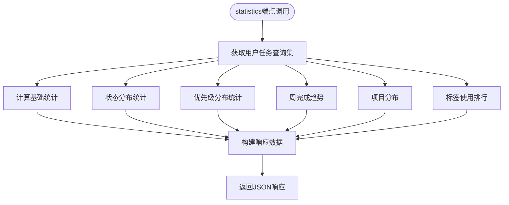
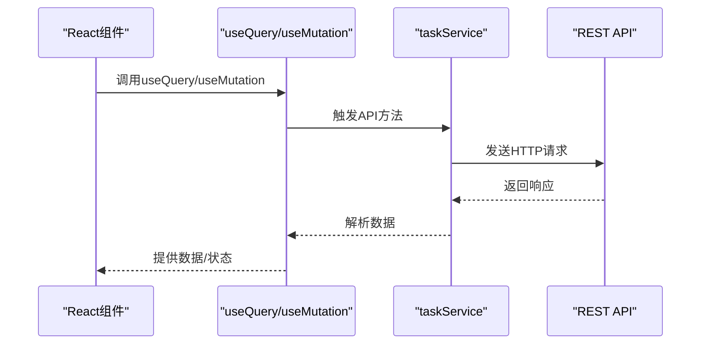

# 高级任务功能

<cite>
**本文档中引用的文件**  
- [TaskViewSet](file://backend/apps/tasks/views.py)
- [taskService](file://frontend/src/services/task.ts)
- [urls.py](file://backend/apps/tasks/urls.py)
- [TasksPage.tsx](file://frontend/src/pages/TasksPage.tsx)
- [TaskSerializer](file://backend/apps/tasks/serializers.py)
</cite>

## 目录
1. [简介](#简介)
2. [核心功能端点](#核心功能端点)
3. [过滤与搜索机制](#过滤与搜索机制)
4. [排序功能](#排序功能)
5. [前端React Query集成](#前端react-query集成)
6. [结论](#结论)

## 简介
本项目提供了一套完整的任务管理API，支持高级功能端点，包括任务完成、标星切换、今日任务获取和综合统计信息查询。后端基于Django REST Framework构建，前端使用React Query进行数据管理，实现了高效的数据交互和状态同步。

## 核心功能端点

### complete（完成任务）
该端点用于将指定任务的状态设置为“completed”，并记录完成时间。通过`@action(detail=True, methods=['post'])`装饰器实现，接收任务ID作为路径参数，更新数据库中的状态字段和完成时间戳。

**Section sources**
- [TaskViewSet.complete](file://backend/apps/tasks/views.py#L28-L36)

### toggle_star（切换标星状态）
此功能允许用户快速标记重要任务。调用该端点会翻转任务的`is_starred`布尔字段值，便于在前端界面中高亮显示关键任务。

**Section sources**
- [TaskViewSet.toggle_star](file://backend/apps/tasks/views.py#L38-L45)

### today（获取今日任务）
该端点返回当前日期截止且尚未完成的任务列表。它结合了日期过滤和状态过滤逻辑，帮助用户聚焦当天需要处理的任务。

**Section sources**
- [TaskViewSet.today](file://backend/apps/tasks/views.py#L47-L56)

### statistics（返回综合统计信息）
此端点提供全面的任务数据分析，包含：
- 总任务数、完成率、状态分布
- 优先级分布
- 过去7天每日完成趋势
- 项目分布
- 标签使用排行（前10）

返回的数据结构包含摘要信息和多个维度的分布数据，适用于仪表盘展示。



**Diagram sources**
- [TaskViewSet.statistics](file://backend/apps/tasks/views.py#L58-L135)

**Section sources**
- [TaskViewSet.statistics](file://backend/apps/tasks/views.py#L58-L135)

## 过滤与搜索机制

### filter_backends配置
系统启用了多种过滤后端，支持多维度任务筛选：
- **DjangoFilterBackend**：基于字段精确匹配
- **SearchFilter**：全文搜索支持
- **OrderingFilter**：结果排序控制

#### filterset_fields（字段过滤）
支持以下字段的直接过滤：
- `status`：任务状态（todo/in_progress/completed）
- `priority`：优先级（low/medium/high/urgent）
- `project`：所属项目ID
- `is_starred`：是否标星

这些字段允许客户端通过URL参数进行精确筛选，例如：`/tasks/?status=todo&is_starred=true`

**Section sources**
- [TaskViewSet.filterset_fields](file://backend/apps/tasks/views.py#L15-L15)

#### search_fields（全文搜索）
支持对任务标题和描述内容进行全文搜索，提升查找效率。搜索时不区分大小写，并支持部分匹配。

示例：`/tasks/?search=会议` 将返回标题或描述中包含"会议"的所有任务。

**Section sources**
- [TaskViewSet.search_fields](file://backend/apps/tasks/views.py#L16-L16)

## 排序功能

### ordering_fields（可排序字段）
允许客户端按以下字段对结果进行排序：
- `created_at`：创建时间
- `due_date`：截止时间
- `order`：自定义排序序号
- `priority`：优先级

使用方法：在请求中添加`ordering`参数，如：
- `/tasks/?ordering=-created_at`（按创建时间降序）
- `/tasks/?ordering=priority,due_date`（先按优先级升序，再按截止时间升序）

**Section sources**
- [TaskViewSet.ordering_fields](file://backend/apps/tasks/views.py#L17-L17)

## 前端React Query集成

### API服务封装
前端通过`taskService`对象封装所有任务相关API调用，统一处理HTTP请求。



**Diagram sources**
- [taskService](file://frontend/src/services/task.ts#L11-L56)
- [TasksPage.tsx](file://frontend/src/pages/TasksPage.tsx#L51-L73)

### useQuery使用示例
```typescript
// 获取今日任务
const { data: todayTasks, isLoading } = useQuery({
  queryKey: ['todayTasks'],
  queryFn: taskService.getTodayTasks
})

// 获取统计信息
const { data: stats, isLoading } = useQuery({
  queryKey: ['taskStatistics'],
  queryFn: taskService.getStatistics
})
```

### useMutation使用示例
```typescript
// 完成任务
const completeMutation = useMutation({
  mutationFn: (taskId: number) => taskService.completeTask(taskId),
  onSuccess: (updatedTask) => {
    queryClient.invalidateQueries({ queryKey: ['tasks'] })
    toast.success('任务已完成')
  }
})

// 切换标星
const starMutation = useMutation({
  mutationFn: (taskId: number) => taskService.toggleStar(taskId),
  onSuccess: (updatedTask) => {
    queryClient.setQueryData(['tasks', updatedTask.id], updatedTask)
  }
})
```

**Section sources**
- [taskService](file://frontend/src/services/task.ts#L11-L56)
- [TasksPage.tsx](file://frontend/src/pages/TasksPage.tsx#L120-L128)

## 结论
本系统通过精心设计的API端点和前端集成方案，提供了强大而灵活的任务管理功能。后端利用Django REST Framework的丰富特性实现了高效的过滤、搜索和统计功能，前端则通过React Query实现了优雅的状态管理和数据同步。这种架构既保证了性能，又提供了良好的用户体验。