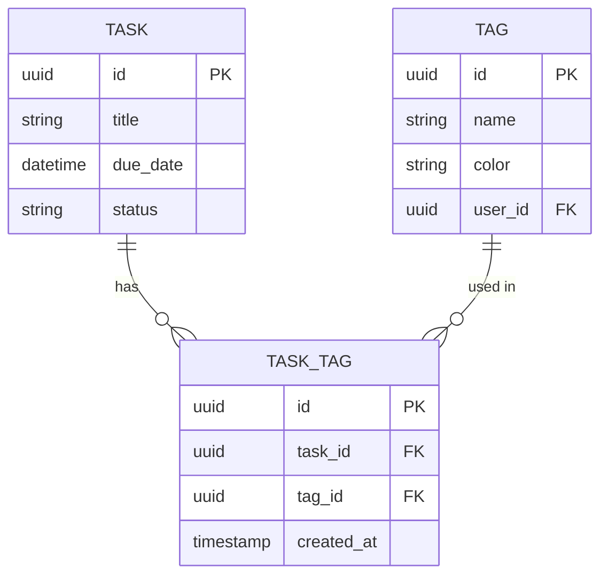
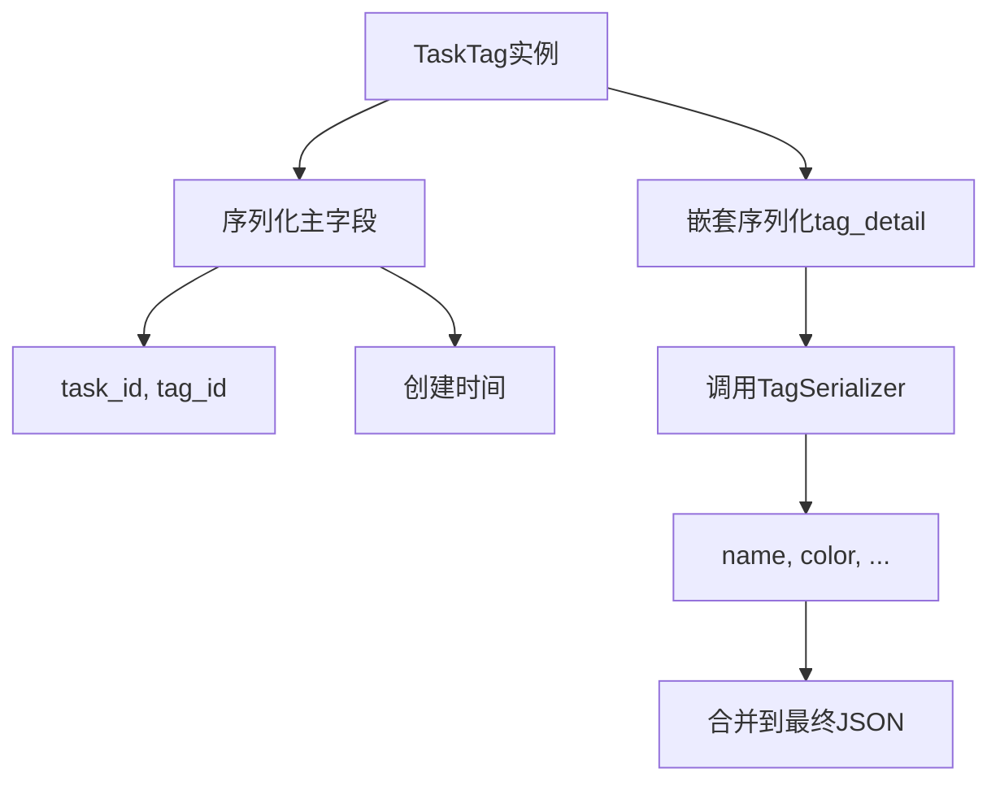

# 任务标签关联API

<cite>
**本文档引用的文件**
- [models.py](file://backend/apps/tags/models.py#L30-L56)
- [serializers.py](file://backend/apps/tags/serializers.py#L12-L19)
- [views.py](file://backend/apps/tags/views.py#L36-L41)
- [urls.py](file://backend/apps/tags/urls.py#L7)
</cite>

## 目录
1. [简介](#简介)
2. [核心模型设计](#核心模型设计)
3. [序列化器实现](#序列化器实现)
4. [视图集与数据过滤](#视图集与数据过滤)
5. [唯一性约束与数据完整性](#唯一性约束与数据完整性)
6. [前端调用示例](#前端调用示例)

## 简介
本API文档详细说明了任务与标签之间的多对多关系管理机制。系统通过中间模型`TaskTag`实现任务与标签的灵活关联，支持为任务添加、移除和查询标签。该设计确保了用户数据的隔离性，并通过嵌套序列化器优化了前端性能，避免了额外的API请求。

## 核心模型设计

`TaskTag`模型作为任务（Task）与标签（Tag）之间的中间表，实现了多对多关系的精细化控制。该模型包含两个外键字段：`task`指向任务实例，`tag`指向标签实例。每个关联记录还包含创建时间戳，便于追踪操作历史。



**图示来源**
- [models.py](file://backend/apps/tags/models.py#L30-L56)

**本节来源**
- [models.py](file://backend/apps/tags/models.py#L30-L56)

## 序列化器实现

`TaskTagSerializer`采用嵌套序列化技术，在返回任务-标签关联信息的同时，内联提供标签的详细信息。通过`tag_detail`字段，使用`TagSerializer`作为源序列化器（`source='tag'`），自动包含标签的名称和颜色属性。

这种设计使前端在获取任务标签列表时，无需再单独调用标签API来获取颜色等展示信息，显著减少了网络请求次数，提升了用户体验和系统性能。



**图示来源**
- [serializers.py](file://backend/apps/tags/serializers.py#L12-L19)

**本节来源**
- [serializers.py](file://backend/apps/tags/serializers.py#L12-L19)

## 视图集与数据过滤

`TaskTagViewSet`继承自Django REST Framework的`ModelViewSet`，提供完整的CRUD操作接口。其核心方法`get_queryset`实现了关键的数据隔离逻辑：

```python
def get_queryset(self):
    return TaskTag.objects.filter(tag__user=self.request.user)
```

此查询集通过`tag__user`的反向关联，确保当前用户只能访问其自身创建的标签所关联的任务记录。即使两个用户存在同名标签，其底层数据完全隔离，保障了多租户环境下的数据安全。

此外，该视图集已通过路由器注册在`/api/tags/task-tags/`路径下，支持标准的RESTful操作。

**本节来源**
- [views.py](file://backend/apps/tags/views.py#L36-L41)
- [urls.py](file://backend/apps/tags/urls.py#L7)

## 唯一性约束与数据完整性

为防止同一任务被重复关联同一个标签，`TaskTag`模型在元数据中定义了联合唯一约束：

```python
class Meta:
    unique_together = ['task', 'tag']
```

此约束确保数据库层面不会出现重复的`task-tag`组合。当尝试创建已存在的关联时，数据库将抛出完整性错误，从而保证了数据的一致性和业务逻辑的正确性。这一机制是实现高效标签管理的基础，避免了冗余数据和潜在的查询异常。

**本节来源**
- [models.py](file://backend/apps/tags/models.py#L52)

## 前端调用示例

### 为任务关联标签
```http
POST /api/tags/task-tags/
Content-Type: application/json

{
  "task": "task-uuid-123",
  "tag": "tag-uuid-456"
}
```

### 查询任务的所有标签
```http
GET /api/tags/task-tags/?task=task-uuid-123
```

响应示例：
```json
[
  {
    "id": "tt-uuid-789",
    "task": "task-uuid-123",
    "tag": "tag-uuid-456",
    "tag_detail": {
      "id": "tag-uuid-456",
      "name": "重要",
      "color": "#EF4444",
      "user": "user-uuid",
      "created_at": "2023-01-01T00:00:00Z",
      "updated_at": "2023-01-01T00:00:00Z"
    },
    "created_at": "2023-01-02T10:00:00Z"
  }
]
```

**本节来源**
- [views.py](file://backend/apps/tags/views.py#L36-L41)
- [serializers.py](file://backend/apps/tags/serializers.py#L12-L19)