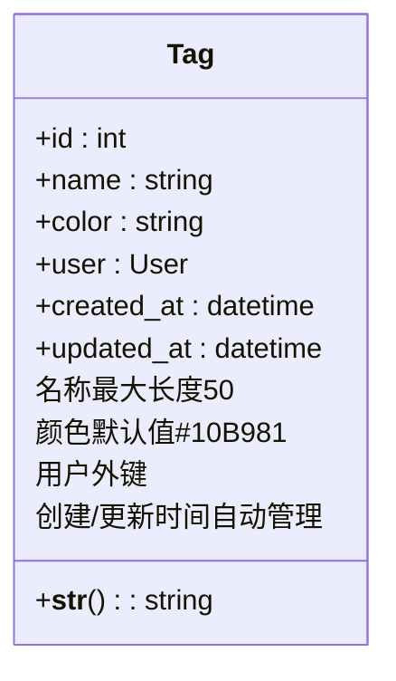
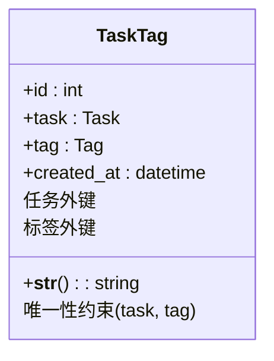
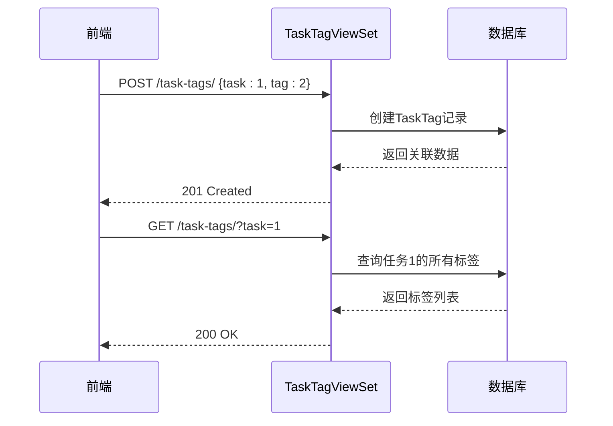
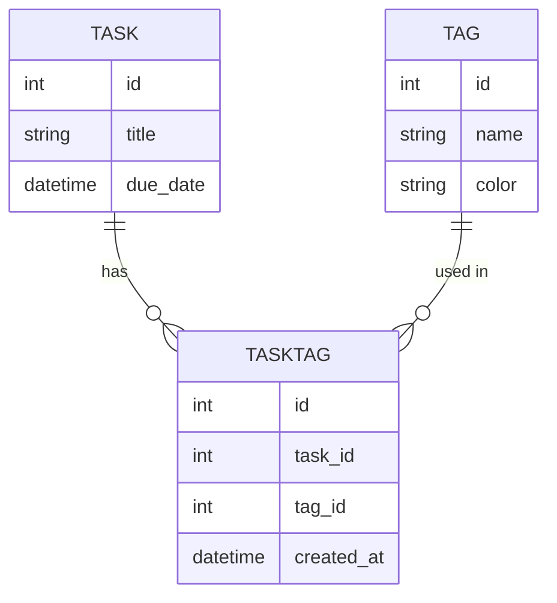

# 标签API

<cite>
**本文档中引用的文件**  
- [TagViewSet](file://backend/apps/tags/views.py#L6-L32)
- [TaskTagViewSet](file://backend/apps/tags/views.py#L35-L39)
- [Tag模型](file://backend/apps/tags/models.py#L4-L26)
- [TaskTag模型](file://backend/apps/tags/models.py#L29-L54)
- [TagSerializer](file://backend/apps/tags/serializers.py#L4-L8)
- [TaskTagSerializer](file://backend/apps/tags/serializers.py#L11-L17)
- [tag.ts](file://frontend/src/services/tag.ts)
- [task.ts](file://frontend/src/services/task.ts)
- [TagsPage.tsx](file://frontend/src/pages/TagsPage.tsx)
- [TasksPage.tsx](file://frontend/src/pages/TasksPage.tsx)
- [index.ts](file://frontend/src/types/index.ts#L96-L103)
</cite>

## 目录
1. [简介](#简介)
2. [核心组件](#核心组件)
3. [标签CRUD操作](#标签crud操作)
4. [创建标签的幂等性设计](#创建标签的幂等性设计)
5. [任务与标签关联管理](#任务与标签关联管理)
6. [多对多关联机制](#多对多关联机制)
7. [前端调用示例](#前端调用示例)
8. [标签颜色管理](#标签颜色管理)

## 简介
本API文档详细说明了系统中标签管理功能的实现，涵盖标签的创建、读取、更新和删除（CRUD）操作，以及任务与标签之间的关联管理。系统通过`TagViewSet`和`TaskTagViewSet`两个视图集分别处理标签本身和任务-标签关联关系。特别设计了创建标签时的幂等性行为，避免重复标签的产生，并支持在标签已存在时选择性更新其颜色属性。

**Section sources**
- [TagViewSet](file://backend/apps/tags/views.py#L6-L32)
- [TaskTagViewSet](file://backend/apps/tags/views.py#L35-L39)

## 核心组件

### Tag模型
`Tag`模型定义了标签的基本属性，包括名称、颜色、所属用户及时间戳。每个用户可创建多个标签，但标签名称在用户范围内必须唯一。



**Diagram sources**
- [Tag模型](file://backend/apps/tags/models.py#L4-L26)

### TaskTag模型
`TaskTag`模型作为中间表，实现任务与标签之间的多对多关联。每条记录表示一个任务与一个标签的绑定关系，并记录创建时间。



**Diagram sources**
- [TaskTag模型](file://backend/apps/tags/models.py#L29-L54)

## 标签CRUD操作

`TagViewSet`继承自`ModelViewSet`，提供完整的标签管理接口：

- **GET /tags/**：获取当前用户的所有标签
- **POST /tags/**：创建新标签（具有幂等性）
- **GET /tags/{id}/**：获取指定标签详情
- **PATCH /tags/{id}/**：更新标签信息（如名称、颜色）
- **DELETE /tags/{id}/**：删除标签

所有操作均基于当前请求用户进行权限控制，确保用户只能访问和修改自己的标签。

**Section sources**
- [TagViewSet](file://backend/apps/tags/views.py#L6-L32)
- [TagSerializer](file://backend/apps/tags/serializers.py#L4-L8)

## 创建标签的幂等性设计

创建标签端点（`POST /tags/`）采用幂等性设计，避免因重复请求或前端误操作导致重复标签。其核心逻辑如下：

1. 接收客户端提交的标签名称
2. 查询当前用户是否已存在同名标签
3. 若存在：
   - 可选更新颜色属性（如果请求中包含新颜色）
   - 返回现有标签数据，状态码为200 OK
4. 若不存在：
   - 正常创建新标签，状态码为201 Created

此设计提升了用户体验，前端无需在创建前额外查询标签是否存在，简化了调用逻辑。

```mermaid
flowchart TD
A[接收创建标签请求] --> B{是否提供名称?}
B --> |否| C[正常创建]
B --> |是| D[查询同名标签]
D --> E{标签已存在?}
E --> |是| F[更新颜色(如提供)]
F --> G[返回现有标签]
E --> |否| C
C --> H[创建新标签]
G --> I[返回200 OK]
H --> J[返回201 Created]
```

**Diagram sources**
- [TagViewSet](file://backend/apps/tags/views.py#L6-L32)

**Section sources**
- [TagViewSet](file://backend/apps/tags/views.py#L6-L32)

## 任务与标签关联管理

`TaskTagViewSet`专门用于管理任务与标签的关联关系。通过该视图集，可以：

- 建立任务与标签的关联
- 查询特定任务的所有标签
- 删除任务与标签的关联
- 按标签筛选任务

该视图集通过`tag__user=self.request.user`进行查询过滤，确保用户只能管理自己创建的标签与任务的关联。



**Diagram sources**
- [TaskTagViewSet](file://backend/apps/tags/views.py#L35-L39)
- [TaskTagSerializer](file://backend/apps/tags/serializers.py#L11-L17)

**Section sources**
- [TaskTagViewSet](file://backend/apps/tags/views.py#L35-L39)

## 多对多关联机制

系统通过`TaskTag`中间模型实现任务与标签的多对多关联。这种设计具有以下优势：

- **灵活性**：支持一个任务拥有多个标签，一个标签应用于多个任务
- **扩展性**：中间表可轻松添加额外字段（如创建时间）
- **查询效率**：支持高效的双向查询
- **数据完整性**：通过外键约束保证关联有效性

在Django模型中，通过`related_name`实现反向查询：
- `task.task_tags`：获取任务的所有标签关联
- `tag.task_tags`：获取标签的所有任务关联



**Diagram sources**
- [Task模型](file://backend/apps/tasks/models.py#L5-L74)
- [Tag模型](file://backend/apps/tags/models.py#L4-L26)
- [TaskTag模型](file://backend/apps/tags/models.py#L29-L54)

## 前端调用示例

### 为任务添加标签
```typescript
// 前端调用示例
const addTagToTask = async (taskId: number, tagId: number) => {
  try {
    const response = await apiClient.post('/task-tags/', {
      task: taskId,
      tag: tagId
    });
    return response.data;
  } catch (error) {
    console.error('添加标签失败:', error);
  }
};
```

### 按标签筛选任务
```typescript
// 获取指定标签下的所有任务
const getTasksByTag = async (tagId: number) => {
  const response = await apiClient.get('/task-tags/', {
    params: { tag: tagId }
  });
  
  // 获取任务详情
  const taskIds = response.data.results.map((item: any) => item.task);
  const tasks = await Promise.all(
    taskIds.map((id: number) => taskService.getTask(id))
  );
  
  return tasks;
};
```

**Section sources**
- [tag.ts](file://frontend/src/services/tag.ts)
- [task.ts](file://frontend/src/services/task.ts)
- [TasksPage.tsx](file://frontend/src/pages/TasksPage.tsx)

## 标签颜色管理

### 实现方式
- 颜色以十六进制字符串存储（如`#3B82F6`）
- 默认颜色为`#10B981`（绿色）
- 前端提供预设颜色选择器
- 支持在创建或更新标签时指定颜色

### 使用场景
- **视觉分类**：不同颜色代表不同类别（如工作、个人、学习）
- **优先级标识**：红色表示高优先级，蓝色表示普通任务
- **项目区分**：每个项目使用特定颜色的标签
- **情绪标记**：用颜色表达任务的情感属性

前端标签管理页面提供直观的颜色选择器，用户可从预设调色板中选择颜色，提升操作体验。

**Section sources**
- [Tag模型](file://backend/apps/tags/models.py#L4-L26)
- [TagsPage.tsx](file://frontend/src/pages/TagsPage.tsx)
- [index.ts](file://frontend/src/types/index.ts#L96-L103)