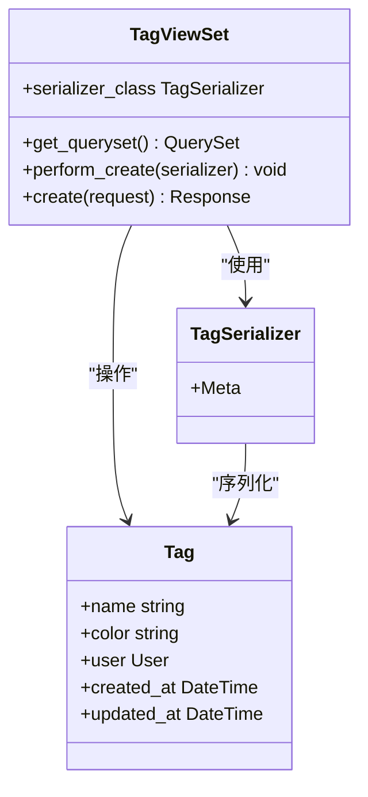
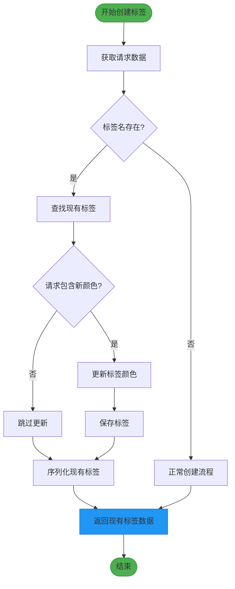

# 标签管理API

<cite>
**Referenced Files in This Document**   
- [TagViewSet](file://backend/apps/tags/views.py#L6-L32)
- [Tag](file://backend/apps/tags/models.py#L5-L26)
- [TagSerializer](file://backend/apps/tags/serializers.py#L5-L9)
- [urls.py](file://backend/apps/tags/urls.py#L6)
</cite>

## 目录
1. [简介](#简介)
2. [核心功能](#核心功能)
3. [创建标签](#创建标签)
4. [读取标签](#读取标签)
5. [更新标签](#更新标签)
6. [删除标签](#删除标签)
7. [数据模型](#数据模型)
8. [序列化器](#序列化器)
9. [HTTP请求示例](#http请求示例)
10. [总结](#总结)

## 简介
标签管理API为用户提供了一套完整的标签创建、读取、更新和删除（CRUD）功能。该API设计注重用户体验和数据一致性，特别实现了创建端点的幂等性，确保用户在创建标签时获得一致且可预测的响应。系统通过权限控制确保用户只能访问和操作自己创建的标签，保障了数据的隐私和安全。

**Section sources**
- [views.py](file://backend/apps/tags/views.py#L6-L32)

## 核心功能
标签管理API的核心是`TagViewSet`，它继承自Django REST Framework的`ModelViewSet`，提供了完整的CRUD操作。该视图集通过重写特定方法实现了自定义业务逻辑，包括幂等性创建、用户隔离和自动用户关联。



**Diagram sources**
- [views.py](file://backend/apps/tags/views.py#L6-L32)
- [serializers.py](file://backend/apps/tags/serializers.py#L5-L9)
- [models.py](file://backend/apps/tags/models.py#L5-L26)

**Section sources**
- [views.py](file://backend/apps/tags/views.py#L6-L32)

## 创建标签
创建标签是标签管理API的核心功能之一，其设计体现了幂等性原则，确保了API的健壮性和用户体验。

### 幂等性设计
当用户尝试创建一个已存在的同名标签时，系统不会返回错误，而是返回现有的标签实例。这种设计避免了客户端需要先查询再创建的复杂逻辑，简化了API的使用。



**Diagram sources**
- [views.py](file://backend/apps/tags/views.py#L16-L32)

### 自动用户关联
`perform_create`方法确保了在创建标签时自动将当前用户与标签关联，无需客户端在请求中显式提供用户信息。

```python
def perform_create(self, serializer):
    serializer.save(user=self.request.user)
```

**Section sources**
- [views.py](file://backend/apps/tags/views.py#L13-L14)

### 创建流程
1. 客户端发送POST请求到`/tags/`端点
2. 系统检查请求中是否包含标签名
3. 如果标签名存在，查找该用户下同名的标签
4. 如果找到现有标签：
   - 检查请求中是否包含新的颜色值
   - 如果有新颜色，更新标签颜色并保存
   - 序列化并返回现有标签数据
5. 如果没有找到现有标签，执行正常创建流程

**Section sources**
- [views.py](file://backend/apps/tags/views.py#L16-L32)

## 读取标签
读取标签功能确保用户只能访问自己创建的标签，实现了数据的隔离和安全。

### 用户隔离
`get_queryset`方法重写确保了查询集只包含当前用户创建的标签。

```python
def get_queryset(self):
    return Tag.objects.filter(user=self.request.user)
```

此方法在每次读取操作（如获取标签列表、获取单个标签）时自动应用，确保了数据访问的安全性。

**Section sources**
- [views.py](file://backend/apps/tags/views.py#L10-L11)

## 更新标签
更新标签功能允许用户修改现有标签的属性，如名称和颜色。

### 更新流程
1. 客户端发送PUT或PATCH请求到`/tags/{id}/`端点
2. 系统验证用户是否有权限更新该标签（通过`get_queryset`确保标签属于当前用户）
3. 应用更新并保存到数据库
4. 返回更新后的标签数据

更新操作同样受到用户隔离的保护，用户无法更新不属于自己的标签。

**Section sources**
- [views.py](file://backend/apps/tags/views.py#L6-L32)

## 删除标签
删除标签功能允许用户移除不再需要的标签。

### 删除流程
1. 客户端发送DELETE请求到`/tags/{id}/`端点
2. 系统验证用户是否有权限删除该标签（通过`get_queryset`确保标签属于当前用户）
3. 从数据库中删除标签
4. 返回204 No Content响应

删除操作也受到用户隔离的保护，确保数据安全。

**Section sources**
- [views.py](file://backend/apps/tags/views.py#L6-L32)

## 数据模型
标签系统的数据模型由两个主要模型组成：`Tag`和`TaskTag`。

### Tag模型
`Tag`模型代表用户创建的标签，包含以下字段：

| 字段 | 类型 | 描述 | 约束 |
|------|------|------|------|
| name | CharField | 标签名称 | 最大长度50字符 |
| color | CharField | 标签颜色 | 默认值'#10B981'，最大长度7字符 |
| user | ForeignKey | 所属用户 | 外键关联到用户模型 |
| created_at | DateTimeField | 创建时间 | 自动添加 |
| updated_at | DateTimeField | 更新时间 | 自动更新 |

**unique_together约束**
`Tag`模型在元数据中定义了`unique_together = ['name', 'user']`约束，确保在数据库层面，每个用户的标签名称都是唯一的。这意味着同一用户不能拥有两个同名标签，但不同用户可以拥有同名标签。

```python
class Meta:
    db_table = 'tags'
    verbose_name = '标签'
    verbose_name_plural = verbose_name
    unique_together = ['name', 'user']
```

**Section sources**
- [models.py](file://backend/apps/tags/models.py#L20-L25)

### TaskTag模型
`TaskTag`模型是任务和标签之间的多对多关联模型，用于将标签应用到任务上。

**Section sources**
- [models.py](file://backend/apps/tags/models.py#L30-L54)

## 序列化器
`TagSerializer`负责将`Tag`模型实例序列化为JSON格式，以及将JSON数据反序列化为模型实例。

### 字段配置
`TagSerializer`配置了以下字段：

```python
class Meta:
    model = Tag
    fields = ['id', 'name', 'color', 'user', 'created_at', 'updated_at']
    read_only_fields = ['id', 'user', 'created_at', 'updated_at']
```

### 只读字段处理
`read_only_fields`配置确保了特定字段在创建或更新时不能被客户端修改：

- `id`: 标签的唯一标识符，由数据库自动生成
- `user`: 所属用户，由`perform_create`方法自动设置
- `created_at`: 创建时间，由数据库自动记录
- `updated_at`: 更新时间，由数据库自动更新

这种配置确保了数据的完整性和安全性，防止客户端篡改关键系统字段。

**Section sources**
- [serializers.py](file://backend/apps/tags/serializers.py#L8-L9)

## HTTP请求示例
以下示例展示了如何使用标签管理API。

### 创建标签请求
```http
POST /tags/ HTTP/1.1
Content-Type: application/json
Authorization: Bearer <token>

{
    "name": "重要",
    "color": "#EF4444"
}
```

### 创建标签响应（新标签）
```http
HTTP/1.1 201 Created
Content-Type: application/json

{
    "id": 1,
    "name": "重要",
    "color": "#EF4444",
    "user": 1,
    "created_at": "2024-01-01T10:00:00Z",
    "updated_at": "2024-01-01T10:00:00Z"
}
```

### 创建标签响应（已存在标签）
```http
HTTP/1.1 200 OK
Content-Type: application/json

{
    "id": 1,
    "name": "重要",
    "color": "#EF4444",
    "user": 1,
    "created_at": "2024-01-01T10:00:00Z",
    "updated_at": "2024-01-01T10:05:00Z"
}
```

**Section sources**
- [views.py](file://backend/apps/tags/views.py#L16-L32)

## 总结
标签管理API通过精心设计的`TagViewSet`实现了完整的CRUD功能，特别强调了创建端点的幂等性设计。系统通过`get_queryset`方法确保用户只能访问自己创建的标签，通过`perform_create`方法自动关联当前用户，通过`TagSerializer`的只读字段配置保护关键数据。数据库层面的`unique_together`约束确保了用户标签名称的唯一性。这些设计共同构建了一个安全、可靠且易于使用的标签管理系统。

**Section sources**
- [views.py](file://backend/apps/tags/views.py#L6-L32)
- [models.py](file://backend/apps/tags/models.py#L5-L26)
- [serializers.py](file://backend/apps/tags/serializers.py#L5-L9)