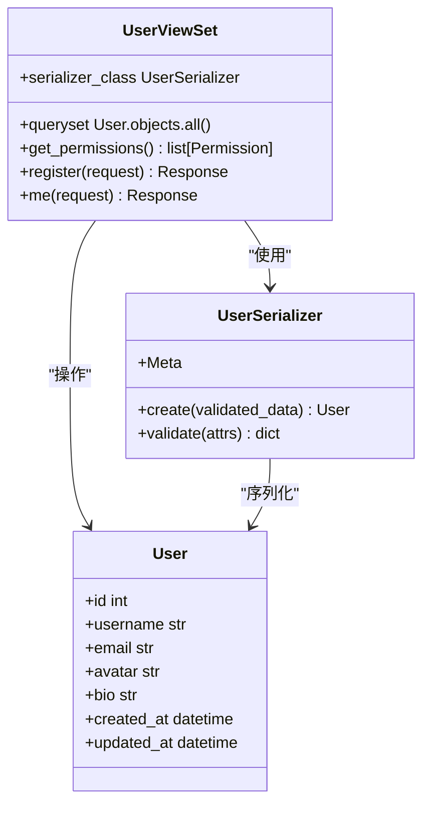
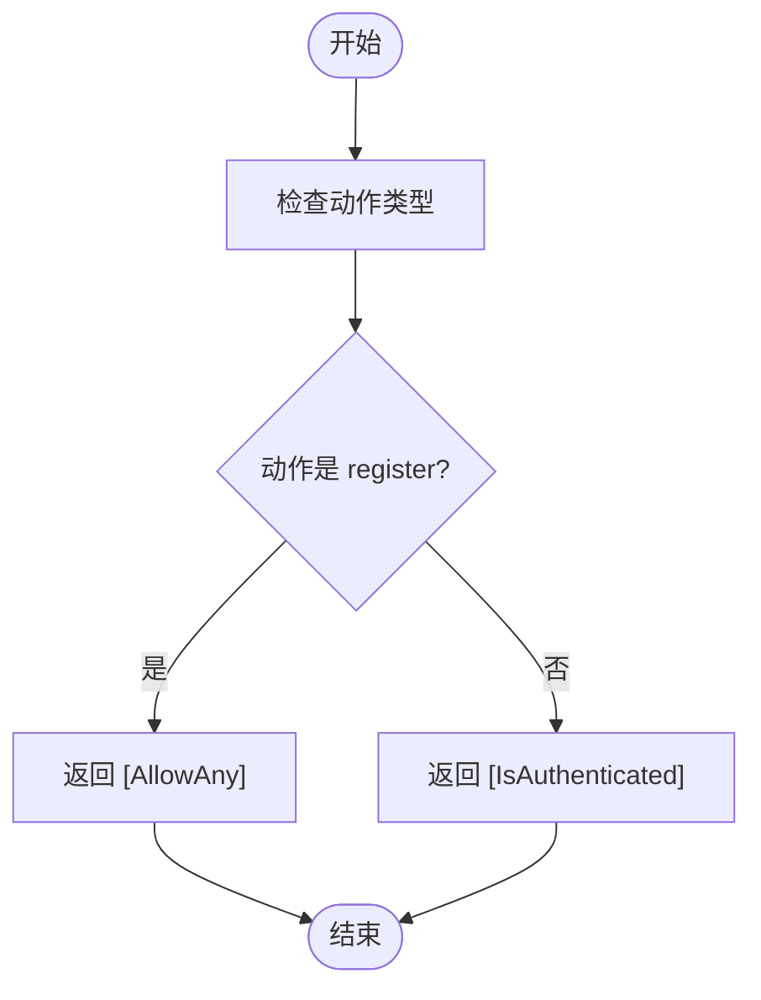
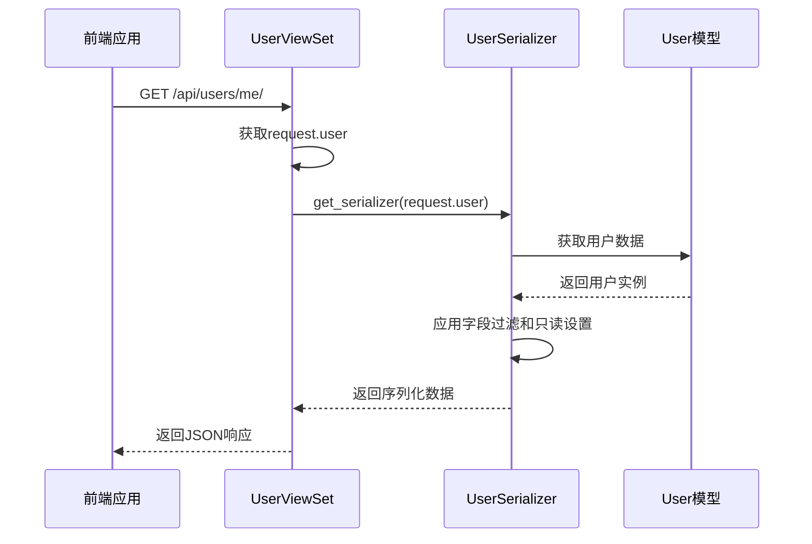
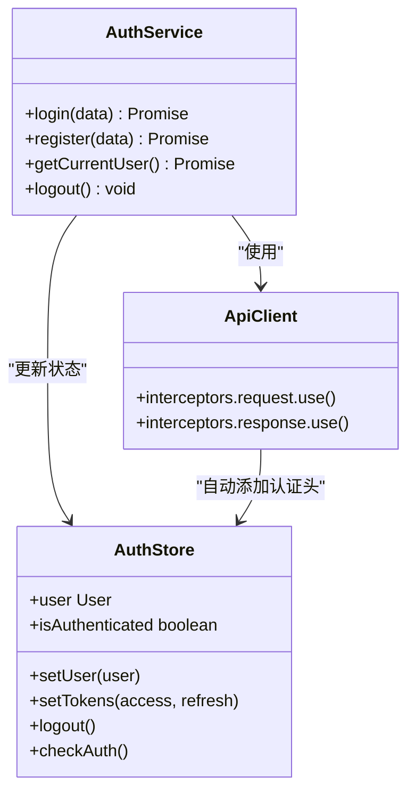
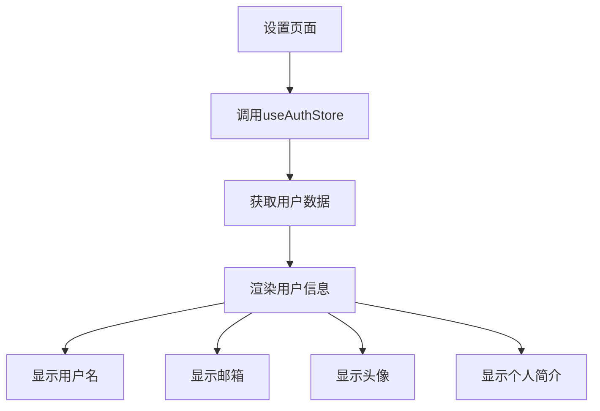

# 用户API

<cite>
**本文档引用文件**   
- [UserViewSet](file://backend/apps/users/views.py)
- [UserSerializer](file://backend/apps/users/serializers.py)
- [User](file://backend/apps/users/models.py)
- [auth.ts](file://frontend/src/services/auth.ts)
- [api.ts](file://frontend/src/services/api.ts)
- [auth.ts](file://frontend/src/store/auth.ts)
- [index.ts](file://frontend/src/types/index.ts)
- [SettingsPage.tsx](file://frontend/src/pages/SettingsPage.tsx)
</cite>

## 目录
1. [简介](#简介)
2. [核心组件](#核心组件)
3. [权限控制机制](#权限控制机制)
4. [数据序列化过程](#数据序列化过程)
5. [用户模型字段与验证规则](#用户模型字段与验证规则)
6. [前端调用示例](#前端调用示例)
7. [安全考虑](#安全考虑)
8. [错误处理](#错误处理)
9. [结论](#结论)

## 简介
本API文档详细说明了用户管理系统的实现，重点聚焦于`UserViewSet`中的`/api/users/me/`端点。该端点用于获取当前认证用户的信息，涉及权限控制、数据序列化、模型定义和前端集成等多个方面。系统采用Django REST Framework构建后端，配合React前端实现完整的用户信息获取流程。

## 核心组件

### UserViewSet 实现
`UserViewSet`是用户管理的核心视图集，继承自`ModelViewSet`，提供了标准的CRUD操作，并通过自定义动作扩展了注册和获取当前用户的功能。



**图示来源**
- [UserViewSet](file://backend/apps/users/views.py#L8-L30)
- [UserSerializer](file://backend/apps/users/serializers.py#L4-L8)
- [User](file://backend/apps/users/models.py#L4-L20)

**本节来源**
- [UserViewSet](file://backend/apps/users/views.py#L8-L30)

## 权限控制机制

### 权限分配逻辑
`get_permissions`方法根据不同的操作动作动态分配权限策略：

- `register`动作：允许任何用户访问（`AllowAny`）
- 其他所有动作：仅允许认证用户访问（`IsAuthenticated`）

对于`me`端点，由于其装饰器中未指定`permission_classes`，将继承`get_permissions`方法返回的`[IsAuthenticated]`，确保只有登录用户才能获取自己的信息。



**图示来源**
- [UserViewSet.get_permissions](file://backend/apps/users/views.py#L12-L15)

**本节来源**
- [UserViewSet.get_permissions](file://backend/apps/users/views.py#L12-L15)

## 数据序列化过程

### 序列化流程
当用户请求`/api/users/me/`时，系统执行以下序列化流程：



**图示来源**
- [UserViewSet.me](file://backend/apps/users/views.py#L27-L30)
- [UserSerializer](file://backend/apps/users/serializers.py#L4-L8)

**本节来源**
- [UserViewSet.me](file://backend/apps/users/views.py#L27-L30)

## 用户模型字段与验证规则

### 用户模型字段定义
用户模型继承自Django的`AbstractUser`，并扩展了以下字段：

| 字段名 | 类型 | 是否必填 | 验证规则 | 说明 |
|-------|------|---------|---------|------|
| id | int | 是 | 自动递增 | 主键 |
| username | string | 是 | 唯一性 | 用户名 |
| email | string | 是 | 唯一性、邮箱格式 | 邮箱地址 |
| avatar | string | 否 | URL格式 | 头像链接 |
| bio | string | 否 | - | 个人简介 |
| created_at | datetime | 是 | 自动填充 | 创建时间 |
| updated_at | datetime | 是 | 自动更新 | 更新时间 |

**本节来源**
- [User](file://backend/apps/users/models.py#L4-L20)

### 字段验证规则
- **邮箱(email)**：必须是有效的邮箱格式，且在数据库中唯一
- **头像(avatar)**：必须是有效的URL链接，可为空
- **个人简介(bio)**：纯文本字段，可为空
- **创建时间(created_at)**：创建时自动设置，不可修改
- **更新时间(updated_at)**：每次保存时自动更新

## 前端调用示例

### API调用实现
前端通过`authService`服务调用用户API：



**图示来源**
- [auth.ts](file://frontend/src/services/auth.ts#L4-L24)
- [api.ts](file://frontend/src/services/api.ts#L1-L58)
- [auth.ts](file://frontend/src/store/auth.ts#L12-L35)

**本节来源**
- [auth.ts](file://frontend/src/services/auth.ts#L14-L17)

### UI渲染示例
在设置页面中，获取的用户数据用于渲染个人资料：



**图示来源**
- [SettingsPage.tsx](file://frontend/src/pages/SettingsPage.tsx#L7-L7)
- [auth.ts](file://frontend/src/store/auth.ts#L4-L4)

**本节来源**
- [SettingsPage.tsx](file://frontend/src/pages/SettingsPage.tsx#L7-L7)

## 安全考虑

### 敏感信息过滤
系统通过以下机制保护用户敏感信息：

1. **密码字段隔离**：密码字段仅在注册序列化器中定义，且设置为`write_only`
2. **只读字段设置**：ID、创建时间和更新时间设置为只读，防止客户端修改
3. **认证头自动管理**：前端通过拦截器自动添加JWT令牌，避免明文传输

### 权限验证
- 所有敏感操作都需要有效的JWT令牌
- 未认证请求将被拒绝并返回401状态码
- 令牌过期后，前端会自动尝试刷新令牌

**本节来源**
- [UserSerializer](file://backend/apps/users/serializers.py#L4-L8)
- [api.ts](file://frontend/src/services/api.ts#L12-L55)

## 错误处理

### 未认证访问
当未认证用户尝试访问`/api/users/me/`时，系统将返回401未授权响应：

```json
{
  "detail": "身份认证信息未提供。"
}
```

### 其他可能错误
- **403 禁止访问**：用户认证但无权限
- **404 未找到**：请求的资源不存在
- **500 服务器错误**：后端处理异常

前端会自动处理401响应，重定向到登录页面。

**本节来源**
- [api.ts](file://frontend/src/services/api.ts#L26-L55)

## 结论
`/api/users/me/`端点通过`IsAuthenticated`权限类确保了只有认证用户才能访问，使用`UserSerializer`进行安全的数据序列化，并通过前端服务层实现无缝的用户信息获取和UI渲染。整个流程体现了安全、高效和用户友好的设计原则。