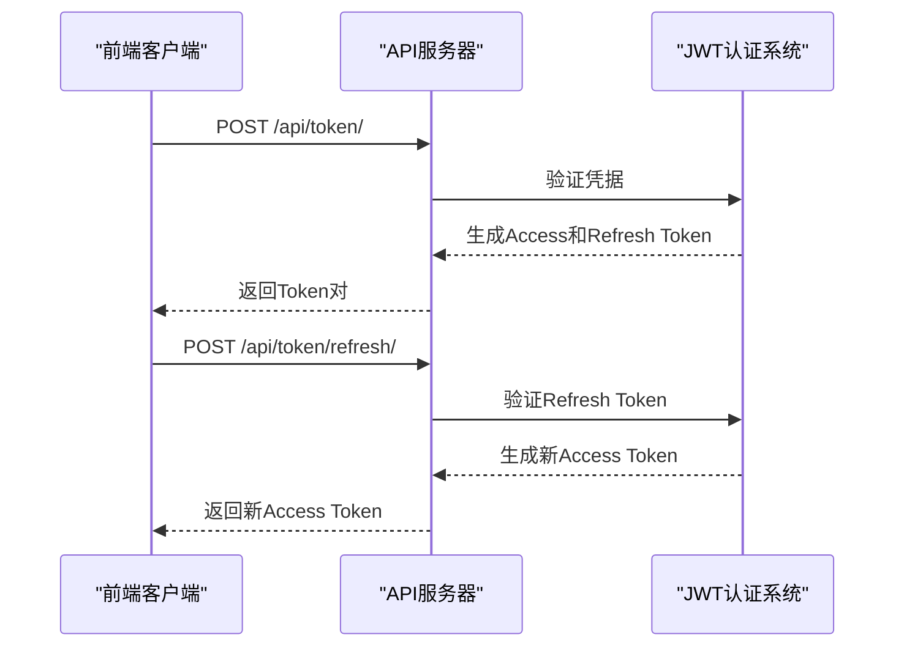
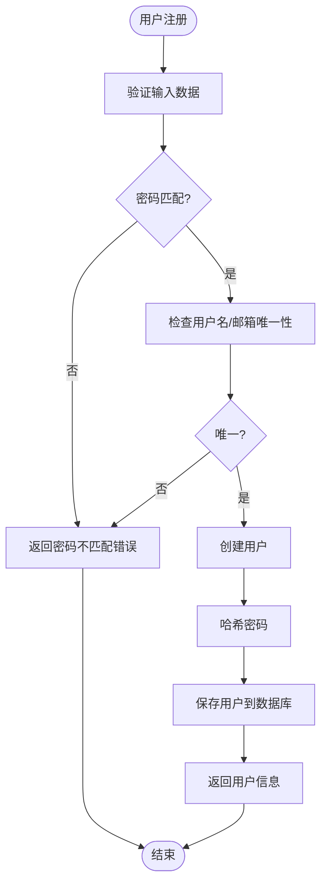
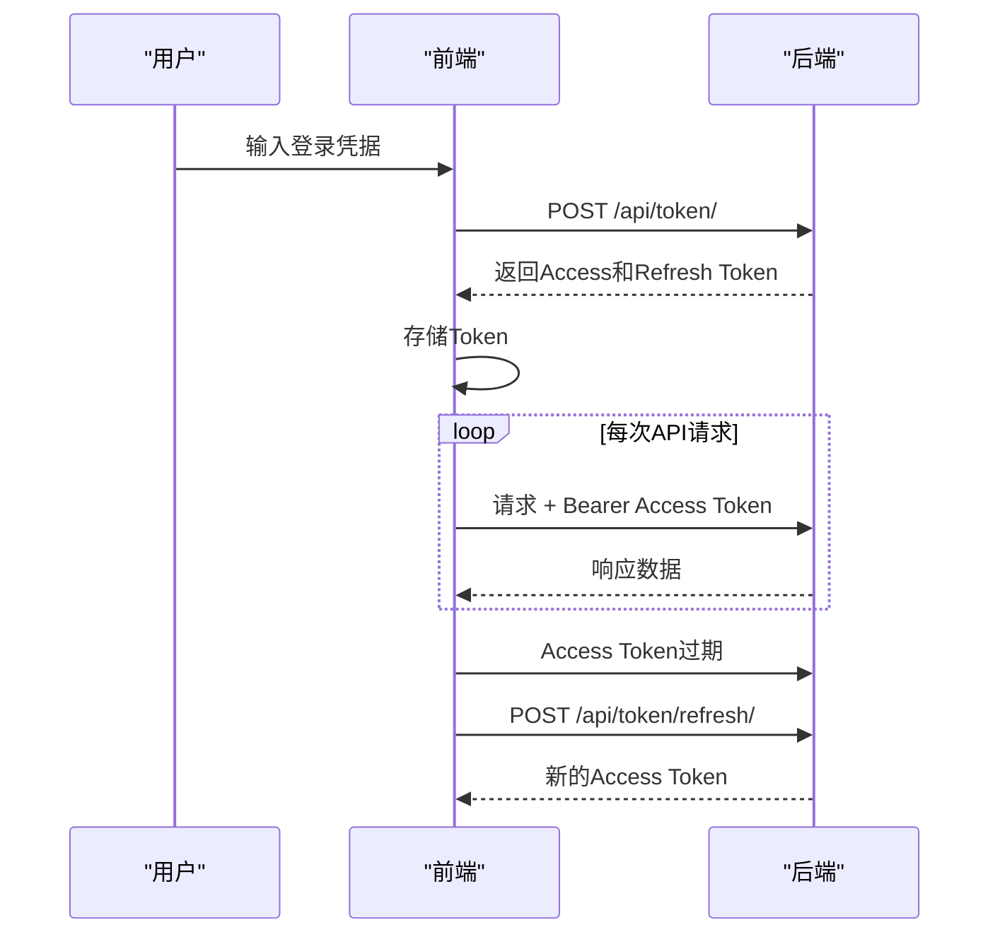
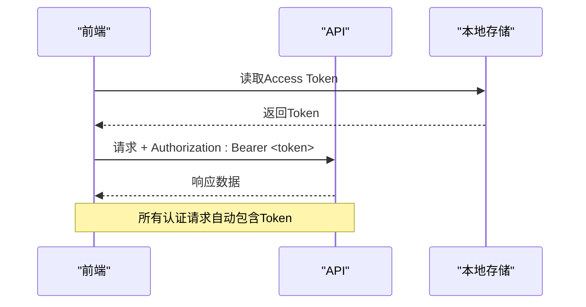

# 认证API

<cite>
**本文档引用的文件**  
- [users/urls.py](file://backend/apps/users/urls.py)
- [users/views.py](file://backend/apps/users/views.py)
- [users/serializers.py](file://backend/apps/users/serializers.py)
- [todo_project/urls.py](file://backend/todo_project/urls.py)
- [todo_project/settings.py](file://backend/todo_project/settings.py)
- [auth.ts](file://frontend/src/services/auth.ts)
- [api.ts](file://frontend/src/services/api.ts)
- [LoginPage.tsx](file://frontend/src/pages/LoginPage.tsx)
- [RegisterPage.tsx](file://frontend/src/pages/RegisterPage.tsx)
</cite>

## 目录
1. [简介](#简介)
2. [认证端点](#认证端点)
3. [用户注册API](#用户注册api)
4. [JWT认证流程](#jwt认证流程)
5. [错误处理](#错误处理)
6. [前端调用示例](#前端调用示例)
7. [总结](#总结)

## 简介
本API文档详细说明了基于Django REST Framework和JWT的用户认证系统。系统支持用户注册、登录、Token刷新和当前用户信息获取等功能。认证机制采用Bearer Token模式，通过RESTful API提供安全的身份验证服务。

**Section sources**
- [todo_project/urls.py](file://backend/todo_project/urls.py#L1-L26)
- [settings.py](file://backend/todo_project/settings.py#L116-L163)

## 认证端点

### Token获取 (/api/token/)
用于用户登录并获取访问令牌。

- **HTTP方法**: POST
- **请求头**: Content-Type: application/json
- **请求体schema**:
  ```json
  {
    "username": "string",
    "password": "string"
  }
  ```
- **成功响应 (200)**:
  ```json
  {
    "access": "string",
    "refresh": "string"
  }
  ```

### Token刷新 (/api/token/refresh/)
用于使用刷新令牌获取新的访问令牌。

- **HTTP方法**: POST
- **请求头**: Content-Type: application/json
- **请求体schema**:
  ```json
  {
    "refresh": "string"
  }
  ```
- **成功响应 (200)**:
  ```json
  {
    "access": "string"
  }
  ```



**Diagram sources**
- [todo_project/urls.py](file://backend/todo_project/urls.py#L1-L26)
- [settings.py](file://backend/todo_project/settings.py#L116-L163)

**Section sources**
- [todo_project/urls.py](file://backend/todo_project/urls.py#L1-L26)

## 用户注册API

### 端点信息
- **URL**: /api/users/register/
- **HTTP方法**: POST
- **权限**: 允许匿名访问

### 请求体schema
```json
{
  "username": "string",
  "email": "string",
  "password": "string",
  "password_confirm": "string"
}
```

### 实现逻辑
1. **密码强度验证**:
   - 密码最小长度为8个字符
   - 需要两次输入密码进行确认
   - 服务器端验证两次密码是否匹配

2. **用户唯一性检查**:
   - 系统自动检查用户名和邮箱的唯一性
   - 由Django模型约束保证

3. **重复标签处理**:
   - 注册流程中不涉及标签处理
   - 标签功能在独立的标签应用中实现



**Diagram sources**
- [users/serializers.py](file://backend/apps/users/serializers.py#L11-L27)
- [users/views.py](file://backend/apps/users/views.py#L18-L24)

**Section sources**
- [users/serializers.py](file://backend/apps/users/serializers.py#L11-L27)
- [users/views.py](file://backend/apps/users/views.py#L18-L24)

## JWT认证流程

### Token生命周期
- **Access Token有效期**: 1天
- **Refresh Token有效期**: 7天
- **Token刷新机制**: 支持刷新令牌轮换和黑名单机制

### 认证流程
1. 用户通过用户名和密码登录
2. 服务器验证凭据并返回Access和Refresh Token
3. 前端在后续请求的Authorization头中携带Access Token
4. 当Access Token过期时，使用Refresh Token获取新的Access Token
5. Refresh Token过期后，用户需要重新登录



**Diagram sources**
- [settings.py](file://backend/todo_project/settings.py#L116-L163)
- [api.ts](file://frontend/src/services/api.ts#L1-L58)

## 错误处理

### 常见认证失败场景

| 场景 | HTTP状态码 | 响应体 |
|------|-----------|--------|
| 无效凭据 | 401 | `{"detail": "No active account found with the given credentials"}` |
| Token过期 | 401 | `{"detail": "Token is invalid or expired"}` |
| 缺少Token | 401 | `{"detail": "Authentication credentials were not provided"}` |
| 密码不匹配 | 400 | `{"password": "密码不匹配"}` |
| 用户名已存在 | 400 | `{"username": "该用户名已存在。"}` |

### 错误处理策略
- 400错误：客户端输入验证失败，需要用户修正输入
- 401错误：认证失败，可能需要重新登录
- 前端自动处理Token过期，尝试刷新Token

**Section sources**
- [users/serializers.py](file://backend/apps/users/serializers.py#L20-L23)
- [api.ts](file://frontend/src/services/api.ts#L30-L50)

## 前端调用示例

### 用户注册
```typescript
import { authService } from '@/services/auth'

const registerUser = async () => {
  try {
    const userData = await authService.register({
      username: 'john_doe',
      email: 'john@example.com',
      password: 'securepassword123',
      password_confirm: 'securepassword123'
    })
    console.log('注册成功:', userData)
  } catch (error) {
    console.error('注册失败:', error)
  }
}
```

### 用户登录
```typescript
import { authService } from '@/services/auth'
import { useAuthStore } from '@/store/auth'

const loginUser = async () => {
  try {
    const tokens = await authService.login({
      username: 'john_doe',
      password: 'securepassword123'
    })
    useAuthStore.getState().setTokens(tokens.access, tokens.refresh)
    console.log('登录成功')
  } catch (error) {
    console.error('登录失败:', error)
  }
}
```

### Token刷新（自动处理）
```typescript
// 在api.ts中已实现自动刷新逻辑
// 当收到401响应时，自动使用Refresh Token获取新Access Token

apiClient.interceptors.response.use(
  (response) => response,
  async (error) => {
    if (error.response?.status === 401) {
      // 自动刷新Token逻辑
      const refreshToken = localStorage.getItem('refresh_token')
      const response = await axios.post('/api/token/refresh/', {
        refresh: refreshToken
      })
      
      const { access } = response.data
      localStorage.setItem('access_token', access)
      // 重试原始请求
    }
    return Promise.reject(error)
  }
)
```

### 设置Authorization头
```typescript
// 在api.ts中通过拦截器自动设置
apiClient.interceptors.request.use(
  (config) => {
    const token = localStorage.getItem('access_token')
    if (token) {
      config.headers.Authorization = `Bearer ${token}`
    }
    return config
  }
)
```



**Diagram sources**
- [api.ts](file://frontend/src/services/api.ts#L15-L25)
- [auth.ts](file://frontend/src/services/auth.ts#L1-L24)

**Section sources**
- [api.ts](file://frontend/src/services/api.ts#L1-L58)
- [auth.ts](file://frontend/src/services/auth.ts#L1-L24)
- [LoginPage.tsx](file://frontend/src/pages/LoginPage.tsx#L1-L97)
- [RegisterPage.tsx](file://frontend/src/pages/RegisterPage.tsx#L1-L132)

## 总结
本认证系统提供了完整的JWT身份验证解决方案，包括用户注册、登录、Token管理和自动刷新功能。系统具有以下特点：
- 安全的密码验证机制
- 自动化的Token刷新流程
- 完善的错误处理
- 前端友好的API设计
- 符合RESTful规范

通过前后端的紧密配合，实现了无缝的用户体验和安全的认证机制。