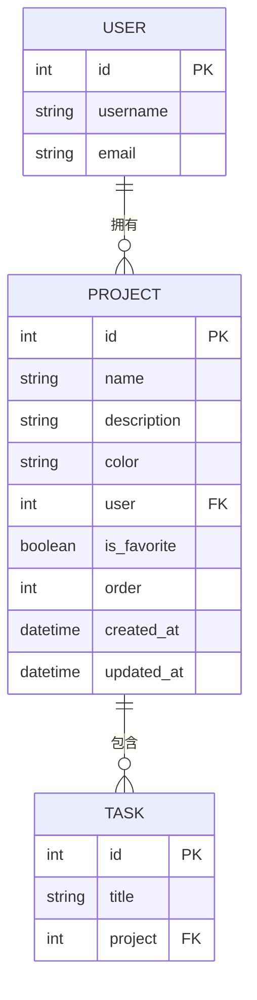
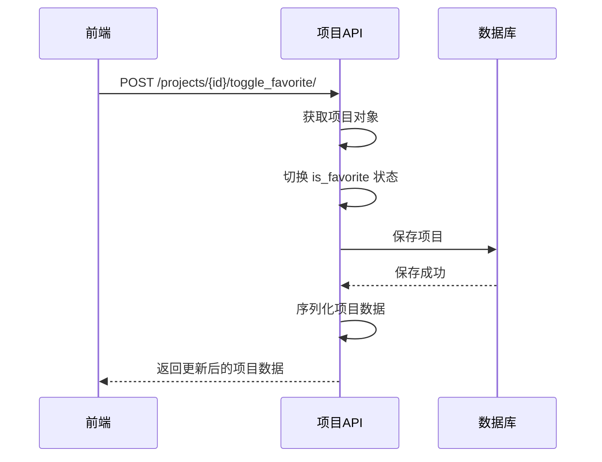
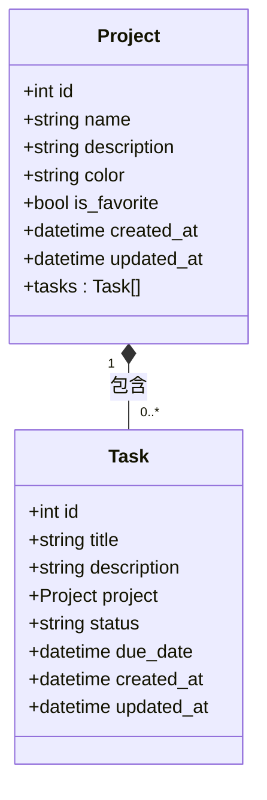

# 项目API

<cite>
**Referenced Files in This Document**   
- [ProjectViewSet](file://backend/apps/projects/views.py#L7-L36)
- [Project](file://backend/apps/projects/models.py#L4-L30)
- [ProjectSerializer](file://backend/apps/projects/serializers.py#L4-L29)
- [urls.py](file://backend/apps/projects/urls.py#L1-L11)
- [Task](file://backend/apps/tasks/models.py#L4-L73)
- [project.ts](file://frontend/src/services/project.ts#L1-L43)
- [ProjectsPage.tsx](file://frontend/src/pages/ProjectsPage.tsx#L9-L263)
- [index.ts](file://frontend/src/types/index.ts#L67-L83)
</cite>

## 目录
1. [简介](#简介)
2. [项目数据模型](#项目数据模型)
3. [API端点与CRUD操作](#api端点与crud操作)
4. [切换收藏状态功能](#切换收藏状态功能)
5. [查询集过滤机制](#查询集过滤机制)
6. [前端调用示例](#前端调用示例)
7. [项目与任务的关联关系](#项目与任务的关联关系)

## 简介
本文档详细介绍了项目管理API的核心功能，重点聚焦于`ProjectViewSet`的实现。该API提供了完整的项目CRUD（创建、读取、更新、删除）操作，支持项目名称、描述、颜色和收藏状态等核心属性的管理。特别地，文档深入解析了切换收藏状态这一特殊功能端点的实现逻辑和使用场景。通过查询集过滤机制，确保了用户只能访问和操作属于自己的项目，保障了数据安全。同时，文档还提供了前端调用示例，并说明了项目与任务之间的关联关系。

## 项目数据模型

项目数据模型定义了项目的核心属性和结构。每个项目都包含名称、描述、颜色、收藏状态等字段，并与用户建立关联。



**Diagram sources**
- [models.py](file://backend/apps/projects/models.py#L4-L30)
- [models.py](file://backend/apps/tasks/models.py#L4-L73)

**Section sources**
- [models.py](file://backend/apps/projects/models.py#L4-L30)

## API端点与CRUD操作

项目API通过`ProjectViewSet`提供标准的RESTful端点，支持对项目的完整CRUD操作。API端点基于Django REST Framework的`ModelViewSet`实现，自动提供了创建、读取、更新和删除功能。

```mermaid
flowchart TD
A[客户端] --> B[POST /projects/]
A --> C[GET /projects/]
A --> D[GET /projects/{id}/]
A --> E[PATCH /projects/{id}/]
A --> F[DELETE /projects/{id}/]
B --> G[创建项目]
C --> H[获取项目列表]
D --> I[获取单个项目]
E --> J[更新项目]
F --> K[删除项目]
```

**Diagram sources**
- [urls.py](file://backend/apps/projects/urls.py#L1-L11)
- [views.py](file://backend/apps/projects/views.py#L7-L36)

**Section sources**
- [views.py](file://backend/apps/projects/views.py#L7-L36)
- [serializers.py](file://backend/apps/projects/serializers.py#L4-L29)

## 切换收藏状态功能

切换收藏状态是一个特殊的API端点，允许用户通过POST请求快速切换项目的收藏状态。该功能通过Django REST Framework的`@action`装饰器实现，作为`ProjectViewSet`的一个自定义动作。



**Diagram sources**
- [views.py](file://backend/apps/projects/views.py#L14-L21)
- [project.ts](file://frontend/src/services/project.ts#L38-L40)

**Section sources**
- [views.py](file://backend/apps/projects/views.py#L14-L21)

## 查询集过滤机制

查询集过滤机制确保了用户只能访问和操作属于自己的项目。这是通过重写`get_queryset`方法实现的，该方法在每次请求时都会过滤查询集，只返回当前请求用户所拥有的项目。

```mermaid
flowchart TD
A[用户发起请求] --> B{请求类型}
B --> |列表/详情| C[调用 get_queryset]
C --> D[Project.objects.filter(user=request.user)]
D --> E[返回过滤后的查询集]
E --> F[执行CRUD操作]
F --> G[返回结果]
B --> |其他| H[执行相应操作]
```

**Diagram sources**
- [views.py](file://backend/apps/projects/views.py#L11-L12)

**Section sources**
- [views.py](file://backend/apps/projects/views.py#L11-L12)

## 前端调用示例

前端通过`projectService`服务调用项目API。在项目列表页面中，用户可以创建、读取、更新和删除项目，并通过点击星标图标切换项目的收藏状态。

```mermaid
flowchart TD
A[ProjectsPage] --> B[useEffect]
B --> C[loadProjects]
C --> D[projectService.getProjects]
D --> E[API /projects/]
E --> F[更新项目列表状态]
A --> G[handleToggleFavorite]
G --> H[projectService.updateProject]
H --> I[API /projects/{id}/]
I --> J[更新项目状态]
```

**Diagram sources**
- [project.ts](file://frontend/src/services/project.ts#L13-L40)
- [ProjectsPage.tsx](file://frontend/src/pages/ProjectsPage.tsx#L22-L42)

**Section sources**
- [project.ts](file://frontend/src/services/project.ts#L13-L40)
- [ProjectsPage.tsx](file://frontend/src/pages/ProjectsPage.tsx#L9-L263)

## 项目与任务的关联关系

项目与任务之间存在一对多的关联关系。每个项目可以包含多个任务，而每个任务只能属于一个项目。这种关系在任务模型中通过外键`project`字段实现，允许通过项目ID过滤任务列表。



**Diagram sources**
- [models.py](file://backend/apps/projects/models.py#L4-L30)
- [models.py](file://backend/apps/tasks/models.py#L4-L73)

**Section sources**
- [models.py](file://backend/apps/tasks/models.py#L4-L73)
- [index.ts](file://frontend/src/types/index.ts#L67-L83)