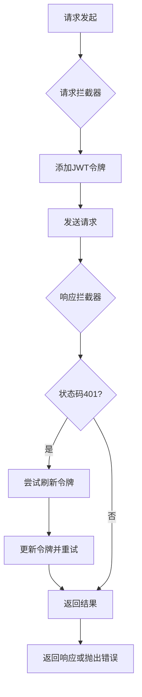
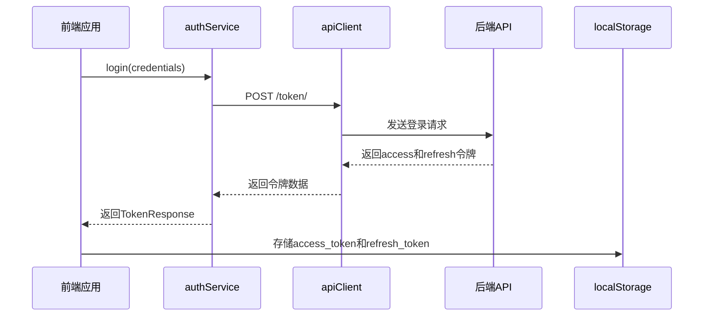
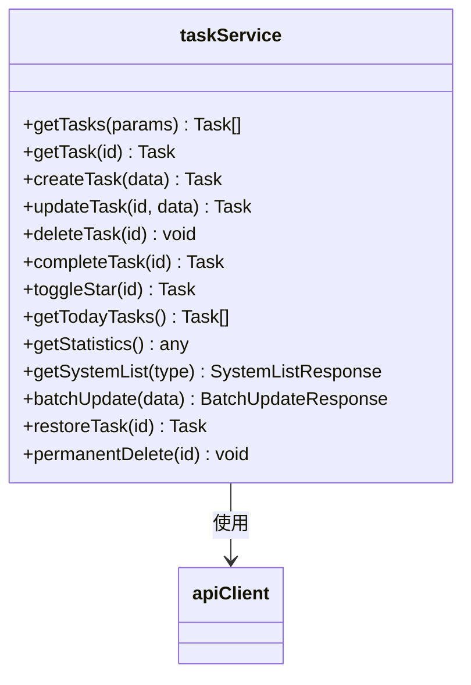
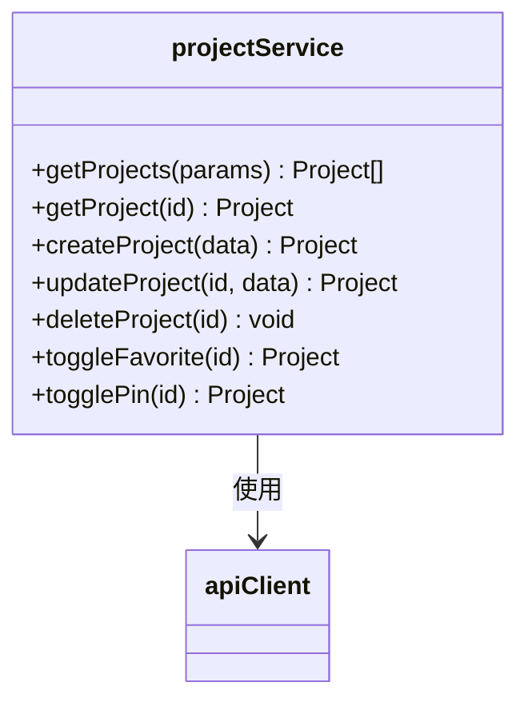
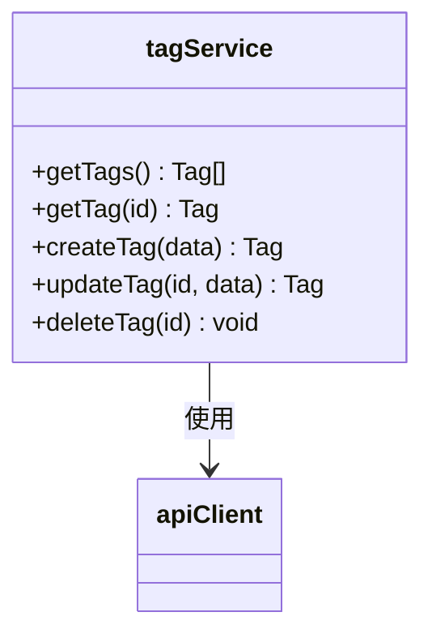
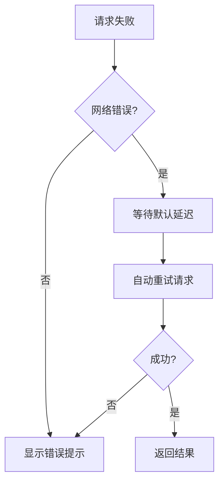
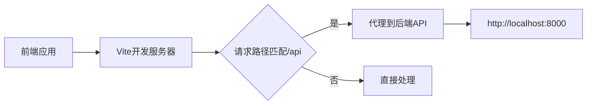

# API客户端

<cite>
**本文档引用文件**  
- [api.ts](file://frontend/src/services/api.ts)
- [auth.ts](file://frontend/src/services/auth.ts)
- [task.ts](file://frontend/src/services/task.ts)
- [project.ts](file://frontend/src/services/project.ts)
- [tag.ts](file://frontend/src/services/tag.ts)
- [vite.config.ts](file://frontend/vite.config.ts)
- [index.ts](file://frontend/src/types/index.ts)
</cite>

## 目录
1. [简介](#简介)
2. [API基础配置](#api基础配置)
3. [认证服务实现](#认证服务实现)
4. [资源服务模块分析](#资源服务模块分析)
5. [请求示例](#请求示例)
6. [错误处理与重试机制](#错误处理与重试机制)
7. [开发环境跨域解决方案](#开发环境跨域解决方案)
8. [总结](#总结)

## 简介
本项目前端通过Axios封装了一套完整的HTTP服务客户端，实现了统一的请求管理、身份认证、错误处理和缓存机制。API客户端与React Query深度集成，支持查询键生成、数据缓存和自动重试功能，为任务、项目、标签等核心资源提供了标准化的CRUD操作接口。

## API基础配置

API客户端基于Axios创建，封装了基础URL、请求头配置以及请求/响应拦截器，确保所有请求的一致性和安全性。



**Diagram sources**
- [api.ts](file://frontend/src/services/api.ts#L5-L58)

**Section sources**
- [api.ts](file://frontend/src/services/api.ts#L1-L58)

## 认证服务实现

认证服务模块封装了用户注册、登录和令牌刷新逻辑，并与本地存储中的认证状态保持同步。



**Diagram sources**
- [auth.ts](file://frontend/src/services/auth.ts#L4-L24)
- [api.ts](file://frontend/src/services/api.ts#L35-L49)

**Section sources**
- [auth.ts](file://frontend/src/services/auth.ts#L1-L25)
- [types/index.ts](file://frontend/src/types/index.ts#L109-L124)

## 资源服务模块分析

各资源服务模块（任务、项目、标签）均采用一致的设计模式，封装了对应资源的CRUD操作，并适配分页响应格式。

### 任务服务分析

任务服务提供了全面的任务管理功能，包括常规操作和批量处理。



**Diagram sources**
- [task.ts](file://frontend/src/services/task.ts#L12-L78)
- [types/index.ts](file://frontend/src/types/index.ts#L23-L47)

**Section sources**
- [task.ts](file://frontend/src/services/task.ts#L1-L79)
- [types/index.ts](file://frontend/src/types/index.ts#L187-L202)

### 项目服务分析

项目服务支持项目的基本操作及收藏、置顶等状态切换功能。



**Diagram sources**
- [project.ts](file://frontend/src/services/project.ts#L12-L47)
- [types/index.ts](file://frontend/src/types/index.ts#L69-L87)

**Section sources**
- [project.ts](file://frontend/src/services/project.ts#L1-L48)
- [types/index.ts](file://frontend/src/types/index.ts#L69-L87)

### 标签服务分析

标签服务提供标签的增删改查功能，兼容分页与非分页响应格式。



**Diagram sources**
- [tag.ts](file://frontend/src/services/tag.ts#L12-L40)
- [types/index.ts](file://frontend/src/types/index.ts#L100-L107)

**Section sources**
- [tag.ts](file://frontend/src/services/tag.ts#L1-L41)
- [types/index.ts](file://frontend/src/types/index.ts#L100-L107)

## 请求示例

以下为各HTTP方法的实际调用方式与参数传递示例：

### GET请求
```typescript
// 获取所有任务（带过滤参数）
const tasks = await taskService.getTasks({ 
  status: 'todo', 
  project: 1 
});

// 获取特定任务
const task = await taskService.getTask(123);
```

### POST请求
```typescript
// 创建新任务
const newTask = await taskService.createTask({
  title: '新任务',
  project: 1,
  priority: 'high'
});

// 完成任务
const completedTask = await taskService.completeTask(123);
```

### PUT/PATCH请求
```typescript
// 更新任务信息
const updatedTask = await taskService.updateTask(123, {
  title: '更新后的标题',
  description: '新的描述'
});
```

### DELETE请求
```typescript
// 删除任务
await taskService.deleteTask(123);
```

**Section sources**
- [task.ts](file://frontend/src/services/task.ts#L13-L36)
- [project.ts](file://frontend/src/services/project.ts#L13-L35)
- [tag.ts](file://frontend/src/services/tag.ts#L13-L38)

## 错误处理与重试机制

系统实现了多层次的错误处理与恢复机制，保障用户体验的连续性。

### 令牌自动刷新机制
当API返回401未授权状态时，客户端会自动尝试使用refresh token获取新的access token，并重新发送原始请求。

### 网络离线重试策略
结合React Query的配置，系统设置了合理的重试次数（retry: 1），在网络短暂中断时自动重试请求。



**Diagram sources**
- [api.ts](file://frontend/src/services/api.ts#L26-L55)
- [main.tsx](file://frontend/src/main.tsx#L10-L15)

**Section sources**
- [api.ts](file://frontend/src/services/api.ts#L26-L55)
- [main.tsx](file://frontend/src/main.tsx#L10-L15)

## 开发环境跨域解决方案

通过Vite的代理配置，开发环境下的跨域问题得到有效解决。



**Diagram sources**
- [vite.config.ts](file://frontend/vite.config.ts#L13-L20)

**Section sources**
- [vite.config.ts](file://frontend/vite.config.ts#L1-L23)
- [api.ts](file://frontend/src/services/api.ts#L3)

## 总结
本API客户端设计充分考虑了安全性、可用性和可维护性。通过Axios拦截器实现统一的认证管理，利用React Query提供强大的缓存和状态管理能力，各服务模块遵循一致的封装规范。开发环境通过Vite代理解决跨域问题，生产环境可通过环境变量灵活配置API地址。整个架构既保证了代码的整洁性，又提供了良好的扩展性和用户体验。