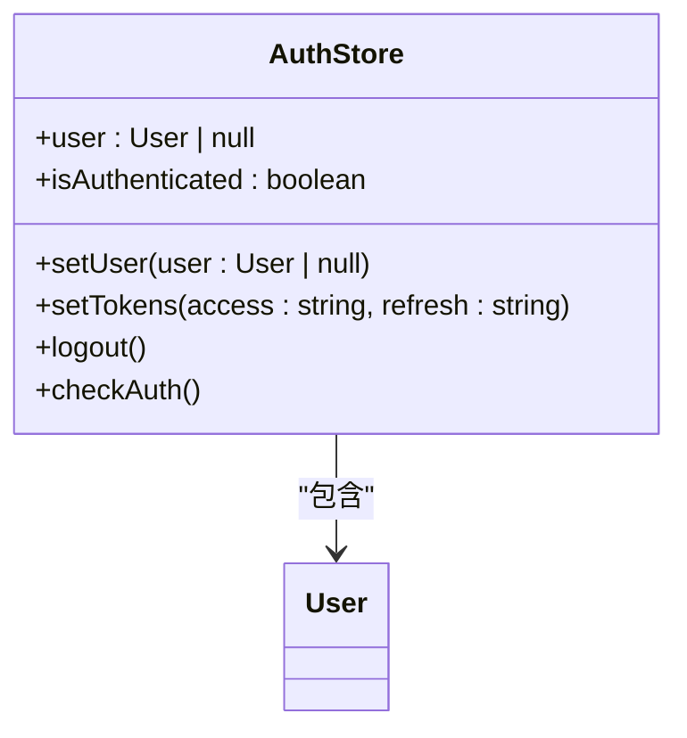
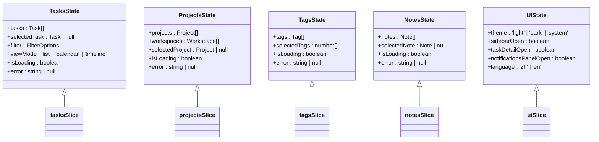
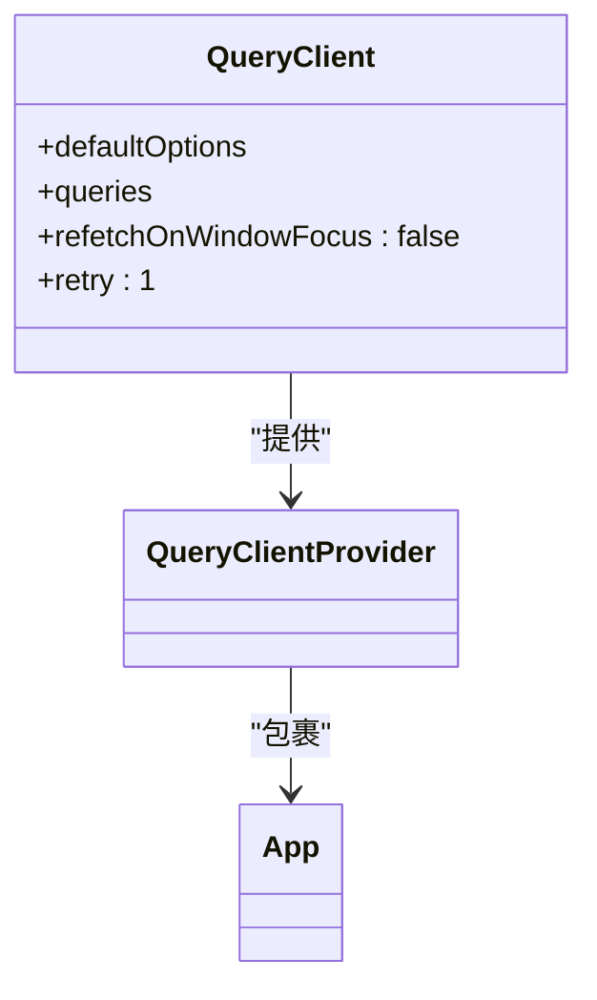
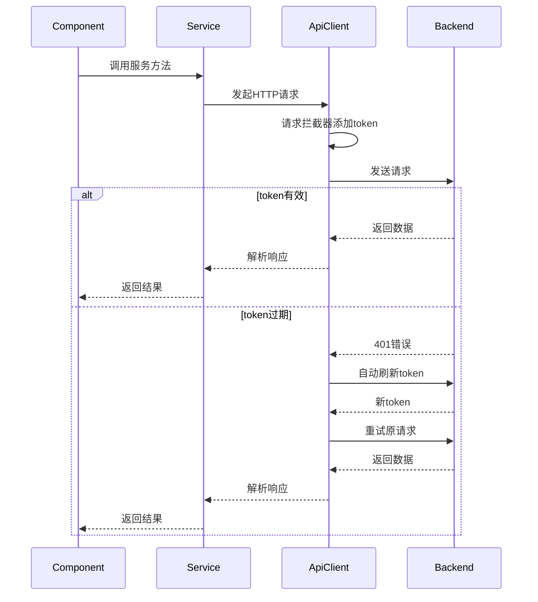
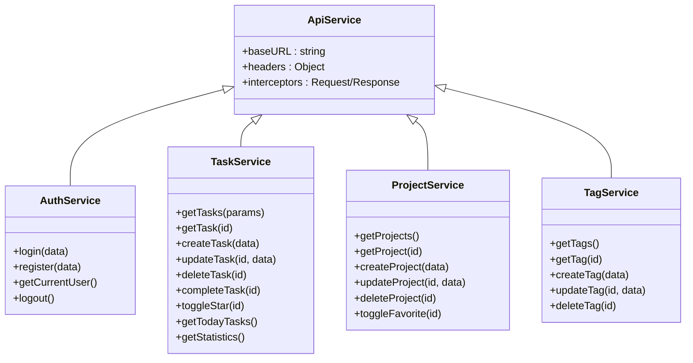
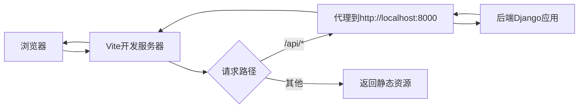

# 前端架构

<cite>
**本文档中引用的文件**  
- [App.tsx](file://frontend/src/App.tsx)
- [main.tsx](file://frontend/src/main.tsx)
- [vite.config.ts](file://frontend/vite.config.ts)
- [auth.ts](file://frontend/src/store/auth.ts)
- [index.ts](file://frontend/src/store/index.ts)
- [api.ts](file://frontend/src/services/api.ts)
- [Layout.tsx](file://frontend/src/components/Layout.tsx)
- [tasksSlice.ts](file://frontend/src/store/slices/tasksSlice.ts)
- [projectsSlice.ts](file://frontend/src/store/slices/projectsSlice.ts)
- [tagsSlice.ts](file://frontend/src/store/slices/tagsSlice.ts)
- [notesSlice.ts](file://frontend/src/store/slices/notesSlice.ts)
- [uiSlice.ts](file://frontend/src/store/slices/uiSlice.ts)
- [task.ts](file://frontend/src/services/task.ts)
- [project.ts](file://frontend/src/services/project.ts)
- [tag.ts](file://frontend/src/services/tag.ts)
- [authService.ts](file://frontend/src/services/auth.ts)
</cite>

## 目录
1. [项目结构](#项目结构)
2. [组件化架构](#组件化架构)
3. [状态管理策略](#状态管理策略)
4. [API服务层](#api服务层)
5. [Vite构建与开发服务器配置](#vite构建与开发服务器配置)
6. [前端架构图](#前端架构图)

## 项目结构

前端项目采用模块化组织结构，主要分为以下几个核心目录：

- `src/components`：存放可复用的UI组件，如按钮、模态框、布局容器等
- `src/pages`：存放页面级组件，每个文件对应一个路由页面
- `src/services`：封装与后端API通信的服务层
- `src/store`：管理应用状态，包含Zustand和Redux Toolkit的实现
- `src/types`：定义TypeScript类型
- `src/utils`：存放工具函数

**Section sources**
- [App.tsx](file://frontend/src/App.tsx#L1-L52)
- [README.md](file://README.md#L34-L77)

## 组件化架构

前端采用组件化架构，通过`src/components`和`src/pages`实现UI的模块化。

`src/components`目录包含基础UI组件和复合组件：
- `ui/`：基础UI组件（Button、Input、Modal）
- `Layout.tsx`：主布局组件，包含侧边栏和导航
- `ErrorBoundary.tsx`：错误边界组件
- `ProtectedRoute.tsx`：受保护路由组件
- `task/`：任务相关复合组件

`src/pages`目录包含所有页面组件，每个页面对应一个路由：
- DashboardPage：仪表盘页面
- TasksPage：任务管理页面
- ProjectsPage：项目管理页面
- CalendarPage：日历页面
- SettingsPage：设置页面

应用通过React Router实现路由管理，在`App.tsx`中定义了完整的路由结构，包括登录、注册和受保护的主应用路由。

```mermaid
graph TD
A[App] --> B[ErrorBoundary]
B --> C[Redux Provider]
C --> D[BrowserRouter]
D --> E[Routes]
E --> F[/login: LoginPage]
E --> G[/register: RegisterPage]
E --> H[/ : ProtectedRoute]
H --> I[Layout]
I --> J[DashboardPage]
I --> K[TasksPage]
I --> L[ProjectsPage]
I --> M[CalendarPage]
I --> N[TagsPage]
I --> O[ReportsPage]
I --> P[SettingsPage]
```

**Diagram sources**
- [App.tsx](file://frontend/src/App.tsx#L18-L51)
- [Layout.tsx](file://frontend/src/components/Layout.tsx#L7-L131)

**Section sources**
- [App.tsx](file://frontend/src/App.tsx#L1-L52)
- [Layout.tsx](file://frontend/src/components/Layout.tsx#L1-L131)

## 状态管理策略

应用采用混合状态管理策略，结合Zustand和Redux Toolkit来管理不同类型的状态。

### 全局认证状态（Zustand）

使用Zustand管理用户认证状态，`src/store/auth.ts`中定义了`useAuthStore`：
- 存储用户信息和认证状态
- 通过localStorage持久化token
- 提供登录、登出、token刷新等操作
- 在应用启动时检查认证状态



**Diagram sources**
- [auth.ts](file://frontend/src/store/auth.ts#L4-L11)

### 应用状态（Redux Toolkit）

使用Redux Toolkit管理应用的全局状态，`src/store/index.ts`中配置了store：
- `tasks`：任务状态
- `projects`：项目状态  
- `tags`：标签状态
- `notes`：笔记状态
- `ui`：UI状态（主题、侧边栏等）

每个状态模块在`src/store/slices/`目录下有对应的slice文件，遵循Redux Toolkit的最佳实践。



**Diagram sources**
- [tasksSlice.ts](file://frontend/src/store/slices/tasksSlice.ts#L4-L11)
- [projectsSlice.ts](file://frontend/src/store/slices/projectsSlice.ts#L4-L10)
- [tagsSlice.ts](file://frontend/src/store/slices/tagsSlice.ts#L4-L9)
- [notesSlice.ts](file://frontend/src/store/slices/notesSlice.ts#L4-L9)
- [uiSlice.ts](file://frontend/src/store/slices/uiSlice.ts#L3-L9)

### 服务端状态（React Query）

在`src/main.tsx`中配置了React Query的`QueryClient`：
- 管理从后端获取的数据
- 提供缓存、自动刷新、错误重试等功能
- 配置`refetchOnWindowFocus: false`避免频繁请求
- 设置`retry: 1`在失败时重试一次



**Diagram sources**
- [main.tsx](file://frontend/src/main.tsx#L7-L14)

**Section sources**
- [auth.ts](file://frontend/src/store/auth.ts#L1-L37)
- [index.ts](file://frontend/src/store/index.ts#L1-L24)
- [main.tsx](file://frontend/src/main.tsx#L1-L23)
- [tasksSlice.ts](file://frontend/src/store/slices/tasksSlice.ts#L1-L72)
- [projectsSlice.ts](file://frontend/src/store/slices/projectsSlice.ts#L1-L66)
- [tagsSlice.ts](file://frontend/src/store/slices/tagsSlice.ts#L1-L69)
- [notesSlice.ts](file://frontend/src/store/slices/notesSlice.ts#L1-L60)
- [uiSlice.ts](file://frontend/src/store/slices/uiSlice.ts#L1-L59)

## API服务层

`src/services`目录封装了与后端API的通信逻辑，采用分层设计。

### API客户端配置

`src/services/api.ts`创建了axios实例：
- 配置基础URL（从环境变量读取）
- 设置请求头Content-Type
- 添加请求拦截器自动添加认证token
- 添加响应拦截器处理401错误和token刷新

当token过期时，自动使用refresh token获取新token，确保用户体验流畅。



**Diagram sources**
- [api.ts](file://frontend/src/services/api.ts#L1-L59)

### 服务模块

各个服务模块分别处理不同领域的API调用：

- `auth.ts`：认证相关服务（登录、注册、获取用户信息）
- `task.ts`：任务相关服务（CRUD操作、完成任务、获取统计）
- `project.ts`：项目相关服务（CRUD操作、切换收藏）
- `tag.ts`：标签相关服务（CRUD操作）

每个服务方法都返回Promise，便于在组件中使用async/await。



**Diagram sources**
- [api.ts](file://frontend/src/services/api.ts#L1-L59)
- [auth.ts](file://frontend/src/services/auth.ts#L1-L25)
- [task.ts](file://frontend/src/services/task.ts#L1-L57)
- [project.ts](file://frontend/src/services/project.ts#L1-L42)
- [tag.ts](file://frontend/src/services/tag.ts#L1-L40)

**Section sources**
- [api.ts](file://frontend/src/services/api.ts#L1-L59)
- [auth.ts](file://frontend/src/services/auth.ts#L1-L25)
- [task.ts](file://frontend/src/services/task.ts#L1-L57)
- [project.ts](file://frontend/src/services/project.ts#L1-L42)
- [tag.ts](file://frontend/src/services/tag.ts#L1-L40)

## Vite构建与开发服务器配置

`vite.config.ts`配置了Vite构建工具和开发服务器。

### 别名配置

设置`@`别名为`src`目录，简化模块导入路径：
```typescript
alias: {
  '@': path.resolve(__dirname, './src')
}
```

### 开发服务器代理

配置开发服务器代理，解决跨域问题：
- 将`/api`请求代理到后端服务`http://localhost:8000`
- 设置`changeOrigin: true`修改请求源

这使得前端开发服务器可以无缝与后端API通信，无需处理CORS问题。



**Diagram sources**
- [vite.config.ts](file://frontend/vite.config.ts#L1-L23)

**Section sources**
- [vite.config.ts](file://frontend/vite.config.ts#L1-L23)

## 前端架构图

以下架构图展示了数据流从API服务到状态管理再到UI组件的完整路径。

```mermaid
graph TD
A[UI组件] --> B{数据需求}
B --> |认证状态| C[Zustand useAuthStore]
B --> |应用状态| D[Redux Store]
B --> |服务端数据| E[React Query]
C --> F[localStorage]
D --> G[Redux Slices]
E --> H[QueryClient]
G --> |触发| I[API服务]
H --> |触发| I
C --> |触发| I
I --> J[API客户端]
J --> |请求拦截| K[添加认证token]
K --> L[后端API]
L --> |响应| M[响应拦截]
M --> |401处理| N[token刷新]
M --> |正常响应| O[返回数据]
O --> I --> H --> B
O --> I --> G --> D --> B
O --> I --> C --> B
P[开发服务器] --> |代理| Q[/api → http://localhost:8000]
Q --> L
style A fill:#4CAF50,stroke:#388E3C
style C fill:#2196F3,stroke:#1976D2
style D fill:#2196F3,stroke:#1976D2
style E fill:#2196F3,stroke:#1976D2
style I fill:#FF9800,stroke:#F57C00
style J fill:#FF9800,stroke:#F57C00
style L fill:#9C27B0,stroke:#7B1FA2
```

**Diagram sources**
- [main.tsx](file://frontend/src/main.tsx#L1-L23)
- [auth.ts](file://frontend/src/store/auth.ts#L1-L37)
- [index.ts](file://frontend/src/store/index.ts#L1-L24)
- [api.ts](file://frontend/src/services/api.ts#L1-L59)
- [vite.config.ts](file://frontend/vite.config.ts#L1-L23)