# 前端组件架构

<cite>
**本文档引用文件**  
- [Layout.tsx](file://frontend/src/components/Layout.tsx)
- [TaskItem.tsx](file://frontend/src/components/task/TaskItem.tsx)
- [TaskDetail.tsx](file://frontend/src/components/task/TaskDetail.tsx)
- [SortableTaskItem.tsx](file://frontend/src/components/task/SortableTaskItem.tsx)
- [Button.tsx](file://frontend/src/components/ui/Button.tsx)
- [Input.tsx](file://frontend/src/components/ui/Input.tsx)
- [Modal.tsx](file://frontend/src/components/ui/Modal.tsx)
- [ErrorBoundary.tsx](file://frontend/src/components/ErrorBoundary.tsx)
- [Loading.tsx](file://frontend/src/components/Loading.tsx)
- [ProtectedRoute.tsx](file://frontend/src/components/ProtectedRoute.tsx)
- [TasksPage.tsx](file://frontend/src/pages/TasksPage.tsx)
- [App.tsx](file://frontend/src/App.tsx)
- [tailwind.config.js](file://frontend/tailwind.config.js)
- [index.ts](file://frontend/src/types/index.ts)
</cite>

## 目录
1. [简介](#简介)
2. [项目结构](#项目结构)
3. [核心组件](#核心组件)
4. [架构概览](#架构概览)
5. [详细组件分析](#详细组件分析)
6. [依赖分析](#依赖分析)
7. [性能考虑](#性能考虑)
8. [故障排除指南](#故障排除指南)
9. [结论](#结论)

## 简介
本文档详细阐述了基于React的前端组件架构，重点分析了组件的分层设计、复用机制与交互逻辑。系统采用现代化的UI设计原则，结合TailwindCSS实现原子化样式管理，并通过合理的组件拆分与状态管理构建可维护的前端应用。

## 项目结构
前端项目采用功能模块化组织方式，核心组件集中于`components`目录，按功能划分为任务、UI基础组件等子模块。页面组件位于`pages`目录，通过路由进行组织。类型定义统一管理于`types`目录，确保类型安全。

**组件结构图**
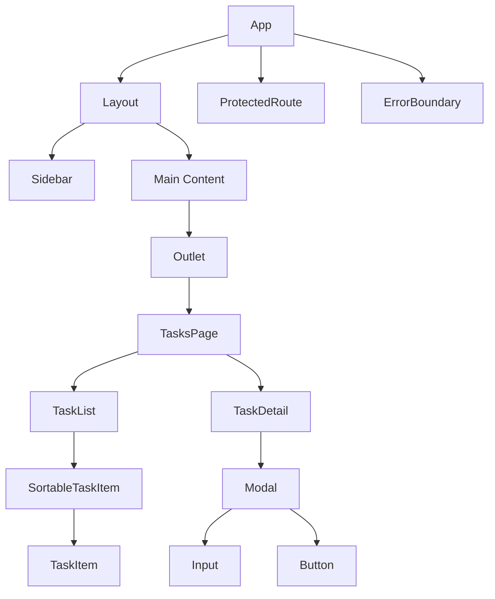

**图源**
- [App.tsx](file://frontend/src/App.tsx)
- [Layout.tsx](file://frontend/src/components/Layout.tsx)
- [TasksPage.tsx](file://frontend/src/pages/TasksPage.tsx)

## 核心组件

本文档聚焦于以下核心组件的架构与实现：
- **Layout组件**：应用主布局容器
- **任务相关组件**：TaskItem、TaskDetail、SortableTaskItem
- **UI基础组件**：Button、Input、Modal
- **体验优化组件**：ErrorBoundary、Loading

**章节来源**
- [Layout.tsx](file://frontend/src/components/Layout.tsx)
- [TaskItem.tsx](file://frontend/src/components/task/TaskItem.tsx)
- [TaskDetail.tsx](file://frontend/src/components/task/TaskDetail.tsx)
- [Button.tsx](file://frontend/src/components/ui/Button.tsx)
- [ErrorBoundary.tsx](file://frontend/src/components/ErrorBoundary.tsx)

## 架构概览
系统采用分层架构设计，从上至下分为：
1. **路由层**：通过React Router管理页面导航
2. **布局层**：Layout组件提供统一的主界面框架
3. **页面层**：各功能页面实现具体业务逻辑
4. **组件层**：可复用的UI组件提供基础构建块
5. **服务层**：API服务处理数据交互

**架构图**
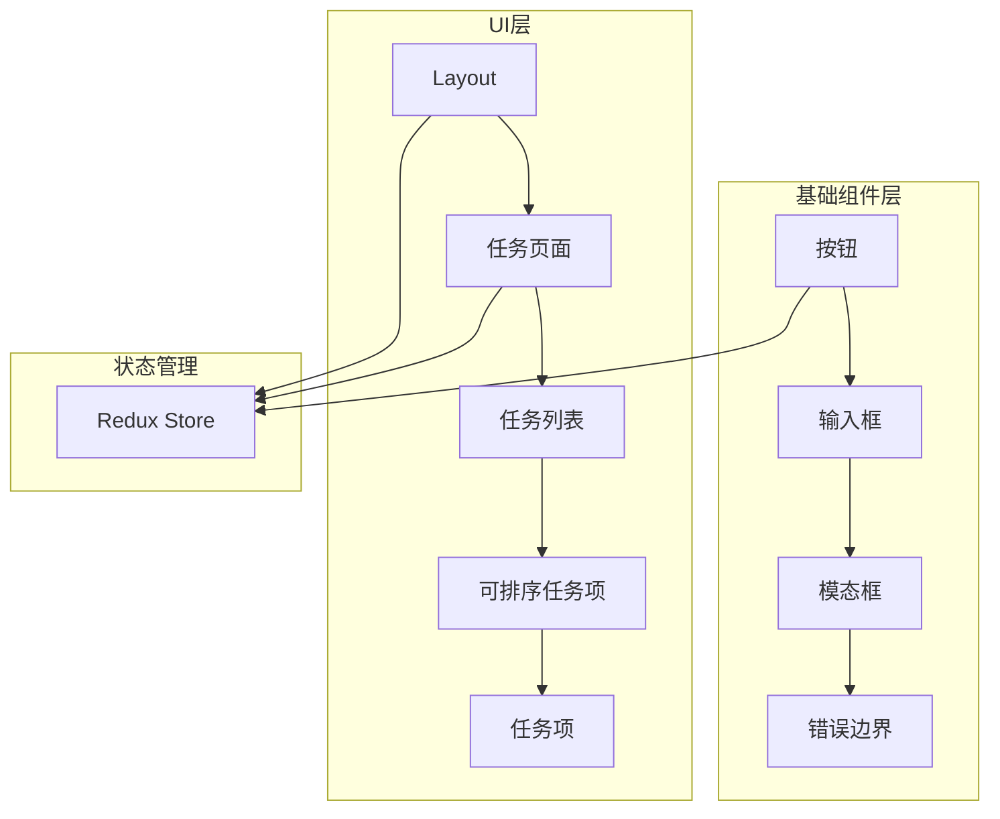

**图源**
- [App.tsx](file://frontend/src/App.tsx)
- [Layout.tsx](file://frontend/src/components/Layout.tsx)
- [TasksPage.tsx](file://frontend/src/pages/TasksPage.tsx)

## 详细组件分析

### Layout组件分析
Layout组件作为应用的主布局容器，集成了侧边栏导航、用户信息展示和路由出口功能。通过`useAuthStore`钩子实现认证状态管理，确保未认证用户被重定向到登录页。

组件支持侧边栏折叠功能，提升界面空间利用率。导航项采用`NavLink`实现当前路由高亮，提升用户体验。

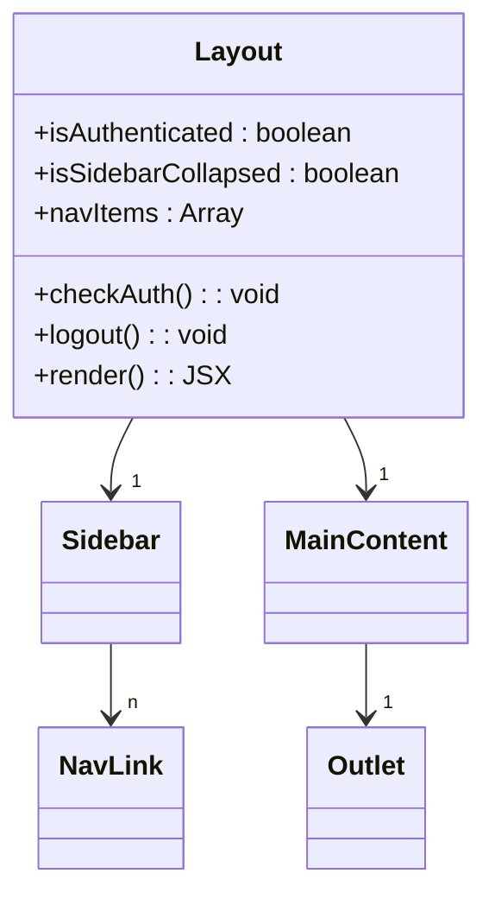

**图源**
- [Layout.tsx](file://frontend/src/components/Layout.tsx#L7-L130)

**章节来源**
- [Layout.tsx](file://frontend/src/components/Layout.tsx)

### 任务组件分析

#### 任务项组件
TaskItem组件负责单个任务的展示，包含任务标题、状态、优先级、截止日期等元信息。支持悬停显示操作按钮（编辑、删除），提升界面整洁度。

组件通过props接收事件回调函数，实现与父组件的通信。支持拖拽手柄，为排序功能提供接口。

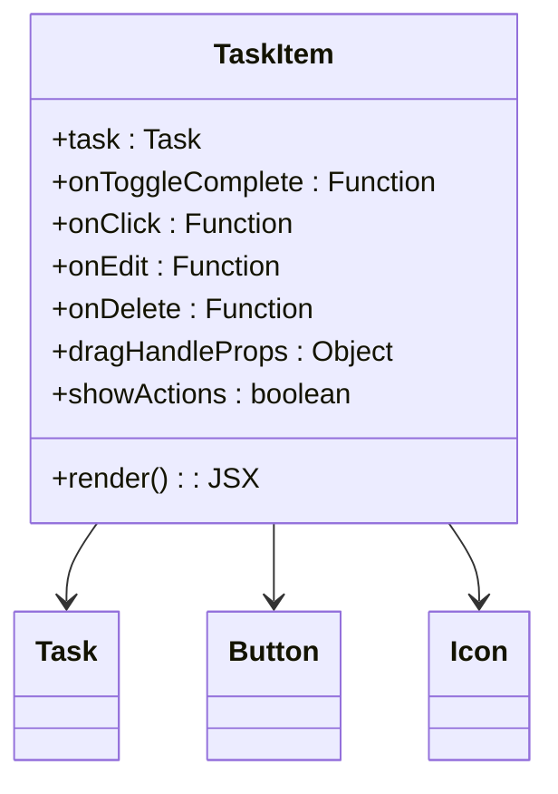

**图源**
- [TaskItem.tsx](file://frontend/src/components/task/TaskItem.tsx#L18-L211)

#### 任务详情组件
TaskDetail组件提供任务的详细编辑界面，集成在模态框中。支持任务属性的全面编辑，包括标题、描述、优先级、状态、项目归属和标签管理。

组件实现智能标签提取功能，当用户在描述中输入`#标签名 `格式时自动创建或关联标签。提供快捷时间选项，提升操作效率。

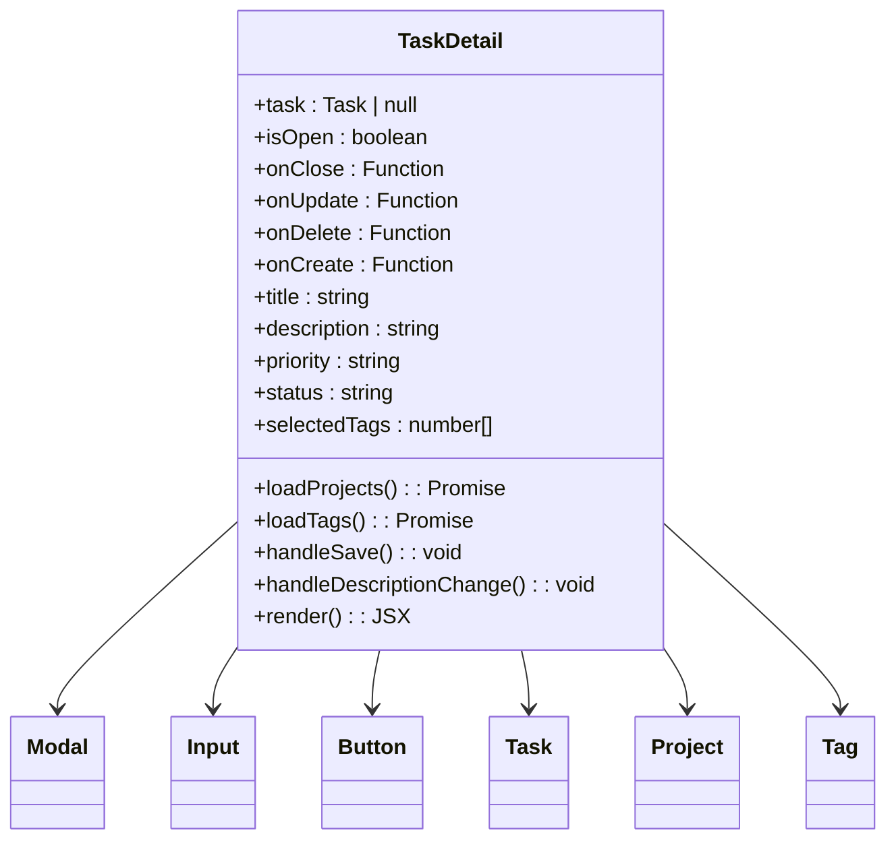

**图源**
- [TaskDetail.tsx](file://frontend/src/components/task/TaskDetail.tsx#L22-L510)

#### 可排序任务项组件
SortableTaskItem组件基于dnd-kit库实现任务的拖拽排序功能。通过`useSortable`钩子获取拖拽状态和事件处理器，将拖拽逻辑与UI展示分离。

组件包装TaskItem，注入拖拽手柄属性，实现无侵入式的功能增强。支持指针和键盘两种拖拽方式，提升可访问性。

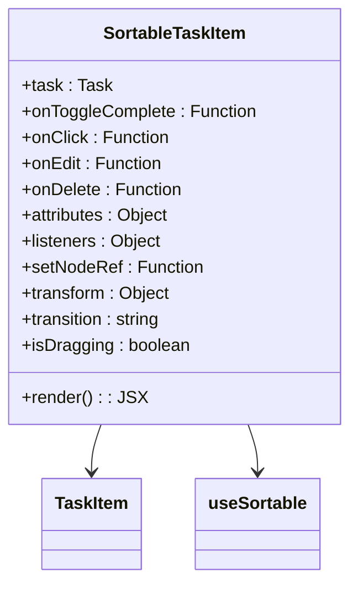

**图源**
- [SortableTaskItem.tsx](file://frontend/src/components/task/SortableTaskItem.tsx#L14-L37)

**章节来源**
- [TaskItem.tsx](file://frontend/src/components/task/TaskItem.tsx)
- [TaskDetail.tsx](file://frontend/src/components/task/TaskDetail.tsx)
- [SortableTaskItem.tsx](file://frontend/src/components/task/SortableTaskItem.tsx)

### UI基础组件分析

#### 按钮组件
Button组件提供统一的按钮样式和行为。支持多种变体（默认、主要、危险、幽灵、轮廓）和尺寸（小、中、大），通过props灵活配置。

组件内置加载状态显示，当`isLoading`为true时显示旋转动画。采用`forwardRef`确保DOM引用可访问，支持无障碍访问。

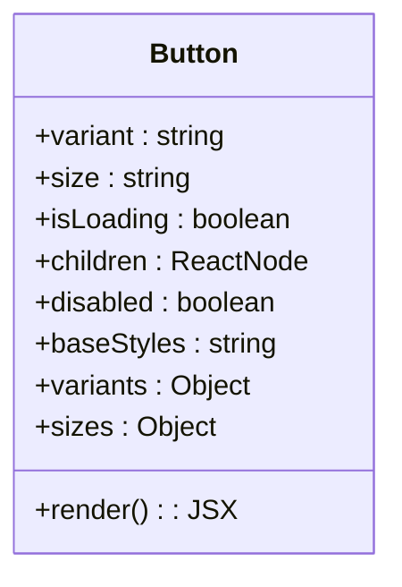

**图源**
- [Button.tsx](file://frontend/src/components/ui/Button.tsx#L10-L53)

#### 输入框组件
Input组件封装了表单输入的基本功能，支持标签、错误提示和禁用状态。通过`cn`工具函数合并TailwindCSS类名，实现样式组合。

错误状态下自动应用红色边框，提升表单验证的视觉反馈。支持标准的HTML输入属性，确保与原生元素兼容。

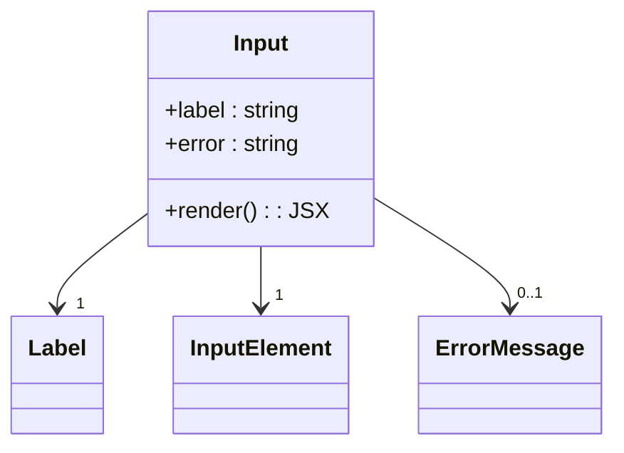

**图源**
- [Input.tsx](file://frontend/src/components/ui/Input.tsx#L9-L39)

#### 模态框组件
Modal组件基于Headless UI实现无样式的模态框，通过CSS Transition提供平滑的进入/退出动画。支持多种尺寸配置，适应不同内容需求。

组件实现点击遮罩或按ESC键关闭功能，符合用户预期。标题区域包含关闭按钮，提升操作便捷性。

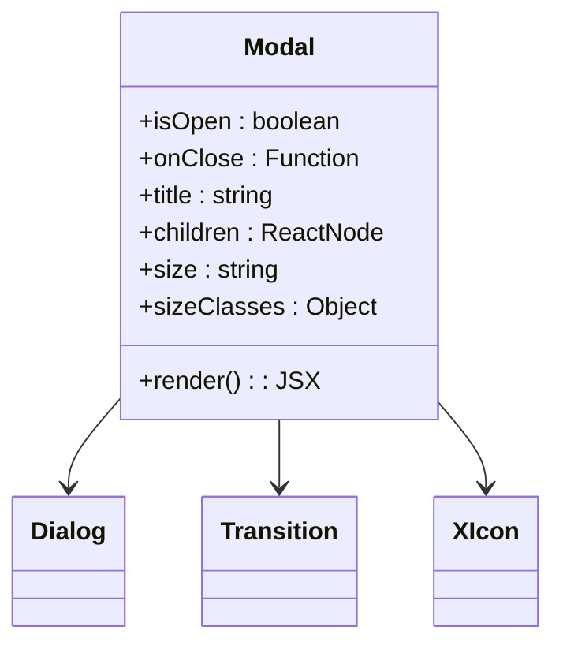

**图源**
- [Modal.tsx](file://frontend/src/components/ui/Modal.tsx#L13-L72)

**章节来源**
- [Button.tsx](file://frontend/src/components/ui/Button.tsx)
- [Input.tsx](file://frontend/src/components/ui/Input.tsx)
- [Modal.tsx](file://frontend/src/components/ui/Modal.tsx)

### 体验优化组件分析

#### 错误边界组件
ErrorBoundary组件使用React的错误边界机制捕获子组件树中的JavaScript错误。发生错误时显示友好的错误界面，避免应用崩溃。

组件记录错误信息到控制台，便于调试。提供重新加载按钮，让用户可以快速恢复应用状态。

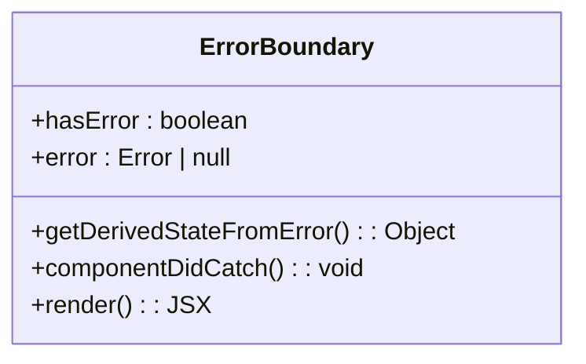

**图源**
- [ErrorBoundary.tsx](file://frontend/src/components/ErrorBoundary.tsx#L12-L51)

#### 加载组件
Loading组件提供统一的加载指示器，包含旋转动画和"加载中..."文字提示。采用居中布局，确保在不同屏幕尺寸下都有良好的视觉效果。

组件样式简洁，蓝色动画与应用主色调保持一致，维护品牌一致性。

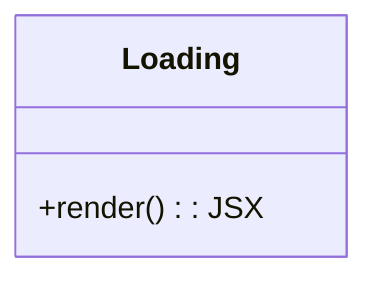

**图源**
- [Loading.tsx](file://frontend/src/components/Loading.tsx#L1-L12)

**章节来源**
- [ErrorBoundary.tsx](file://frontend/src/components/ErrorBoundary.tsx)
- [Loading.tsx](file://frontend/src/components/Loading.tsx)

## 依赖分析
组件间依赖关系清晰，遵循单向数据流原则。高层组件通过props向下传递数据和回调函数，低层组件通过调用回调函数向上通信。

**依赖图**
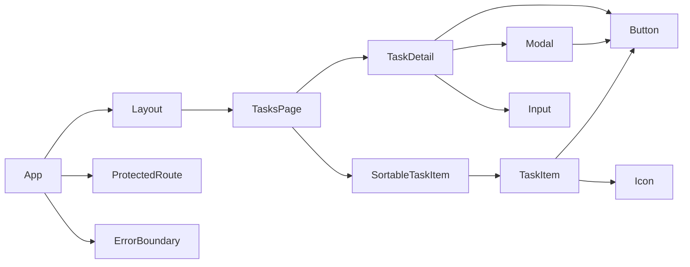

**图源**
- [App.tsx](file://frontend/src/App.tsx)
- [Layout.tsx](file://frontend/src/components/Layout.tsx)
- [TasksPage.tsx](file://frontend/src/pages/TasksPage.tsx)

**章节来源**
- [App.tsx](file://frontend/src/App.tsx)
- [Layout.tsx](file://frontend/src/components/Layout.tsx)
- [TasksPage.tsx](file://frontend/src/pages/TasksPage.tsx)

## 性能考虑
- **虚拟化**：长列表场景应考虑使用虚拟滚动优化性能
- **防抖**：搜索输入应添加防抖处理，减少不必要的渲染
- **Memoization**：使用React.memo对静态组件进行记忆化
- **代码分割**：按路由进行代码分割，减少初始加载体积
- **图片优化**：任务附件图片应使用懒加载和适当压缩

## 故障排除指南
- **组件不渲染**：检查认证状态和路由配置
- **样式丢失**：确认TailwindCSS配置正确且类名无拼写错误
- **拖拽失效**：检查dnd-kit传感器配置和DOM结构
- **API调用失败**：验证认证令牌和请求参数
- **状态更新延迟**：检查Redux store更新逻辑和异步处理

**章节来源**
- [ProtectedRoute.tsx](file://frontend/src/components/ProtectedRoute.tsx)
- [tailwind.config.js](file://frontend/tailwind.config.js)
- [TasksPage.tsx](file://frontend/src/pages/TasksPage.tsx)

## 结论
本前端架构通过合理的组件分层和复用机制，构建了一个可维护、可扩展的应用系统。Layout组件提供统一的布局框架，任务组件实现复杂的业务逻辑，UI基础组件确保视觉一致性。通过ErrorBoundary和Loading组件优化用户体验，结合TailwindCSS实现高效的样式管理。整体架构遵循现代前端最佳实践，为后续功能扩展奠定了坚实基础。