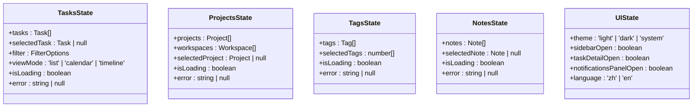

# 状态管理

<cite>
**本文档引用文件**  
- [auth.ts](file://frontend/src/store/auth.ts)
- [tasksSlice.ts](file://frontend/src/store/slices/tasksSlice.ts)
- [projectsSlice.ts](file://frontend/src/store/slices/projectsSlice.ts)
- [tagsSlice.ts](file://frontend/src/store/slices/tagsSlice.ts)
- [notesSlice.ts](file://frontend/src/store/slices/notesSlice.ts)
- [uiSlice.ts](file://frontend/src/store/slices/uiSlice.ts)
- [index.ts](file://frontend/src/store/index.ts)
- [auth.ts](file://frontend/src/services/auth.ts)
</cite>

## 目录
1. [引言](#引言)
2. [状态管理架构概览](#状态管理架构概览)
3. [认证状态管理](#认证状态管理)
4. [Slice模块设计与实现](#slice模块设计与实现)
5. [Store整合与中间件](#store整合与中间件)
6. [状态选择器与不可变性原则](#状态选择器与不可变性原则)
7. [Zustand与Redux对比分析](#zustand与redux对比分析)
8. [状态流图与数据流分析](#状态流图与数据流分析)
9. [错误处理与加载状态管理](#错误处理与加载状态管理)
10. [总结](#总结)

## 引言
本项目采用Zustand作为全局状态管理方案，结合Redux Toolkit的Slice模式组织模块化状态，同时集成React Query处理服务端状态。该架构兼顾轻量性与可维护性，适用于中大型前端应用。文档将深入解析其协同工作机制，涵盖认证管理、模块划分、状态更新优化及整体数据流。

## 状态管理架构概览
项目采用混合状态管理策略：Zustand负责全局持久化状态（如用户认证），Redux Toolkit管理结构化客户端状态（如任务、项目、标签等），通过React Redux绑定实现组件访问。这种分层设计既利用了Zustand的简洁性，又保留了Redux的可预测性和调试优势。

**图示来源**  
- [auth.ts](file://frontend/src/store/auth.ts)
- [index.ts](file://frontend/src/store/index.ts)
- [slices/](file://frontend/src/store/slices/)

## 认证状态管理
`auth.ts`文件定义了基于Zustand的用户认证状态管理逻辑，包含用户信息、认证状态、令牌持久化和登出机制。

### 登录与状态初始化
认证状态初始化时检查本地存储中的访问令牌，自动设置`isAuthenticated`标志。登录成功后，通过`setTokens`方法将令牌存入`localStorage`并更新状态。

### 登出与持久化处理
登出操作清除本地令牌，重置状态，并通过修改`window.location.href`跳转至登录页，确保页面完全刷新以清除可能的内存残留状态。

**图示来源**  
- [auth.ts](file://frontend/src/store/auth.ts#L12-L35)

**本节来源**  
- [auth.ts](file://frontend/src/store/auth.ts#L1-L37)
- [services/auth.ts](file://frontend/src/services/auth.ts#L1-L25)

## Slice模块设计与实现
各功能模块（任务、项目、标签等）采用Redux Toolkit的`createSlice`模式定义状态结构、异步操作和reducer逻辑。

### 状态结构定义
每个Slice定义了清晰的状态接口，包含数据数组、选中项、过滤条件、加载状态和错误信息。例如`tasksSlice`包含任务列表、选中任务、视图模式等。

### 异步操作与Reducer逻辑
虽然Slice本身不直接处理异步逻辑，但通过配套的服务层（如`task.ts`）调用API，并在成功后分发由`createSlice`生成的action来更新状态。所有reducer遵循不可变性原则，通过直接赋值或数组方法（如`push`、`filter`）安全更新状态。

**图示来源**  
- [tasksSlice.ts](file://frontend/src/store/slices/tasksSlice.ts#L4-L11)
- [projectsSlice.ts](file://frontend/src/store/slices/projectsSlice.ts#L4-L10)
- [tagsSlice.ts](file://frontend/src/store/slices/tagsSlice.ts#L4-L9)
- [notesSlice.ts](file://frontend/src/store/slices/notesSlice.ts#L4-L9)
- [uiSlice.ts](file://frontend/src/store/slices/uiSlice.ts#L3-L9)

**本节来源**  
- [tasksSlice.ts](file://frontend/src/store/slices/tasksSlice.ts)
- [projectsSlice.ts](file://frontend/src/store/slices/projectsSlice.ts)
- [tagsSlice.ts](file://frontend/src/store/slices/tagsSlice.ts)
- [notesSlice.ts](file://frontend/src/store/slices/notesSlice.ts)
- [uiSlice.ts](file://frontend/src/store/slices/uiSlice.ts)

## Store整合与中间件
`index.ts`文件通过`configureStore`整合所有Slice reducer，创建全局Redux store，并导出类型定义和类型安全的hook。

### Store整合方式
所有Slice的reducer通过命名空间方式注册到根reducer中，形成树状状态结构。例如`tasks` Slice对应`state.tasks`路径。

### 类型安全与Hook导出
利用TypeScript的`ReturnType`和`typeof`操作符，从store实例推导出`RootState`和`AppDispatch`类型，确保状态选择和action分发的类型安全。同时导出类型化的`useAppSelector`和`useAppDispatch` hook，提升开发体验。

**本节来源**  
- [index.ts](file://frontend/src/store/index.ts#L1-L24)

## 状态选择器与不可变性原则
状态选择器（selector）用于从store中提取特定数据，优化组件重渲染。

### 选择器优化使用
通过`useAppSelector` hook结合选择函数，仅当所依赖的状态片段变化时才触发组件更新。例如只监听`state.tasks.isLoading`而非整个任务状态。

### 状态更新的不可变性
所有reducer函数在更新状态时，不直接修改原状态对象，而是返回新对象或使用immer等工具实现草稿模式。Slice的reducer虽看似直接修改，实则由Redux Toolkit内部使用immer保证不可变性。

**本节来源**  
- [tasksSlice.ts](file://frontend/src/store/slices/tasksSlice.ts#L26-L54)
- [projectsSlice.ts](file://frontend/src/store/slices/projectsSlice.ts#L24-L50)
- [tagsSlice.ts](file://frontend/src/store/slices/tagsSlice.ts#L22-L53)
- [index.ts](file://frontend/src/store/index.ts#L19-L23)

## Zustand与Redux对比分析
项目选择Zustand管理认证状态，而使用Redux Toolkit管理其他客户端状态，此技术决策基于以下考量：

### 技术差异对比
| 特性 | Zustand | Redux |
|------|---------|-------|
| 包大小 | 极小 (~7kB) | 较大 (需配套工具) |
| 模板代码 | 几乎无 | 较多 (action, reducer, type) |
| 中间件 | 支持但非必需 | 强依赖 (thunk, saga) |
| 调试工具 | 基础支持 | 强大 (Redux DevTools) |
| 可预测性 | 高 | 极高 |
| 学习曲线 | 平缓 | 陡峭 |

### 本项目技术考量
- **认证状态简单**：用户认证状态结构简单（用户对象、令牌、布尔标志），Zustand的简洁性更合适。
- **持久化需求**：Zustand易于与`localStorage`集成，适合令牌持久化。
- **减少依赖**：避免为单一状态引入整个Redux生态。
- **其他状态复杂**：任务、项目等状态需要复杂reducer逻辑和严格不可变性，Redux Toolkit更胜任。

**本节来源**  
- [auth.ts](file://frontend/src/store/auth.ts)
- [index.ts](file://frontend/src/store/index.ts)

## 状态流图与数据流分析
从API响应到状态更新再到UI渲染的完整数据流如下：

**图示来源**  
- [services/auth.ts](file://frontend/src/services/auth.ts#L5-L24)
- [tasksSlice.ts](file://frontend/src/store/slices/tasksSlice.ts#L26-L54)
- [index.ts](file://frontend/src/store/index.ts)

## 错误处理与加载状态管理
各Slice统一包含`isLoading`和`error`字段，实现一致的用户体验。

### 加载状态管理
在发起异步请求前设置`setLoading(true)`，请求完成后设为`false`，UI组件据此显示加载指示器。

### 错误处理策略
请求失败时调用`setError` action设置错误信息，组件捕获并展示错误提示。错误状态在下次请求时自动清除。

**本节来源**  
- [tasksSlice.ts](file://frontend/src/store/slices/tasksSlice.ts#L9-L10)
- [projectsSlice.ts](file://frontend/src/store/slices/projectsSlice.ts#L8-L9)
- [tagsSlice.ts](file://frontend/src/store/slices/tagsSlice.ts#L7-L8)
- [notesSlice.ts](file://frontend/src/store/slices/notesSlice.ts#L7-L8)

## 总结
本项目通过Zustand与Redux Toolkit的混合架构，实现了高效、可维护的状态管理。Zustand用于轻量级的认证状态，Redux Toolkit处理复杂的客户端状态，两者通过清晰的职责划分协同工作。该设计平衡了开发效率与应用性能，为后续功能扩展提供了坚实基础。