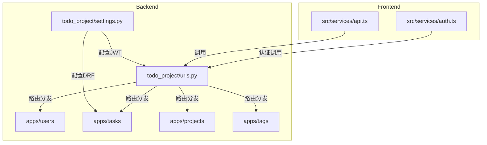
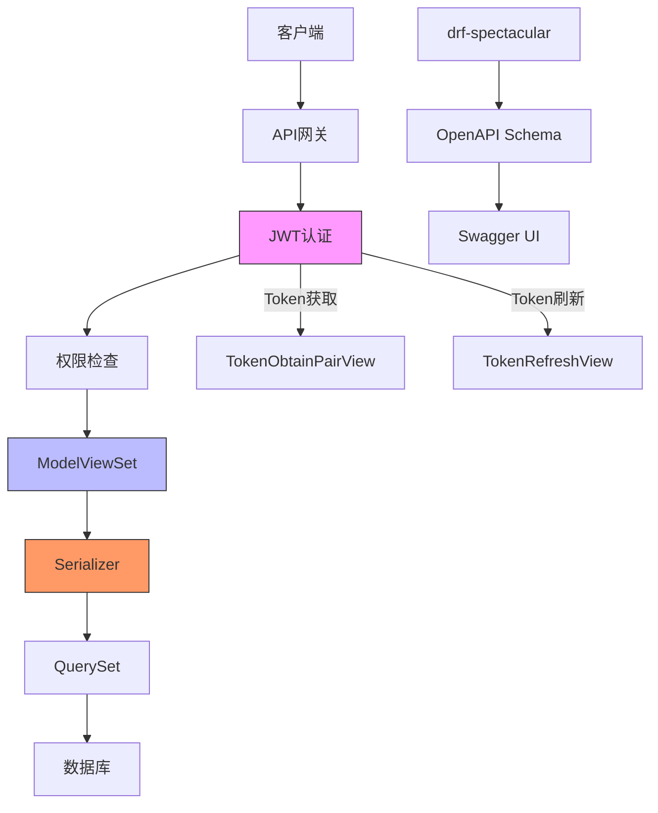
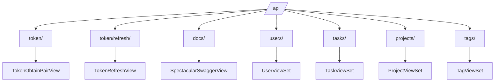
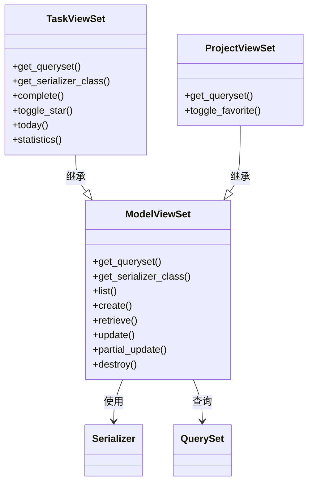
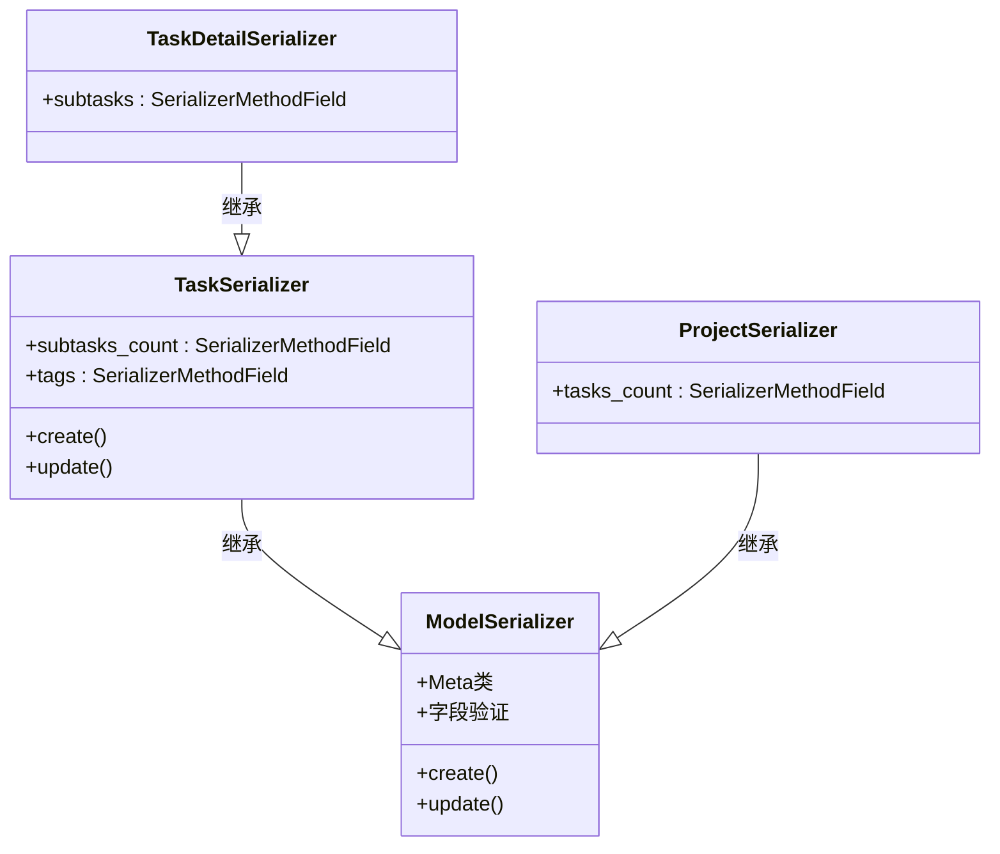
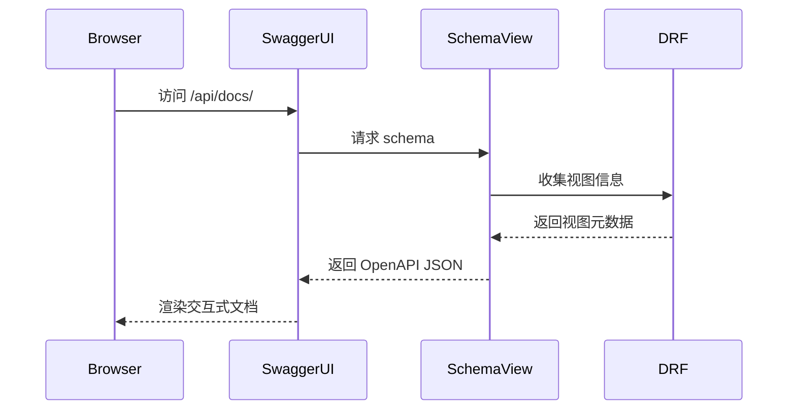
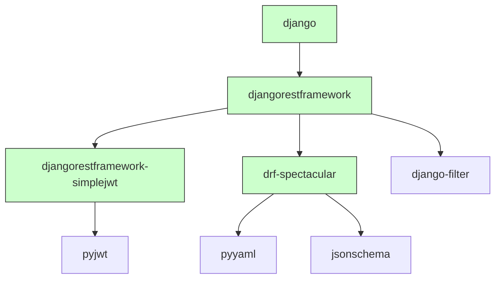

# API设计

<cite>
**本文档引用的文件**  
- [urls.py](file://backend/todo_project/urls.py)
- [settings.py](file://backend/todo_project/settings.py)
- [tasks/urls.py](file://backend/apps/tasks/urls.py)
- [tasks/views.py](file://backend/apps/tasks/views.py)
- [tasks/serializers.py](file://backend/apps/tasks/serializers.py)
- [projects/views.py](file://backend/apps/projects/views.py)
- [projects/serializers.py](file://backend/apps/projects/serializers.py)
- [users/serializers.py](file://backend/apps/users/serializers.py)
- [tags/serializers.py](file://backend/apps/tags/serializers.py)
- [tasks/models.py](file://backend/apps/tasks/models.py)
- [projects/models.py](file://backend/apps/projects/models.py)
- [users/models.py](file://backend/apps/users/models.py)
</cite>

## 目录
1. [简介](#简介)
2. [项目结构](#项目结构)
3. [核心组件](#核心组件)
4. [架构概览](#架构概览)
5. [详细组件分析](#详细组件分析)
6. [依赖分析](#依赖分析)
7. [性能考虑](#性能考虑)
8. [故障排除指南](#故障排除指南)
9. [结论](#结论)

## 简介
本文档系统阐述了基于Django REST Framework构建的RESTful API架构。重点分析了API路由组织、类视图实现模式、序列化器设计、任务CRUD操作支持、过滤与分页机制、OpenAPI文档自动生成、认证流程及错误处理规范。

## 项目结构
本项目采用模块化Django应用结构，后端API集中于`backend/apps/`目录下，包含`users`、`tasks`、`projects`和`tags`四个核心应用。每个应用遵循Django REST Framework标准模式，包含`models.py`、`views.py`、`serializers.py`和`urls.py`文件。



**图示来源**  
- [todo_project/urls.py](file://backend/todo_project/urls.py#L1-L26)
- [todo_project/settings.py](file://backend/todo_project/settings.py#L116-L163)

**本节来源**  
- [todo_project/urls.py](file://backend/todo_project/urls.py#L1-L26)
- [todo_project/settings.py](file://backend/todo_project/settings.py#L1-L164)

## 核心组件
系统核心组件包括JWT认证、任务管理、项目管理、标签系统和用户管理。API通过`drf-spectacular`自动生成OpenAPI 3.0规范文档，支持Swagger UI可视化浏览。

**本节来源**  
- [todo_project/urls.py](file://backend/todo_project/urls.py#L1-L26)
- [todo_project/settings.py](file://backend/todo_project/settings.py#L116-L163)

## 架构概览
系统采用基于类的视图（Class-Based Views）和ModelViewSet模式构建RESTful API，通过DefaultRouter自动生成标准CRUD端点。全局配置在`settings.py`中定义了JWT认证、权限控制、过滤后端和分页策略。



**图示来源**  
- [todo_project/urls.py](file://backend/todo_project/urls.py#L18-L19)
- [todo_project/settings.py](file://backend/todo_project/settings.py#L123-L138)
- [tasks/views.py](file://backend/apps/tasks/views.py#L13-L21)

**本节来源**  
- [todo_project/settings.py](file://backend/todo_project/settings.py#L123-L163)
- [todo_project/urls.py](file://backend/todo_project/urls.py#L1-L26)

## 详细组件分析

### 路由组织结构分析
API路由以`/api/`为前缀，集中定义在主`urls.py`文件中。包含JWT认证端点、API文档端点和各应用入口。



**图示来源**  
- [todo_project/urls.py](file://backend/todo_project/urls.py#L18-L25)

**本节来源**  
- [todo_project/urls.py](file://backend/todo_project/urls.py#L1-L26)

### 视图实现模式分析
系统广泛使用`ModelViewSet`实现CRUD操作，通过`get_queryset()`方法实现用户数据隔离。自定义动作通过`@action`装饰器实现，如任务完成、标星切换等。



**图示来源**  
- [tasks/views.py](file://backend/apps/tasks/views.py#L13-L137)
- [projects/views.py](file://backend/apps/projects/views.py#L8-L22)

**本节来源**  
- [tasks/views.py](file://backend/apps/tasks/views.py#L1-L137)
- [projects/views.py](file://backend/apps/projects/views.py#L1-L22)

### 序列化器设计分析
序列化器负责数据验证、反序列化和嵌套关系处理。使用`SerializerMethodField`计算衍生字段（如任务数、子任务数），并在`create()`和`update()`方法中处理多对多关系。



**图示来源**  
- [tasks/serializers.py](file://backend/apps/tasks/serializers.py#L6-L64)
- [projects/serializers.py](file://backend/apps/projects/serializers.py#L5-L22)

**本节来源**  
- [tasks/serializers.py](file://backend/apps/tasks/serializers.py#L1-L64)
- [projects/serializers.py](file://backend/apps/projects/serializers.py#L1-L22)
- [users/serializers.py](file://backend/apps/users/serializers.py#L1-L29)
- [tags/serializers.py](file://backend/apps/tags/serializers.py#L1-L19)

### 任务API功能分析
任务API全面支持CRUD操作，并提供过滤、搜索、排序和分页功能。通过`filter_backends`配置了`DjangoFilterBackend`、`SearchFilter`和`OrderingFilter`。

```mermaid
flowchart TD
A[客户端请求] --> B{HTTP方法}
B --> |GET| C[获取任务列表]
B --> |POST| D[创建任务]
B --> |GET /id| E[获取单个任务]
B --> |PUT/PATCH| F[更新任务]
B --> |DELETE| G[删除任务]
C --> H[应用过滤]
H --> I[应用搜索]
I --> J[应用排序]
J --> K[分页]
K --> L[返回响应]
M[自定义动作] --> N[/complete]
M --> O[/toggle_star]
M --> P[/today]
M --> Q[/statistics]
```

**图示来源**  
- [tasks/views.py](file://backend/apps/tasks/views.py#L15-L18)
- [tasks/views.py](file://backend/apps/tasks/views.py#L28-L137)

**本节来源**  
- [tasks/views.py](file://backend/apps/tasks/views.py#L1-L137)
- [tasks/serializers.py](file://backend/apps/tasks/serializers.py#L1-L64)
- [tasks/models.py](file://backend/apps/tasks/models.py#L1-L74)

### API文档生成机制
使用`drf-spectacular`库自动生成OpenAPI 3.0规范文档，提供交互式Swagger UI界面。相关端点为`/api/schema/`和`/api/docs/`。



**图示来源**  
- [todo_project/urls.py](file://backend/todo_project/urls.py#L14-L15)
- [todo_project/settings.py](file://backend/todo_project/settings.py#L158-L163)

**本节来源**  
- [todo_project/urls.py](file://backend/todo_project/urls.py#L1-L26)
- [todo_project/settings.py](file://backend/todo_project/settings.py#L158-L163)

## 依赖分析
系统依赖关系清晰，各应用通过`INSTALLED_APPS`注册，API路由通过主`urls.py`聚合。第三方依赖包括`djangorestframework`、`djangorestframework-simplejwt`和`drf-spectacular`。



**图示来源**  
- [backend/uv.lock](file://backend/uv.lock#L133-L176)
- [todo_project/settings.py](file://backend/todo_project/settings.py#L38-L42)

**本节来源**  
- [backend/uv.lock](file://backend/uv.lock#L634-L654)
- [todo_project/settings.py](file://backend/todo_project/settings.py#L29-L49)

## 性能考虑
系统配置了默认分页（每页20条记录），避免一次性返回大量数据。通过`select_related`和`prefetch_related`优化数据库查询，减少N+1查询问题。建议在高并发场景下添加缓存层。

## 故障排除指南
常见问题包括JWT认证失败、跨域请求被拒、序列化器验证错误等。前端通过响应拦截器自动处理401状态码，尝试使用refresh token刷新访问令牌。

**本节来源**  
- [frontend/src/services/api.ts](file://frontend/src/services/api.ts#L1-L58)
- [frontend/src/store/auth.ts](file://frontend/src/store/auth.ts#L1-L36)
- [PROJECT_OVERVIEW.md](file://PROJECT_OVERVIEW.md#L209-L216)

## 结论
本API设计文档系统阐述了基于Django REST Framework的RESTful API架构。系统采用现代化的技术栈，具备良好的可维护性和扩展性。通过`drf-spectacular`实现API文档自动化，通过JWT实现安全认证，通过ModelViewSet和Serializer实现高效的数据操作。