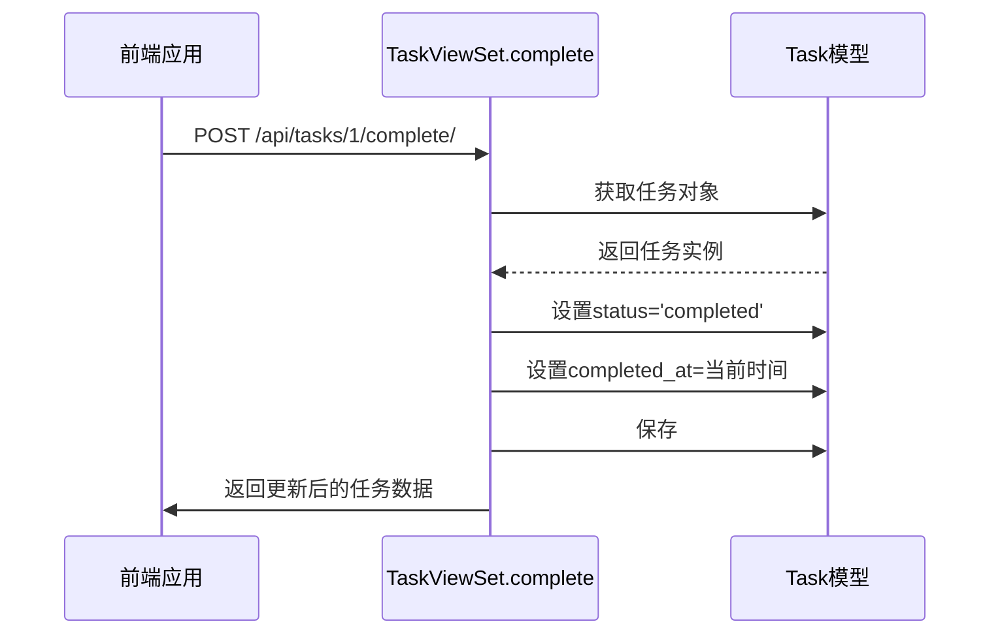
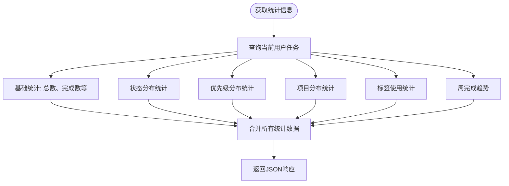
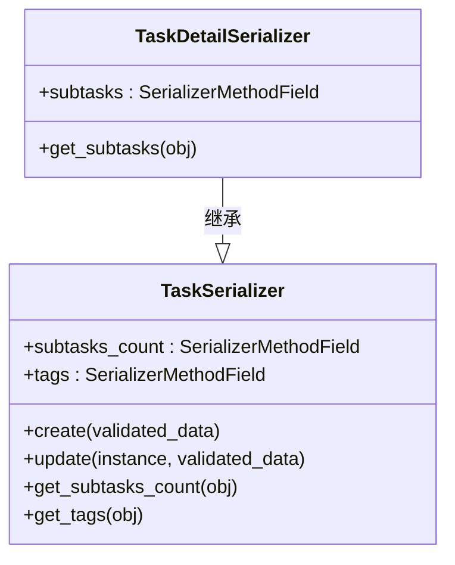

# 任务API

<cite>
**本文档中引用的文件**  
- [models.py](file://backend/apps/tasks/models.py)
- [serializers.py](file://backend/apps/tasks/serializers.py)
- [views.py](file://backend/apps/tasks/views.py)
- [urls.py](file://backend/apps/tasks/urls.py)
- [index.ts](file://frontend/src/types/index.ts)
</cite>

## 目录
1. [简介](#简介)
2. [任务模型字段说明](#任务模型字段说明)
3. [核心API端点](#核心api端点)
4. [自定义动作API](#自定义动作api)
5. [序列化器处理机制](#序列化器处理机制)
6. [过滤、搜索与分页](#过滤搜索与分页)
7. [代码示例](#代码示例)

## 简介
本API文档详细描述了任务管理系统的全生命周期操作，涵盖任务的创建、读取、更新和删除（CRUD）功能，以及自定义动作如完成任务、标星切换等。系统支持任务的父子层级关系、优先级、状态管理及标签关联，适用于复杂任务组织场景。

## 任务模型字段说明
任务模型包含以下核心字段：

| 字段名 | 类型 | 描述 |
|--------|------|------|
| `title` | 字符串 | 任务标题，最大长度255字符 |
| `description` | 文本（可选） | 任务详细描述 |
| `user` | 外键 | 所属用户，自动关联当前登录用户 |
| `project` | 外键（可选） | 所属项目，支持任务分组 |
| `parent` | 外键（可选） | 父任务，用于构建子任务层级 |
| `priority` | 字符串 | 优先级，可选值：`none`（无）、`low`（低）、`medium`（中）、`high`（高） |
| `status` | 字符串 | 状态，可选值：`todo`（待办）、`in_progress`（进行中）、`completed`（已完成） |
| `start_date` | 日期时间（可选） | 任务开始时间 |
| `due_date` | 日期时间（可选） | 任务截止时间 |
| `completed_at` | 日期时间（可选） | 任务完成时间，完成时自动填充 |
| `order` | 整数 | 排序字段，用于自定义任务顺序 |
| `is_starred` | 布尔值 | 是否标星，用于快速标记重要任务 |
| `created_at` | 日期时间 | 创建时间，自动生成 |
| `updated_at` | 日期时间 | 更新时间，自动更新 |
| `subtasks_count` | 整数 | 子任务数量，只读字段，由序列化器动态计算 |
| `tags` | 数组 | 关联的标签ID列表，由序列化器处理 |

**Section sources**
- [models.py](file://backend/apps/tasks/models.py#L5-L74)
- [index.ts](file://frontend/src/types/index.ts#L23-L46)

## 核心API端点
任务API基于RESTful设计，使用`/api/tasks/`作为基础路径。

### GET /api/tasks/
获取当前用户的所有任务列表，支持分页、过滤和搜索。

- **分页**：使用`PageNumberPagination`，默认每页10条
- **过滤字段**：`status`、`priority`、`project`、`is_starred`
- **搜索字段**：`title`、`description`
- **排序字段**：`created_at`、`due_date`、`order`、`priority`

### GET /api/tasks/{id}/
获取指定任务的详细信息，包含子任务列表（`subtasks`字段）。

### POST /api/tasks/
创建新任务。请求体需包含任务基本信息，`user`字段自动设置为当前用户。

- 支持通过`tags`字段关联标签（传入标签ID数组）
- 支持通过`parent`字段指定父任务
- `created_at`、`updated_at`、`user`为只读字段

### PATCH /api/tasks/{id}/
部分更新任务信息。可更新字段包括：`title`、`description`、`project`、`parent`、`priority`、`status`、`start_date`、`due_date`、`order`、`is_starred`、`tags`。

- 更新`tags`字段会覆盖原有标签关联
- `completed_at`在状态变为`completed`时自动设置

### DELETE /api/tasks/{id}/
删除指定任务及其所有子任务（级联删除）。

**Section sources**
- [views.py](file://backend/apps/tasks/views.py#L13-L27)
- [urls.py](file://backend/apps/tasks/urls.py#L1-L11)

## 自定义动作API
系统提供多个自定义动作端点，用于实现特定业务逻辑。

### POST /api/tasks/{id}/complete/
将任务状态设置为“已完成”，并记录完成时间。



**Diagram sources**
- [views.py](file://backend/apps/tasks/views.py#L28-L37)

### POST /api/tasks/{id}/toggle_star/
切换任务的标星状态（`is_starred`取反）。

### GET /api/tasks/today/
获取今日截止且未完成的任务列表（`due_date`为今天且`status`为`todo`或`in_progress`）。

### GET /api/tasks/statistics/
获取任务统计信息，包括：

- **汇总信息**：总任务数、已完成数、进行中数、逾期数、完成率
- **状态分布**：各状态任务数量
- **优先级分布**：各优先级任务数量
- **项目分布**：各项目任务数量
- **标签统计**：使用频率最高的10个标签
- **周完成数据**：过去7天每日完成任务数



**Diagram sources**
- [views.py](file://backend/apps/tasks/views.py#L58-L137)

## 序列化器处理机制
任务序列化器负责数据的序列化与反序列化，处理复杂逻辑。

### TaskSerializer
- **subtasks_count**：通过`SerializerMethodField`动态计算子任务数量
- **tags**：返回关联标签ID列表
- **create()**：处理`tags`字段，创建任务后建立标签关联
- **update()**：更新`tags`字段时，先删除旧关联，再创建新关联

### TaskDetailSerializer
继承自`TaskSerializer`，额外包含`subtasks`字段，递归序列化所有子任务。



**Diagram sources**
- [serializers.py](file://backend/apps/tasks/serializers.py#L6-L64)

## 过滤、搜索与分页
系统使用Django REST Framework的过滤机制实现灵活查询。

### 过滤（Filtering）
支持通过查询参数按以下字段过滤：
- `status`：任务状态
- `priority`：优先级
- `project`：所属项目ID
- `is_starred`：是否标星

示例：`/api/tasks/?status=todo&priority=high`

### 搜索（Search）
支持在`title`和`description`字段进行全文搜索。

示例：`/api/tasks/?search=会议`

### 分页（Pagination）
使用`PageNumberPagination`，响应包含分页元数据：

```json
{
  "count": 25,
  "next": "http://example.com/api/tasks/?page=2",
  "previous": null,
  "results": [...]
}
```

**Section sources**
- [views.py](file://backend/apps/tasks/views.py#L15-L18)

## 代码示例
以下为关键操作的代码示例。

### 创建带子任务的任务
```python
# 创建父任务
parent_task = {
    "title": "项目规划",
    "priority": "high",
    "tags": [1, 2]
}
response = requests.post("/api/tasks/", json=parent_task)

# 创建子任务
subtask = {
    "title": "需求分析",
    "parent": response.json()["id"]
}
requests.post("/api/tasks/", json=subtask)
```

### 更新任务状态
```python
# 使用自定义动作完成任务
requests.post(f"/api/tasks/{task_id}/complete/")
```

### 获取统计信息
```python
# 获取任务统计
response = requests.get("/api/tasks/statistics/")
stats = response.json()
print(f"完成率: {stats['summary']['completion_rate']}%")
```

**Section sources**
- [views.py](file://backend/apps/tasks/views.py#L28-L137)
- [serializers.py](file://backend/apps/tasks/serializers.py#L26-L52)