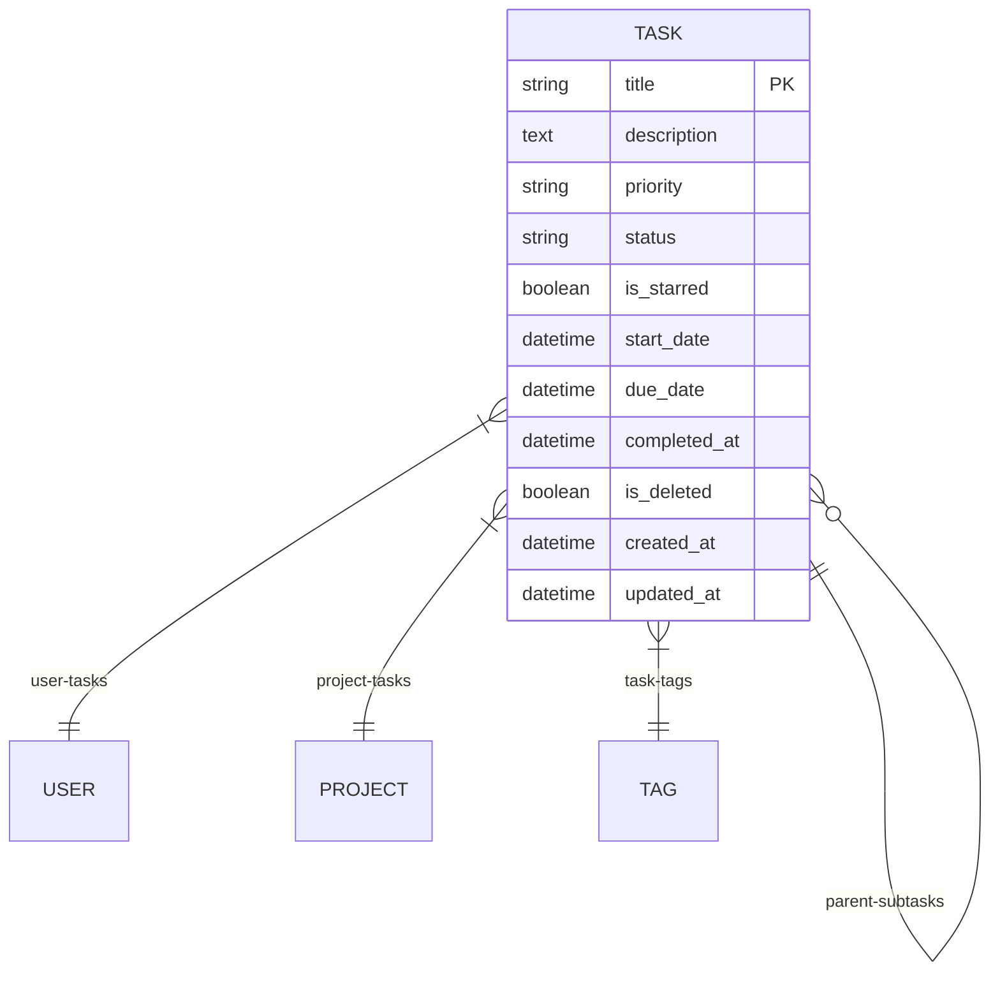
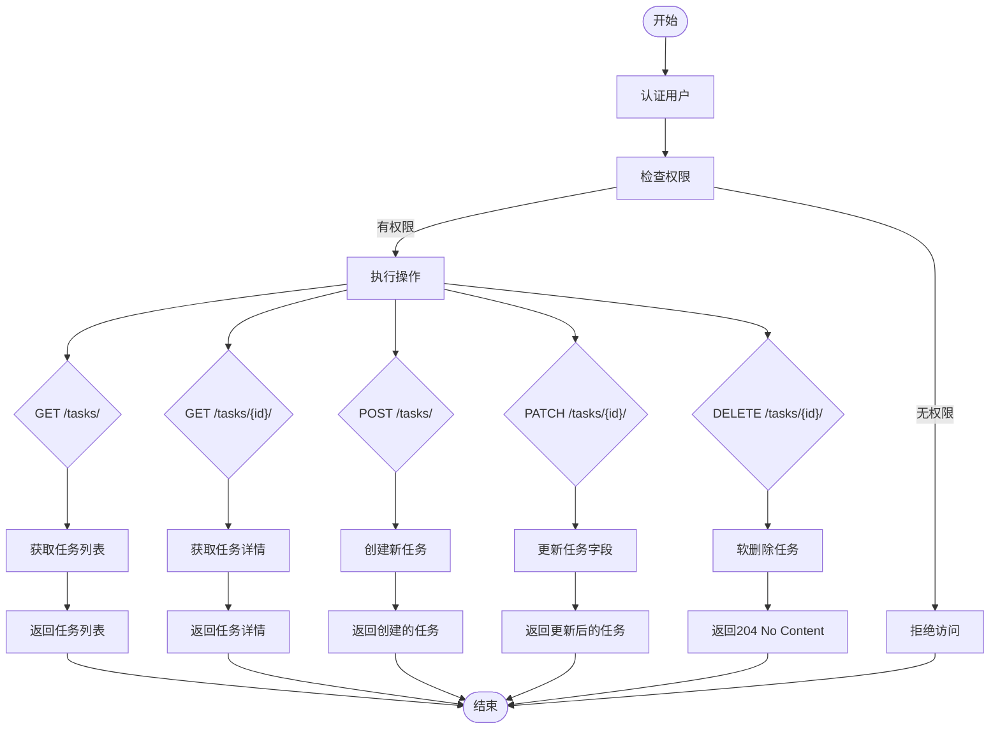
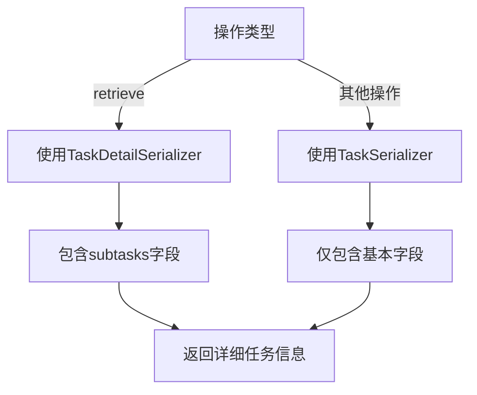
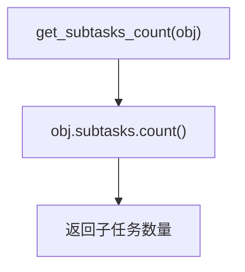
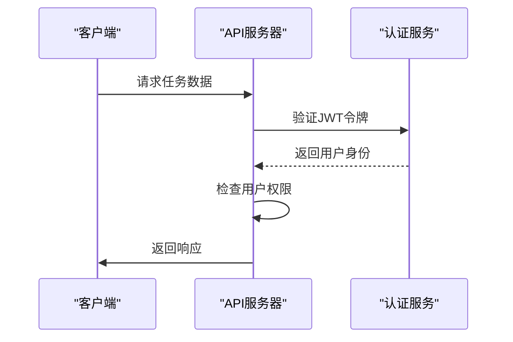
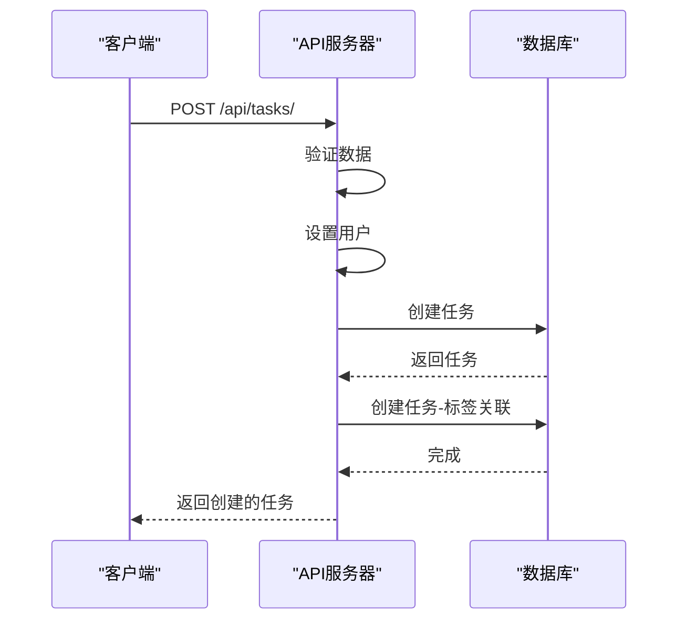
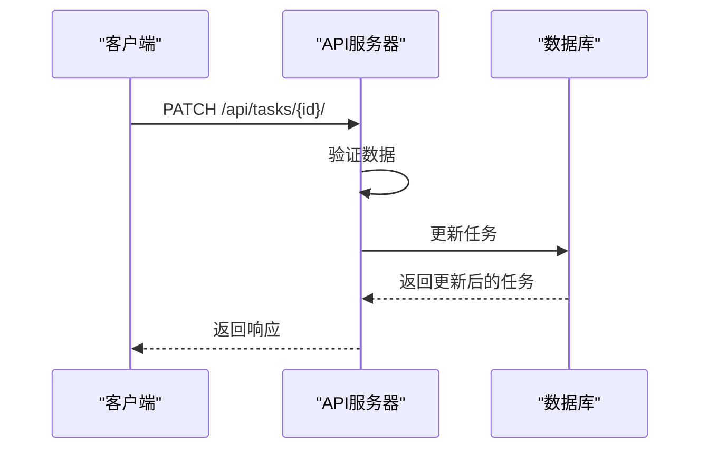
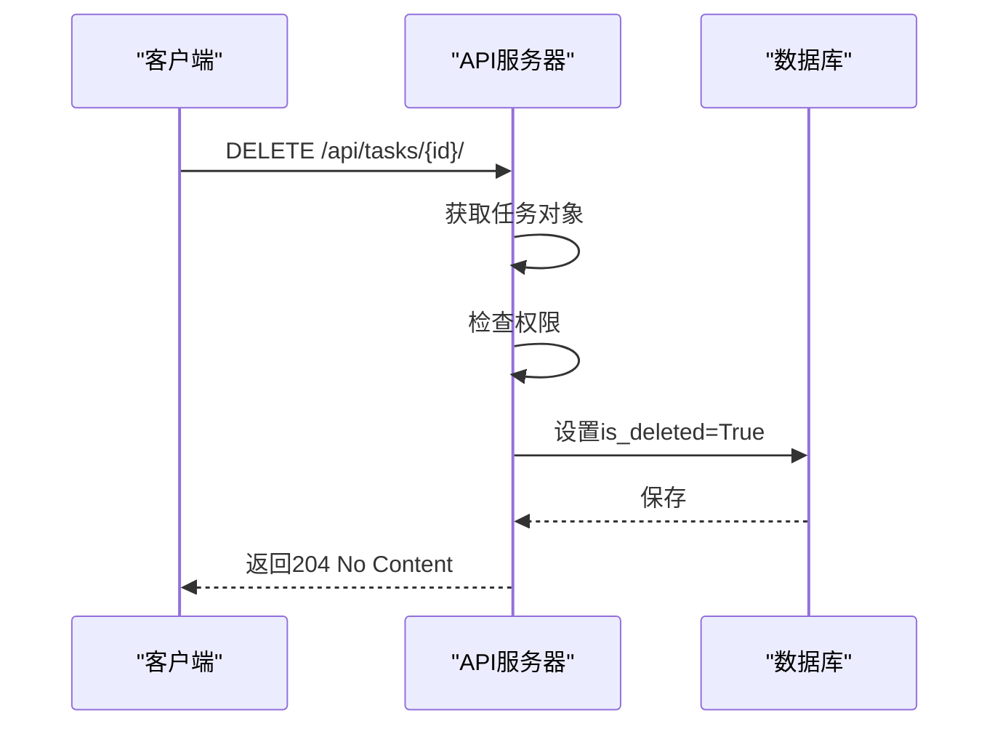

# 任务基础操作

<cite>
**Referenced Files in This Document**   
- [models.py](file://backend/apps/tasks/models.py)
- [serializers.py](file://backend/apps/tasks/serializers.py)
- [views.py](file://backend/apps/tasks/views.py)
- [urls.py](file://backend/apps/tasks/urls.py)
- [users/models.py](file://backend/apps/users/models.py)
- [projects/models.py](file://backend/apps/projects/models.py)
- [tags/models.py](file://backend/apps/tags/models.py)
</cite>

## 目录
1. [任务模型核心字段](#任务模型核心字段)
2. [任务CRUD操作](#任务crud操作)
3. [序列化器详解](#序列化器详解)
4. [认证与权限控制](#认证与权限控制)
5. [代码示例](#代码示例)

## 任务模型核心字段

任务模型定义了任务的核心属性和约束，包含以下关键字段：

**Section sources**
- [models.py](file://backend/apps/tasks/models.py#L22-L65)

### 核心字段说明

| 字段 | 类型 | 约束/选项 | 说明 |
|------|------|-----------|------|
| title | 字符串 | 最大长度255 | 任务标题，必填项 |
| description | 文本 | 可为空 | 任务详细描述 |
| priority | 字符串 | 'none', 'low', 'medium', 'high' | 优先级，分别对应无、低、中、高 |
| status | 字符串 | 'todo', 'in_progress', 'completed' | 状态，分别对应待办、进行中、已完成 |
| is_starred | 布尔值 | 默认False | 标星状态，用于标记重要任务 |
| start_date | 日期时间 | 可为空 | 任务开始时间规划 |
| due_date | 日期时间 | 可为空 | 任务截止时间规划 |
| parent | 外键 | 指向自身 | 父任务，用于构建父子任务关系 |

### 字段关系图



**Diagram sources**
- [models.py](file://backend/apps/tasks/models.py#L5-L73)
- [users/models.py](file://backend/apps/users/models.py#L5-L22)
- [projects/models.py](file://backend/apps/projects/models.py#L5-L32)
- [tags/models.py](file://backend/apps/tags/models.py#L5-L56)

## 任务CRUD操作

任务的CRUD操作通过`/api/tasks/`端点实现，支持标准的HTTP方法。

**Section sources**
- [views.py](file://backend/apps/tasks/views.py#L12-L235)
- [urls.py](file://backend/apps/tasks/urls.py#L1-L10)

### HTTP方法说明

| 方法 | 端点 | 功能 | 权限 |
|------|------|------|------|
| GET | /api/tasks/ | 获取任务列表 | 仅限本人任务 |
| GET | /api/tasks/{id}/ | 获取单个任务详情 | 仅限本人任务 |
| POST | /api/tasks/ | 创建新任务 | 认证用户 |
| PATCH | /api/tasks/{id}/ | 部分更新任务字段 | 仅限本人任务 |
| DELETE | /api/tasks/{id}/ | 删除任务（软删除） | 仅限本人任务 |

### 操作流程图



**Diagram sources**
- [views.py](file://backend/apps/tasks/views.py#L12-L235)

## 序列化器详解

任务系统使用两个主要的序列化器来处理数据的序列化和反序列化。

**Section sources**
- [serializers.py](file://backend/apps/tasks/serializers.py#L5-L62)

### TaskSerializer

`TaskSerializer`是基础序列化器，用于处理任务的基本信息。

```mermaid
classDiagram
class TaskSerializer {
+subtasks_count SerializerMethodField()
+tags SerializerMethodField()
+get_subtasks_count(obj) int
+get_tags(obj) list
+create(validated_data) Task
+update(instance, validated_data) Task
}
TaskSerializer : fields : id, title, description, user, project, parent, priority, status, start_date, due_date, completed_at, order, is_starred, is_deleted, tags, created_at, updated_at, subtasks_count
TaskSerializer : read_only_fields : id, user, created_at, updated_at, completed_at
```

**Diagram sources**
- [serializers.py](file://backend/apps/tasks/serializers.py#L5-L51)

### TaskDetailSerializer

`TaskDetailSerializer`继承自`TaskSerializer`，用于获取任务详情，包含子任务信息。

```mermaid
classDiagram
class TaskSerializer {
+subtasks_count SerializerMethodField()
+tags SerializerMethodField()
}
class TaskDetailSerializer {
+subtasks SerializerMethodField()
+get_subtasks(obj) list
}
TaskDetailSerializer --|> TaskSerializer : 继承
TaskDetailSerializer : fields : ... + subtasks
```

**Diagram sources**
- [serializers.py](file://backend/apps/tasks/serializers.py#L54-L62)

### 序列化器使用场景

当执行不同操作时，系统会自动选择合适的序列化器：



**Diagram sources**
- [views.py](file://backend/apps/tasks/views.py#L30-L33)

### subtasks_count字段计算逻辑

`subtasks_count`字段是动态计算的，其值为任务的子任务数量：



**Diagram sources**
- [serializers.py](file://backend/apps/tasks/serializers.py#L19-L20)

## 认证与权限控制

系统实现了严格的认证和权限控制机制，确保数据安全。

**Section sources**
- [views.py](file://backend/apps/tasks/views.py#L20-L28)
- [users/models.py](file://backend/apps/users/models.py#L5-L22)

### JWT认证流程



**Diagram sources**
- [views.py](file://backend/apps/tasks/views.py#L20-L28)

### 权限控制实现

系统通过`get_queryset`方法实现权限控制，确保用户只能访问自己的任务：

```python
def get_queryset(self):
    queryset = Task.objects.filter(user=self.request.user)
    # 默认不显示已删除的任务
    include_deleted = self.request.query_params.get('include_deleted', 'false')
    if include_deleted.lower() != 'true':
        queryset = queryset.filter(is_deleted=False)
    return queryset
```

**Section sources**
- [views.py](file://backend/apps/tasks/views.py#L20-L28)

## 代码示例

以下是一些常见的任务操作代码示例。

**Section sources**
- [views.py](file://backend/apps/tasks/views.py#L26-L52)
- [serializers.py](file://backend/apps/tasks/serializers.py#L26-L52)

### 创建带子任务的任务



**Diagram sources**
- [serializers.py](file://backend/apps/tasks/serializers.py#L26-L37)

### 更新任务优先级



**Diagram sources**
- [views.py](file://backend/apps/tasks/views.py#L39-L42)

### 删除任务



**Diagram sources**
- [views.py](file://backend/apps/tasks/views.py#L215-L220)