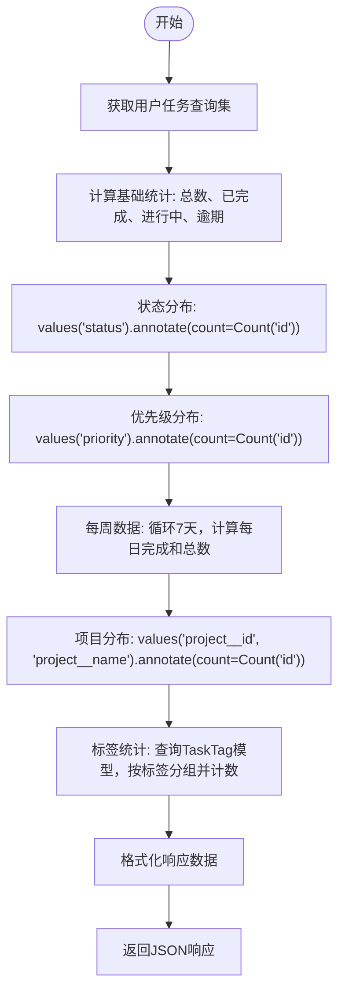
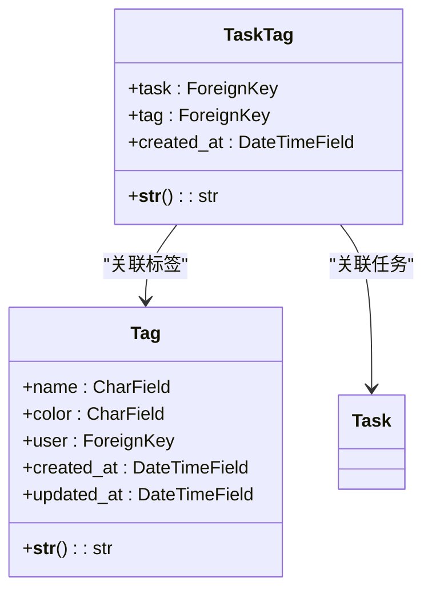
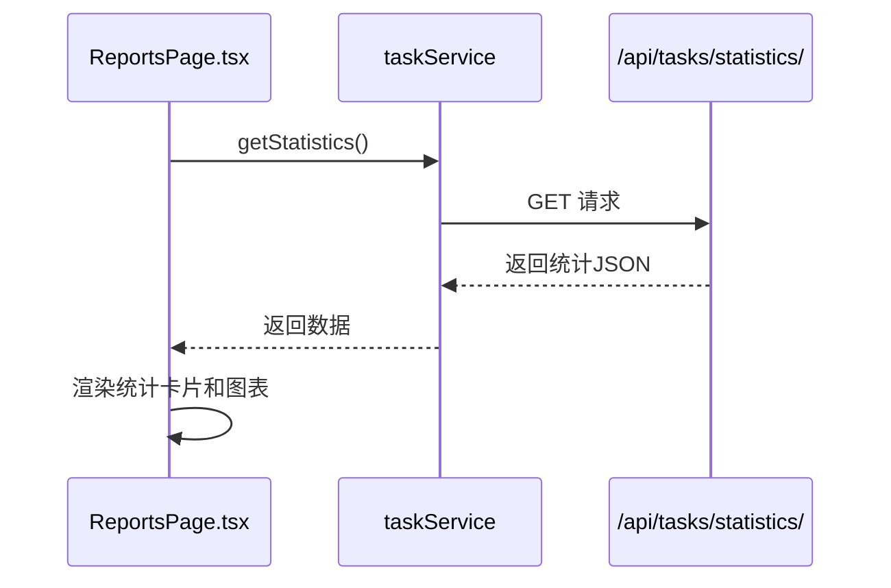

# 任务统计信息

<cite>
**本文档引用的文件**   
- [TaskViewSet.statistics](file://backend/apps/tasks/views.py#L66-L142)
- [TaskTag](file://backend/apps/tags/models.py#L29-L54)
- [ReportsPage.tsx](file://frontend/src/pages/ReportsPage.tsx)
- [taskService.getStatistics](file://frontend/src/services/task.ts#L53-L56)
</cite>

## 目录
1. [简介](#简介)
2. [后端实现分析](#后端实现分析)
3. [统计对象结构](#统计对象结构)
4. [前端数据可视化](#前端数据可视化)
5. [性能优化建议](#性能优化建议)
6. [结论](#结论)

## 简介
本项目提供了一个全面的任务管理系统，其中`/api/tasks/statistics/`端点是核心功能之一，用于生成详细的任务统计信息。该端点为用户提供了对其任务数据的深入洞察，包括总体完成情况、状态分布、优先级分析、时间趋势和标签使用情况。通过Django REST Framework的视图集和Django ORM的强大聚合功能，系统能够高效地计算并返回复合统计对象。前端则利用这些数据在报表页面中生成直观的可视化图表，帮助用户理解其任务模式和效率。

## 后端实现分析

`/api/tasks/statistics/`端点由`TaskViewSet`类中的`statistics`方法实现，该方法利用Django ORM的`annotate`和`Count`聚合函数来计算各种统计数据。方法首先获取当前用户的所有任务查询集，然后基于此查询集计算各项指标。

**Diagram sources**
- [TaskViewSet.statistics](file://backend/apps/tasks/views.py#L66-L142)

**Section sources**
- [TaskViewSet.statistics](file://backend/apps/tasks/views.py#L66-L142)

## 统计对象结构

`/api/tasks/statistics/`端点返回一个包含多个子对象的复合JSON对象，每个子对象代表不同维度的统计信息。

### 汇总信息 (summary)
包含任务的总体完成情况。

**Section sources**
- [TaskViewSet.statistics](file://backend/apps/tasks/views.py#L131-L136)

### 状态分布 (status_distribution)
展示各状态任务的数量分布。

**Section sources**
- [TaskViewSet.statistics](file://backend/apps/tasks/views.py#L82-L84)

### 优先级分布 (priority_distribution)
展示各优先级任务的数量分布。

**Section sources**
- [TaskViewSet.statistics](file://backend/apps/tasks/views.py#L87-L89)

### 每周数据 (weekly_data)
提供过去7天每日完成任务数和总任务数的时间序列数据。

**Section sources**
- [TaskViewSet.statistics](file://backend/apps/tasks/views.py#L92-L111)

### 项目分布 (project_distribution)
展示各项目下任务数量的分布情况。

**Section sources**
- [TaskViewSet.statistics](file://backend/apps/tasks/views.py#L114-L118)

### 标签统计 (tag_stats)
从`apps.tags.models.TaskTag`模型获取使用频率最高的10个标签统计。

**Diagram sources**
- [TaskTag](file://backend/apps/tags/models.py#L29-L54)

**Section sources**
- [TaskViewSet.statistics](file://backend/apps/tasks/views.py#L121-L128)

## 前端数据可视化

前端在`ReportsPage.tsx`中使用`taskService.getStatistics`方法调用`/api/tasks/statistics/`端点，并利用返回的数据生成统计图表。

**Diagram sources**
- [ReportsPage.tsx](file://frontend/src/pages/ReportsPage.tsx)
- [taskService.getStatistics](file://frontend/src/services/task.ts#L53-L56)

**Section sources**
- [ReportsPage.tsx](file://frontend/src/pages/ReportsPage.tsx)

## 性能优化建议

当处理大量数据时，可以采用以下性能优化策略：

### 缓存策略
对统计端点的响应进行缓存，避免频繁的数据库查询。

**Section sources**
- [TaskViewSet.statistics](file://backend/apps/tasks/views.py#L66-L142)

### 数据库查询优化
确保相关字段（如`status`, `priority`, `project`, `user`）已建立数据库索引。

**Section sources**
- [TaskViewSet.statistics](file://backend/apps/tasks/views.py#L66-L142)

## 结论
`/api/tasks/statistics/`端点是一个功能强大且设计良好的API，它有效地结合了Django ORM的聚合功能和清晰的数据结构，为前端提供了丰富的统计信息。通过`annotate`和`Count`，后端能够高效地计算出复杂的聚合数据。前端则通过`recharts`库将这些数据转化为直观的图表，极大地提升了用户体验。为了确保系统在数据量增长时仍能保持高性能，建议实施适当的缓存策略和数据库优化措施。