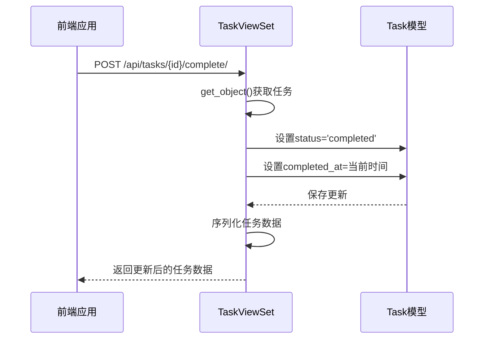
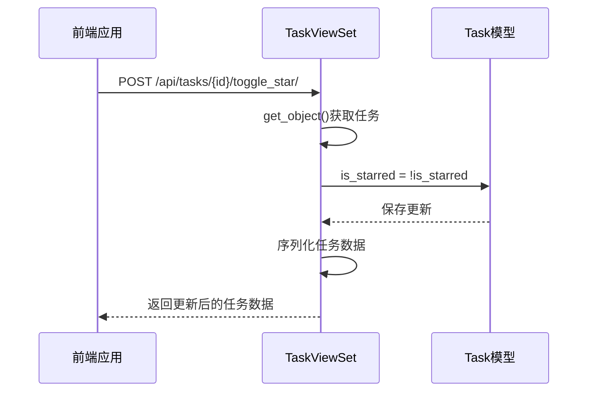
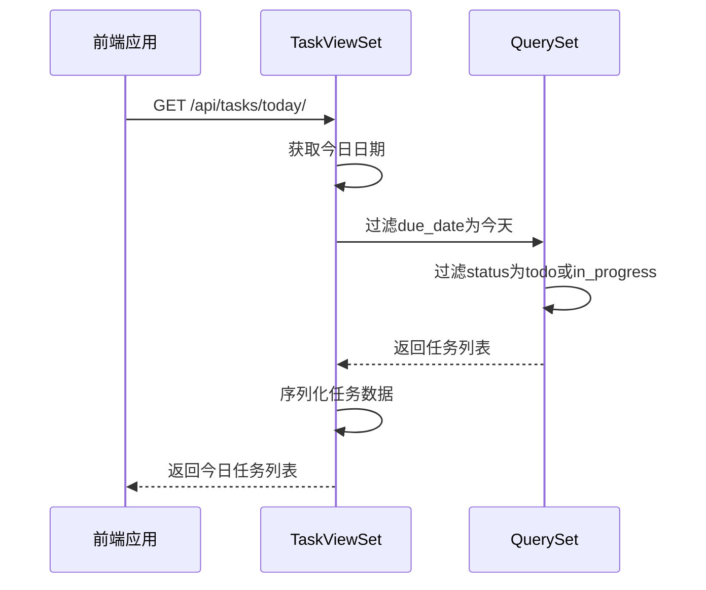
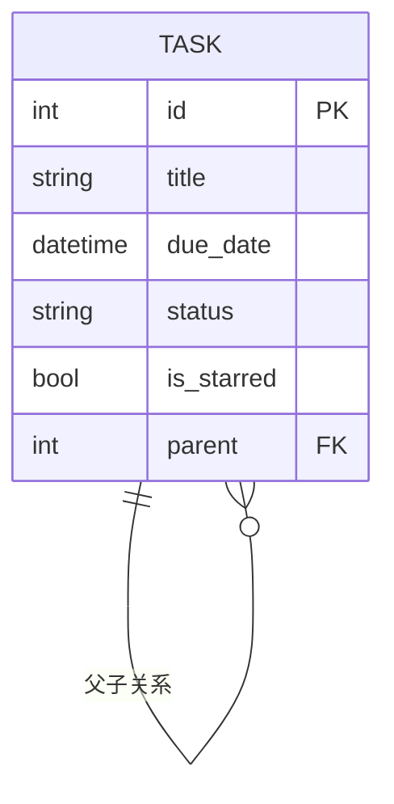
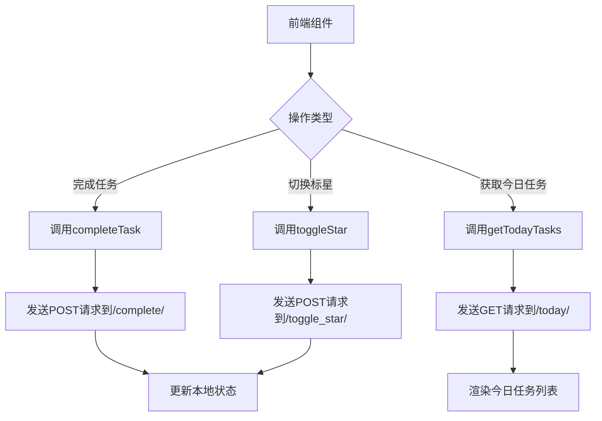
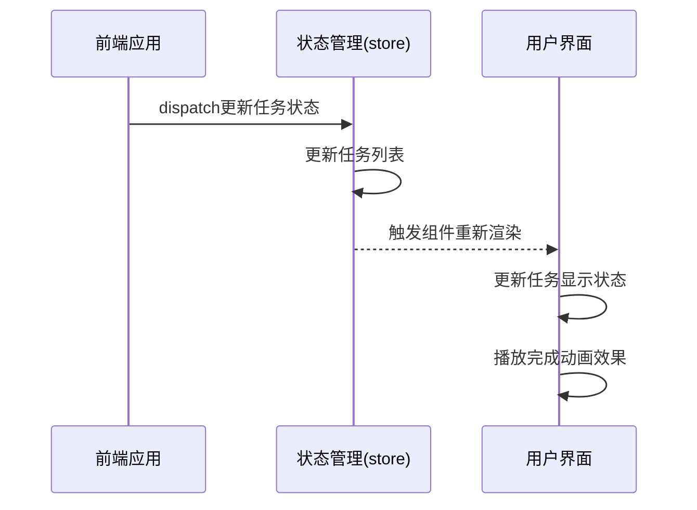
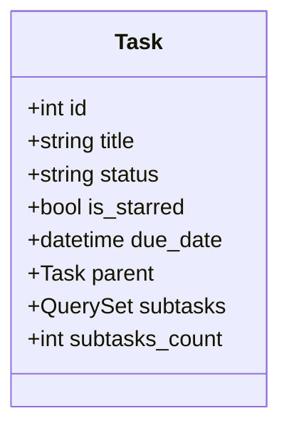

# 任务高级操作

<cite>
**本文档引用的文件**
- [TaskViewSet.py](file://backend/apps/tasks/views.py)
- [task.ts](file://frontend/src/services/task.ts)
- [Task.ts](file://frontend/src/types/index.ts)
- [TaskModel.py](file://backend/apps/tasks/models.py)
</cite>

## 目录
1. [简介](#简介)
2. [自定义动作API详解](#自定义动作api详解)
3. [前端调用实现](#前端调用实现)
4. [错误处理与状态同步](#错误处理与状态同步)
5. [父子任务层级管理](#父子任务层级管理)
6. [总结](#总结)

## 简介
本文档详细描述了任务管理系统中的高级操作功能，重点介绍通过`@action`装饰器实现的四个关键自定义动作API。这些API提供了对任务状态的精细化控制，包括完成任务、标星切换、今日任务查询等功能，为用户提供高效的任务管理体验。

**Section sources**
- [TaskViewSet.py](file://backend/apps/tasks/views.py#L12-L235)

## 自定义动作API详解

### 完成任务 (/api/tasks/{id}/complete/)
该端点用于将指定任务的状态设置为"已完成"，并记录完成时间。当用户完成某项任务时，通过此API更新任务状态。

- **HTTP方法**: POST
- **请求参数**: 任务ID (路径参数)
- **响应数据**: 更新后的任务对象，包含新的状态和完成时间戳
- **实现逻辑**: 将任务状态设置为'completed'，同时设置`completed_at`字段为当前时间



**Diagram sources**
- [TaskViewSet.py](file://backend/apps/tasks/views.py#L35-L42)

### 标星切换 (/api/tasks/{id}/toggle_star/)
该端点用于切换任务的标星状态，便于用户快速标记重要任务。通过此功能，用户可以将关键任务标记为星标，以便在任务列表中优先显示。

- **HTTP方法**: POST
- **请求参数**: 任务ID (路径参数)
- **响应数据**: 更新后的任务对象，包含新的标星状态
- **实现逻辑**: 将`is_starred`字段取反，实现标星状态的切换



**Diagram sources**
- [TaskViewSet.py](file://backend/apps/tasks/views.py#L45-L51)

### 今日任务查询 (/api/tasks/today/)
该端点用于获取今日截止且未完成的任务列表，帮助用户聚焦当天需要完成的任务。

- **HTTP方法**: GET
- **请求参数**: 无
- **响应数据**: 今日截止的未完成任务列表
- **实现逻辑**: 查询截止日期为今天且状态为'todo'或'in_progress'的任务



**Diagram sources**
- [TaskViewSet.py](file://backend/apps/tasks/views.py#L54-L62)

### 父子任务层级管理
系统支持任务的层级结构管理，通过`parent`字段建立父子任务关系，实现复杂任务的分解和管理。

- **数据结构**: 任务模型中的`parent`字段为自引用外键
- **查询方式**: 通过`subtasks`反向关系查询子任务
- **应用场景**: 将大型项目分解为多个子任务，实现任务的层次化管理



**Diagram sources**
- [TaskModel.py](file://backend/apps/tasks/models.py#L37-L44)

**Section sources**
- [TaskViewSet.py](file://backend/apps/tasks/views.py#L35-L62)
- [TaskModel.py](file://backend/apps/tasks/models.py#L4-L73)

## 前端调用实现

### API服务调用
前端通过`taskService`服务调用后端API，实现与后端的交互。以下是关键方法的实现：



**Diagram sources**
- [task.ts](file://frontend/src/services/task.ts#L38-L45)

### 类型定义
前端定义了`Task`接口，确保与后端数据结构的一致性：

```typescript
interface Task {
  id: number
  title: string
  status: 'todo' | 'in_progress' | 'completed'
  is_starred: boolean
  due_date?: string
  completed_at?: string
  // 其他字段...
}
```

**Section sources**
- [task.ts](file://frontend/src/services/task.ts#L2-L79)
- [Task.ts](file://frontend/src/types/index.ts#L22-L46)

## 错误处理与状态同步

### 标星切换失败处理
当标星切换操作失败时，系统会返回相应的错误信息，前端需要进行适当的错误处理：

- **网络错误**: 显示网络连接异常提示
- **权限错误**: 检查用户权限并提示重新登录
- **数据冲突**: 处理并发修改冲突，提示用户刷新数据

### 完成任务后状态同步
完成任务后，系统需要确保任务列表的实时更新：

1. 后端返回更新后的任务数据
2. 前端更新本地状态管理中的任务状态
3. 重新渲染相关组件
4. 如果需要，从任务列表中移除已完成任务



**Diagram sources**
- [task.ts](file://frontend/src/services/task.ts#L37-L40)

**Section sources**
- [task.ts](file://frontend/src/services/task.ts#L12-L78)

## 父子任务层级管理

### 数据结构设计
任务模型通过自引用外键实现父子层级关系：

- `parent`: 指向父任务的外键，可为空
- `subtasks`: 反向关系，获取所有子任务
- `order`: 用于在同一层级内排序任务

### 查询优化
为提高查询效率，系统实现了以下优化：

- 使用`select_related`预加载父任务数据
- 使用`prefetch_related`批量加载子任务
- 在序列化器中添加`subtasks_count`字段，避免N+1查询问题



**Diagram sources**
- [TaskModel.py](file://backend/apps/tasks/models.py#L4-L73)
- [TaskSerializer.py](file://backend/apps/tasks/serializers.py#L5-L51)

**Section sources**
- [TaskModel.py](file://backend/apps/tasks/models.py#L4-L73)
- [TaskSerializer.py](file://backend/apps/tasks/serializers.py#L5-L51)

## 总结
本文档详细介绍了任务高级操作的实现机制，包括完成任务、标星切换、今日任务查询和父子任务管理等功能。通过`@action`装饰器，系统扩展了标准的CRUD操作，提供了更丰富的任务管理功能。前端通过专门的API服务调用这些功能，并实现了相应的错误处理和状态同步机制，确保用户体验的流畅性和数据的一致性。