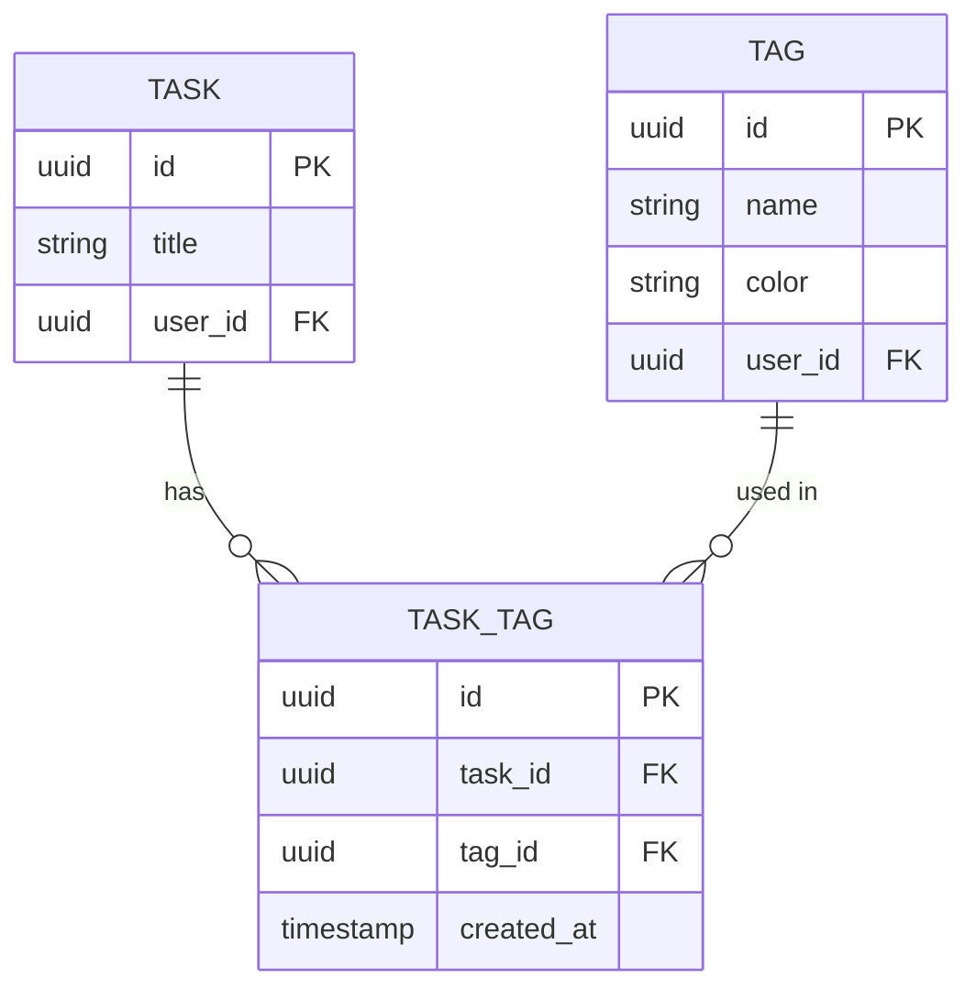
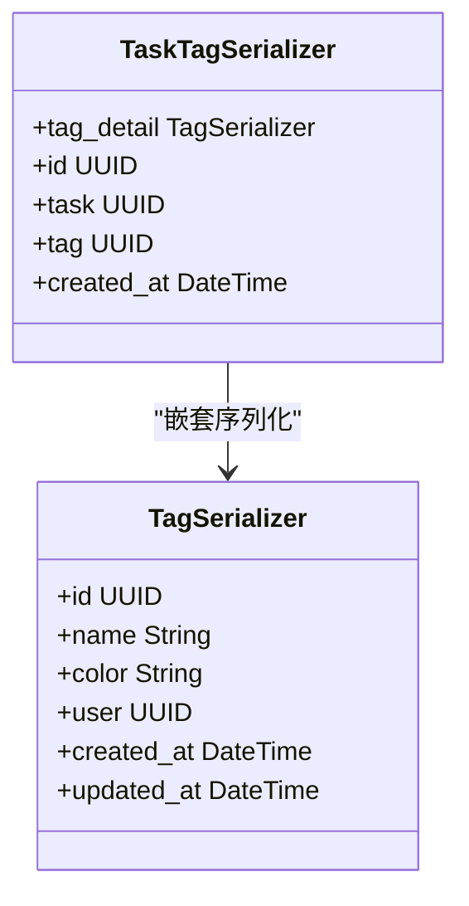
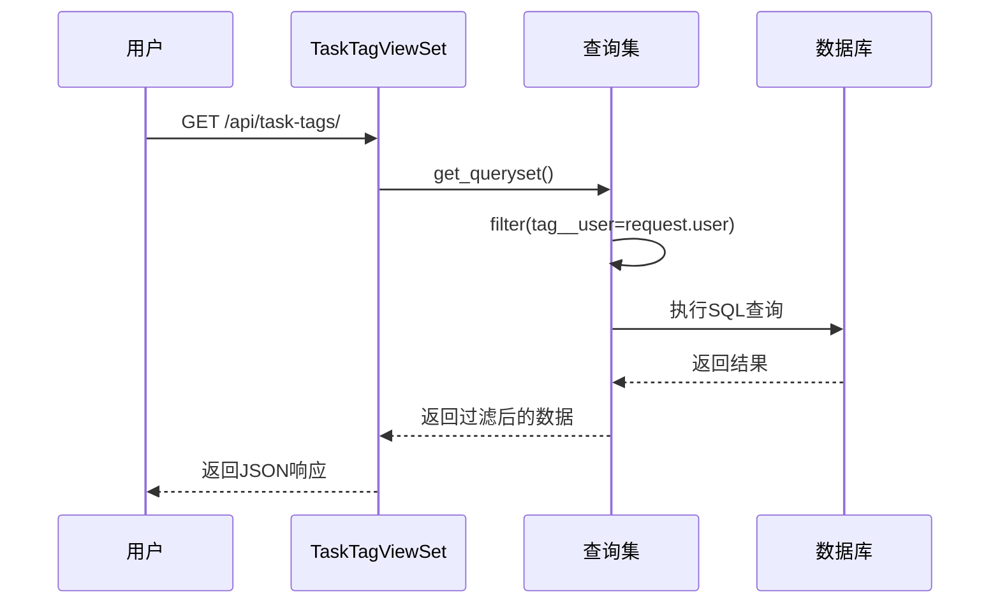

# 任务标签关联API

<cite>
**Referenced Files in This Document**   
- [TaskTagViewSet](file://backend/apps/tags/views.py#L35-L39)
- [TaskTagSerializer](file://backend/apps/tags/serializers.py#L11-L17)
- [TaskTag](file://backend/apps/tags/models.py#L29-L54)
- [TagSerializer](file://backend/apps/tags/serializers.py#L4-L8)
- [urls.py](file://backend/apps/tags/urls.py#L7)
</cite>

## 目录
1. [简介](#简介)
2. [核心模型](#核心模型)
3. [序列化器实现](#序列化器实现)
4. [视图集与端点](#视图集与端点)
5. [API使用示例](#api使用示例)
6. [权限与数据隔离](#权限与数据隔离)

## 简介
本API文档详细说明了任务与标签之间多对多关系的管理机制。系统通过`TaskTag`中间模型（through model）来建立任务与标签的关联，实现了灵活的标签分类功能。`/api/task-tags/`端点允许用户创建、查询和删除任务-标签关联，支持对任务进行精细化的分类和筛选。该设计不仅满足了基本的标签管理需求，还通过嵌套序列化和用户数据隔离等特性，确保了API的易用性和安全性。

## 核心模型

`TaskTag`模型作为任务（Task）与标签（Tag）之间的中间模型，通过外键关联实现了多对多关系。该模型在数据库中创建了`task_tags`表，通过`task`和`tag`两个外键字段将任务与标签进行关联。



**Diagram sources**
- [TaskTag](file://backend/apps/tags/models.py#L29-L54)

**Section sources**
- [TaskTag](file://backend/apps/tags/models.py#L29-L54)

## 序列化器实现

`TaskTagSerializer`是处理任务-标签关联数据的核心序列化器。其关键特性在于`tag_detail`字段的实现，该字段使用`TagSerializer`对关联的标签进行嵌套序列化，从而在API响应中直接提供标签的完整信息。



**Diagram sources**
- [TaskTagSerializer](file://backend/apps/tags/serializers.py#L11-L17)
- [TagSerializer](file://backend/apps/tags/serializers.py#L4-L8)

**Section sources**
- [TaskTagSerializer](file://backend/apps/tags/serializers.py#L11-L17)

## 视图集与端点

`TaskTagViewSet`是管理任务-标签关联的视图集，它通过`/api/task-tags/`端点提供完整的CRUD操作。该视图集继承自`ModelViewSet`，自动提供了创建、读取、更新和删除功能。

```mermaid
graph TD
A[/api/task-tags/] --> B[GET]
A --> C[POST]
A --> D[GET /{id}]
A --> E[PUT /{id}]
A --> F[DELETE /{id}]
B --> G[获取关联列表]
C --> H[创建新关联]
D --> I[获取单个关联]
E --> J[更新关联]
F --> K[删除关联]
style A fill:#4C97FF,stroke:#333,stroke-width:2px
```

**Diagram sources**
- [TaskTagViewSet](file://backend/apps/tags/views.py#L35-L39)
- [urls.py](file://backend/apps/tags/urls.py#L7)

**Section sources**
- [TaskTagViewSet](file://backend/apps/tags/views.py#L35-L39)

## API使用示例

### 为任务添加标签
通过POST请求创建任务与标签的关联。

**请求**
```
POST /api/task-tags/
Content-Type: application/json

{
    "task": "task-uuid-123",
    "tag": "tag-uuid-456"
}
```

**响应**
```json
{
    "id": "tasktag-uuid-789",
    "task": "task-uuid-123",
    "tag": "tag-uuid-456",
    "tag_detail": {
        "id": "tag-uuid-456",
        "name": "重要",
        "color": "#FF0000",
        "user": "user-uuid-001",
        "created_at": "2023-01-01T00:00:00Z",
        "updated_at": "2023-01-01T00:00:00Z"
    },
    "created_at": "2023-01-01T00:00:00Z"
}
```

### 获取任务标签详情列表
通过GET请求获取所有任务-标签关联，并包含标签的详细信息。

**响应**
```json
[
    {
        "id": "tasktag-uuid-789",
        "task": "task-uuid-123",
        "tag": "tag-uuid-456",
        "tag_detail": {
            "id": "tag-uuid-456",
            "name": "重要",
            "color": "#FF0000"
        },
        "created_at": "2023-01-01T00:00:00Z"
    }
]
```

### 删除特定关联
通过DELETE请求删除指定的任务-标签关联。

**请求**
```
DELETE /api/task-tags/tasktag-uuid-789/
```

**响应**
```
HTTP/1.1 204 No Content
```

## 权限与数据隔离

系统通过`get_queryset`方法实现了严格的数据隔离，确保用户只能访问自己拥有的标签所关联的任务关系。这是通过在查询中添加`tag__user=self.request.user`过滤条件实现的。



**Diagram sources**
- [TaskTagViewSet](file://backend/apps/tags/views.py#L35-L39)

**Section sources**
- [TaskTagViewSet](file://backend/apps/tags/views.py#L35-L39)