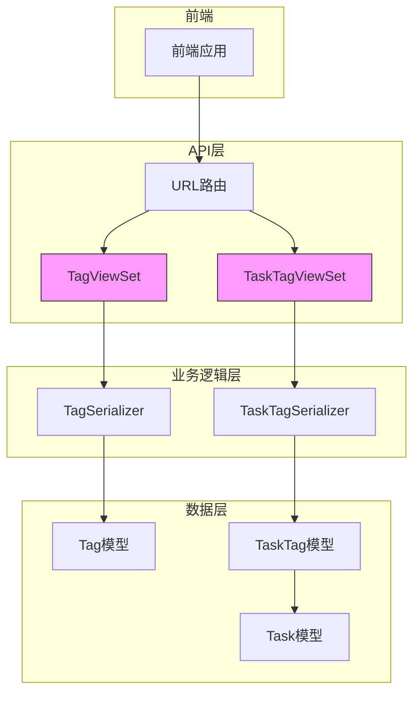
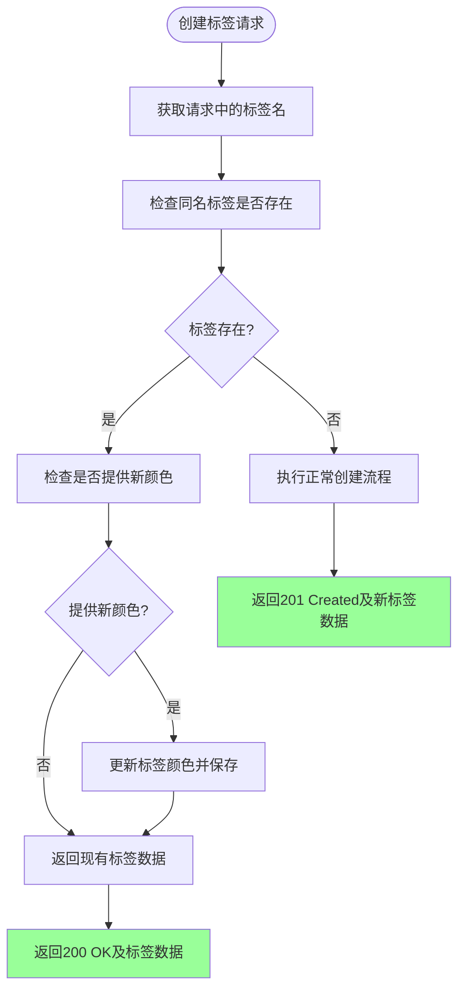
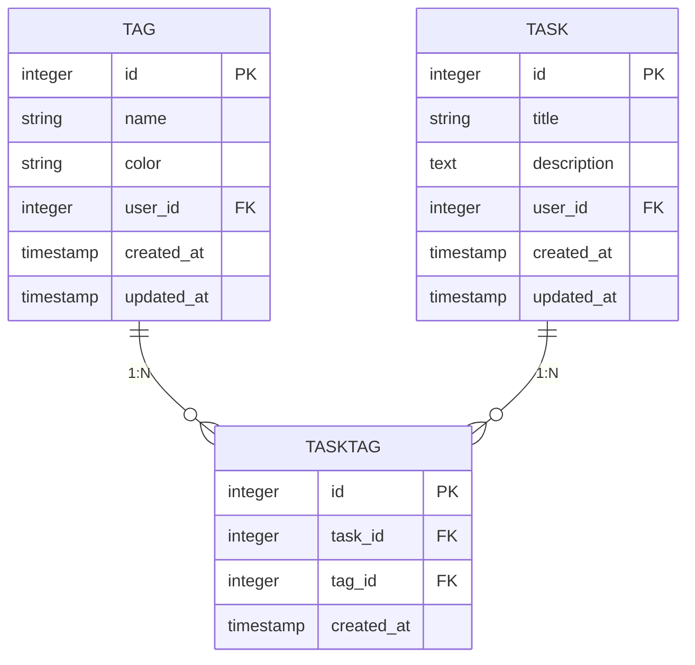
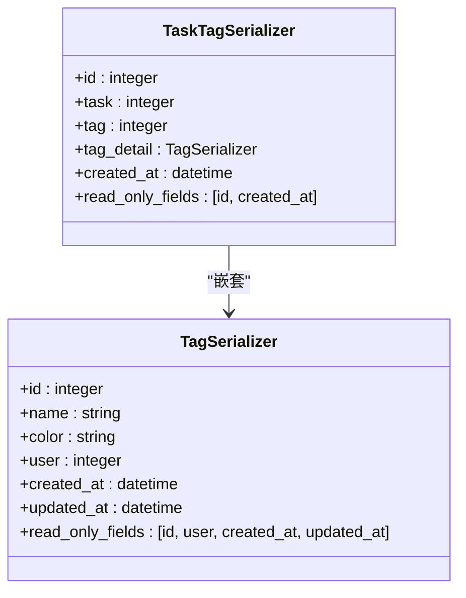
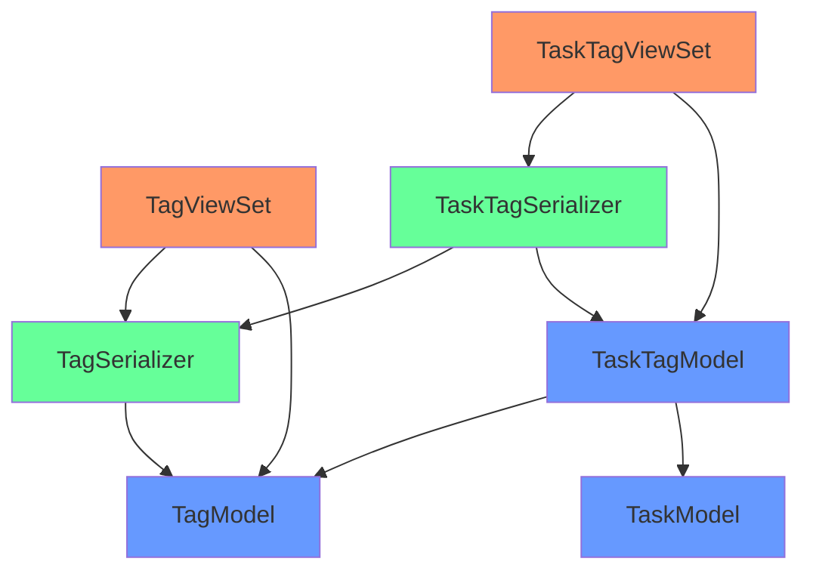

# 标签API

<cite>
**Referenced Files in This Document**   
- [TagViewSet](file://backend/apps/tags/views.py#L6-L32)
- [TaskTag](file://backend/apps/tags/models.py#L29-L54)
- [TagSerializer](file://backend/apps/tags/serializers.py#L4-L8)
- [TaskTagSerializer](file://backend/apps/tags/serializers.py#L11-L17)
- [models.py](file://backend/apps/tags/models.py)
- [serializers.py](file://backend/apps/tags/serializers.py)
- [views.py](file://backend/apps/tags/views.py)
- [urls.py](file://backend/apps/tags/urls.py)
- [tag.ts](file://frontend/src/services/tag.ts)
</cite>

## 目录
1. [简介](#简介)
2. [核心组件](#核心组件)
3. [架构概览](#架构概览)
4. [详细组件分析](#详细组件分析)
5. [依赖分析](#依赖分析)
6. [性能考虑](#性能考虑)
7. [故障排除指南](#故障排除指南)
8. [结论](#结论)

## 简介
本文档详细描述了标签API的功能，涵盖标签的创建、管理以及与任务的关联功能。重点说明了`/api/tags/`端点的GET（列表/详情）、POST（创建）、PATCH（部分更新）和DELETE操作。文档深入解析了`TagViewSet.create`方法的幂等性设计，`TaskTag`模型作为多对多关系中间表的作用，以及`/api/tags/task-tags/`端点的用途。同时，解释了`TagSerializer`和`TaskTagSerializer`的嵌套序列化实现，标签与任务的关联方式，以及用户数据隔离的查询逻辑。

## 核心组件

本节分析标签系统的核心组件，包括标签视图集、标签模型、任务标签模型、序列化器以及URL路由配置。

**Section sources**
- [views.py](file://backend/apps/tags/views.py#L6-L32)
- [models.py](file://backend/apps/tags/models.py#L5-L27)
- [models.py](file://backend/apps/tags/models.py#L29-L54)
- [serializers.py](file://backend/apps/tags/serializers.py#L4-L8)
- [serializers.py](file://backend/apps/tags/serializers.py#L11-L17)
- [urls.py](file://backend/apps/tags/urls.py)

## 架构概览

标签系统采用Django REST Framework的ModelViewSet模式，通过清晰的分层架构实现标签的全生命周期管理。系统包含模型层、序列化层、视图层和路由层，各层职责分明，协同工作。

**Diagram sources**
- [urls.py](file://backend/apps/tags/urls.py)
- [views.py](file://backend/apps/tags/views.py)
- [serializers.py](file://backend/apps/tags/serializers.py)
- [models.py](file://backend/apps/tags/models.py)

## 详细组件分析

### 标签视图集 (TagViewSet) 分析

`TagViewSet`是标签管理的核心控制器，继承自`ModelViewSet`，提供了标准的CRUD操作。其`create`方法实现了幂等性设计，确保同名标签不会重复创建。

#### 创建方法的幂等性设计

**Diagram sources**
- [views.py](file://backend/apps/tags/views.py#L15-L32)

**Section sources**
- [views.py](file://backend/apps/tags/views.py#L15-L32)

### 任务标签模型 (TaskTag) 分析

`TaskTag`模型作为任务与标签之间的多对多关系中间表，不仅建立了关联，还记录了关联的创建时间。

#### 模型关系图

**Diagram sources**
- [models.py](file://backend/apps/tags/models.py#L29-L54)
- [models.py](file://backend/apps/tags/models.py#L5-L27)
- [models.py](file://backend/apps/tasks/models.py#L5-L75)

**Section sources**
- [models.py](file://backend/apps/tags/models.py#L29-L54)

### 序列化器分析

标签系统使用两个序列化器：`TagSerializer`用于标签数据的序列化，`TaskTagSerializer`用于任务标签关联数据的序列化。

#### 嵌套序列化实现

**Diagram sources**
- [serializers.py](file://backend/apps/tags/serializers.py#L4-L8)
- [serializers.py](file://backend/apps/tags/serializers.py#L11-L17)

**Section sources**
- [serializers.py](file://backend/apps/tags/serializers.py)

## 依赖分析

标签系统与其他模块存在明确的依赖关系，确保了数据的完整性和一致性。

**Diagram sources**
- [views.py](file://backend/apps/tags/views.py)
- [serializers.py](file://backend/apps/tags/serializers.py)
- [models.py](file://backend/apps/tags/models.py)
- [models.py](file://backend/apps/tasks/models.py)

**Section sources**
- [views.py](file://backend/apps/tags/views.py)
- [serializers.py](file://backend/apps/tags/serializers.py)
- [models.py](file://backend/apps/tags/models.py)

## 性能考虑

标签API在设计时考虑了性能优化：
1. 使用`select_related`和`prefetch_related`减少数据库查询次数
2. 在`get_queryset`方法中过滤用户数据，避免不必要的数据加载
3. `TaskTagSerializer`中的`tag_detail`字段使用`read_only=True`，避免写入时的复杂处理
4. 前端服务中对标签列表获取进行了分页处理，避免一次性加载过多数据

## 故障排除指南

### 常见问题及解决方案

| 问题现象 | 可能原因 | 解决方案 |
|--------|--------|--------|
| 创建同名标签失败 | 权限不足或数据验证错误 | 检查用户认证状态和请求数据格式 |
| 无法获取标签列表 | URL路径错误 | 确认请求路径为`/api/tags/` |
| 任务标签详情不显示 | 嵌套序列化配置错误 | 检查`TaskTagSerializer`中的`tag_detail`字段配置 |
| 标签颜色未更新 | 请求中未包含color字段 | 确保在创建同名标签时提供color字段 |

**Section sources**
- [views.py](file://backend/apps/tags/views.py)
- [serializers.py](file://backend/apps/tags/serializers.py)
- [tag.ts](file://frontend/src/services/tag.ts)

## 结论

标签API通过精心设计的架构实现了标签的全生命周期管理。其核心特性包括：
1. **幂等性创建**：`TagViewSet.create`方法确保同名标签不会重复创建，提升了用户体验和数据一致性。
2. **灵活的关联机制**：通过`TaskTag`中间模型，实现了任务与标签的多对多关联，并支持扩展字段（如创建时间）。
3. **丰富的数据展示**：`TaskTagSerializer`使用嵌套序列化，提供了任务标签的完整详情。
4. **严格的数据隔离**：通过`get_queryset`方法过滤，确保用户只能访问自己的标签数据。

该API设计合理，功能完整，为前端应用提供了稳定可靠的标签管理能力。