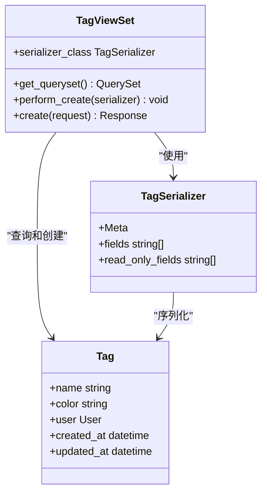
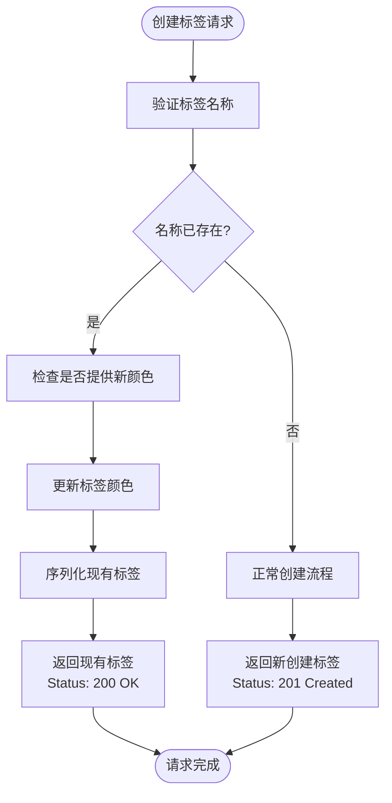
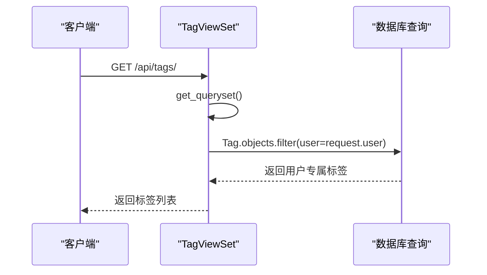
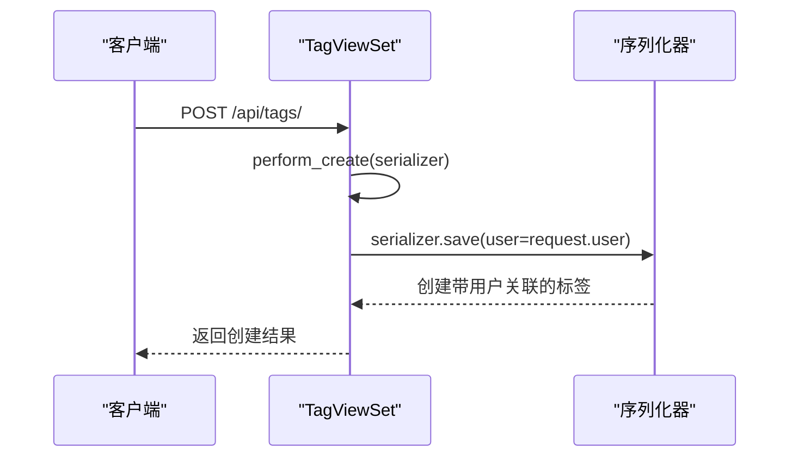
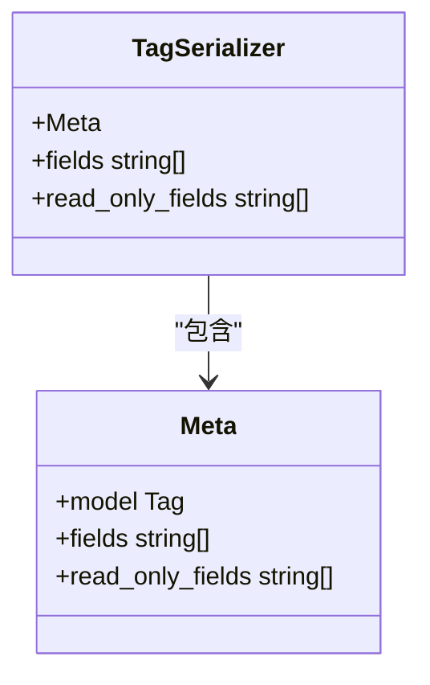
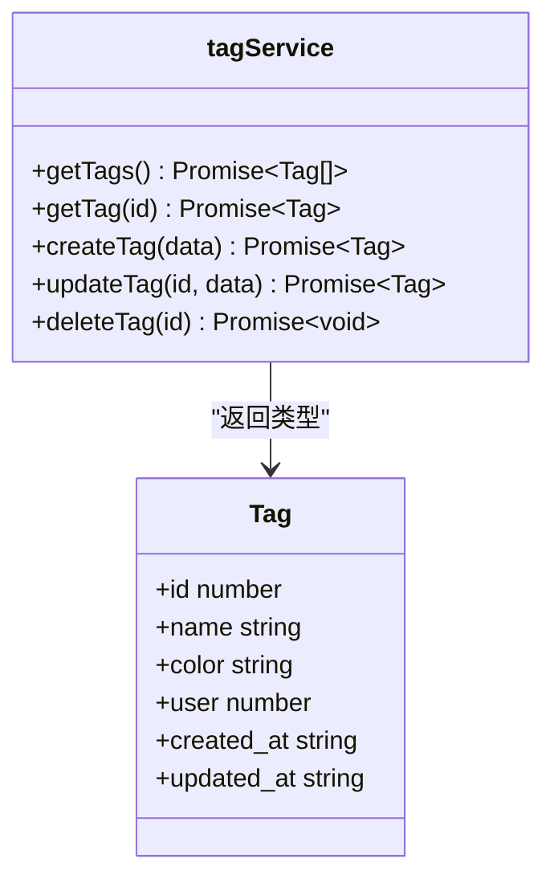
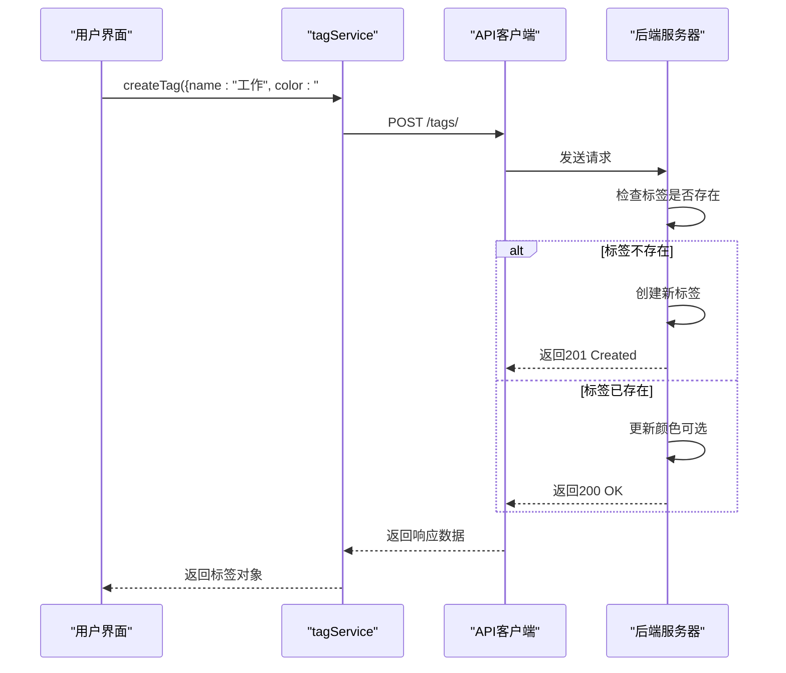
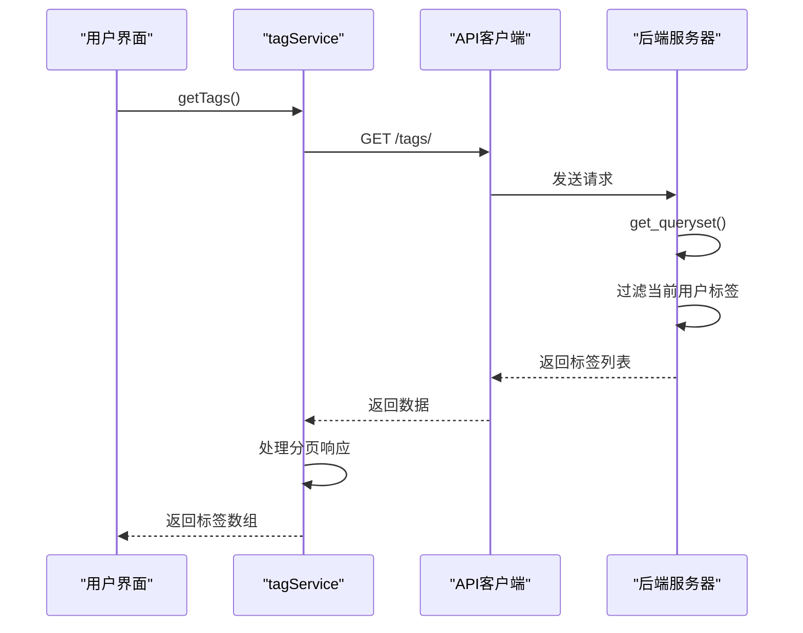
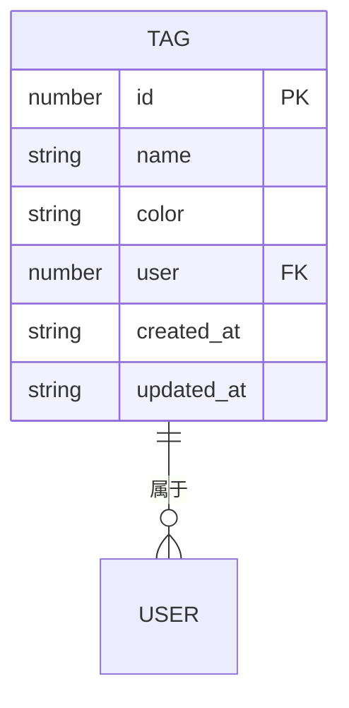
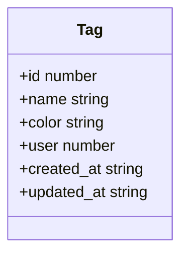

# 标签管理API

<cite>
**Referenced Files in This Document**  
- [TagViewSet](file://backend/apps/tags/views.py#L6-L32)
- [TagSerializer](file://backend/apps/tags/serializers.py#L4-L8)
- [Tag](file://backend/apps/tags/models.py#L4-L26)
- [tagService](file://frontend/src/services/tag.ts#L12-L40)
- [Tag](file://frontend/src/types/index.ts#L99-L106)
- [urls.py](file://backend/apps/tags/urls.py)
</cite>

## Table of Contents
1. [标签管理API](#标签管理api)
2. [核心功能概述](#核心功能概述)
3. [后端实现](#后端实现)
4. [前端调用示例](#前端调用示例)
5. [数据模型](#数据模型)

## 核心功能概述

标签管理API提供了一套完整的标签生命周期管理功能，通过`/api/tags/`端点支持标准的CRUD操作。该API设计旨在为用户提供高效、无重复的标签管理体验。

**核心特性**：
- **幂等性创建**：当用户尝试创建已存在的同名标签时，系统不会抛出错误，而是返回现有标签实例，避免数据重复。
- **用户隔离**：每个用户只能访问和管理属于自己的标签，确保数据安全和隐私。
- **灵活更新**：在创建请求中可选择性地更新现有标签的颜色属性。
- **标准化接口**：遵循RESTful设计原则，支持GET、POST、PATCH和DELETE方法。

**支持的HTTP方法**：
- `GET /api/tags/`：获取当前用户的标签列表
- `GET /api/tags/{id}/`：获取指定标签的详细信息
- `POST /api/tags/`：创建新标签（具备幂等性）
- `PATCH /api/tags/{id}/`：部分更新标签信息
- `DELETE /api/tags/{id}/`：删除指定标签

**Section sources**
- [TagViewSet](file://backend/apps/tags/views.py#L6-L32)
- [urls.py](file://backend/apps/tags/urls.py)

## 后端实现

### TagViewSet 核心逻辑

`TagViewSet`是标签管理功能的核心视图集，继承自Django REST Framework的`ModelViewSet`，实现了完整的CRUD操作。

**Diagram sources**
- [TagViewSet](file://backend/apps/tags/views.py#L6-L32)
- [TagSerializer](file://backend/apps/tags/serializers.py#L4-L8)
- [Tag](file://backend/apps/tags/models.py#L4-L26)

#### 幂等性创建设计

`create`方法实现了关键的幂等性设计，当用户尝试创建已存在的同名标签时，系统会返回现有标签而非抛出错误。

**Diagram sources**
- [TagViewSet](file://backend/apps/tags/views.py#L16-L32)

**Section sources**
- [TagViewSet](file://backend/apps/tags/views.py#L16-L32)

#### 用户数据隔离

通过`get_queryset`方法确保用户只能访问属于自己的标签，实现了数据的自动隔离。

**Diagram sources**
- [TagViewSet](file://backend/apps/tags/views.py#L9-L10)

**Section sources**
- [TagViewSet](file://backend/apps/tags/views.py#L9-L10)

#### 自动用户绑定

`perform_create`方法在创建标签时自动将当前用户与标签关联，无需前端传递用户信息。

**Diagram sources**
- [TagViewSet](file://backend/apps/tags/views.py#L12-L13)

**Section sources**
- [TagViewSet](file://backend/apps/tags/views.py#L12-L13)

### TagSerializer 配置

`TagSerializer`定义了标签数据的序列化规则，确保数据的一致性和安全性。

**Diagram sources**
- [TagSerializer](file://backend/apps/tags/serializers.py#L4-L8)

**Section sources**
- [TagSerializer](file://backend/apps/tags/serializers.py#L4-L8)

## 前端调用示例

### tagService API 封装

前端通过`tagService`对象封装了对标签API的所有调用，提供了简洁的Promise接口。

**Diagram sources**
- [tagService](file://frontend/src/services/tag.ts#L12-L40)
- [Tag](file://frontend/src/types/index.ts#L99-L106)

**Section sources**
- [tagService](file://frontend/src/services/tag.ts#L12-L40)

### 创建标签示例

**Diagram sources**
- [tagService](file://frontend/src/services/tag.ts#L27-L29)
- [TagViewSet](file://backend/apps/tags/views.py#L16-L32)

**Section sources**
- [tagService](file://frontend/src/services/tag.ts#L27-L29)

### 获取标签列表示例

**Diagram sources**
- [tagService](file://frontend/src/services/tag.ts#L13-L19)
- [TagViewSet](file://backend/apps/tags/views.py#L9-L10)

**Section sources**
- [tagService](file://frontend/src/services/tag.ts#L13-L19)

## 数据模型

### 标签模型 (Tag)

`Tag`模型定义了标签的核心属性和约束，是标签管理功能的数据基础。

**Diagram sources**
- [Tag](file://backend/apps/tags/models.py#L4-L26)

**Section sources**
- [Tag](file://backend/apps/tags/models.py#L4-L26)

### 字段说明

| 字段 | 类型 | 描述 | 约束 |
|------|------|------|------|
| id | number | 唯一标识符 | 主键，自增 |
| name | string | 标签名称 | 最大长度50字符，与用户组合唯一 |
| color | string | 标签颜色 | 最大长度7字符，默认值'#10B981' |
| user | number | 所属用户 | 外键，级联删除 |
| created_at | string | 创建时间 | 自动生成 |
| updated_at | string | 更新时间 | 自动更新 |

**Section sources**
- [Tag](file://backend/apps/tags/models.py#L4-L26)

### 前端类型定义

前端`Tag`接口与后端模型保持一致，确保类型安全。

**Diagram sources**
- [Tag](file://frontend/src/types/index.ts#L99-L106)

**Section sources**
- [Tag](file://frontend/src/types/index.ts#L99-L106)