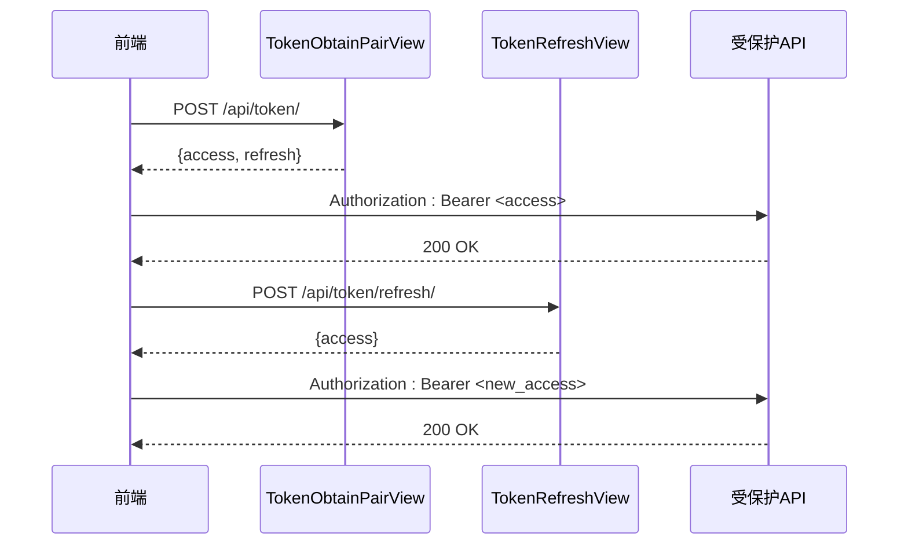
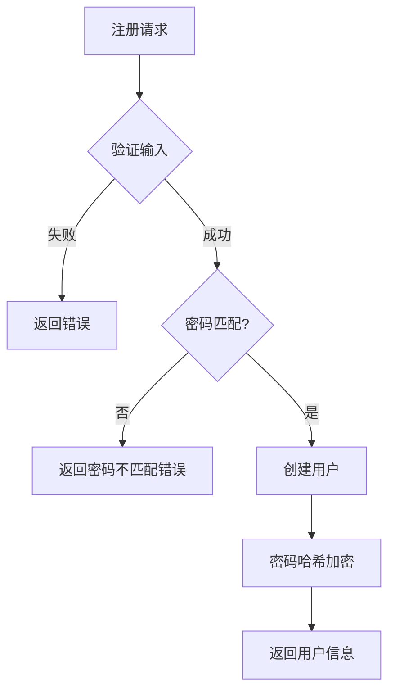
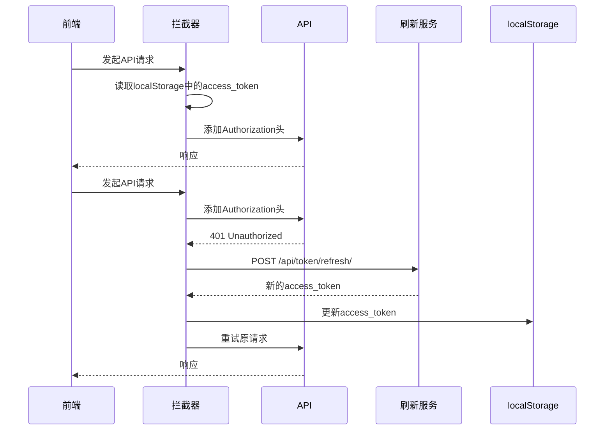

# 认证API

<cite>
**本文档引用文件**  
- [settings.py](file://backend/todo_project/settings.py)
- [urls.py](file://backend/todo_project/urls.py)
- [views.py](file://backend/apps/users/views.py)
- [serializers.py](file://backend/apps/users/serializers.py)
- [models.py](file://backend/apps/users/models.py)
- [auth.ts](file://frontend/src/services/auth.ts)
- [api.ts](file://frontend/src/services/api.ts)
- [LoginPage.tsx](file://frontend/src/pages/LoginPage.tsx)
- [RegisterPage.tsx](file://frontend/src/pages/RegisterPage.tsx)
- [ProtectedRoute.tsx](file://frontend/src/components/ProtectedRoute.tsx)
</cite>

## 目录
1. [简介](#简介)
2. [认证端点](#认证端点)
3. [用户注册流程](#用户注册流程)
4. [JWT配置说明](#jwt配置说明)
5. [前端集成方案](#前端集成方案)
6. [错误处理与安全机制](#错误处理与安全机制)
7. [跨域凭证处理](#跨域凭证处理)

## 简介
本项目采用`djangorestframework-simplejwt`实现基于JWT的认证机制，提供标准的令牌获取、刷新和用户注册功能。系统通过`TokenObtainPairView`和`TokenRefreshView`提供认证接口，并结合自定义用户模型实现完整的用户生命周期管理。前端通过axios拦截器自动处理令牌附加和刷新逻辑。

## 认证端点

### 令牌获取 (/api/token/)
- **HTTP方法**: POST
- **功能**: 用户登录并获取访问令牌和刷新令牌
- **请求参数**:
  - `username`: 字符串，必填
  - `password`: 字符串，必填
- **成功响应**:
  - 状态码: 200 OK
  - 响应体:
    ```json
    {
      "access": "JWT访问令牌",
      "refresh": "JWT刷新令牌"
    }
    ```
- **错误响应**:
  - 状态码: 401 Unauthorized
  - 响应体:
    ```json
    {
      "detail": "无效的凭据"
    }
    ```

### 令牌刷新 (/api/token/refresh/)
- **HTTP方法**: POST
- **功能**: 使用刷新令牌获取新的访问令牌
- **请求参数**:
  - `refresh`: 字符串，必填（刷新令牌）
- **成功响应**:
  - 状态码: 200 OK
  - 响应体:
    ```json
    {
      "access": "新的JWT访问令牌"
    }
    ```
- **错误响应**:
  - 状态码: 401 Unauthorized
  - 响应体:
    ```json
    {
      "detail": "令牌无效或已过期"
    }
    ```



**图示来源**
- [urls.py](file://backend/todo_project/urls.py#L18-L19)
- [views.py](file://backend/apps/users/views.py#L19-L25)

**本节来源**
- [urls.py](file://backend/todo_project/urls.py#L18-L19)

## 用户注册流程

### 注册端点 (/api/users/register/)
- **HTTP方法**: POST
- **权限**: 允许匿名访问
- **请求验证**:
  - 密码长度至少8位
  - 两次密码输入必须一致
  - 邮箱格式验证
- **密码加密**: 使用Django内置的`create_user`方法进行PBKDF2哈希加密

### 处理流程
1. 接收注册请求数据
2. 通过`UserRegistrationSerializer`进行验证
3. 密码匹配检查
4. 创建用户并自动哈希密码
5. 返回用户基本信息



**图示来源**
- [serializers.py](file://backend/apps/users/serializers.py#L20-L28)
- [views.py](file://backend/apps/users/views.py#L19-L25)

**本节来源**
- [views.py](file://backend/apps/users/views.py#L19-L25)
- [serializers.py](file://backend/apps/users/serializers.py#L12-L28)

## JWT配置说明

### SIMPLE_JWT配置
```python
SIMPLE_JWT = {
    'ACCESS_TOKEN_LIFETIME': timedelta(days=1),
    'REFRESH_TOKEN_LIFETIME': timedelta(days=7),
    'ROTATE_REFRESH_TOKENS': True,
    'BLACKLIST_AFTER_ROTATION': True,
}
```

- **访问令牌有效期**: 1天
- **刷新令牌有效期**: 7天
- **令牌轮换**: 启用，每次使用刷新令牌时生成新的刷新令牌
- **黑名单机制**: 启用，旧的刷新令牌被加入黑名单防止重用

### 认证头使用
- **格式**: `Authorization: Bearer <access_token>`
- **应用场景**: 所有受保护的API端点
- **自动附加**: 前端通过axios拦截器自动添加

**本节来源**
- [settings.py](file://backend/todo_project/settings.py#L143-L148)

## 前端集成方案

### Axios拦截器配置
前端在`api.ts`中配置了请求和响应拦截器，实现自动令牌管理和刷新。



**图示来源**
- [api.ts](file://frontend/src/services/api.ts#L1-L58)
- [auth.ts](file://frontend/src/services/auth.ts#L1-L24)

**本节来源**
- [api.ts](file://frontend/src/services/api.ts#L1-L58)
- [auth.ts](file://frontend/src/services/auth.ts#L1-L24)

## 错误处理与安全机制

### 常见错误场景
- **无效凭据**: 用户名或密码错误，返回401状态码
- **刷新令牌过期**: 刷新令牌超过7天有效期，返回401状态码
- **密码不匹配**: 注册时两次密码输入不一致，返回400状态码
- **令牌无效**: 伪造或损坏的JWT令牌，返回401状态码

### 安全措施
- 密码在数据库中始终以哈希形式存储
- 刷新令牌使用黑名单机制防止重放攻击
- 访问令牌短期有效，降低泄露风险
- 所有认证相关操作通过HTTPS传输

**本节来源**
- [serializers.py](file://backend/apps/users/serializers.py#L21-L23)
- [api.ts](file://frontend/src/services/api.ts#L30-L50)

## 跨域凭证处理

### CORS配置
```python
CORS_ALLOWED_ORIGINS = ['http://localhost:5173', 'http://127.0.0.1:5173']
CORS_ALLOW_CREDENTIALS = True
```

- **允许的源**: 前端开发服务器
- **凭证支持**: 启用，允许发送Cookie和认证头
- **浏览器要求**: 前端请求必须设置`withCredentials: true`

### 实现要点
- 后端必须设置`CORS_ALLOW_CREDENTIALS = True`
- 前端axios实例自动处理凭证
- 浏览器同源策略下正常工作
- 生产环境需配置正确的域名白名单

**本节来源**
- [settings.py](file://backend/todo_project/settings.py#L150-L155)
- [api.ts](file://frontend/src/services/api.ts#L4-L6)