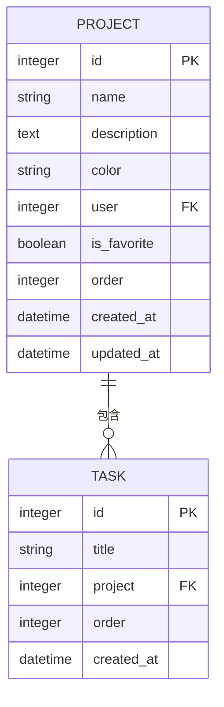
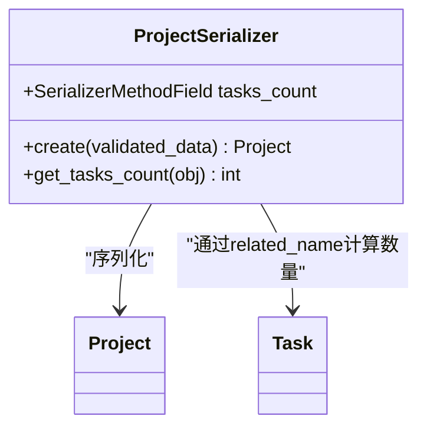
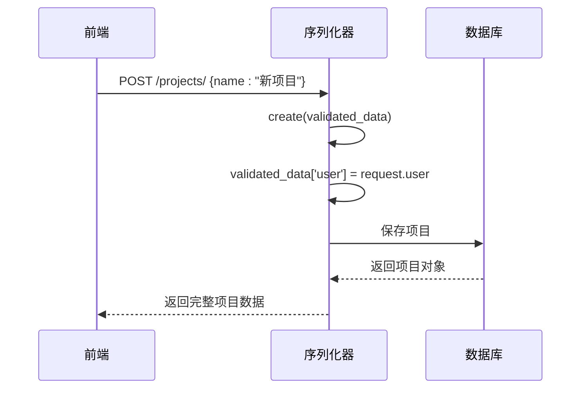
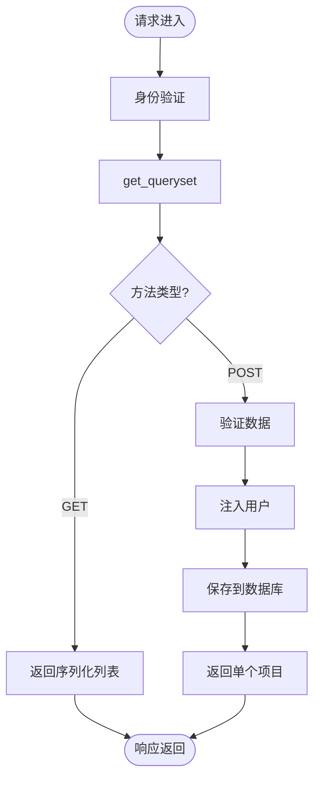
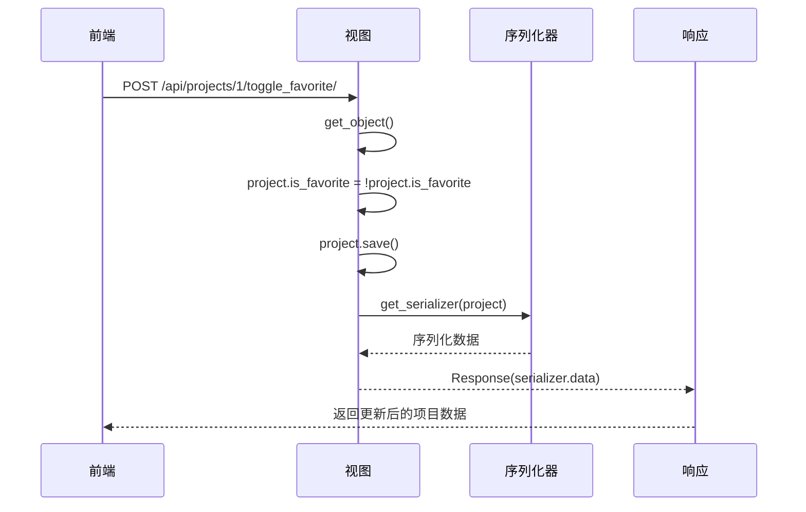
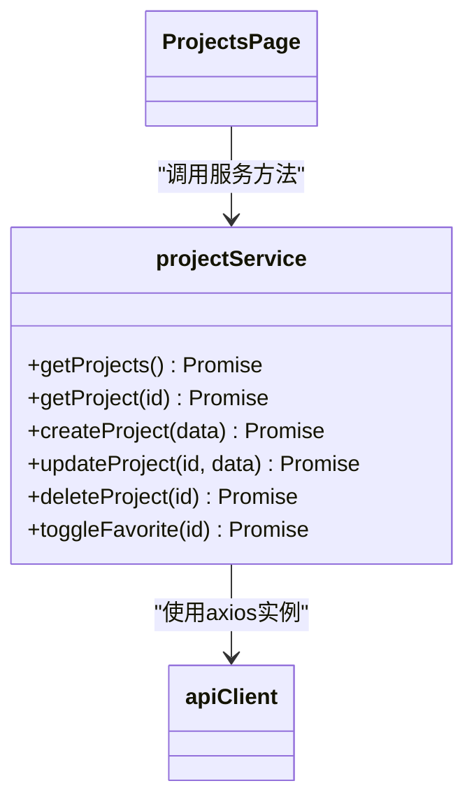
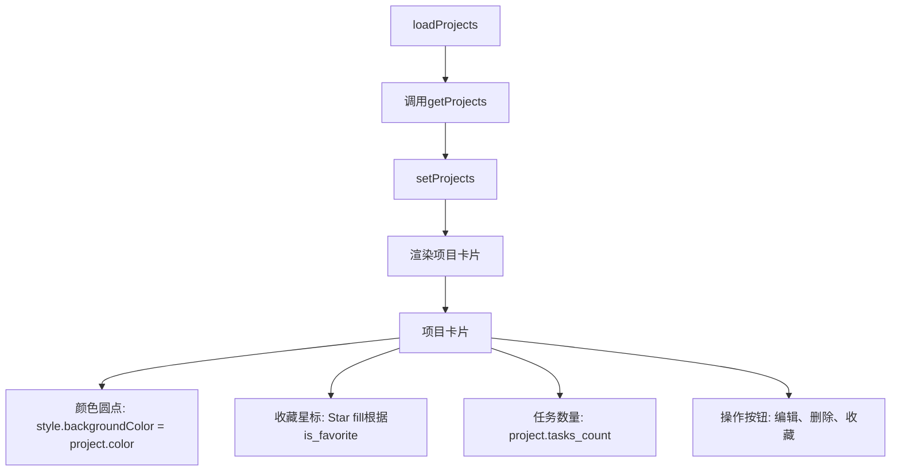

# 项目API

<cite>
**本文档引用的文件**  
- [models.py](file://backend/apps/projects/models.py)
- [serializers.py](file://backend/apps/projects/serializers.py)
- [views.py](file://backend/apps/projects/views.py)
- [urls.py](file://backend/apps/projects/urls.py)
- [project.ts](file://frontend/src/services/project.ts)
- [ProjectsPage.tsx](file://frontend/src/pages/ProjectsPage.tsx)
- [index.ts](file://frontend/src/types/index.ts)
</cite>

## 目录
1. [简介](#简介)
2. [项目模型](#项目模型)
3. [序列化器实现](#序列化器实现)
4. [视图集与端点](#视图集与端点)
5. [自定义动作：切换收藏](#自定义动作：切换收藏)
6. [前端服务与交互](#前端服务与交互)
7. [项目列表渲染](#项目列表渲染)
8. [请求示例](#请求示例)
9. [查询优化与关联关系](#查询优化与关联关系)

## 简介
本API文档详细描述了项目管理模块的核心接口，涵盖项目资源的增删改查操作以及自定义行为。API基于Django REST Framework构建，通过`/api/projects/`端点提供完整的项目管理功能，支持创建、读取、更新、删除项目，并实现收藏状态切换等用户交互功能。前端通过TypeScript服务调用这些接口，并在项目页面中渲染可视化卡片。

## 项目模型
项目模型定义了核心数据结构，包含名称、描述、颜色标识、收藏状态、排序字段等属性。每个项目归属于特定用户，通过外键关联实现数据隔离。



**Diagram sources**  
- [models.py](file://backend/apps/projects/models.py#L5-L31)
- [tasks/models.py](file://backend/apps/tasks/models.py#L5-L74)

**Section sources**  
- [models.py](file://backend/apps/projects/models.py#L5-L31)

## 序列化器实现
项目序列化器负责数据的序列化与反序列化，动态注入当前用户并计算关联任务数量。



### 动态用户注入
在创建项目时，序列化器自动将当前请求用户注入到`validated_data`中，确保项目与用户正确关联。



### 任务数量计算
`tasks_count`字段通过`SerializerMethodField`动态计算，调用`obj.tasks.count()`获取关联任务总数，避免额外查询。

**Diagram sources**  
- [serializers.py](file://backend/apps/projects/serializers.py#L5-L22)

**Section sources**  
- [serializers.py](file://backend/apps/projects/serializers.py#L5-L22)

## 视图集与端点
`ProjectViewSet`提供标准的RESTful接口，自动路由到相应操作。

| HTTP方法 | 端点 | 描述 |
|---------|------|------|
| GET | `/api/projects/` | 获取项目列表（含详情） |
| POST | `/api/projects/` | 创建新项目 |
| GET | `/api/projects/{id}/` | 获取单个项目详情 |
| PATCH | `/api/projects/{id}/` | 部分更新项目（如颜色、收藏状态） |
| DELETE | `/api/projects/{id}/` | 删除项目 |

所有查询均通过`get_queryset()`方法过滤，仅返回当前用户所属项目，确保数据安全。



**Section sources**  
- [views.py](file://backend/apps/projects/views.py#L8-L13)

## 自定义动作：切换收藏
`toggle_favorite`是一个自定义动作，用于切换项目的收藏状态。



该动作返回完整的项目数据，包含更新后的`is_favorite`状态和`tasks_count`，便于前端直接更新UI。

**Diagram sources**  
- [views.py](file://backend/apps/projects/views.py#L14-L22)

**Section sources**  
- [views.py](file://backend/apps/projects/views.py#L14-L22)

## 前端服务与交互
前端通过`projectService`封装API调用，提供类型安全的接口访问。



服务处理分页响应，提取`results`数组，确保返回一致的数据结构。

**Section sources**  
- [project.ts](file://frontend/src/services/project.ts#L12-L43)

## 项目列表渲染
`ProjectsPage`组件负责渲染项目列表，利用API响应数据构建可视化卡片。



每个项目卡片显示颜色标识、名称、描述和任务数量，并通过交互按钮支持编辑、删除和收藏操作。

**Section sources**  
- [ProjectsPage.tsx](file://frontend/src/pages/ProjectsPage.tsx#L1-L265)

## 请求示例
### 创建新项目
```http
POST /api/projects/
Content-Type: application/json

{
  "name": "前端开发",
  "description": "Vue3和TypeScript项目",
  "color": "#10B981"
}
```

### 更新项目颜色
```http
PATCH /api/projects/1/
Content-Type: application/json

{
  "color": "#F59E0B"
}
```

### 检测收藏状态
```http
POST /api/projects/1/toggle_favorite/
```

响应返回更新后的项目对象：
```json
{
  "id": 1,
  "name": "前端开发",
  "description": "Vue3和TypeScript项目",
  "color": "#F59E0B",
  "user": 1,
  "is_favorite": true,
  "order": 0,
  "created_at": "2024-01-01T00:00:00Z",
  "updated_at": "2024-01-01T00:00:00Z",
  "tasks_count": 15
}
```

## 查询优化与关联关系
项目与任务通过外键关联，`related_name='tasks'`允许从项目反向访问所有任务。`tasks_count`的计算使用`obj.tasks.count()`，Django ORM会生成高效的SQL COUNT查询。列表视图的`get_queryset()`方法自动过滤当前用户数据，结合数据库索引实现快速查询。

**Section sources**  
- [models.py](file://backend/apps/projects/models.py#L18-L19)
- [tasks/models.py](file://backend/apps/tasks/models.py#L30-L37)
- [serializers.py](file://backend/apps/projects/serializers.py#L16-L17)