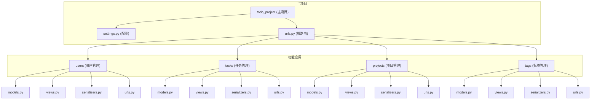
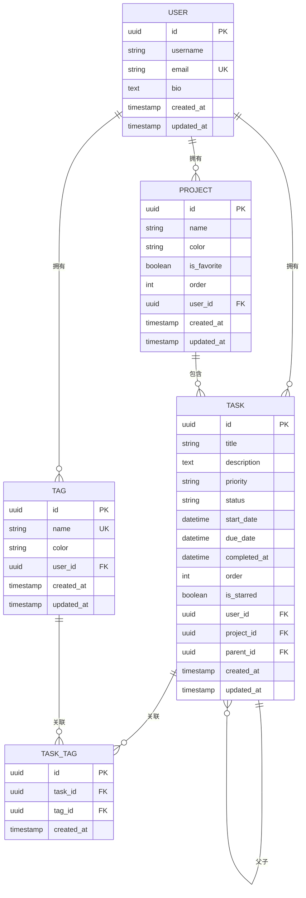
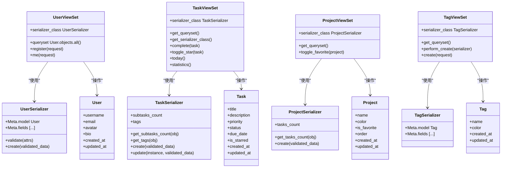
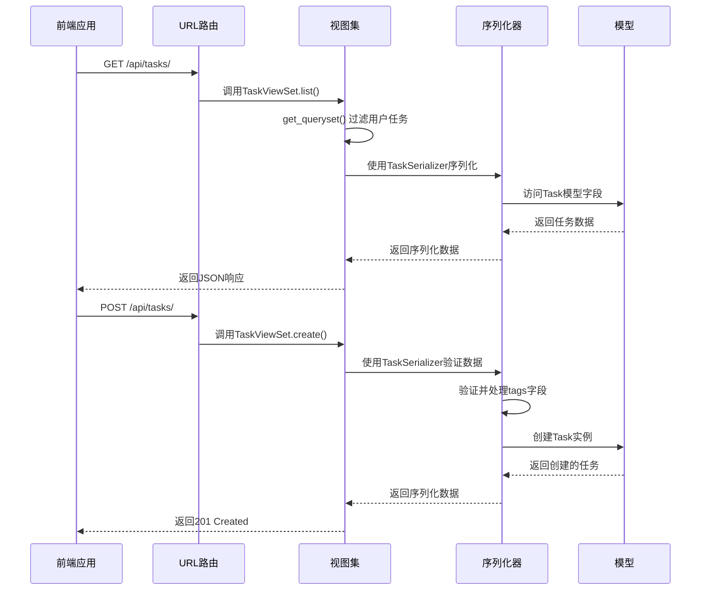

# 后端架构

<cite>
**本文档中引用的文件**
- [settings.py](file://backend/todo_project/settings.py)
- [urls.py](file://backend/todo_project/urls.py)
- [users/models.py](file://backend/apps/users/models.py)
- [tasks/models.py](file://backend/apps/tasks/models.py)
- [projects/models.py](file://backend/apps/projects/models.py)
- [tags/models.py](file://backend/apps/tags/models.py)
- [users/views.py](file://backend/apps/users/views.py)
- [tasks/views.py](file://backend/apps/tasks/views.py)
- [projects/views.py](file://backend/apps/projects/views.py)
- [tags/views.py](file://backend/apps/tags/views.py)
- [users/serializers.py](file://backend/apps/users/serializers.py)
- [tasks/serializers.py](file://backend/apps/tasks/serializers.py)
- [projects/serializers.py](file://backend/apps/projects/serializers.py)
- [tags/serializers.py](file://backend/apps/tags/serializers.py)
- [users/urls.py](file://backend/apps/users/urls.py)
- [tasks/urls.py](file://backend/apps/tasks/urls.py)
- [projects/urls.py](file://backend/apps/projects/urls.py)
- [tags/urls.py](file://backend/apps/tags/urls.py)
</cite>

## 目录
1. [项目结构](#项目结构)
2. [核心模块关系](#核心模块关系)
3. [配置分析](#配置分析)
4. [API路由设计](#api路由设计)
5. [MVC架构实现](#mvc架构实现)
6. [组件交互流程](#组件交互流程)

## 项目结构

Django项目采用模块化设计，将功能划分为独立的应用。主项目`todo_project`负责全局配置和路由分发，而具体功能由`users`、`tasks`、`projects`、`tags`四个应用实现。



**图示来源**
- [settings.py](file://backend/todo_project/settings.py)
- [urls.py](file://backend/todo_project/urls.py)

**本节来源**
- [settings.py](file://backend/todo_project/settings.py)
- [urls.py](file://backend/todo_project/urls.py)

## 核心模块关系

各应用之间通过模型关系实现数据关联。用户是所有数据的拥有者，任务可以属于项目并关联多个标签，形成完整的任务管理系统。



**图示来源**
- [users/models.py](file://backend/apps/users/models.py)
- [tasks/models.py](file://backend/apps/tasks/models.py)
- [projects/models.py](file://backend/apps/projects/models.py)
- [tags/models.py](file://backend/apps/tags/models.py)

**本节来源**
- [users/models.py](file://backend/apps/users/models.py)
- [tasks/models.py](file://backend/apps/tasks/models.py)
- [projects/models.py](file://backend/apps/projects/models.py)
- [tags/models.py](file://backend/apps/tags/models.py)

## 配置分析

### 数据库连接
通过`django-environ`库从环境变量读取数据库配置，支持多种数据库类型，提高了配置的灵活性和安全性。

```python
DATABASES = {
    'default': env.db('DATABASE_URL', default='sqlite:///db.sqlite3')
}
```

### JWT认证设置
使用`rest_framework_simplejwt`实现JWT认证，配置了合理的令牌有效期和刷新策略。

```python
SIMPLE_JWT = {
    'ACCESS_TOKEN_LIFETIME': timedelta(days=1),
    'REFRESH_TOKEN_LIFETIME': timedelta(days=7),
    'ROTATE_REFRESH_TOKENS': True,
    'BLACKLIST_AFTER_ROTATION': True,
}
```

### CORS策略
配置了跨域资源共享策略，允许前端应用访问API接口。

```python
CORS_ALLOWED_ORIGINS = env.list(
    'CORS_ALLOWED_ORIGINS',
    default=['http://localhost:5173', 'http://127.0.0.1:5173']
)
CORS_ALLOW_CREDENTIALS = True
```

### 环境变量管理
使用`django-environ`管理环境变量，将敏感信息与代码分离。

```python
env = environ.Env(
    DEBUG=(bool, False)
)
environ.Env.read_env(os.path.join(BASE_DIR, '.env'))
```

**本节来源**
- [settings.py](file://backend/todo_project/settings.py)

## API路由设计

采用RESTful API最佳实践，使用Django REST Framework的路由器自动生成功能完整的CRUD接口。

```mermaid
graph TD
root["/ (根路径)"]
subgraph "管理界面"
admin["/admin/"]
end
subgraph "API文档"
schema["/api/schema/"]
docs["/api/docs/"]
end
subgraph "认证接口"
token["/api/token/"]
refresh["/api/token/refresh/"]
end
subgraph "用户接口"
users["/api/users/"]
users_register["/api/users/register/"]
users_me["/api/users/me/"]
end
subgraph "任务接口"
tasks["/api/tasks/"]
tasks_today["/api/tasks/today/"]
tasks_stats["/api/tasks/statistics/"]
tasks_complete["/api/tasks/{id}/complete/"]
tasks_star["/api/tasks/{id}/toggle_star/"]
end
subgraph "项目接口"
projects["/api/projects/"]
projects_favorite["/api/projects/{id}/toggle_favorite/"]
end
subgraph "标签接口"
tags["/api/tags/"]
task_tags["/api/tags/task-tags/"]
end
root --> admin
root --> schema
root --> docs
root --> token
root --> refresh
root --> users
root --> tasks
root --> projects
root --> tags
```



**图示来源**
- [urls.py](file://backend/todo_project/urls.py)
- [users/urls.py](file://backend/apps/users/urls.py)
- [tasks/urls.py](file://backend/apps/tasks/urls.py)
- [projects/urls.py](file://backend/apps/projects/urls.py)
- [tags/urls.py](file://backend/apps/tags/urls.py)

**本节来源**
- [urls.py](file://backend/todo_project/urls.py)
- [users/urls.py](file://backend/apps/users/urls.py)
- [tasks/urls.py](file://backend/apps/tasks/urls.py)
- [projects/urls.py](file://backend/apps/projects/urls.py)
- [tags/urls.py](file://backend/apps/tags/urls.py)

## MVC架构实现

各应用遵循MVC设计模式，实现了关注点分离。



**图示来源**
- [users/views.py](file://backend/apps/users/views.py)
- [tasks/views.py](file://backend/apps/tasks/views.py)
- [projects/views.py](file://backend/apps/projects/views.py)
- [tags/views.py](file://backend/apps/tags/views.py)
- [users/serializers.py](file://backend/apps/users/serializers.py)
- [tasks/serializers.py](file://backend/apps/tasks/serializers.py)
- [projects/serializers.py](file://backend/apps/projects/serializers.py)
- [tags/serializers.py](file://backend/apps/tags/serializers.py)
- [users/models.py](file://backend/apps/users/models.py)
- [tasks/models.py](file://backend/apps/tasks/models.py)
- [projects/models.py](file://backend/apps/projects/models.py)
- [tags/models.py](file://backend/apps/tags/models.py)

**本节来源**
- [users/views.py](file://backend/apps/users/views.py)
- [tasks/views.py](file://backend/apps/tasks/views.py)
- [projects/views.py](file://backend/apps/projects/views.py)
- [tags/views.py](file://backend/apps/tags/views.py)
- [users/serializers.py](file://backend/apps/users/serializers.py)
- [tasks/serializers.py](file://backend/apps/tasks/serializers.py)
- [projects/serializers.py](file://backend/apps/projects/serializers.py)
- [tags/serializers.py](file://backend/apps/tags/serializers.py)

## 组件交互流程

展示请求从URL路由到视图、序列化器再到模型的处理流程。



**图示来源**
- [tasks/urls.py](file://backend/apps/tasks/urls.py)
- [tasks/views.py](file://backend/apps/tasks/views.py)
- [tasks/serializers.py](file://backend/apps/tasks/serializers.py)
- [tasks/models.py](file://backend/apps/tasks/models.py)

**本节来源**
- [tasks/urls.py](file://backend/apps/tasks/urls.py)
- [tasks/views.py](file://backend/apps/tasks/views.py)
- [tasks/serializers.py](file://backend/apps/tasks/serializers.py)
- [tasks/models.py](file://backend/apps/tasks/models.py)