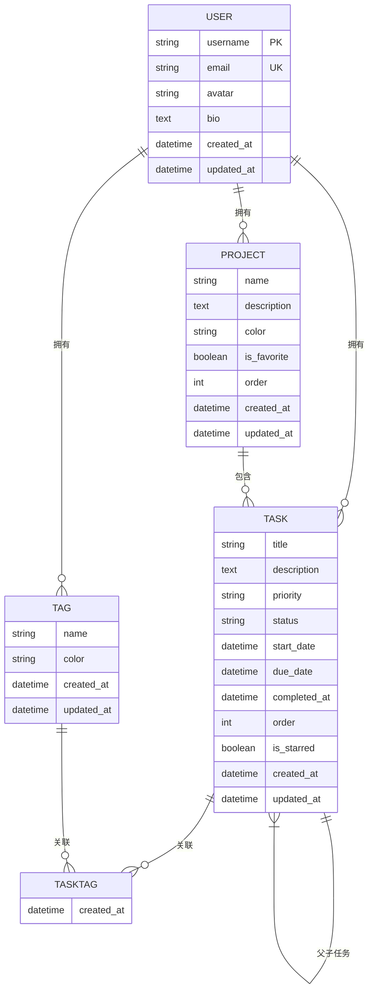

# 数据模型

<cite>
**本文档中引用的文件**  
- [User](file://backend/apps/users/models.py)
- [Task](file://backend/apps/tasks/models.py)
- [Project](file://backend/apps/projects/models.py)
- [Tag](file://backend/apps/tags/models.py)
- [TaskTag](file://backend/apps/tags/models.py)
- [TaskSerializer](file://backend/apps/tasks/serializers.py)
- [ProjectSerializer](file://backend/apps/projects/serializers.py)
- [TagSerializer](file://backend/apps/tags/serializers.py)
</cite>

## 目录
1. [用户模型](#用户模型)
2. [任务模型](#任务模型)
3. [项目模型](#项目模型)
4. [标签模型](#标签模型)
5. [模型关系图](#模型关系图)
6. [数据查询示例](#数据查询示例)
7. [数据库迁移与优化](#数据库迁移与优化)
8. [数据一致性与性能考量](#数据一致性与性能考量)

## 用户模型

`User` 模型继承自 Django 的 `AbstractUser`，扩展了用户相关的基本信息字段。该模型用于管理系统中的用户账户，支持认证和个性化设置。

### 字段定义
- **email**: 电子邮件地址，唯一约束，用于登录和通信
- **avatar**: 头像 URL，可为空
- **bio**: 个人简介，文本字段，可为空
- **created_at**: 创建时间，自动添加
- **updated_at**: 更新时间，自动更新

### 元数据配置
- 数据库表名：`users`
- 显示名称：`用户`

**Section sources**
- [User](file://backend/apps/users/models.py#L5-L22)

## 任务模型

`Task` 是系统的核心模型，用于表示用户的待办事项。它包含丰富的属性和关系，支持复杂的任务管理功能。

### 字段定义
- **title**: 任务标题，最大长度 255
- **description**: 任务描述，可为空
- **user**: 所属用户，外键关联 `User`，级联删除
- **project**: 所属项目，外键关联 `Project`，可为空，删除时设为空
- **parent**: 父任务，自关联外键，支持子任务结构
- **priority**: 优先级，枚举字段，可选值：无、低、中、高
- **status**: 状态，枚举字段，可选值：待办、进行中、已完成
- **start_date**: 开始时间，可为空
- **due_date**: 截止时间，可为空
- **completed_at**: 完成时间，可为空
- **order**: 排序字段，用于自定义排序
- **is_starred**: 是否标星，布尔值
- **created_at**: 创建时间，自动添加
- **updated_at**: 更新时间，自动更新

### 枚举选择
- **PRIORITY_CHOICES**: 定义了任务的优先级选项，便于前端展示和筛选
- **STATUS_CHOICES**: 定义了任务的状态流转，支持任务生命周期管理

### 业务逻辑
- 支持父子任务结构，通过 `parent` 字段实现递归关联
- 排序机制基于 `order` 字段和 `created_at` 时间戳
- 标星功能通过 `is_starred` 字段实现快速标记重要任务

**Section sources**
- [Task](file://backend/apps/tasks/models.py#L5-L72)

## 项目模型

`Project` 模型用于组织和分类任务，提供项目级别的管理功能。

### 字段定义
- **name**: 项目名称，最大长度 255
- **description**: 项目描述，可为空
- **color**: 项目颜色，用于前端可视化，格式为十六进制
- **user**: 所属用户，外键关联 `User`，级联删除
- **is_favorite**: 是否收藏，布尔值
- **order**: 排序字段，用于自定义排序
- **created_at**: 创建时间，自动添加
- **updated_at**: 更新时间，自动更新

### 元数据配置
- 数据库表名：`projects`
- 显示名称：`项目`
- 排序规则：按 `order` 和 `created_at` 降序排列

**Section sources**
- [Project](file://backend/apps/projects/models.py#L5-L31)

## 标签模型

`Tag` 模型用于为任务添加分类标签，支持多维度的任务组织。

### 字段定义
- **name**: 标签名称，最大长度 50
- **color**: 标签颜色，用于前端可视化
- **user**: 所属用户，外键关联 `User`，级联删除
- **created_at**: 创建时间，自动添加
- **updated_at**: 更新时间，自动更新

### 多对多关系实现
由于 Django 不支持直接的多对多字段自定义，系统使用中间模型 `TaskTag` 实现任务与标签的关联。

#### TaskTag 模型
- **task**: 外键关联 `Task`，级联删除
- **tag**: 外键关联 `Tag`，级联删除
- **created_at**: 创建时间，自动添加
- **unique_together**: 约束任务和标签的组合唯一性

**Section sources**
- [Tag](file://backend/apps/tags/models.py#L5-L26)
- [TaskTag](file://backend/apps/tags/models.py#L30-L54)

## 模型关系图



**Diagram sources**
- [User](file://backend/apps/users/models.py#L5-L22)
- [Task](file://backend/apps/tasks/models.py#L5-L72)
- [Project](file://backend/apps/projects/models.py#L5-L31)
- [Tag](file://backend/apps/tags/models.py#L5-L26)
- [TaskTag](file://backend/apps/tags/models.py#L30-L54)

## 数据查询示例

### 查询用户的所有任务
```python
user_tasks = Task.objects.filter(user=request.user)
```

### 查询项目中的所有任务
```python
project_tasks = Task.objects.filter(project=project_id)
```

### 查询带标签的任务
```python
task_with_tags = Task.objects.prefetch_related('task_tags__tag').get(id=task_id)
```

### 查询标星的高优先级任务
```python
starred_high_priority = Task.objects.filter(
    is_starred=True, 
    priority='high',
    user=request.user
).order_by('order', '-created_at')
```

**Section sources**
- [TaskSerializer](file://backend/apps/tasks/serializers.py#L5-L51)
- [ProjectSerializer](file://backend/apps/projects/serializers.py#L4-L20)
- [TagSerializer](file://backend/apps/tags/serializers.py#L4-L8)

## 数据库迁移与优化

### 迁移策略
- 使用 Django 的迁移系统管理数据库模式变更
- 初始迁移文件位于各应用的 `migrations/` 目录下
- 修改模型后需运行 `python manage.py makemigrations` 生成迁移文件
- 使用 `python manage.py migrate` 应用迁移

### 索引优化建议
- 为 `Task` 模型的 `user`、`project`、`parent`、`priority`、`status` 和 `is_starred` 字段创建索引
- 为 `Project` 模型的 `user` 和 `is_favorite` 字段创建索引
- 为 `Tag` 模型的 `user` 字段创建索引
- 考虑为 `Task` 的 `order` 字段创建复合索引以优化排序性能

**Section sources**
- [Task](file://backend/apps/tasks/models.py#L5-L72)
- [Project](file://backend/apps/projects/models.py#L5-L31)
- [Tag](file://backend/apps/tags/models.py#L5-L26)

## 数据一致性与性能考量

### 数据一致性问题
- **级联删除**: 当用户删除时，其所有任务、项目和标签将被级联删除
- **空值处理**: 项目删除时，相关任务的 `project` 字段设为空，保持任务数据完整性
- **唯一性约束**: 标签名称在用户范围内唯一，避免重复标签
- **事务处理**: 在创建和更新任务时，确保任务-标签关联的原子性

### 性能优化建议
- 使用 `select_related` 预加载外键关联数据
- 使用 `prefetch_related` 预加载多对多关联数据
- 对频繁查询的字段创建数据库索引
- 考虑使用缓存机制存储常用查询结果
- 分页处理大量任务数据，避免内存溢出

### 常见问题解决方案
- **N+1 查询问题**: 使用 `prefetch_related` 和 `select_related` 减少数据库查询次数
- **大数据量排序**: 在数据库层面进行排序，避免在 Python 中排序
- **并发更新冲突**: 使用数据库锁或乐观锁机制处理并发更新
- **内存占用过高**: 使用 `iterator()` 方法处理大量数据的迭代

**Section sources**
- [Task](file://backend/apps/tasks/models.py#L5-L72)
- [TaskSerializer](file://backend/apps/tasks/serializers.py#L5-L51)
- [TaskTag](file://backend/apps/tags/models.py#L30-L54)