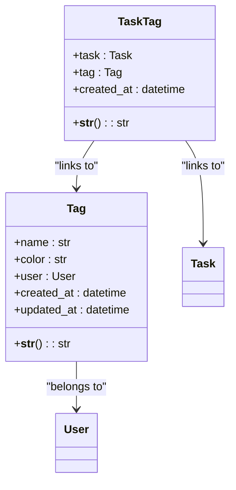
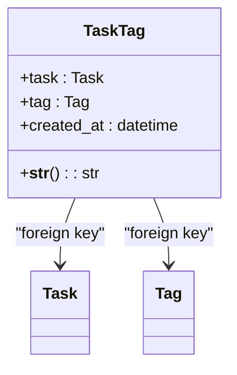
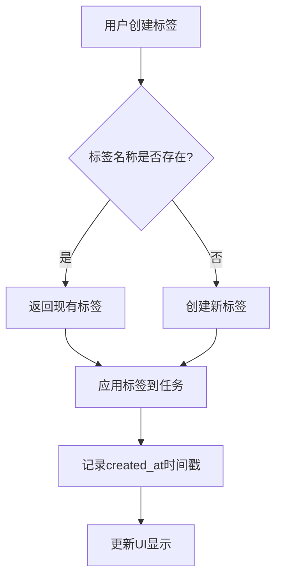

# 标签模型

<cite>
**Referenced Files in This Document**   
- [models.py](file://backend/apps/tags/models.py)
- [models.py](file://backend/apps/tasks/models.py)
- [serializers.py](file://backend/apps/tags/serializers.py)
- [serializers.py](file://backend/apps/tasks/serializers.py)
- [views.py](file://backend/apps/tags/views.py)
- [views.py](file://backend/apps/tasks/views.py)
- [0001_initial.py](file://backend/apps/tags/migrations/0001_initial.py)
- [0002_initial.py](file://backend/apps/tags/migrations/0002_initial.py)
</cite>

## 目录
1. [标签模型设计](#标签模型设计)
2. [唯一性约束实现](#唯一性约束实现)
3. [任务-标签关联模型](#任务-标签关联模型)
4. [多对多关系实现](#多对多关系实现)
5. [复杂查询示例](#复杂查询示例)
6. [使用模式与最佳实践](#使用模式与最佳实践)
7. [性能优化方案](#性能优化方案)

## 标签模型设计

标签模型（Tag）是系统中用于分类和组织任务的核心组件。该模型通过`name`和`color`字段提供语义化和视觉化的分类能力。

**name字段**：作为标签的核心标识，`name`字段被定义为最大长度50个字符的字符串，用于存储用户自定义的标签名称。该字段是用户识别和搜索标签的主要依据。

**color字段**：`color`字段存储十六进制颜色代码（如`#10B981`），为标签提供视觉区分能力。该字段默认值为`#10B981`（一种青绿色），确保新创建的标签具有统一的视觉风格。颜色选择不仅增强了界面的美观性，还支持语义化编码，例如红色表示紧急，蓝色表示工作相关。



**Diagram sources**
- [models.py](file://backend/apps/tags/models.py#L5-L26)

**Section sources**
- [models.py](file://backend/apps/tags/models.py#L5-L26)

## 唯一性约束实现

系统通过`unique_together`约束确保用户级别的标签唯一性，防止同一用户创建重复名称的标签。

在`Tag`模型的`Meta`类中，`unique_together = ['name', 'user']`定义了复合唯一约束。这意味着标签名称的唯一性是相对于用户的，不同用户可以拥有相同名称的标签，但同一用户不能创建同名标签。

该约束的实现原理基于数据库层面的唯一索引。当尝试创建新标签时，数据库会检查`name`和`user`字段组合是否已存在。如果存在匹配记录，数据库将拒绝插入操作，从而保证数据完整性。

```python
class Meta:
    db_table = 'tags'
    verbose_name = '标签'
    verbose_name_plural = verbose_name
    unique_together = ['name', 'user']
```

**Section sources**
- [models.py](file://backend/apps/tags/models.py#L20-L24)

## 任务-标签关联模型

`TaskTag`中间模型是标签系统灵活性的关键设计，它替代了Django原生的`ManyToManyField`，提供了更丰富的功能和控制能力。

**设计目的**：
1. **时间戳记录**：`created_at`字段记录标签应用到任务的时间，支持按标签应用时间排序和历史追溯。
2. **扩展性**：为未来可能的字段扩展（如权重、优先级）预留空间。
3. **细粒度控制**：允许对关联关系本身进行查询、过滤和操作。

**优势对比**：
与Django原生`ManyToManyField`相比，`TaskTag`模型提供了显著优势：
- **数据丰富性**：原生多对多关系仅存储ID关联，而`TaskTag`可以存储额外元数据。
- **查询灵活性**：支持基于关联时间的复杂查询，如"查找上周添加的所有标签"。
- **API友好性**：序列化器可以包含关联详情，提供更完整的数据视图。



**Diagram sources**
- [models.py](file://backend/apps/tags/models.py#L30-L54)

**Section sources**
- [models.py](file://backend/apps/tags/models.py#L30-L54)

## 多对多关系实现

系统通过`Task`和`Tag`模型的外键关联实现了多对多关系，这种设计既保持了数据完整性又提供了查询效率。

**关系结构**：
- `Tag`模型通过`user`外键与用户关联，确保标签的用户归属。
- `TaskTag`模型通过`task`和`tag`两个外键，分别关联到`Task`和`Tag`模型。
- `related_name='task_tags'`在两个外键上定义，允许从任务或标签实例反向查询关联记录。

**时间戳能力**：
`created_at`字段不仅记录了标签应用的时间，还支持以下功能：
- **历史分析**：追踪用户标签使用模式随时间的变化。
- **智能排序**：按最近使用标签排序，提升用户体验。
- **数据统计**：生成标签使用频率的时间序列分析。

```python
class TaskTag(models.Model):
    task = models.ForeignKey(
        'tasks.Task',
        on_delete=models.CASCADE,
        related_name='task_tags',
        verbose_name='任务'
    )
    tag = models.ForeignKey(
        Tag,
        on_delete=models.CASCADE,
        related_name='task_tags',
        verbose_name='标签'
    )
    created_at = models.DateTimeField(auto_now_add=True, verbose_name='创建时间')
```

**Section sources**
- [models.py](file://backend/apps/tags/models.py#L34-L46)

## 复杂查询示例

系统支持多种复杂查询，满足高级任务筛选需求。

**同时带有'紧急'和'工作'标签的任务查询**：
```python
from django.db.models import Q

# 方法1：使用子查询
urgent_tag = Tag.objects.get(name='紧急', user=request.user)
work_tag = Tag.objects.get(name='工作', user=request.user)

tasks = Task.objects.filter(
    user=request.user
).filter(
    task_tags__tag=urgent_tag
).filter(
    task_tags__tag=work_tag
).distinct()

# 方法2：使用聚合
from django.db.models import Count

tasks = Task.objects.filter(
    user=request.user
).annotate(
    matching_tags=Count(
        'task_tags',
        filter=Q(task_tags__tag__name__in=['紧急', '工作'])
    )
).filter(
    matching_tags=2
)
```

**其他查询模式**：
- **按标签时间范围查询**：查找特定时间段内添加的标签
- **标签组合查询**：支持AND/OR逻辑操作
- **未标记任务查询**：查找未关联任何标签的任务

**Section sources**
- [views.py](file://backend/apps/tasks/views.py#L144-L176)
- [serializers.py](file://backend/apps/tasks/serializers.py#L22-L24)

## 使用模式与最佳实践

### 标签命名策略
- **简洁明确**：使用简短、描述性的名称（如"会议"而非"需要参加的会议"）
- **一致性**：建立命名规范，如全部小写或驼峰命名
- **避免过度细分**：保持标签层级扁平，避免创建过多相似标签

### 颜色语义化建议
- **紧急程度**：红色表示紧急，黄色表示注意，绿色表示正常
- **任务类型**：蓝色表示工作，紫色表示个人，橙色表示学习
- **项目归属**：为不同项目分配特定颜色主题

### 前端交互模式
- **自动补全**：输入时显示现有标签建议
- **颜色预览**：在标签选择器中显示颜色块
- **批量操作**：支持为多个任务同时添加/移除标签



**Diagram sources**
- [views.py](file://backend/apps/tags/views.py#L16-L33)

**Section sources**
- [views.py](file://backend/apps/tags/views.py#L7-L33)

## 性能优化方案

### 数据库层面优化
- **复合索引**：为`TaskTag`表的`task_id`和`tag_id`字段创建复合索引
- **查询优化**：使用`select_related`和`prefetch_related`减少数据库查询次数
- **分页处理**：对标签列表查询实施分页，避免一次性加载过多数据

### 缓存策略
- **Redis缓存**：缓存用户标签列表，减少数据库访问
- **浏览器缓存**：前端存储标签数据，减少API调用
- **CDN加速**：静态资源通过CDN分发

### 查询优化示例
```python
# 优化前：N+1查询问题
tasks = Task.objects.all()
for task in tasks:
    tags = task.task_tags.all()  # 每次循环都查询数据库

# 优化后：使用prefetch_related
tasks = Task.objects.prefetch_related('task_tags__tag')
for task in tasks:
    tags = task.task_tags.all()  # 使用预加载的数据
```

**Section sources**
- [serializers.py](file://backend/apps/tasks/serializers.py#L33-L35)
- [views.py](file://backend/apps/tasks/views.py#L20-L28)