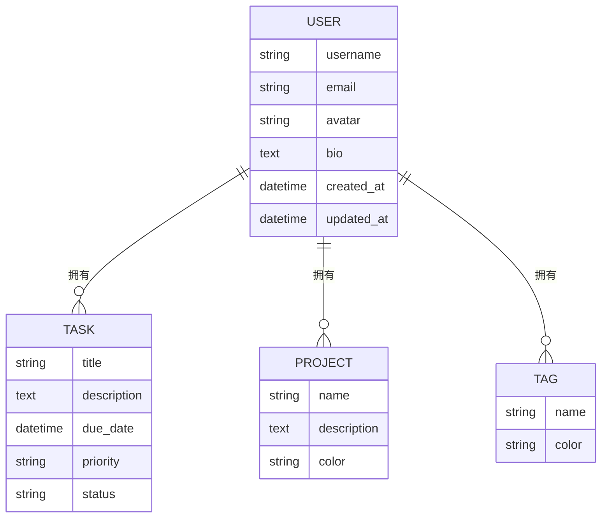
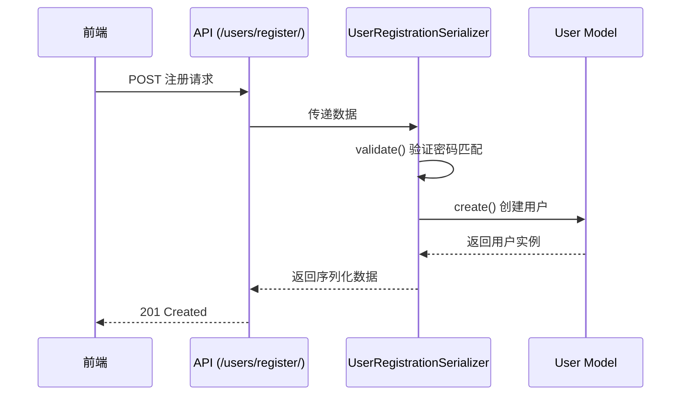

# 用户模型

<cite>
**本文档中引用的文件**  
- [models.py](file://backend/apps/users/models.py#L4-L20)
- [serializers.py](file://backend/apps/users/serializers.py#L4-L27)
- [views.py](file://backend/apps/users/views.py#L8-L30)
- [settings.py](file://backend/todo_project/settings.py#L119-L119)
- [admin.py](file://backend/apps/users/admin.py#L4-L8)
- [tasks/models.py](file://backend/apps/tasks/models.py#L24-L29)
- [projects/models.py](file://backend/apps/projects/models.py#L12-L17)
- [tags/models.py](file://backend/apps/tags/models.py#L11-L16)
- [index.ts](file://frontend/src/types/index.ts#L0-L12)
</cite>

## 目录
1. [简介](#简介)
2. [核心字段详解](#核心字段详解)
3. [继承与基类特性](#继承与基类特性)
4. [时间戳自动管理机制](#时间戳自动管理机制)
5. [Meta元数据配置](#meta元数据配置)
6. [与其他模型的外键关系](#与其他模型的外键关系)
7. [序列化与API交互](#序列化与api交互)
8. [用户创建与注册流程](#用户创建与注册流程)
9. [数据验证与约束](#数据验证与约束)
10. [常见问题与解决方案](#常见问题与解决方案)

## 简介
用户模型是本系统的核心身份实体，继承自Django内置的`AbstractUser`类，并扩展了邮箱唯一性、头像、简介等个性化字段。该模型作为任务、项目、标签等所有用户生成内容的归属主体，通过外键关联实现数据所有权控制。系统全局配置已将此模型设为默认用户模型，确保认证系统的一致性。

**Section sources**
- [models.py](file://backend/apps/users/models.py#L4-L20)
- [settings.py](file://backend/todo_project/settings.py#L119-L119)

## 核心字段详解
用户模型包含以下核心字段：

- **email**：邮箱地址字段，设置`unique=True`确保全局唯一性，用于用户登录和身份识别
- **avatar**：头像URL字段，允许为空（`blank=True, null=True`），存储用户头像图片的链接
- **bio**：个人简介字段，文本类型，支持长文本输入，用于展示用户自我描述
- **created_at**：创建时间戳，记录用户账户创建的精确时间
- **updated_at**：更新时间戳，每次用户信息修改时自动更新

这些字段在序列化器中被明确包含，前端通过API可获取完整用户信息。

**Section sources**
- [models.py](file://backend/apps/users/models.py#L9-L13)
- [serializers.py](file://backend/apps/users/serializers.py#L8-L8)

## 继承与基类特性
`User`模型继承自`django.contrib.auth.models.AbstractUser`，这意味着它继承了Django认证系统的所有核心功能，包括：

- 用户名、密码管理
- 权限系统（is_staff, is_superuser）
- 组（groups）和用户权限（user_permissions）
- 登录状态跟踪（last_login）
- 账户激活状态（is_active）

通过继承而非修改默认User模型，系统在保留Django原生认证能力的同时，实现了字段扩展的灵活性。`__str__`方法返回用户名，便于在管理后台和调试中识别用户实例。

**Section sources**
- [models.py](file://backend/apps/users/models.py#L5-L5)
- [admin.py](file://backend/apps/users/admin.py#L4-L8)

## 时间戳自动管理机制
`created_at`和`updated_at`字段采用Django的自动时间戳机制：

- `auto_now_add=True`：仅在对象首次创建时自动设置为当前时间，之后不再更改
- `auto_now=True`：每次调用`save()`方法时自动更新为当前时间

这种机制确保了数据创建和修改时间的准确性和一致性，无需在业务逻辑中手动维护时间戳，减少了人为错误的风险。

**Section sources**
- [models.py](file://backend/apps/users/models.py#L12-L13)

## Meta元数据配置
`Meta`类定义了模型的元数据配置：

- **db_table**：指定数据库表名为`users`，避免Django默认的`apps_users_user`命名
- **verbose_name**：设置模型的可读名称为“用户”，用于管理后台和API文档
- **verbose_name_plural**：复数形式与单数相同，保持中文命名一致性

这些配置提升了数据库的可读性和管理后台的用户体验。

**Section sources**
- [models.py](file://backend/apps/users/models.py#L15-L18)

## 与其他模型的外键关系
用户模型作为核心实体，被多个业务模型通过外键引用：



**Diagram sources**
- [models.py](file://backend/apps/users/models.py#L4-L20)
- [tasks/models.py](file://backend/apps/tasks/models.py#L24-L29)
- [projects/models.py](file://backend/apps/projects/models.py#L12-L17)
- [tags/models.py](file://backend/apps/tags/models.py#L11-L16)

### 外键关系示例
- **任务模型**：`user = models.ForeignKey(settings.AUTH_USER_MODEL, related_name='tasks')`
- **项目模型**：`user = models.ForeignKey(settings.AUTH_USER_MODEL, related_name='projects')`
- **标签模型**：`user = models.ForeignKey(settings.AUTH_USER_MODEL, related_name='tags')`

通过`related_name`配置，可进行反向查询：
```python
# 获取用户的所有任务
user.tasks.all()

# 获取用户的所有项目
user.projects.all()

# 获取用户的所有标签
user.tags.all()
```

**Section sources**
- [tasks/models.py](file://backend/apps/tasks/models.py#L24-L29)
- [projects/models.py](file://backend/apps/projects/models.py#L12-L17)
- [tags/models.py](file://backend/apps/tags/models.py#L11-L16)

## 序列化与API交互
用户模型通过DRF序列化器暴露API接口：

- **UserSerializer**：用于展示用户信息，包含所有核心字段，其中`id`、`created_at`、`updated_at`为只读
- **UserRegistrationSerializer**：用于用户注册，包含密码确认逻辑，确保密码一致性

API端点通过`UserViewSet`提供RESTful操作，包括获取当前用户信息（`/me/`）和用户注册。



**Diagram sources**
- [serializers.py](file://backend/apps/users/serializers.py#L11-L27)
- [views.py](file://backend/apps/users/views.py#L19-L25)

**Section sources**
- [serializers.py](file://backend/apps/users/serializers.py#L4-L27)
- [views.py](file://backend/apps/users/views.py#L8-L30)

## 用户创建与注册流程
用户创建流程通过`UserRegistrationSerializer.create()`方法实现：

1. 接收注册数据（用户名、邮箱、密码、密码确认）
2. 验证密码一致性
3. 调用`User.objects.create_user()`创建用户，自动处理密码哈希
4. 返回创建的用户实例

前端通过`/users/register/`端点提交注册请求，后端验证通过后返回用户信息和JWT令牌。

**Section sources**
- [serializers.py](file://backend/apps/users/serializers.py#L25-L28)
- [views.py](file://backend/apps/users/views.py#L19-L25)

## 数据验证与约束
系统实施了多层次的数据验证：

- **唯一性约束**：邮箱字段的`unique=True`确保无重复注册
- **密码验证**：注册序列化器要求密码至少8位，并验证两次输入一致
- **字段级验证**：Django自动验证EmailField格式
- **应用级验证**：`validate()`方法提供自定义错误信息

这些约束共同保障了用户数据的完整性和安全性。

**Section sources**
- [models.py](file://backend/apps/users/models.py#L9)
- [serializers.py](file://backend/apps/users/serializers.py#L20-L23)

## 常见问题与解决方案
### 问题1：邮箱重复注册
**现象**：注册时提示邮箱已存在  
**解决方案**：前端在提交前调用邮箱唯一性检查API，或优化错误提示信息

### 问题2：时间戳未更新
**现象**：`updated_at`字段未随数据修改而变化  
**原因**：直接使用`update()`方法绕过模型的`save()`  
**解决方案**：使用模型实例的`save()`方法，或在`update()`中显式设置`updated_at`

### 问题3：反向查询性能问题
**现象**：`user.tasks.all()`在任务量大时响应慢  
**解决方案**：使用`select_related()`或`prefetch_related()`进行查询优化

### 问题4：头像URL安全性
**现象**：外部链接可能失效或存在安全风险  
**解决方案**：增加URL有效性验证，或考虑实现文件上传功能

**Section sources**
- [models.py](file://backend/apps/users/models.py#L4-L20)
- [serializers.py](file://backend/apps/users/serializers.py#L20-L23)
- [tasks/models.py](file://backend/apps/tasks/models.py#L24-L29)