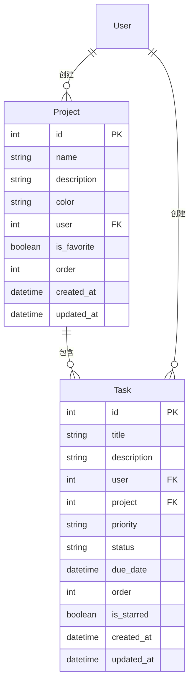
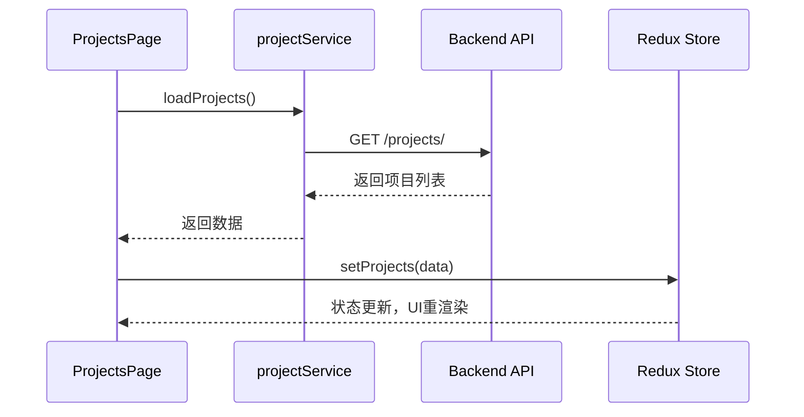

# 项目模型

<cite>
**本文档引用文件**  
- [models.py](file://backend/apps/projects/models.py#L4-L30)
- [serializers.py](file://backend/apps/projects/serializers.py#L4-L29)
- [views.py](file://backend/apps/projects/views.py#L7-L36)
- [project.ts](file://frontend/src/services/project.ts#L12-L42)
- [projectsSlice.ts](file://frontend/src/store/slices/projectsSlice.ts#L3-L65)
- [ProjectsPage.tsx](file://frontend/src/pages/ProjectsPage.tsx#L9-L263)
- [types/index.ts](file://frontend/src/types/index.ts#L67-L83)
- [tasks/models.py](file://backend/apps/tasks/models.py#L30-L37)
</cite>

## 目录
1. [简介](#简介)
2. [字段设计与规范](#字段设计与规范)
3. [核心功能实现](#核心功能实现)
4. [数据关联与查询](#数据关联与查询)
5. [前端交互与状态管理](#前端交互与状态管理)
6. [最佳实践建议](#最佳实践建议)

## 简介
项目模型（Project）是任务管理系统中的核心容器，用于对任务进行逻辑分组和分类管理。每个项目由单个用户创建和拥有，支持自定义名称、描述、颜色标识、收藏状态和排序顺序。项目作为任务的归属容器，实现了任务的结构化组织，提升了用户的任务管理效率。本模型通过与任务模型的外键关联，构建了清晰的层级结构，是整个系统任务组织的基础。

## 字段设计与规范

### name 与 description 字段
`name` 字段为必填项，最大长度为255个字符，用于标识项目的名称，是用户识别项目的主要依据。`description` 字段为可选的文本字段，允许为空，用于提供项目的详细说明或背景信息。这两个字段共同构成了项目的基本信息，为用户提供了清晰的语义标识。

### color 字段与视觉分类
`color` 字段是一个长度为7的字符串字段（如 `#3B82F6`），默认值为蓝色。该字段在前端UI中被用于为项目提供视觉上的颜色标识。在项目列表和任务卡片中，颜色以小圆点或标签背景的形式展示，帮助用户通过颜色快速区分不同的项目类别，实现视觉上的快速分类和识别，提升界面的可读性和用户体验。

**Section sources**
- [models.py](file://backend/apps/projects/models.py#L9-L11)
- [types/index.ts](file://frontend/src/types/index.ts#L70-L72)

## 核心功能实现

### 用户归属与权限控制
`user` 字段是一个外键，关联到系统的用户模型（`settings.AUTH_USER_MODEL`），并设置了 `on_delete=models.CASCADE` 纖性删除。这建立了项目与用户的归属关系。在视图层（`ProjectViewSet`）的 `get_queryset` 方法中，通过 `Project.objects.filter(user=self.request.user)` 限制了每个用户只能访问和操作自己创建的项目，从而实现了基于用户身份的权限控制，确保了数据隔离和安全性。

### is_favorite 收藏功能
`is_favorite` 是一个布尔字段，默认为 `False`。该功能允许用户将重要的项目标记为收藏，以便在前端界面中快速访问。前端通过 `projectService.toggleFavorite(id)` 调用后端的 `toggle_favorite` 自定义动作来切换收藏状态。此功能在 `ProjectsPage` 中通过星形图标实现，收藏的项目可以被优先展示或通过筛选器快速定位，极大地提升了高频使用项目的访问效率。

### order 排序逻辑
`order` 字段是一个整数类型，用于支持项目的自定义排序。其核心在于模型元类（`Meta`）中的 `ordering = ['order', '-created_at']` 设置。这表示数据默认首先按 `order` 字段升序排列，其次按 `created_at` 降序排列（最新创建的在前）。当用户在前端拖拽调整项目顺序时，会更新 `order` 值，从而改变其在列表中的位置。这种设计将自定义排序与默认时间排序相结合，既满足了用户手动排序的需求，又保证了未排序项目能按时间顺序合理展示。

**Section sources**
- [models.py](file://backend/apps/projects/models.py#L12-L19)
- [views.py](file://backend/apps/projects/views.py#L14-L21)
- [project.ts](file://frontend/src/services/project.ts#L37-L40)

## 数据关联与查询

### 项目与任务的关联
项目模型与任务模型（Task）之间存在一对多的关联关系。在任务模型中，`project = models.ForeignKey('projects.Project', on_delete=models.SET_NULL, null=True, blank=True)` 建立了从任务到项目的外键。这意味着一个项目可以包含多个任务，而一个任务只能属于一个项目（或不属于任何项目）。`on_delete=models.SET_NULL` 确保了当项目被删除时，其下的任务不会被级联删除，而是将 `project` 字段置空，保护了任务数据。

### 关联查询示例
要检索特定项目下的所有任务，可以使用Django ORM的双下划线查询语法：
```python
# 获取ID为1的项目下的所有任务
tasks = Task.objects.filter(project__id=1)
# 或者，如果已有项目对象
project = Project.objects.get(id=1)
tasks = project.tasks.all() # 利用related_name='tasks'
```
在前端，`ProjectSerializer` 通过 `tasks_count = serializers.SerializerMethodField()` 字段，利用 `obj.tasks.count()` 方法动态计算并返回每个项目关联的任务总数，为用户提供项目概览信息。



**Diagram sources**
- [models.py](file://backend/apps/projects/models.py#L4-L30)
- [tasks/models.py](file://backend/apps/tasks/models.py#L5-L73)

**Section sources**
- [tasks/models.py](file://backend/apps/tasks/models.py#L30-L37)
- [serializers.py](file://backend/apps/projects/serializers.py#L6-L17)

## 前端交互与状态管理

### 服务层与API调用
前端通过 `projectService` 服务封装了对项目API的所有调用，包括 `getProjects`, `createProject`, `updateProject`, `deleteProject` 和 `toggleFavorite`。这些方法使用 `apiClient` 与后端 `/projects/` RESTful端点进行通信，实现了数据的获取、创建、更新、删除和收藏状态切换。

### 状态管理
项目相关的全局状态由 `projectsSlice` 管理。该Redux slice定义了 `projects` 数组、`selectedProject` 等状态，并提供了 `setProjects`, `addProject`, `updateProject`, `deleteProject` 等reducer方法来同步更新状态。当 `ProjectsPage` 组件加载时，会调用 `loadProjects` 函数获取数据，并通过 `setProjects` 将数据存入Redux store，确保了应用状态的一致性。



**Diagram sources**
- [project.ts](file://frontend/src/services/project.ts#L12-L16)
- [projectsSlice.ts](file://frontend/src/store/slices/projectsSlice.ts#L23-L26)
- [ProjectsPage.tsx](file://frontend/src/pages/ProjectsPage.tsx#L44-L57)

**Section sources**
- [project.ts](file://frontend/src/services/project.ts#L12-L42)
- [projectsSlice.ts](file://frontend/src/store/slices/projectsSlice.ts#L20-L50)
- [ProjectsPage.tsx](file://frontend/src/pages/ProjectsPage.tsx#L9-L263)

## 最佳实践建议

### 命名约定
建议项目名称简洁明了，能准确反映其包含任务的主题，例如“网站开发”、“个人学习”或“家庭事务”。避免使用模糊或过长的名称，以确保在列表和下拉菜单中能清晰显示。

### 颜色使用规范
应建立一致的颜色使用规范。例如，可以约定蓝色代表工作，绿色代表个人，红色代表紧急，黄色代表学习等。保持颜色含义的一致性，有助于用户形成条件反射，实现真正的快速视觉识别。

### 性能考量
由于 `tasks_count` 是通过 `SerializerMethodField` 动态计算的，对于包含大量任务的项目，频繁的 `count()` 查询可能影响性能。在项目数量庞大时，可考虑在项目模型中增加一个 `tasks_count` 整数字段，并在任务创建或删除时通过信号（Signal）或重写 `save` 方法来维护其值，以换取查询性能的提升。

**Section sources**
- [serializers.py](file://backend/apps/projects/serializers.py#L6-L17)
- [models.py](file://backend/apps/projects/models.py#L11)