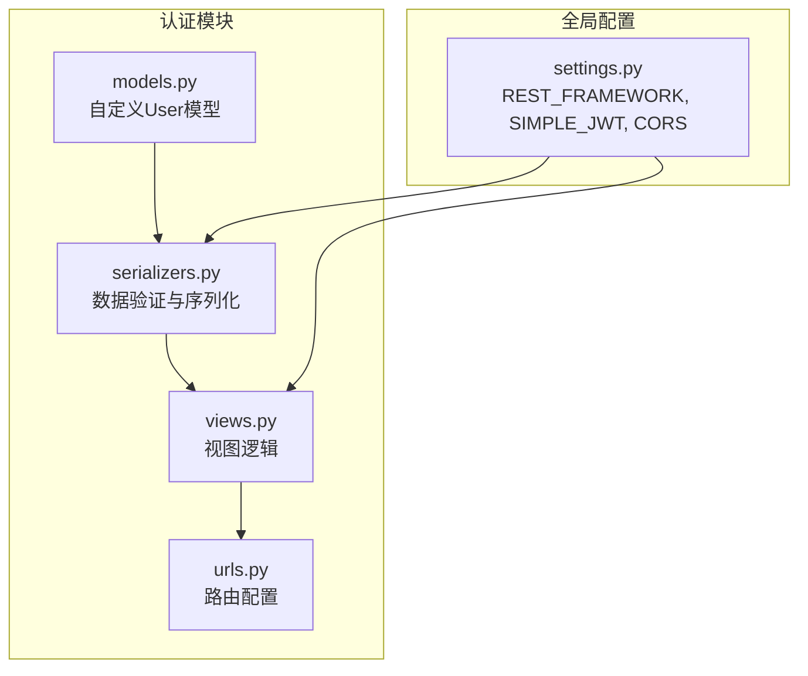
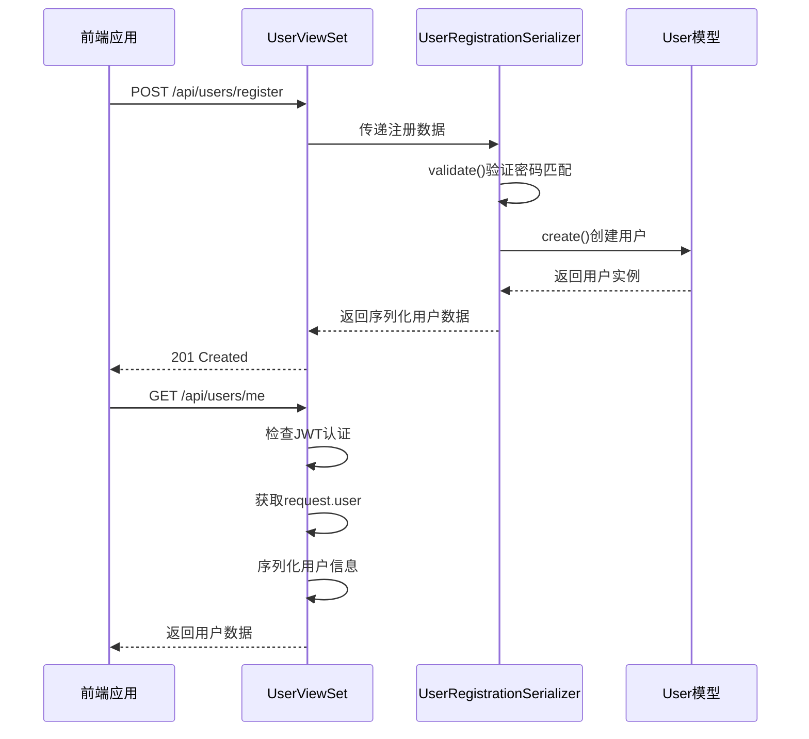
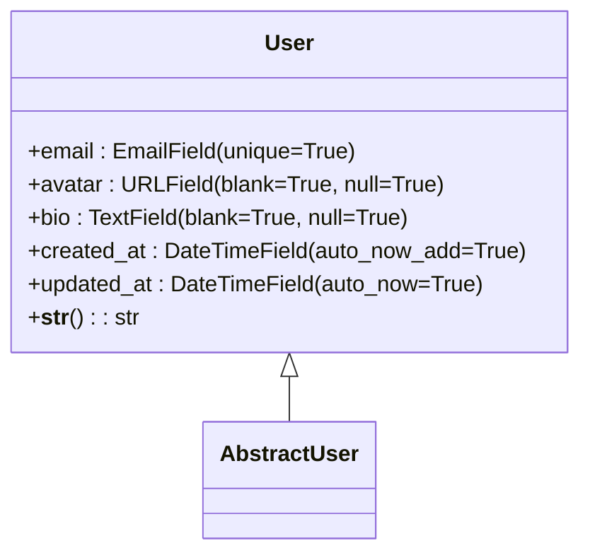
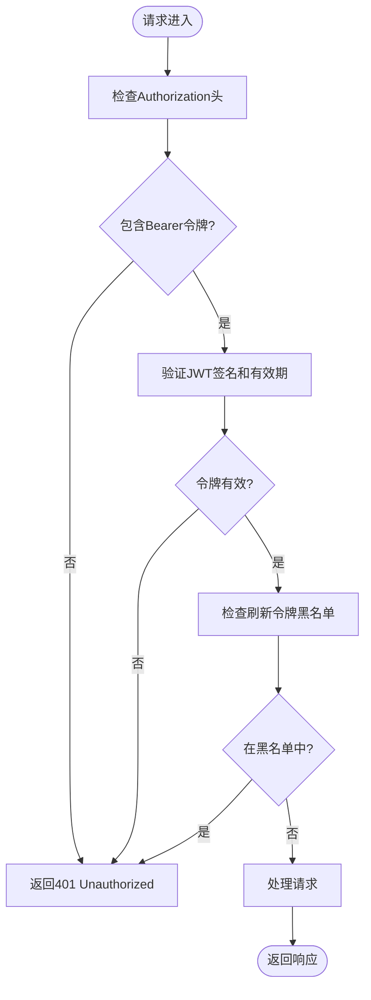
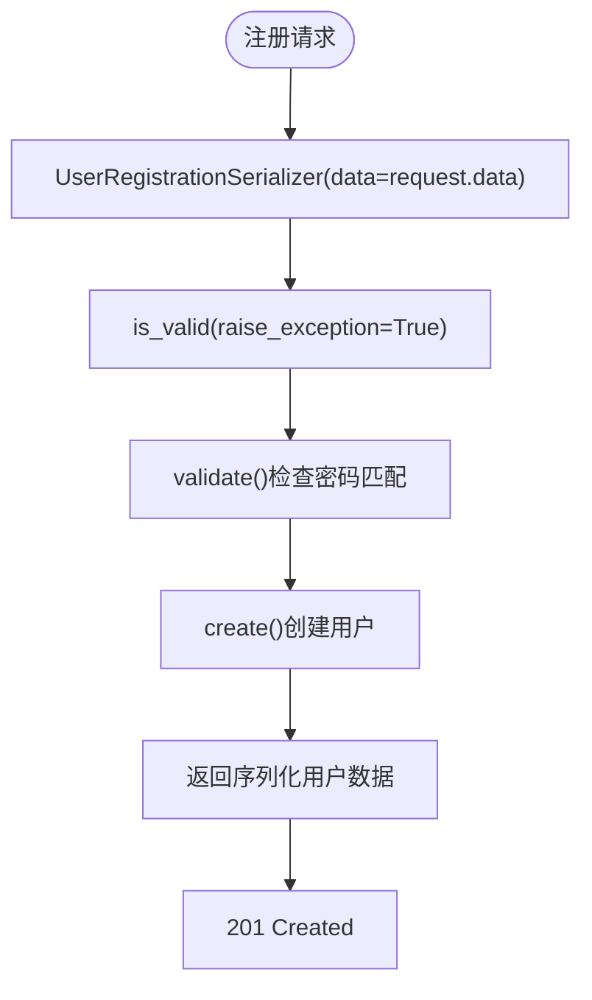
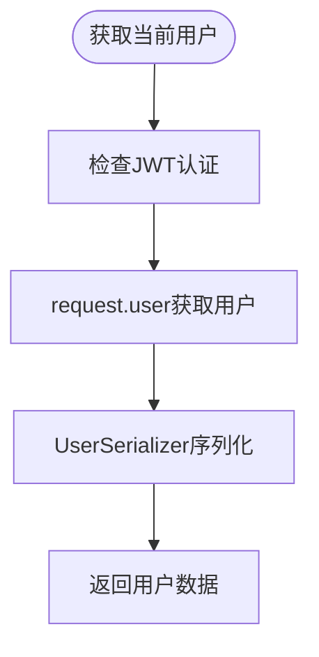
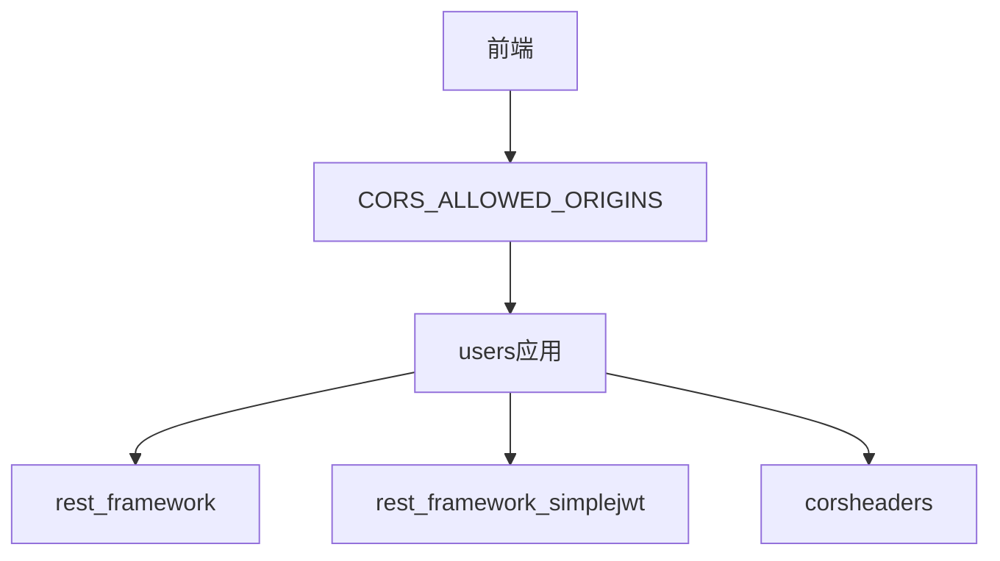

# 认证流程

<cite>
**本文档引用的文件**  
- [settings.py](file://backend/todo_project/settings.py)
- [models.py](file://backend/apps/users/models.py)
- [serializers.py](file://backend/apps/users/serializers.py)
- [views.py](file://backend/apps/users/views.py)
- [urls.py](file://backend/apps/users/urls.py)
</cite>

## 目录
1. [简介](#简介)
2. [项目结构](#项目结构)
3. [核心组件](#核心组件)
4. [架构概述](#架构概述)
5. [详细组件分析](#详细组件分析)
6. [依赖分析](#依赖分析)
7. [性能考虑](#性能考虑)
8. [故障排除指南](#故障排除指南)
9. [结论](#结论)

## 简介
本文档详细描述了基于JWT的用户认证系统实现，涵盖Django REST框架中的认证配置、自定义用户模型、核心认证端点（注册、登录、刷新）的工作流程，以及跨域资源共享（CORS）配置。文档旨在为开发人员提供清晰的认证机制理解，支持前后端安全集成。

## 项目结构
用户认证功能位于`backend/apps/users/`目录下，包含模型、序列化器、视图和URL路由。核心配置在`backend/todo_project/settings.py`中定义，包括REST框架默认认证类、JWT令牌生命周期和CORS策略。

**图示来源**  
- [models.py](file://backend/apps/users/models.py#L4-L20)
- [serializers.py](file://backend/apps/users/serializers.py#L11-L27)
- [views.py](file://backend/apps/users/views.py#L8-L30)
- [settings.py](file://backend/todo_project/settings.py#L122-L147)

**本节来源**  
- [settings.py](file://backend/todo_project/settings.py#L1-L164)
- [models.py](file://backend/apps/users/models.py#L1-L22)

## 核心组件
本系统的核心认证组件包括：基于`AbstractUser`的自定义用户模型、JWT认证配置、用户注册与信息获取视图、以及支持前端开发的CORS策略。这些组件协同工作，确保API访问的安全性和灵活性。

**本节来源**  
- [models.py](file://backend/apps/users/models.py#L4-L20)
- [settings.py](file://backend/todo_project/settings.py#L119-L147)
- [views.py](file://backend/apps/users/views.py#L8-L30)

## 架构概述
系统采用Django REST Framework（DRF）结合`djangorestframework-simplejwt`实现基于JWT的无状态认证。所有API端点默认要求身份验证，通过`Authorization: Bearer <token>`头传递访问令牌。用户注册开放访问，登录后获取访问和刷新令牌，支持令牌刷新机制。

**图示来源**  
- [views.py](file://backend/apps/users/views.py#L19-L25)
- [serializers.py](file://backend/apps/users/serializers.py#L20-L28)
- [models.py](file://backend/apps/users/models.py#L5-L20)

## 详细组件分析

### 用户模型分析
自定义`User`模型继承自`AbstractUser`，扩展了邮箱唯一性、头像URL、个人简介及时间戳字段。通过`AUTH_USER_MODEL`设置在Django中注册，替代默认用户模型。

**图示来源**  
- [models.py](file://backend/apps/users/models.py#L4-L20)

**本节来源**  
- [models.py](file://backend/apps/users/models.py#L4-L20)
- [settings.py](file://backend/todo_project/settings.py#L119-L119)

### 认证配置分析
`REST_FRAMEWORK`配置强制所有API访问需身份验证，并指定`JWTAuthentication`为默认认证类。`SIMPLE_JWT`配置定义了访问令牌1天、刷新令牌7天的有效期，并启用刷新令牌轮换和黑名单机制。

**图示来源**  
- [settings.py](file://backend/todo_project/settings.py#L123-L137)
- [settings.py](file://backend/todo_project/settings.py#L143-L148)

**本节来源**  
- [settings.py](file://backend/todo_project/settings.py#L122-L148)

### 注册与信息获取流程
`UserViewSet`提供`register`和`me`两个核心端点。注册端点使用`UserRegistrationSerializer`验证数据，确保密码匹配并创建用户。`me`端点返回当前认证用户的信息，需有效JWT令牌。

#### 注册流程

**图示来源**  
- [serializers.py](file://backend/apps/users/serializers.py#L11-L27)
- [views.py](file://backend/apps/users/views.py#L19-L25)

#### 信息获取流程

**图示来源**  
- [views.py](file://backend/apps/users/views.py#L27-L31)
- [serializers.py](file://backend/apps/users/serializers.py#L5-L9)

**本节来源**  
- [views.py](file://backend/apps/users/views.py#L8-L30)
- [serializers.py](file://backend/apps/users/serializers.py#L4-L27)

## 依赖分析
认证模块依赖`djangorestframework`、`djangorestframework-simplejwt`和`corsheaders`等第三方库。`users`应用被注册在`INSTALLED_APPS`中，其模型通过`AUTH_USER_MODEL`设置被全局引用。

**图示来源**  
- [settings.py](file://backend/todo_project/settings.py#L38-L48)
- [settings.py](file://backend/todo_project/settings.py#L150-L154)

**本节来源**  
- [settings.py](file://backend/todo_project/settings.py#L29-L49)
- [settings.py](file://backend/todo_project/settings.py#L150-L156)

## 性能考虑
JWT认证为无状态，减少服务器会话存储开销。访问令牌1天有效期平衡安全与用户体验，刷新令牌7天支持长期会话。CORS配置限制可信源，防止跨站请求伪造。

## 故障排除指南
- **401 Unauthorized**: 检查请求头是否包含`Authorization: Bearer <token>`，令牌是否过期。
- **密码不匹配错误**: 确保注册请求中`password`和`password_confirm`字段值一致。
- **CORS错误**: 确认前端域名在`CORS_ALLOWED_ORIGINS`中配置。
- **用户创建失败**: 检查邮箱是否已存在（唯一约束）。

**本节来源**  
- [serializers.py](file://backend/apps/users/serializers.py#L21-L22)
- [settings.py](file://backend/todo_project/settings.py#L151-L154)

## 结论
本认证系统通过Django REST Framework和JWT实现了安全、可扩展的用户认证机制。自定义用户模型、严格的配置和清晰的端点设计确保了系统的健壮性，CORS支持为前后端分离架构提供了便利。开发者应遵循最佳实践，妥善管理令牌生命周期和安全性。