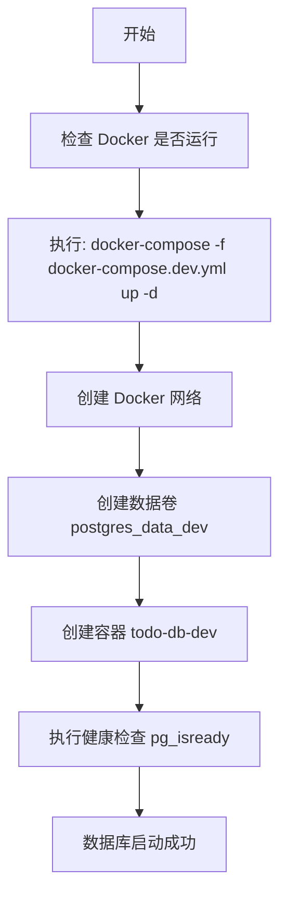
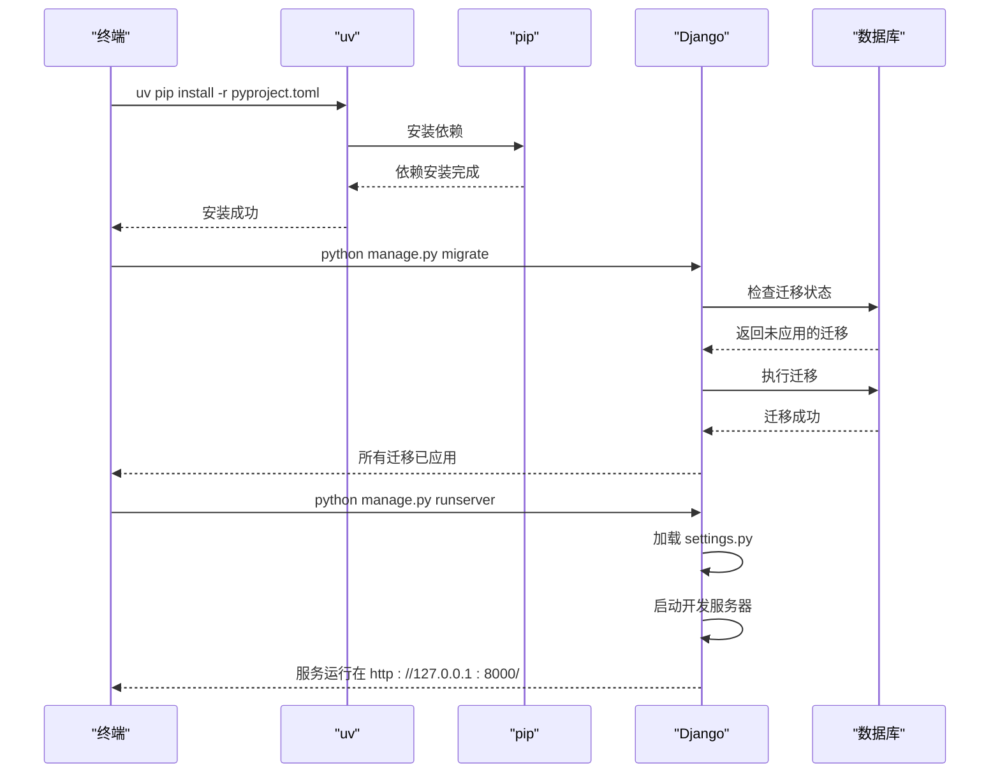

# 快速入门

<cite>
**本文档中引用的文件**  
- [README.md](file://README.md)
- [PROJECT_OVERVIEW.md](file://PROJECT_OVERVIEW.md)
- [IMPLEMENTATION_SUMMARY.md](file://IMPLEMENTATION_SUMMARY.md)
- [docker-compose.dev.yml](file://docker-compose.dev.yml)
- [docker-compose.yml](file://docker-compose.yml)
- [backend/pyproject.toml](file://backend/pyproject.toml)
- [backend/.env.example](file://backend/.env.example)
- [frontend/package.json](file://frontend/package.json)
- [frontend/.env.example](file://frontend/.env.example)
- [Makefile](file://Makefile)
- [dev-setup.sh](file://dev-setup.sh)
- [backend/manage.py](file://backend/manage.py)
- [frontend/vite.config.ts](file://frontend/vite.config.ts)
</cite>

## 目录
1. [简介](#简介)
2. [前置要求](#前置要求)
3. [开发环境搭建](#开发环境搭建)
4. [启动开发数据库](#启动开发数据库)
5. [配置并运行后端](#配置并运行后端)
6. [创建超级用户](#创建超级用户)
7. [启动前端开发服务器](#启动前端开发服务器)
8. [开发与生产环境差异](#开发与生产环境差异)
9. [常见问题及解决方案](#常见问题及解决方案)
10. [附录：快捷命令](#附录：快捷命令)

## 简介

本指南旨在帮助开发者从零开始搭建项目开发环境，并成功运行后端与前端服务。项目为一个功能完整的任务管理系统，采用现代化技术栈，支持用户认证、任务管理、项目分组和标签分类等功能。

通过本指南，您将学习如何：
- 安装必要的开发工具
- 使用 Docker 启动开发数据库
- 配置后端环境变量并运行迁移
- 创建管理员账户
- 启动前端开发服务器
- 解决常见连接与跨域问题

**Section sources**
- [README.md](file://README.md#L1-L321)
- [PROJECT_OVERVIEW.md](file://PROJECT_OVERVIEW.md#L1-L216)

## 前置要求

在开始之前，请确保您的开发环境中已安装以下工具：

### 必需工具
- **Python 3.11+**：用于运行 Django 后端
- **Node.js 20+**：用于前端构建与开发服务器
- **pnpm**：前端包管理器
- **uv**：Python 项目依赖管理工具
- **Docker** 和 **Docker Compose**：用于容器化数据库服务

### 推荐安装方式
```bash
# 安装 uv（Python 包管理器）
pip install uv

# 安装 pnpm（Node.js 包管理器）
npm install -g pnpm
```

### 验证安装
```bash
python --version    # 应输出 Python 3.11 或更高
node --version      # 应输出 v20.x
pnpm --version      # 应输出版本号
uv --version        # 应输出版本号
docker --version    # 应输出 Docker 版本
docker-compose --version  # 应输出 Compose 版本
```

**Section sources**
- [README.md](file://README.md#L70-L82)
- [backend/pyproject.toml](file://backend/pyproject.toml#L5)

## 开发环境搭建

### 1. 克隆项目
```bash
git clone https://github.com/your-repo/ChewyQoderProject.git
cd ChewyQoderProject
```

### 2. 查看项目结构
项目采用前后端分离架构：
```
ChewyQoderProject/
├── backend/          # Django 后端
├── frontend/         # React 前端
├── docker-compose.dev.yml   # 开发环境数据库配置
└── docker-compose.yml       # 生产环境完整配置
```

### 3. 复制环境变量文件
```bash
# 后端环境变量
cp backend/.env.example backend/.env

# 前端环境变量
cp frontend/.env.example frontend/.env
```

**Section sources**
- [README.md](file://README.md#L96-L97)
- [frontend/.env.example](file://frontend/.env.example#L1-L2)
- [backend/.env.example](file://backend/.env.example#L1-L6)

## 启动开发数据库

项目提供 `docker-compose.dev.yml` 文件用于启动 PostgreSQL 数据库。

### 启动数据库服务
```bash
docker-compose -f docker-compose.dev.yml up -d
```

### 预期输出
```bash
Creating network "chewyqoderproject_default" with the default driver
Creating volume "chewyqoderproject_postgres_data_dev" with default driver
Creating todo-db-dev ... done
```

### 验证数据库状态
```bash
docker-compose -f docker-compose.dev.yml ps
```

输出应显示 `todo-db-dev` 状态为 `Up`。

### 数据库配置详情
- **主机**: localhost
- **端口**: 5432
- **数据库名**: todo_db
- **用户名**: todo_user
- **密码**: todo_password

**Diagram sources**
- [docker-compose.dev.yml](file://docker-compose.dev.yml#L1-L23)



**Section sources**
- [docker-compose.dev.yml](file://docker-compose.dev.yml#L1-L23)
- [README.md](file://README.md#L85-L89)

## 配置并运行后端

### 1. 安装后端依赖
```bash
cd backend
uv pip install -r pyproject.toml
```

### 2. 运行数据库迁移
```bash
python manage.py migrate
```

预期输出：
```
Operations to perform:
  Apply all migrations: admin, auth, contenttypes, sessions, tasks, projects, tags, users
Running migrations:
  Applying contenttypes.0001_initial... OK
  Applying auth.0001_initial... OK
  ...
  Applying tasks.0003_task_start_date... OK
```

### 3. 启动后端开发服务器
```bash
python manage.py runserver
```

预期输出：
```
Django version 5.x, using settings 'todo_project.settings'
Starting development server at http://127.0.0.1:8000/
Quit the server with CONTROL-C.
```

此时后端 API 已在 `http://localhost:8000` 上运行。

### 环境变量说明
`backend/.env` 文件中的关键配置：
- `DEBUG=True`：启用调试模式
- `DATABASE_URL=sqlite:///db.sqlite3`：开发环境使用 SQLite
- `CORS_ALLOWED_ORIGINS=http://localhost:5173`：允许前端访问

**Diagram sources**
- [backend/manage.py](file://backend/manage.py#L1-L23)
- [backend/pyproject.toml](file://backend/pyproject.toml#L6-L16)



**Section sources**
- [README.md](file://README.md#L102-L112)
- [backend/pyproject.toml](file://backend/pyproject.toml#L6-L16)
- [backend/.env.example](file://backend/.env.example#L4)

## 创建超级用户

为访问 Django Admin 界面，需创建超级用户。

### 执行命令
```bash
python manage.py createsuperuser
```

### 交互式输入示例
```
Username (leave blank to use 'user'): admin
Email address: admin@example.com
Password: 
Password (again): 
Superuser created successfully.
```

### 访问 Admin 界面
启动服务器后，访问：
```
http://localhost:8000/admin/
```

使用上述创建的用户名和密码登录，可管理用户、任务、项目等数据。

**Section sources**
- [README.md](file://README.md#L108-L109)
- [backend/manage.py](file://backend/manage.py#L1-L23)

## 启动前端开发服务器

### 1. 安装前端依赖
```bash
cd frontend
pnpm install
```

### 2. 启动开发服务器
```bash
pnpm dev
```

### 预期输出
```
vite v5.0.8 dev server running at:

  > Local: http://localhost:5173/
  > Network: use `--host` to expose

ready in 123ms.
```

### 前端代理配置
`vite.config.ts` 中配置了请求代理，将 `/api` 请求转发至后端：

```ts
server: {
  proxy: {
    '/api': {
      target: 'http://localhost:8000',
      changeOrigin: true,
    },
  },
}
```

这解决了开发时的跨域问题。

**Diagram sources**
- [frontend/vite.config.ts](file://frontend/vite.config.ts#L1-L23)
- [frontend/package.json](file://frontend/package.json#L7-L11)


**Section sources**
- [README.md](file://README.md#L126-L133)
- [frontend/vite.config.ts](file://frontend/vite.config.ts#L15-L19)
- [frontend/package.json](file://frontend/package.json#L7)

## 开发与生产环境差异

| 配置项 | 开发环境 | 生产环境 |
|-------|--------|--------|
| **数据库** | SQLite (文件) | PostgreSQL (Docker) |
| **后端服务器** | Django runserver | Gunicorn + Nginx |
| **前端服务** | Vite dev server | Nginx 静态服务 |
| **DEBUG 模式** | True | False |
| **CORS 允许源** | http://localhost:5173 | http://localhost |
| **部署方式** | 本地运行 | Docker Compose |

### 数据库选择说明
- **开发环境**：使用 SQLite 简化配置，无需额外服务
- **生产环境**：使用 PostgreSQL 提供更好的并发与数据完整性

可通过修改 `backend/.env` 中的 `DATABASE_URL` 切换数据库：
```env
# 开发使用 SQLite
DATABASE_URL=sqlite:///db.sqlite3

# 生产使用 PostgreSQL
DATABASE_URL=postgres://todo_user:todo_password@db:5432/todo_db
```

**Section sources**
- [README.md](file://README.md#L193-L194)
- [docker-compose.yml](file://docker-compose.yml#L27-L31)
- [PROJECT_OVERVIEW.md](file://PROJECT_OVERVIEW.md#L211)

## 常见问题及解决方案

### 1. 数据库连接失败

**症状**：
```
django.db.utils.OperationalError: could not connect to server: Connection refused
```

**解决方案**：
1. 确保 Docker 服务正在运行
2. 启动数据库容器：
   ```bash
   docker-compose -f docker-compose.dev.yml up -d
   ```
3. 检查容器状态：
   ```bash
   docker-compose -f docker-compose.dev.yml ps
   ```

### 2. CORS 错误（跨域）

**症状**：
浏览器控制台出现：
```
Access to fetch at 'http://localhost:8000/api/tasks/' from origin 'http://localhost:5173' has been blocked by CORS policy
```

**解决方案**：
1. 检查 `backend/.env` 文件：
   ```env
   CORS_ALLOWED_ORIGINS=http://localhost:5173,http://127.0.0.1:5173
   ```
2. 重启 Django 服务器使配置生效

### 3. 依赖安装失败

**症状**：
`uv pip install` 报错

**解决方案**：
1. 确保 uv 已安装：
   ```bash
   pip install uv
   ```
2. 尝试更新 uv：
   ```bash
   pip install --upgrade uv
   ```

### 4. 前端无法访问 API

**症状**：
API 请求返回 404 或连接拒绝

**解决方案**：
1. 确认后端服务器已启动
2. 检查 `vite.config.ts` 代理配置
3. 确认后端 `ALLOWED_HOSTS` 包含 `localhost`

**Section sources**
- [README.md](file://README.md#L298-L308)
- [backend/.env.example](file://backend/.env.example#L5)
- [frontend/vite.config.ts](file://frontend/vite.config.ts#L15-L19)

## 附录：快捷命令

项目提供 `Makefile` 和 `dev-setup.sh` 脚本简化操作。

### 使用 Makefile
```bash
# 启动开发数据库
make dev-up

# 停止开发数据库
make dev-down

# 启动后端开发服务器
make backend-dev

# 启动前端开发服务器
make frontend-dev

# 运行数据库迁移
make migrate

# 创建超级用户
make superuser

# 一键启动生产环境
make prod-up
```

### 使用快速启动脚本
```bash
# 运行开发环境启动脚本
./dev-setup.sh
```

该脚本将自动启动数据库并提示后续步骤。

**Section sources**
- [Makefile](file://Makefile#L1-L70)
- [dev-setup.sh](file://dev-setup.sh#L1-L87)