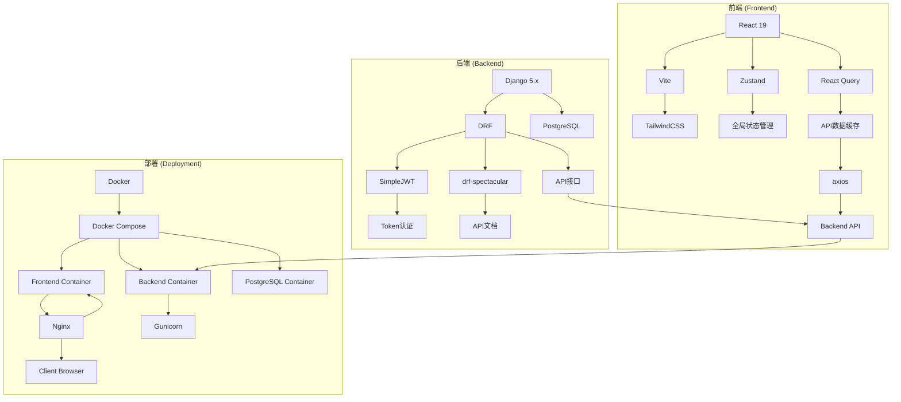

# 技术栈

<cite>
**本文档中引用的文件**  
- [pyproject.toml](file://backend/pyproject.toml)
- [package.json](file://frontend/package.json)
- [docker-compose.yml](file://docker-compose.yml)
- [Dockerfile](file://backend/Dockerfile)
- [Dockerfile](file://frontend/Dockerfile)
- [settings.py](file://backend/todo_project/settings.py)
- [vite.config.ts](file://frontend/vite.config.ts)
- [tailwind.config.js](file://frontend/tailwind.config.js)
- [index.ts](file://frontend/src/store/index.ts)
- [api.ts](file://frontend/src/services/api.ts)
</cite>

## 目录
1. [简介](#简介)
2. [后端技术栈](#后端技术栈)
3. [前端技术栈](#前端技术栈)
4. [部署架构](#部署架构)
5. [技术组件依赖关系图](#技术组件依赖关系图)
6. [技术选型优势与适用场景](#技术选型优势与适用场景)
7. [总结](#总结)

## 简介
本项目采用现代化全栈技术构建，涵盖后端API服务、前端用户界面以及容器化部署方案。后端基于Django 5.x与Django REST Framework构建RESTful API，集成JWT认证与drf-spectacular自动生成API文档；前端采用React 19与TypeScript开发，使用Vite作为构建工具，TailwindCSS进行样式设计，并通过Zustand和React Query实现状态管理；整体系统通过Docker容器化，使用Docker Compose进行服务编排，Nginx作为反向代理服务器实现生产级部署。

## 后端技术栈

项目后端采用Python生态中最成熟的Web框架之一——Django 5.x，结合Django REST Framework（DRF）构建高性能REST API。通过`pyproject.toml`文件定义了明确的依赖版本约束，确保环境一致性。

### Django 5.x 与 DRF 集成
Django作为MVC架构的全功能Web框架，提供了ORM、Admin后台、用户认证等开箱即用的功能。通过`INSTALLED_APPS`配置，项目集成了`rest_framework`、`rest_framework_simplejwt`、`drf_spectacular`等核心插件，构建现代化API服务。

### JWT 认证（djangorestframework-simplejwt）
在`settings.py`中配置了`rest_framework_simplejwt`作为默认认证类，实现无状态的Token认证机制。`SIMPLE_JWT`配置项设置了访问令牌（access token）有效期为1天，刷新令牌（refresh token）为7天，并启用了令牌轮换与黑名单机制，提升安全性。

### API 文档生成（drf-spectacular）
项目集成`drf-spectacular`库，自动生成符合OpenAPI 3.0规范的API文档。通过`SPECTACULAR_SETTINGS`配置文档标题、版本和描述信息，开发者可通过Web界面直接查看、测试API接口，极大提升前后端协作效率。

**本节来源**  
- [pyproject.toml](file://backend/pyproject.toml#L6-L16)
- [settings.py](file://backend/todo_project/settings.py#L38-L40)
- [settings.py](file://backend/todo_project/settings.py#L123-L138)
- [settings.py](file://backend/todo_project/settings.py#L143-L148)
- [settings.py](file://backend/todo_project/settings.py#L158-L163)

## 前端技术栈

前端采用React 19最新版本，结合TypeScript提供类型安全，使用Vite构建工具实现极速开发体验，TailwindCSS进行原子化样式设计，并通过Zustand与React Query实现高效状态管理。

### React 19 与 TypeScript
`package.json`中明确依赖`react`和`react-dom`的19.x版本，利用最新特性如Actions、编译器优化等提升性能。TypeScript（`typescript`）提供静态类型检查，配合`@types/react`等类型定义确保代码健壮性。

### Vite 构建工具
`vite.config.ts`配置了Vite开发服务器，监听5173端口，并设置`/api`路径代理至后端8000端口，解决开发环境跨域问题。插件`@vitejs/plugin-react`支持JSX语法与HMR热更新，显著提升开发效率。

### TailwindCSS 样式框架
`tailwind.config.js`配置了完整的主题系统，支持暗色模式、CSS变量集成、动画与可访问性设计。通过`content`字段扫描所有TSX文件，确保类名正确生成，实现高度可定制的UI设计。

### 状态管理方案
项目采用混合状态管理策略：
- **Zustand**：轻量级状态管理库，用于全局UI状态（如模态框、加载状态）和业务状态（任务、项目、标签等）。
- **React Query**：用于管理服务器状态，自动处理数据获取、缓存、轮询、错误重试等逻辑，减少手动状态管理负担。

**本节来源**  
- [package.json](file://frontend/package.json#L13-L43)
- [vite.config.ts](file://frontend/vite.config.ts#L1-L23)
- [tailwind.config.js](file://frontend/tailwind.config.js#L1-L78)
- [index.ts](file://frontend/src/store/index.ts#L1-L24)

## 部署架构

项目采用Docker容器化部署，通过Docker Compose统一编排后端、前端、数据库服务，Nginx作为反向代理实现生产级部署。

### Docker 容器化
- **后端Dockerfile**：基于Python 3.11-slim镜像，使用`uv`安装依赖，通过`gunicorn`启动WSGI应用，暴露8000端口。
- **前端Dockerfile**：多阶段构建，第一阶段使用Node 20构建静态资源，第二阶段使用Nginx服务静态文件，提升安全性与性能。

### Docker Compose 编排
`docker-compose.yml`定义了三个服务：
- **db**：PostgreSQL 15数据库，持久化数据卷。
- **backend**：后端服务，依赖数据库健康检查，自动执行迁移与静态文件收集。
- **frontend**：前端服务，依赖后端启动，通过环境变量注入API地址。

### Nginx 反向代理
前端Docker镜像中集成Nginx，通过`nginx.conf`配置静态资源服务与路由重写，确保SPA应用在刷新时正确加载。生产环境中Nginx同时可配置HTTPS、负载均衡与缓存策略。

**本节来源**  
- [Dockerfile](file://backend/Dockerfile#L1-L26)
- [Dockerfile](file://frontend/Dockerfile#L1-L33)
- [docker-compose.yml](file://docker-compose.yml#L1-L62)

## 技术组件依赖关系图

**图表来源**  
- [package.json](file://frontend/package.json)
- [pyproject.toml](file://backend/pyproject.toml)
- [docker-compose.yml](file://docker-compose.yml)
- [Dockerfile](file://backend/Dockerfile)
- [Dockerfile](file://frontend/Dockerfile)

## 技术选型优势与适用场景

### 后端优势
- **Django + DRF**：适合快速开发复杂业务逻辑的API，自带Admin、ORM、认证系统，降低开发成本。
- **JWT认证**：无状态、可扩展，适合分布式系统与移动端集成。
- **drf-spectacular**：自动生成交互式文档，提升团队协作效率，支持SDK生成。

### 前端优势
- **React 19 + TypeScript**：类型安全、组件化、生态丰富，适合大型应用开发。
- **Vite**：基于ESM的构建工具，启动速度快，HMR响应迅速，提升开发体验。
- **TailwindCSS**：原子化CSS，避免类名冲突，支持主题定制与暗色模式。
- **Zustand + React Query**：轻量级状态管理，分离本地状态与服务器状态，代码更清晰。

### 部署优势
- **Docker + Compose**：环境一致性，一键部署，易于CI/CD集成。
- **Nginx反向代理**：高性能静态资源服务，支持HTTPS、负载均衡与安全策略。

**适用场景**：该技术栈适用于中大型全栈Web应用，特别是需要高开发效率、良好可维护性与可扩展性的项目，如任务管理系统、CRM、ERP等。

## 总结
本项目构建了一个现代化、可维护、可扩展的全栈应用架构。后端采用Django生态确保稳定性与开发效率，前端使用React最新技术栈提供流畅用户体验，部署层面通过Docker实现环境一致性与自动化运维。各技术组件协同工作，形成完整闭环，具备良好的工程实践价值。