# 任务模型

<cite>
**本文档引用文件**   
- [Task模型](file://backend/apps/tasks/models.py)
- [Task序列化器](file://backend/apps/tasks/serializers.py)
- [Task视图集](file://backend/apps/tasks/views.py)
- [前端任务服务](file://frontend/src/services/task.ts)
- [任务项组件](file://frontend/src/components/task/TaskItem.tsx)
- [任务详情组件](file://frontend/src/components/task/TaskDetail.tsx)
- [任务标签关联模型](file://backend/apps/tags/models.py)
</cite>

## 目录
1. [简介](#简介)
2. [核心字段详解](#核心字段详解)
3. [父子任务层级结构](#父子任务层级结构)
4. [枚举选项详解](#枚举选项详解)
5. [时间字段业务逻辑](#时间字段业务逻辑)
6. [排序与前端集成](#排序与前端集成)
7. [操作示例](#操作示例)
8. [数据库约束与索引](#数据库约束与索引)

## 简介
任务模型是系统核心数据结构，用于表示用户待办事项。该模型支持丰富的属性配置，包括标题、描述、优先级、状态、时间规划、父子层级关系和排序功能。通过自引用外键实现子任务嵌套结构，结合前端拖拽交互提供直观的任务管理体验。

**Section sources**
- [models.py](file://backend/apps/tasks/models.py#L4-L75)

## 核心字段详解
任务模型包含多个关键字段，每个字段都有明确的语义和用途：

- **title**：任务标题，最大长度255字符，必填项
- **description**：任务描述，支持富文本内容，可为空
- **user**：外键关联用户，标识任务所属用户，级联删除
- **project**：外键关联项目，可为空，删除项目时设为空值
- **parent**：自引用外键，指向父任务，实现子任务结构
- **priority**：优先级字段，从PRIORITY_CHOICES中选择
- **status**：状态字段，从STATUS_CHOICES中选择
- **start_date**：计划开始时间，可为空
- **due_date**：截止时间，可为空
- **completed_at**：实际完成时间，完成任务时自动填充
- **order**：排序字段，用于自定义任务顺序
- **is_starred**：是否标星，用于快速标记重要任务
- **is_deleted**：软删除标志，标记任务是否被删除
- **created_at**：创建时间，自动记录
- **updated_at**：更新时间，每次修改自动更新

**Diagram sources**
- [models.py](file://backend/apps/tasks/models.py#L4-L75)

**Section sources**
- [models.py](file://backend/apps/tasks/models.py#L4-L75)

## 父子任务层级结构
任务模型通过自引用外键`parent`实现子任务层级结构，`related_name='subtasks'`允许从父任务反向访问所有子任务。

### 层级关系实现

**Diagram sources**
- [models.py](file://backend/apps/tasks/models.py#L38-L45)

### 使用方式
- 创建子任务时设置`parent`字段指向父任务ID
- 通过`parent.subtasks.all()`获取所有直接子任务
- 支持无限层级嵌套，但建议控制在3层以内以保证用户体验
- 前端通过递归渲染显示任务树结构
- 删除父任务时，所有子任务将被级联删除

### 序列化处理
在`TaskDetailSerializer`中，通过`get_subtasks`方法递归序列化子任务：

**Diagram sources**
- [serializers.py](file://backend/apps/tasks/serializers.py#L54-L63)
- [TaskDetail.tsx](file://frontend/src/components/task/TaskDetail.tsx#L61-L67)

**Section sources**
- [models.py](file://backend/apps/tasks/models.py#L38-L45)
- [serializers.py](file://backend/apps/tasks/serializers.py#L54-L63)

## 枚举选项详解
任务模型使用两个枚举选项来规范优先级和状态的取值。

### PRIORITY_CHOICES
优先级选项定义了任务的重要程度：

**Diagram sources**
- [models.py](file://backend/apps/tasks/models.py#L9-L14)

### STATUS_CHOICES
状态选项定义了任务的生命周期：

**Diagram sources**
- [models.py](file://backend/apps/tasks/models.py#L16-L20)

### 实际应用
- 后端通过`choices`参数限制字段取值范围
- 前端在任务详情组件中提供可视化选择器
- API返回的枚举值为英文标识符，显示文本由前端映射
- 支持通过批量更新接口修改多个任务的状态或优先级

**Section sources**
- [models.py](file://backend/apps/tasks/models.py#L9-L20)
- [TaskDetail.tsx](file://frontend/src/components/task/TaskDetail.tsx#L214-L227)

## 时间字段业务逻辑
三个时间字段共同管理任务的时间规划和生命周期。

### 字段关系

**Diagram sources**
- [models.py](file://backend/apps/tasks/models.py#L58-L60)

### 业务规则
- `start_date`：计划开始时间，可为空，不强制要求
- `due_date`：截止时间，可为空，用于提醒和排序
- `completed_at`：仅当状态为"completed"时设置，由系统自动填充
- 完成任务时，如果`completed_at`为空，则自动设置为当前时间
- 可通过`complete`动作接口完成任务并自动设置完成时间
- 统计功能使用`completed_at`进行数据分析

**Section sources**
- [models.py](file://backend/apps/tasks/models.py#L58-L60)
- [views.py](file://backend/apps/tasks/views.py#L35-L43)

## 排序与前端集成
`order`字段支持自定义任务排序，与前端拖拽功能深度集成。

### 排序机制
- 默认按`order`升序和`created_at`降序排列
- `order`字段为整数，默认值为0
- 拖拽排序时，前端发送重新排序后的任务ID和顺序列表
- 支持通过批量更新接口修改多个任务的顺序

### 前端集成

**Diagram sources**
- [SortableTaskItem.tsx](file://frontend/src/components/task/SortableTaskItem.tsx)
- [task.ts](file://frontend/src/services/task.ts#L65-L68)

### 实现细节
- 使用`batch_update`接口批量更新任务顺序
- 前端维护任务列表的顺序状态
- 拖拽完成后立即发送更新请求
- 支持撤销操作，保留前一次排序状态

**Section sources**
- [models.py](file://backend/apps/tasks/models.py#L61)
- [views.py](file://backend/apps/tasks/views.py#L178-L213)
- [task.ts](file://frontend/src/services/task.ts#L65-L68)

## 操作示例
以下为常见任务操作的使用示例。

### 创建任务

**Diagram sources**
- [serializers.py](file://backend/apps/tasks/serializers.py#L26-L37)
- [task.ts](file://frontend/src/services/task.ts#L24-L27)

### 设置父子关系

**Diagram sources**
- [models.py](file://backend/apps/tasks/models.py#L38-L45)
- [serializers.py](file://backend/apps/tasks/serializers.py#L56-L63)

### 更新状态

**Diagram sources**
- [views.py](file://backend/apps/tasks/views.py#L35-L43)
- [task.ts](file://frontend/src/services/task.ts#L38-L41)

**Section sources**
- [serializers.py](file://backend/apps/tasks/serializers.py#L26-L37)
- [views.py](file://backend/apps/tasks/views.py#L35-L43)
- [task.ts](file://frontend/src/services/task.ts#L24-L41)

## 数据库约束与索引
任务模型在数据库层面进行了优化设计。

### 表结构
- 表名：`tasks`
- 主键：`id` (BigAutoField)
- 外键约束：user、project、parent
- 唯一性：无全局唯一字段
- 软删除：通过`is_deleted`字段实现

### 索引优化
- `user`字段：用户任务查询
- `project`字段：项目任务查询
- `status`和`priority`：过滤查询
- `order`和`created_at`：排序查询
- `is_starred`：标星任务查询
- `due_date`：截止时间提醒

### 查询性能
- 常用过滤字段均已建立索引
- 复合查询使用组合索引优化
- 软删除避免频繁物理删除
- 批量操作减少数据库交互次数

```mermaid
erDiagram
TASK ||--|| USER : "所属用户"
TASK ||--o{ PROJECT : "所属项目"
TASK }o--o{ TASK : "父子任务"
TASK }o--o{ TAG : "标签关联"
TASK {
int id PK
string title
text description
int user FK
int project FK
int parent FK
string priority
string status
datetime start_date
datetime due_date
datetime completed_at
int order
boolean is_starred
boolean is_deleted
datetime created_at
datetime updated_at
}
USER {
int id PK
string username
}
PROJECT {
int id PK
string name
}
TAG {
int id PK
string name
}
```

**Diagram sources**
- [models.py](file://backend/apps/tasks/models.py)
- [tags/models.py](file://backend/apps/tags/models.py)

**Section sources**
- [models.py](file://backend/apps/tasks/models.py)
- [migrations/0001_initial.py](file://backend/apps/tasks/migrations/0001_initial.py)