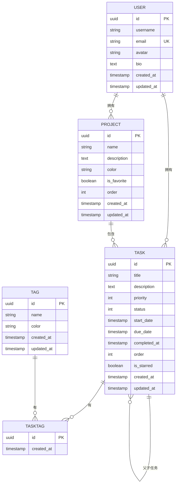

# 数据模型

<cite>
**本文档引用的文件**   
- [User](file://backend/apps/users/models.py)
- [Task](file://backend/apps/tasks/models.py)
- [Project](file://backend/apps/projects/models.py)
- [Tag](file://backend/apps/tags/models.py)
- [TaskTag](file://backend/apps/tags/models.py)
- [settings.py](file://backend/todo_project/settings.py)
- [0001_initial.py](file://backend/apps/tasks/migrations/0001_initial.py)
- [0001_initial.py](file://backend/apps/projects/migrations/0001_initial.py)
- [0001_initial.py](file://backend/apps/tags/migrations/0001_initial.py)
- [0001_initial.py](file://backend/apps/users/migrations/0001_initial.py)
</cite>

## 目录
1. [用户模型 (User)](#用户模型-user)
2. [任务模型 (Task)](#任务模型-task)
3. [项目模型 (Project)](#项目模型-project)
4. [标签模型 (Tag)](#标签模型-tag)
5. [实体关系图 (ER Diagram)](#实体关系图-er-diagram)
6. [数据库迁移策略](#数据库迁移策略)
7. [开发与生产环境配置差异](#开发与生产环境配置差异)

## 用户模型 (User)

用户模型继承自 Django 的 `AbstractUser`，扩展了邮箱、头像、个人简介等字段。该模型通过 `AUTH_USER_MODEL` 设置在 `settings.py` 中被指定为自定义用户模型。

**字段分析**：
- **email**: 邮箱字段，唯一性约束，用于用户登录和身份识别
- **avatar**: 头像 URL，可为空，用于显示用户头像
- **bio**: 个人简介，文本字段，可为空
- **created_at**: 创建时间，自动添加，不可修改
- **updated_at**: 更新时间，每次保存时自动更新

元数据中定义了数据库表名为 `users`，并设置了中文名称为“用户”。

**业务规则**：
- 邮箱必须唯一，作为主要登录凭证
- 用户名由 Django 默认提供，也具有唯一性
- 创建时间和更新时间自动管理，无需手动干预

**Section sources**
- [User](file://backend/apps/users/models.py#L5-L22)
- [settings.py](file://backend/todo_project/settings.py#L119)

## 任务模型 (Task)

任务模型是系统的核心，包含任务的标题、描述、优先级、状态、时间信息等。它通过外键与用户、项目和父任务关联，并支持子任务和标签功能。

**字段分析**：
- **title**: 标题，最大长度 255，必填
- **description**: 描述，可为空
- **user**: 所属用户，外键关联 `User` 模型，级联删除
- **project**: 所属项目，外键关联 `Project` 模型，可为空，删除项目时设为空
- **parent**: 父任务，自引用外键，实现子任务功能，可为空
- **priority**: 优先级，枚举值（无、低、中、高），默认为“无”
- **status**: 状态，枚举值（待办、进行中、已完成），默认为“待办”
- **start_date**: 开始时间，可为空
- **due_date**: 截止时间，可为空
- **completed_at**: 完成时间，可为空
- **order**: 排序字段，整数，默认为 0
- **is_starred**: 是否标星，布尔值，默认为 False
- **created_at**: 创建时间，自动添加
- **updated_at**: 更新时间，自动更新

**子任务实现**：
`parent` 字段是自引用外键，指向 `Task` 模型自身。通过 `related_name='subtasks'`，可以在父任务实例上通过 `subtasks` 访问其所有子任务。这种设计支持无限层级的子任务嵌套。

**业务规则**：
- 任务必须属于一个用户
- 任务可以属于一个项目，也可以不属于任何项目
- 任务可以有父任务，形成层级结构
- 任务的状态和优先级通过枚举字段约束
- 排序字段用于自定义任务顺序

**Section sources**
- [Task](file://backend/apps/tasks/models.py#L5-L74)
- [0001_initial.py](file://backend/apps/tasks/migrations/0001_initial.py#L16-L116)

## 项目模型 (Project)

项目模型用于组织和分类任务，包含项目名称、描述、颜色等信息，并与用户关联。

**字段分析**：
- **name**: 项目名称，最大长度 255，必填
- **description**: 描述，可为空
- **color**: 颜色，字符串，7位十六进制颜色码，默认为蓝色 `#3B82F6`
- **user**: 所属用户，外键关联 `User` 模型，级联删除
- **is_favorite**: 是否收藏，布尔值，默认为 False
- **order**: 排序字段，整数，默认为 0
- **created_at**: 创建时间，自动添加
- **updated_at**: 更新时间，自动更新

**业务规则**：
- 项目必须属于一个用户
- 项目名称在同一用户下应具有唯一性（通过应用层逻辑或数据库约束）
- 颜色用于前端可视化显示
- 收藏状态用于快速访问常用项目

**Section sources**
- [Project](file://backend/apps/projects/models.py#L5-L31)
- [0001_initial.py](file://backend/apps/projects/migrations/0001_initial.py#L13-L58)

## 标签模型 (Tag)

标签模型用于对任务进行分类和标记，支持多对多关系。

**字段分析**：
- **name**: 标签名称，最大长度 50，必填
- **color**: 颜色，字符串，7位十六进制颜色码，默认为绿色 `#10B981`
- **user**: 所属用户，外键关联 `User` 模型，级联删除
- **created_at**: 创建时间，自动添加
- **updated_at**: 更新时间，自动更新

**多对多关系实现**：
通过 `TaskTag` 中间模型实现任务与标签的多对多关系。`TaskTag` 包含 `task` 和 `tag` 两个外键，分别关联 `Task` 和 `Tag` 模型，并设置唯一性约束，防止重复关联。

**业务规则**：
- 标签必须属于一个用户
- 标签名称在同一用户下必须唯一（通过 `unique_together = ['name', 'user']` 实现）
- 每个任务可以关联多个标签，每个标签可以关联多个任务
- 通过中间模型可以扩展关联属性（如创建时间）

**Section sources**
- [Tag](file://backend/apps/tags/models.py#L5-L28)
- [TaskTag](file://backend/apps/tags/models.py#L30-L56)
- [0001_initial.py](file://backend/apps/tags/migrations/0001_initial.py#L13-L71)

## 实体关系图 (ER Diagram)



**Diagram sources**
- [User](file://backend/apps/users/models.py#L5-L22)
- [Project](file://backend/apps/projects/models.py#L5-L31)
- [Task](file://backend/apps/tasks/models.py#L5-L74)
- [Tag](file://backend/apps/tags/models.py#L5-L56)

## 数据库迁移策略

系统使用 Django 的迁移系统管理数据库模式变更。每个应用都有独立的 `migrations` 目录，包含按时间顺序命名的迁移文件。

**迁移文件分析**：
- `0001_initial.py`: 初始迁移文件，创建所有模型对应的数据库表
- `0002_initial.py`: 可能是重复或测试文件，实际结构由 `0001_initial.py` 定义
- `0003_task_start_date.py`: 后续迁移，为 `Task` 模型添加 `start_date` 字段

**最佳实践**：
- 使用 `makemigrations` 命令生成迁移文件
- 使用 `migrate` 命令应用迁移
- 在团队开发中，确保迁移文件按顺序提交到版本控制
- 避免手动修改迁移文件，除非必要
- 使用 `showmigrations` 检查迁移状态
- 在生产环境中，先在测试环境验证迁移

**Section sources**
- [0001_initial.py](file://backend/apps/tasks/migrations/0001_initial.py)
- [0001_initial.py](file://backend/apps/projects/migrations/0001_initial.py)
- [0001_initial.py](file://backend/apps/tags/migrations/0001_initial.py)
- [0001_initial.py](file://backend/apps/users/migrations/0001_initial.py)

## 开发与生产环境配置差异

数据库配置通过环境变量实现开发与生产环境的分离。

**配置分析**：
- **开发环境**: 使用 SQLite，配置为 `sqlite:///db.sqlite3`
- **生产环境**: 使用 PostgreSQL，通过 `DATABASE_URL` 环境变量配置
- 配置方式: 使用 `django-environ` 库从 `.env` 文件读取环境变量

**settings.py 配置**：
```python
DATABASES = {
    'default': env.db('DATABASE_URL', default='sqlite:///db.sqlite3')
}
```

**业务规则**：
- 开发环境使用 SQLite，便于快速启动和调试
- 生产环境使用 PostgreSQL，提供更好的性能和可靠性
- 通过环境变量统一配置管理，避免硬编码
- 支持多种数据库后端，便于部署和扩展

**Section sources**
- [settings.py](file://backend/todo_project/settings.py#L82-L85)