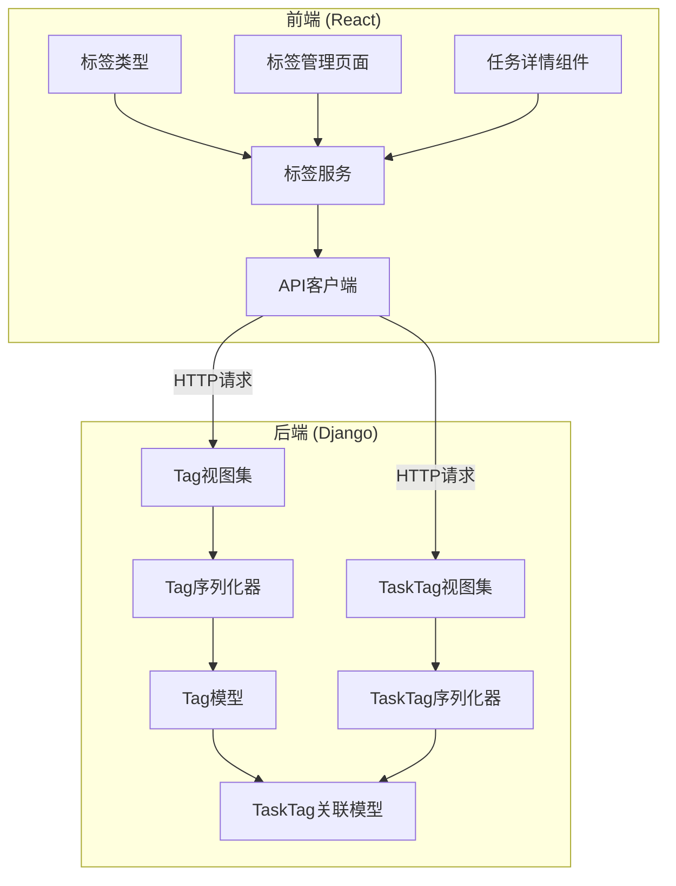
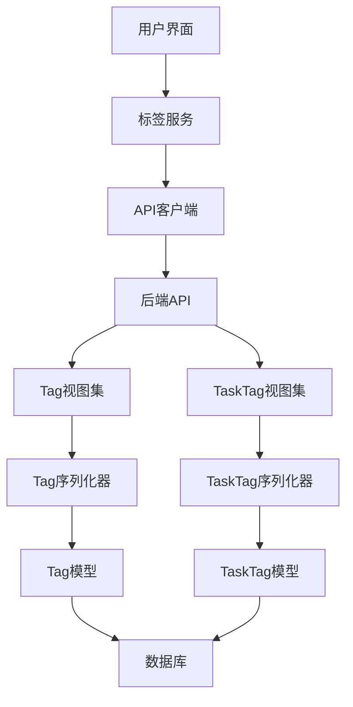
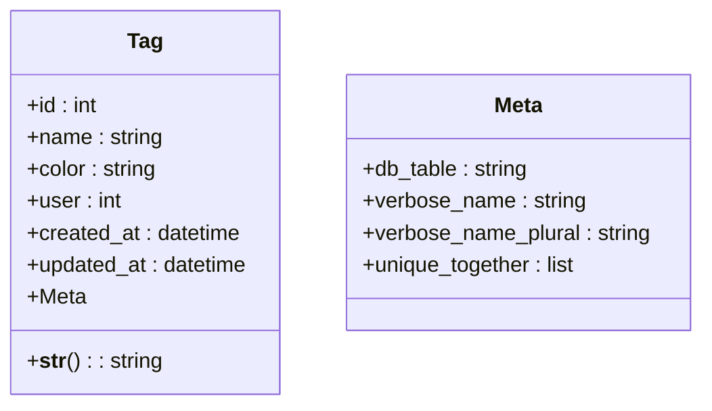
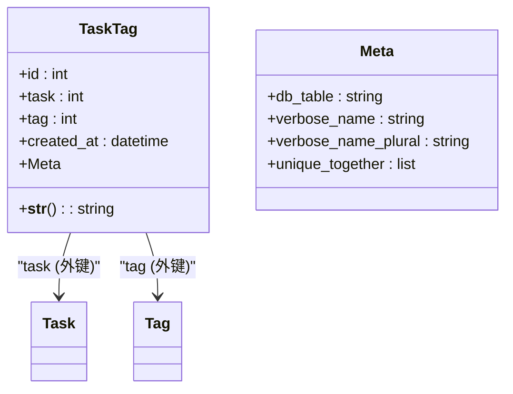
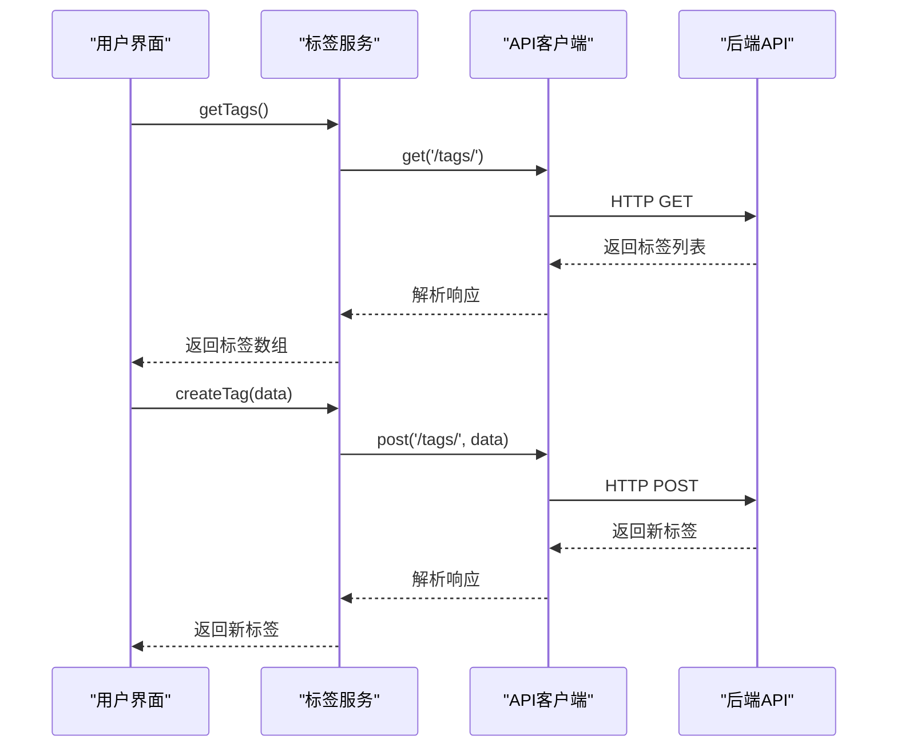
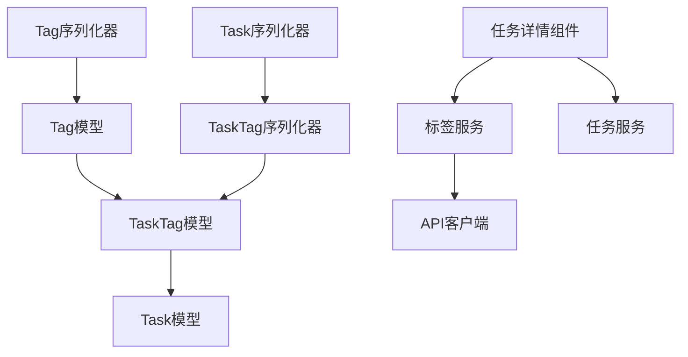

# 标签模型

<cite>
**本文档中引用的文件**   
- [Tag模型](file://backend/apps/tags/models.py#L4-L26)
- [TaskTag关联模型](file://backend/apps/tags/models.py#L29-L54)
- [标签序列化器](file://backend/apps/tags/serializers.py#L4-L8)
- [任务标签序列化器](file://backend/apps/tags/serializers.py#L11-L17)
- [标签服务](file://frontend/src/services/tag.ts)
- [任务服务](file://frontend/src/services/task.ts)
- [标签类型定义](file://frontend/src/types/index.ts#L96-L103)
- [任务类型定义](file://frontend/src/types/index.ts#L22-L46)
- [标签管理页面](file://frontend/src/pages/TagsPage.tsx)
- [任务详情组件](file://frontend/src/components/task/TaskDetail.tsx)
</cite>

## 目录
1. [引言](#引言)
2. [项目结构](#项目结构)
3. [核心组件](#核心组件)
4. [架构概述](#架构概述)
5. [详细组件分析](#详细组件分析)
6. [依赖分析](#依赖分析)
7. [性能考虑](#性能考虑)
8. [故障排除指南](#故障排除指南)
9. [结论](#结论)

## 引言
本文档全面文档化了任务管理系统中的标签（Tag）模型和任务-标签关联（TaskTag）模型的设计与实现。通过深入分析后端Django模型、序列化器、前端服务和用户界面组件，详细说明了标签系统的数据结构、业务约束、前后端交互机制以及用户操作流程。该标签系统支持任务的多维度分类，为用户提供灵活的任务组织和筛选能力。

## 项目结构
项目采用前后端分离的架构，后端使用Django框架实现RESTful API，前端使用React + TypeScript构建用户界面。标签系统相关的代码分布在`backend/apps/tags/`和`frontend/src/services/tag.ts`等文件中，与任务系统紧密集成。

**图源**
- [Tag模型](file://backend/apps/tags/models.py#L4-L26)
- [TaskTag关联模型](file://backend/apps/tags/models.py#L29-L54)
- [标签服务](file://frontend/src/services/tag.ts)

**本节来源**
- [backend/apps/tags/models.py](file://backend/apps/tags/models.py)
- [frontend/src/services/tag.ts](file://frontend/src/services/tag.ts)

## 核心组件
标签系统的核心由两个Django模型构成：`Tag`模型用于定义标签的基本属性，`TaskTag`模型作为多对多关联表管理任务与标签的关系。系统通过序列化器处理数据的序列化与反序列化，并在前端通过服务层封装API调用，最终在用户界面中实现标签的创建、管理和应用。

**本节来源**
- [Tag模型](file://backend/apps/tags/models.py#L4-L26)
- [TaskTag关联模型](file://backend/apps/tags/models.py#L29-L54)
- [标签序列化器](file://backend/apps/tags/serializers.py#L4-L8)

## 架构概述
标签系统采用经典的多对多关系设计模式，通过中间模型`TaskTag`显式管理任务与标签的关联。这种设计提供了额外的灵活性，允许在关联记录中存储元数据（如创建时间），并支持复杂的查询和约束。前后端通过REST API进行通信，前端组件通过服务层调用API，实现标签的CRUD操作和任务关联管理。

**图源**
- [Tag模型](file://backend/apps/tags/models.py#L4-L26)
- [TaskTag关联模型](file://backend/apps/tags/models.py#L29-L54)
- [标签服务](file://frontend/src/services/tag.ts)

## 详细组件分析
### 标签模型分析
`Tag`模型定义了标签的核心属性，包括名称、颜色和所属用户。通过`unique_together`约束确保同一用户不能创建同名标签，防止标签冗余。

**图源**
- [Tag模型](file://backend/apps/tags/models.py#L4-L26)

**本节来源**
- [Tag模型](file://backend/apps/tags/models.py#L4-L26)
- [标签类型定义](file://frontend/src/types/index.ts#L96-L103)

### 任务-标签关联模型分析
`TaskTag`模型作为多对多关联表，通过外键连接`Task`和`Tag`模型。`related_name='task_tags'`配置允许从任务或标签实例反向查询所有关联记录，`unique_together`约束防止同一任务与标签的重复关联。

**图源**
- [TaskTag关联模型](file://backend/apps/tags/models.py#L29-L54)

**本节来源**
- [TaskTag关联模型](file://backend/apps/tags/models.py#L29-L54)
- [任务标签序列化器](file://backend/apps/tags/serializers.py#L11-L17)

### 前端服务分析
前端`tagService`封装了所有标签相关的API调用，提供类型安全的异步方法，包括获取标签列表、创建、更新和删除标签。服务处理分页响应，确保数据格式的一致性。

**图源**
- [标签服务](file://frontend/src/services/tag.ts)

**本节来源**
- [标签服务](file://frontend/src/services/tag.ts)
- [标签类型定义](file://frontend/src/types/index.ts#L96-L103)

## 依赖分析
标签系统与任务系统存在紧密的依赖关系。`TaskTag`模型依赖`Task`模型，`TaskSerializer`在序列化任务时包含标签信息。前端任务详情组件依赖标签服务来管理任务的标签关联。这种设计实现了功能的解耦，同时保持了数据的一致性和完整性。

**图源**
- [Tag模型](file://backend/apps/tags/models.py#L4-L26)
- [TaskTag关联模型](file://backend/apps/tags/models.py#L29-L54)
- [任务序列化器](file://backend/apps/tasks/serializers.py#L5-L51)

**本节来源**
- [backend/apps/tags/models.py](file://backend/apps/tags/models.py)
- [backend/apps/tasks/serializers.py](file://backend/apps/tasks/serializers.py)
- [frontend/src/services/tag.ts](file://frontend/src/services/tag.ts)
- [frontend/src/components/task/TaskDetail.tsx](file://frontend/src/components/task/TaskDetail.tsx)

## 性能考虑
标签系统的性能优化主要体现在数据库索引和查询优化上。`Tag`模型的`name`和`user`字段组合唯一约束自动创建了复合索引，加速了标签的查找和去重检查。`TaskTag`模型的`task`和`tag`外键也建立了索引，确保关联查询的高效性。前端通过缓存标签列表减少API调用频率，提升用户体验。

## 故障排除指南
常见问题包括标签创建失败、任务标签关联无效等。检查后端日志确认数据库约束冲突，验证前端API调用参数的正确性。确保用户身份验证信息正确传递，检查跨域资源共享（CORS）配置。对于标签颜色显示异常，确认前端组件正确应用了颜色样式。

**本节来源**
- [Tag模型](file://backend/apps/tags/models.py#L4-L26)
- [标签服务](file://frontend/src/services/tag.ts)
- [任务详情组件](file://frontend/src/components/task/TaskDetail.tsx)

## 结论
标签系统通过精心设计的模型和约束，实现了高效、可靠的任务分类功能。`Tag`模型的`unique_together`约束确保了用户标签的唯一性，`TaskTag`关联模型的反向查询机制和唯一性约束保证了数据的完整性和查询的灵活性。前后端的紧密协作，使得用户能够轻松创建标签、关联任务并按标签筛选，极大地提升了任务管理的效率和体验。