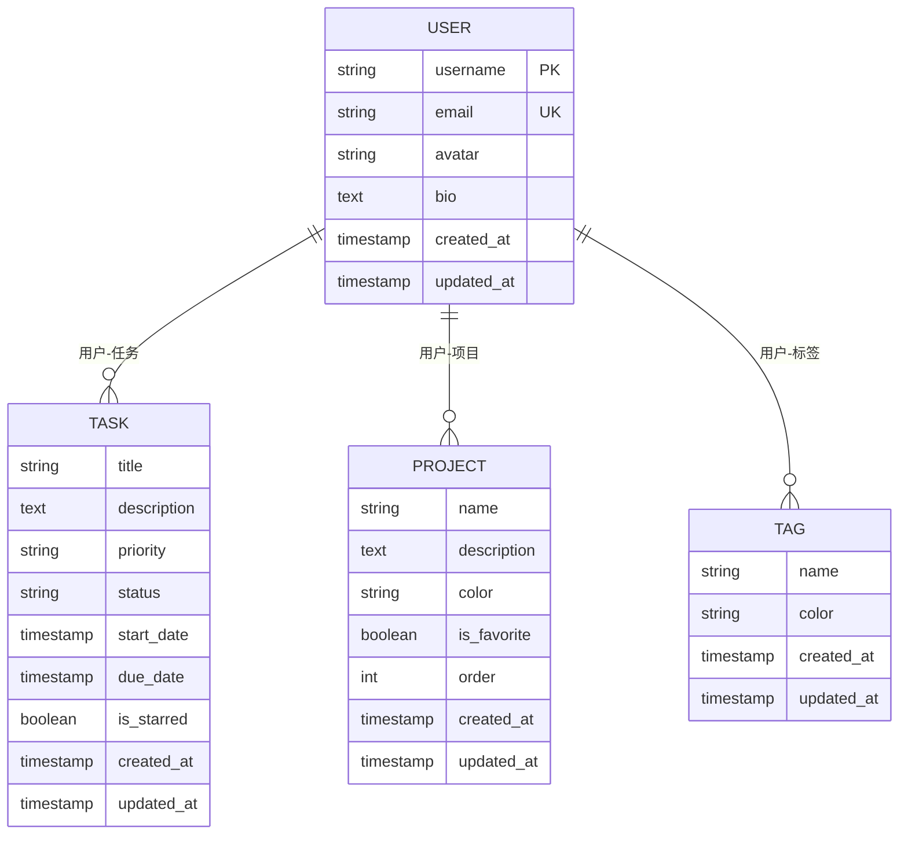

# 用户模型

<cite>
**Referenced Files in This Document**   
- [User](file://backend/apps/users/models.py#L4-L20)
- [Task](file://backend/apps/tasks/models.py#L5-L74)
- [Project](file://backend/apps/projects/models.py#L5-L31)
- [Tag](file://backend/apps/tags/models.py#L5-L56)
- [UserSerializer](file://backend/apps/users/serializers.py#L5-L9)
- [UserRegistrationSerializer](file://backend/apps/users/serializers.py#L12-L28)
- [UserViewSet](file://backend/apps/users/views.py#L8-L30)
</cite>

## Table of Contents
1. [用户模型概述](#用户模型概述)
2. [字段定义与约束](#字段定义与约束)
3. [Meta类配置](#meta类配置)
4. [外键关系与反向查询](#外键关系与反向查询)
5. [用户创建与查询示例](#用户创建与查询示例)

## 用户模型概述

用户模型是系统的核心实体，继承自Django的`AbstractUser`类，扩展了邮箱、头像和简介等字段。该模型作为系统中所有用户数据的存储基础，支持用户注册、登录和信息管理功能。

**Section sources**
- [User](file://backend/apps/users/models.py#L4-L20)

## 字段定义与约束

用户模型包含以下字段定义和约束条件：

- **email**: 邮箱字段，类型为`EmailField`，设置`unique=True`确保邮箱地址的唯一性，作为用户的主要标识
- **avatar**: 头像字段，类型为`URLField`，允许为空（`blank=True, null=True`），存储用户头像的URL地址
- **bio**: 个人简介字段，类型为`TextField`，允许为空，用于存储用户的个人描述信息
- **created_at**: 创建时间字段，类型为`DateTimeField`，使用`auto_now_add=True`自动记录对象创建时间
- **updated_at**: 更新时间字段，类型为`DateTimeField`，使用`auto_now=True`在每次保存时自动更新时间戳

这些字段共同构成了用户的基本信息结构，支持系统的用户管理功能。

**Section sources**
- [User](file://backend/apps/users/models.py#L4-L20)

## Meta类配置

用户模型的Meta类包含以下配置：

- **db_table**: 设置数据库表名为`users`，覆盖默认的表名生成规则
- **verbose_name**: 设置模型的可读名称为"用户"，用于管理界面显示
- **verbose_name_plural**: 设置复数形式的可读名称，与`verbose_name`相同，确保单复数显示一致

这些配置优化了数据库表的命名和管理界面的用户体验。

**Section sources**
- [User](file://backend/apps/users/models.py#L4-L20)

## 外键关系与反向查询

用户模型与其他核心模型建立了外键关系，通过`related_name`实现高效的反向查询：



**Diagram sources**
- [User](file://backend/apps/users/models.py#L4-L20)
- [Task](file://backend/apps/tasks/models.py#L5-L74)
- [Project](file://backend/apps/projects/models.py#L5-L31)
- [Tag](file://backend/apps/tags/models.py#L5-L56)

通过`related_name='tasks'`、`related_name='projects'`和`related_name='tags'`，可以方便地进行反向查询：
- `user.tasks.all()` 获取用户的所有任务
- `user.projects.all()` 获取用户的所有项目
- `user.tags.all()` 获取用户的所有标签

这种设计模式提高了数据访问的效率和代码的可读性。

**Section sources**
- [Task](file://backend/apps/tasks/models.py#L24-L29)
- [Project](file://backend/apps/projects/models.py#L12-L17)
- [Tag](file://backend/apps/tags/models.py#L11-L16)

## 用户创建与查询示例

以下是用户模型的常见操作示例：

### 用户创建
```python
# 通过create_user方法创建用户
user = User.objects.create_user(
    username='john_doe',
    email='john@example.com',
    password='secure_password123',
    avatar='https://example.com/avatar.jpg',
    bio='Python开发者，热爱开源项目'
)
```

### 信息更新
```python
# 更新用户信息
user.bio = '全栈开发者，专注于Django和React'
user.avatar = 'https://example.com/new-avatar.jpg'
user.save()
```

### 查询过滤
```python
# 查询所有用户
users = User.objects.all()

# 按用户名查询
user = User.objects.get(username='john_doe')

# 按邮箱查询
user = User.objects.get(email='john@example.com')

# 过滤活跃用户
active_users = User.objects.filter(is_active=True)

# 模糊搜索用户名
users = User.objects.filter(username__icontains='john')
```

这些示例展示了用户模型的基本操作，涵盖了创建、更新和查询等常见场景。

**Section sources**
- [User](file://backend/apps/users/models.py#L4-L20)
- [UserViewSet](file://backend/apps/users/views.py#L8-L30)
- [UserRegistrationSerializer](file://backend/apps/users/serializers.py#L12-L28)