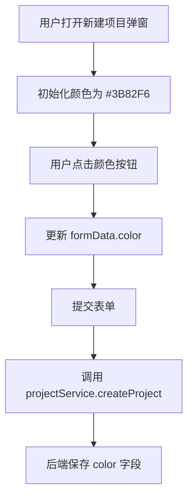
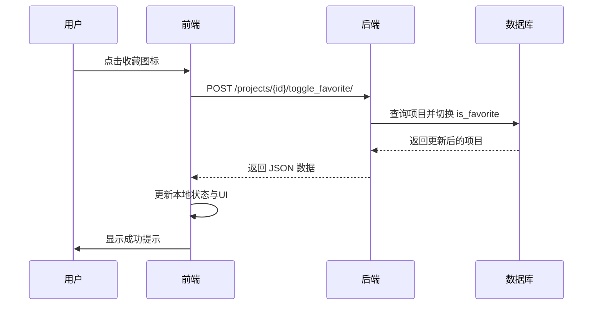

# 项目模型

<cite>
**本文档中引用的文件**  
- [models.py](file://backend/apps/projects/models.py)
- [serializers.py](file://backend/apps/projects/serializers.py)
- [views.py](file://backend/apps/projects/views.py)
- [project.ts](file://frontend/src/services/project.ts)
- [ProjectsPage.tsx](file://frontend/src/pages/ProjectsPage.tsx)
- [index.ts](file://frontend/src/types/index.ts)
</cite>

## 目录
1. [项目模型概述](#项目模型概述)  
2. [核心字段设计与约束](#核心字段设计与约束)  
3. [颜色字段与前端UI集成](#颜色字段与前端ui集成)  
4. [收藏功能业务逻辑](#收藏功能业务逻辑)  
5. [自定义排序机制](#自定义排序机制)  
6. [Meta类排序配置与查询性能](#meta类排序配置与查询性能)  
7. [项目与任务的关联关系](#项目与任务的关联关系)  
8. [完整代码示例](#完整代码示例)  
9. [总结](#总结)

## 项目模型概述

`Project` 模型是任务管理系统中的核心实体，用于组织和分类用户的任务。每个项目可包含多个任务，并通过颜色、收藏状态、排序等属性提供个性化管理能力。项目与用户之间为多对一关系，确保数据隔离与权限控制。

**Section sources**  
- [models.py](file://backend/apps/projects/models.py#L4-L30)

## 核心字段设计与约束

`Project` 模型包含以下关键字段及其用途与约束：

| 字段名 | 类型 | 默认值 | 约束 | 说明 |
|--------|------|--------|------|------|
| `name` | CharField | 无 | 必填，最大长度255 | 项目名称，唯一标识 |
| `description` | TextField | 可为空 | 可选字段 | 项目详细描述 |
| `color` | CharField | `#3B82F6` | 长度7（十六进制颜色码） | 项目视觉标识颜色 |
| `user` | ForeignKey | 无 | 外键关联用户，级联删除 | 所属用户 |
| `is_favorite` | BooleanField | `False` | 不可为空 | 是否被用户收藏 |
| `is_pinned` | BooleanField | `False` | 不可为空 | 是否置顶显示 |
| `order` | IntegerField | `0` | 不可为空 | 用户自定义排序值 |
| `created_at` | DateTimeField | 自动添加 | 只读 | 创建时间戳 |
| `updated_at` | DateTimeField | 自动更新 | 只读 | 最后修改时间戳 |

**Section sources**  
- [models.py](file://backend/apps/projects/models.py#L9-L22)

## 颜色字段与前端UI集成

`color` 字段的默认值为 `#3B82F6`（Tailwind CSS 中的蓝色），在前端界面中广泛用于视觉标识：

1. **项目列表展示**：每个项目卡片左侧的小圆点使用 `style={{ backgroundColor: project.color }}` 动态设置背景色。
2. **新建/编辑弹窗**：提供8种预设颜色供用户选择，初始值设为 `#3B82F6`。
3. **交互反馈**：选中颜色时通过蓝色边框（`ring-2 ring-blue-500`）提示当前选择。

前端通过 `ProjectsPage.tsx` 中的状态管理维护颜色选择逻辑，并在创建或更新项目时将颜色值提交至后端。

**Diagram sources**  
- [ProjectsPage.tsx](file://frontend/src/pages/ProjectsPage.tsx#L15-L20)
- [project.ts](file://frontend/src/services/project.ts#L24-L26)

**Section sources**  
- [models.py](file://backend/apps/projects/models.py#L11)
- [ProjectsPage.tsx](file://frontend/src/pages/ProjectsPage.tsx#L15-L243)

## 收藏功能业务逻辑

收藏功能允许用户标记重要项目，便于快速访问。其业务逻辑如下：

### 后端实现
- `is_favorite` 字段存储布尔值，表示是否收藏。
- 提供 `toggle_favorite` 动作视图，通过 `@action` 装饰器暴露为 `/projects/{id}/toggle_favorite/` 接口。
- 切换逻辑：获取项目对象 → 取反 `is_favorite` → 保存 → 返回序列化数据。

### 前端交互流程
1. 用户点击星形图标。
2. 调用 `handleToggleFavorite` 函数，发送 PATCH 请求更新 `is_favorite`。
3. 成功后更新本地状态并显示提示（“已加入收藏”或“已取消收藏”）。
4. 图标动态变色：收藏状态为黄色填充，否则为灰色。

该功能支持即时反馈，无需刷新页面即可反映状态变化。

**Diagram sources**  
- [views.py](file://backend/apps/projects/views.py#L21-L27)
- [project.ts](file://frontend/src/services/project.ts#L38-L40)
- [ProjectsPage.tsx](file://frontend/src/pages/ProjectsPage.tsx#L83-L92)

**Section sources**  
- [models.py](file://backend/apps/projects/models.py#L18)
- [views.py](file://backend/apps/projects/views.py#L21-L27)
- [ProjectsPage.tsx](file://frontend/src/pages/ProjectsPage.tsx#L83-L92)

## 自定义排序机制

`order` 字段支持用户自定义项目排序：

- 类型为 `IntegerField`，默认值为 `0`。
- 在 `Meta.ordering` 中作为首要排序依据（`['order', '-created_at']`）。
- 前端可通过拖拽等方式调整顺序，更新每个项目的 `order` 值。
- 实际排序由数据库完成，确保列表一致性。

此设计允许用户灵活组织项目优先级，同时保持默认创建时间降序作为后备排序规则。

**Section sources**  
- [models.py](file://backend/apps/projects/models.py#L20)
- [models.py](file://backend/apps/projects/models.py#L28)

## Meta类排序配置与查询性能

`Meta` 类中定义的 `ordering = ['order', '-created_at']` 对查询性能有显著影响：

- **排序策略**：优先按 `order` 升序排列，相同 `order` 值时按 `created_at` 降序排列。
- **数据库索引优化建议**：为 `order` 和 `created_at` 字段建立复合索引，以加速排序操作。
- **性能影响**：若未建立适当索引，大规模数据下排序可能导致全表扫描，影响响应速度。
- **查询优化**：结合 `filter(user=request.user)` 使用，利用用户隔离减少数据集规模。

建议在生产环境中对 `order` 字段添加数据库索引以提升查询效率。

**Section sources**  
- [models.py](file://backend/apps/projects/models.py#L28)

## 项目与任务的关联关系

项目作为任务的容器，通过外键关联实现一对多关系：

- `Task` 模型中定义 `project = ForeignKey('projects.Project', ...)`。
- 关系为可选（`null=True, blank=True`），支持任务不属于任何项目。
- 删除项目时，相关任务的 `project` 字段设为 `NULL`（`on_delete=models.SET_NULL`）。
- 序列化器中通过 `SerializerMethodField` 提供 `tasks_count`、`uncompleted_count` 等统计信息。

项目页面展示任务数量统计，增强用户对项目负载的感知。

**Section sources**  
- [models.py](file://backend/apps/projects/models.py#L16)
- [tasks/models.py](file://backend/apps/tasks/models.py#L30-L36)
- [serializers.py](file://backend/apps/projects/serializers.py#L6-L8)

## 完整代码示例

以下为项目全生命周期操作的代码路径示例：

### 创建项目
- 前端调用：`projectService.createProject({ name, description, color })`
- 后端处理：`ProjectSerializer.create()` 自动绑定当前用户

### 更新项目
- 支持部分更新（PATCH），如修改名称、颜色或收藏状态

### 查询项目列表
- 请求：`GET /projects/`
- 结果：按 `order` 和 `created_at` 排序的项目数组

### 切换收藏状态
- 请求：`POST /projects/{id}/toggle_favorite/`
- 效果：`is_favorite` 取反并持久化

### 与任务关联
- 创建任务时指定 `project_id`
- 项目详情中通过 `tasks` 反向关系访问所有任务

**Section sources**  
- [project.ts](file://frontend/src/services/project.ts)
- [views.py](file://backend/apps/projects/views.py)
- [serializers.py](file://backend/apps/projects/serializers.py)
- [ProjectsPage.tsx](file://frontend/src/pages/ProjectsPage.tsx)

## 总结

`Project` 模型通过结构化字段设计实现了项目管理的核心功能。`color` 字段增强视觉识别，`is_favorite` 提供快速访问机制，`order` 支持用户自定义排序，而 `Meta.ordering` 配置确保数据一致性与查询效率。前后端协同工作，完整覆盖项目创建、更新、查询及与任务关联的场景，构成任务系统的基础架构。

**Section sources**  
- [models.py](file://backend/apps/projects/models.py)
- [serializers.py](file://backend/apps/projects/serializers.py)
- [views.py](file://backend/apps/projects/views.py)
- [ProjectsPage.tsx](file://frontend/src/pages/ProjectsPage.tsx)