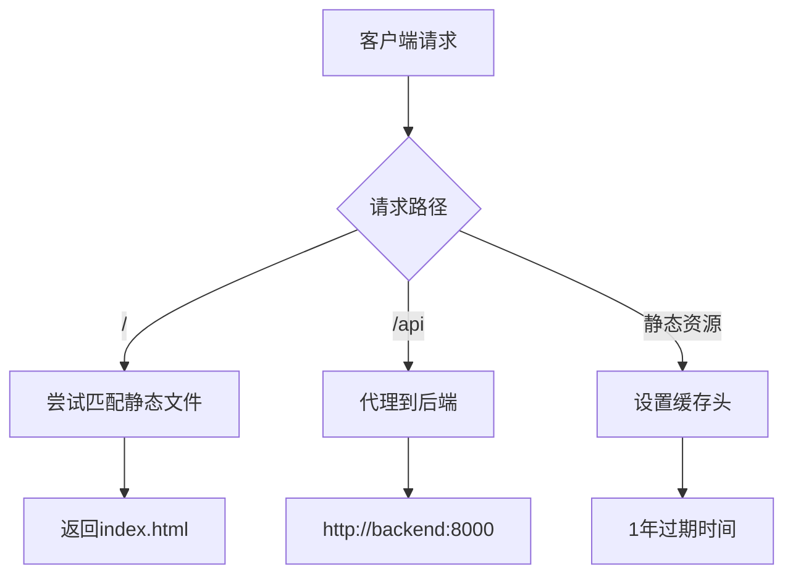
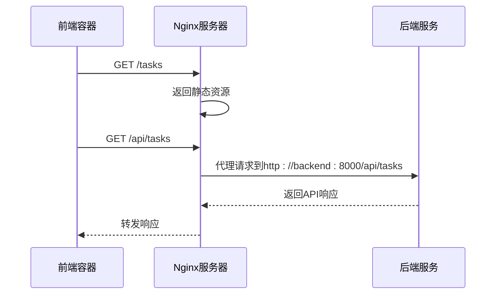

# 前端服务

<cite>
**Referenced Files in This Document**  
- [docker-compose.yml](file://docker-compose.yml)
- [frontend/Dockerfile](file://frontend/Dockerfile)
- [frontend/nginx.conf](file://frontend/nginx.conf)
</cite>

## 目录
1. [前端服务](#前端服务)
2. [Docker构建配置](#docker构建配置)
3. [Nginx服务器配置](#nginx服务器配置)
4. [服务依赖与通信](#服务依赖与通信)
5. [生产环境部署](#生产环境部署)

## Docker构建配置

前端服务在docker-compose.yml中定义了基于./frontend目录的构建上下文，使用自定义Dockerfile进行镜像构建。该服务采用多阶段构建策略，第一阶段使用Node.js基础镜像安装依赖并构建应用，第二阶段使用轻量级Nginx Alpine镜像作为运行时环境，将构建产物复制到容器中。

```mermaid
graph TD
A[Node.js构建阶段] --> |安装依赖| B[pnpm install]
B --> |构建应用| C[pnpm build]
C --> D[Nginx运行阶段]
D --> |复制构建产物| E[/usr/share/nginx/html]
E --> |复制Nginx配置| F[/etc/nginx/conf.d/default.conf]
F --> G[启动Nginx服务]
```

**Diagram sources**  
- [frontend/Dockerfile](file://frontend/Dockerfile#L1-L33)

**Section sources**  
- [docker-compose.yml](file://docker-compose.yml#L46-L57)
- [frontend/Dockerfile](file://frontend/Dockerfile#L1-L33)

## Nginx服务器配置

Nginx配置文件定义了前端服务的核心行为，包括静态资源服务、API反向代理和缓存策略。服务器监听80端口，将根目录指向Nginx的HTML目录，并配置了HTML5路由的fallback机制。



**Diagram sources**  
- [frontend/nginx.conf](file://frontend/nginx.conf#L1-L32)

**Section sources**  
- [frontend/nginx.conf](file://frontend/nginx.conf#L1-L32)

## 服务依赖与通信

前端服务通过depends_on指令依赖backend服务，确保在后端服务启动完成后再启动前端容器。这种依赖关系保证了前后端服务的正确启动顺序，避免了因后端未就绪而导致的前端请求失败。

环境变量VITE_API_URL配置为"http://localhost:8000/api"，这一配置在开发环境中通过Vite的代理功能实现API请求的转发。在生产环境中，Nginx的反向代理规则接管了API请求的路由，将所有/api前缀的请求代理到后端服务。



**Diagram sources**  
- [docker-compose.yml](file://docker-compose.yml#L53-L57)
- [frontend/nginx.conf](file://frontend/nginx.conf#L18-L24)

**Section sources**  
- [docker-compose.yml](file://docker-compose.yml#L53-L57)
- [frontend/nginx.conf](file://frontend/nginx.conf#L18-L24)

## 生产环境部署

前端服务在生产环境中通过轻量级容器高效服务前端资源，与后端服务形成松耦合架构。容器暴露80端口，将外部请求映射到内部Nginx服务。这种架构设计实现了前后端的物理分离，便于独立扩展和维护。

静态资源通过Nginx的gzip压缩和长期缓存策略优化性能，所有js、css、图片等静态文件均设置1年的缓存过期时间，并标记为不可变，最大限度减少重复下载。API请求通过反向代理无缝对接后端服务，实现了跨域资源共享和统一的API网关。

该部署方案确保了前端应用的高可用性和高性能，同时保持了与后端服务的清晰边界，符合现代Web应用的最佳实践。

**Section sources**  
- [docker-compose.yml](file://docker-compose.yml#L46-L57)
- [frontend/Dockerfile](file://frontend/Dockerfile#L1-L33)
- [frontend/nginx.conf](file://frontend/nginx.conf#L1-L32)