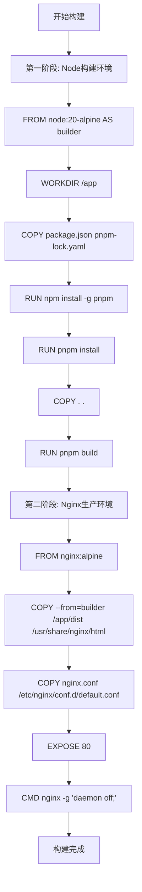
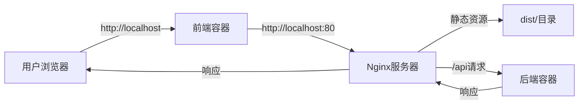

# 构建与部署

<cite>
**Referenced Files in This Document**  
- [frontend/Dockerfile](file://frontend/Dockerfile)
- [docker-compose.yml](file://docker-compose.yml)
- [frontend/nginx.conf](file://frontend/nginx.conf)
</cite>

## 目录

1. [前端Docker多阶段构建详解](#前端docker多阶段构建详解)
2. [Dockerfile指令解析](#dockerfile指令解析)
3. [Docker Compose服务编排](#docker-compose服务编排)
4. [构建优化策略](#构建优化策略)
5. [常见构建问题与解决方案](#常见构建问题与解决方案)

## 前端Docker多阶段构建详解

前端服务采用多阶段Docker构建策略，通过两个独立的构建阶段实现开发与生产环境的分离，最终生成轻量化的生产镜像。

### 构建阶段一：依赖安装与静态资源构建

第一阶段使用 `node:20-alpine` 镜像作为构建环境，该镜像基于Alpine Linux，具有体积小、启动快的特点。此阶段主要完成以下任务：

1. **依赖安装**：通过 `COPY` 指令复制 `package.json` 和 `pnpm-lock.yaml` 文件，然后使用 `RUN npm install -g pnpm` 全局安装pnpm包管理器，最后执行 `pnpm install` 安装项目依赖。
2. **源码复制**：将整个前端源代码复制到容器的 `/app` 目录中。
3. **静态资源构建**：执行 `pnpm build` 命令，使用Vite构建工具将TypeScript和React组件编译为优化的静态资源文件，输出到 `dist` 目录。

此阶段包含了完整的Node.js运行时、开发依赖和源代码，因此镜像体积较大，仅用于构建目的。

### 构建阶段二：生产环境镜像构建

第二阶段使用 `nginx:alpine` 静态镜像作为运行时环境，该镜像专为Web服务优化，体积极小。此阶段主要完成以下任务：

1. **构建产物复制**：使用 `COPY --from=builder` 指令，从第一阶段（标记为 `builder`）的容器中复制 `dist` 目录下的构建产物到Nginx的默认Web根目录 `/usr/share/nginx/html`。
2. **Nginx配置**：将自定义的 `nginx.conf` 配置文件复制到Nginx的配置目录，实现反向代理、静态资源缓存和SPA路由支持。
3. **服务启动**：通过 `CMD` 指令启动Nginx服务，使其在前台运行以保持容器活跃。

**Diagram sources**  
- [frontend/Dockerfile](file://frontend/Dockerfile#L1-L33)



**Diagram sources**  
- [frontend/Dockerfile](file://frontend/Dockerfile#L1-L33)

## Dockerfile指令解析

### WORKDIR
`WORKDIR /app` 指令设置容器内的工作目录。后续的 `COPY`、`RUN` 等指令都将在此目录下执行，确保了构建过程的路径一致性。

### COPY
`COPY` 指令用于将主机文件复制到镜像中。在本例中，分两次复制：先复制依赖文件以利用Docker缓存，再复制源代码。`COPY --from=builder` 实现了多阶段构建间的文件复制。

### RUN
`RUN` 指令在镜像中执行命令。用于安装pnpm、安装依赖和执行构建命令。每个 `RUN` 指令都会创建一个新的镜像层。

### EXPOSE
`EXPOSE 80` 指令声明容器在运行时监听80端口。这是一个文档性指令，实际端口映射由 `docker-compose.yml` 中的 `ports` 配置决定。

### CMD
`CMD ["nginx", "-g", "daemon off;"]` 指定容器启动时执行的默认命令。`daemon off;` 确保Nginx以前台模式运行，防止容器启动后立即退出。

**Section sources**  
- [frontend/Dockerfile](file://frontend/Dockerfile#L1-L33)

## Docker Compose服务编排

`docker-compose.yml` 文件定义了多容器应用的服务编排，其中前端服务的配置如下：

### build配置
```yaml
build:
  context: ./frontend
  dockerfile: Dockerfile
```
- `context`: 构建上下文为 `./frontend` 目录，Docker在此目录下查找Dockerfile和构建所需文件。
- `dockerfile`: 指定使用自定义的 `Dockerfile` 文件，而非默认命名。

### container_name
`container_name: todo-frontend` 指定容器的名称为 `todo-frontend`，便于识别和管理。

### ports
`ports: - "80:80"` 将主机的80端口映射到容器的80端口，使外部可通过 `http://localhost` 访问前端应用。

### depends_on
`depends_on: - backend` 表示前端服务依赖于后端服务，Docker Compose会先启动后端容器再启动前端容器。但此指令不等待后端服务完全就绪。

### 反向代理配置
`nginx.conf` 文件中的 `location /api` 配置实现了API请求的反向代理，将前端应用的 `/api` 路径请求转发到后端服务，解决了开发环境中的跨域问题。



**Diagram sources**  
- [docker-compose.yml](file://docker-compose.yml#L46-L57)
- [frontend/nginx.conf](file://frontend/nginx.conf#L1-L32)

**Section sources**  
- [docker-compose.yml](file://docker-compose.yml#L46-L57)
- [frontend/nginx.conf](file://frontend/nginx.conf#L1-L32)

## 构建优化策略

### 依赖缓存优化
通过分步复制文件（先复制 `package.json`，再复制源码），利用Docker的层缓存机制。当源码变更但依赖未变时，可跳过 `pnpm install` 步骤，显著加快构建速度。

### 多阶段构建优势
- **镜像体积最小化**：生产镜像仅包含Nginx和静态资源，不含Node.js和源码，体积从数百MB降至数十MB。
- **安全性提升**：生产环境不包含构建工具和源码，减少攻击面。
- **职责分离**：构建环境与运行环境完全隔离，符合单一职责原则。

### 镜像分层策略
Docker镜像采用分层存储，合理组织 `Dockerfile` 指令顺序可最大化缓存利用率：
1. 变更频率低的指令（如基础镜像、依赖安装）放在前面
2. 变更频率高的指令（如源码复制）放在后面

## 常见构建问题与解决方案

### 依赖安装失败
**原因**：网络问题导致无法下载npm包。  
**解决方案**：使用国内镜像源，如Dockerfile中已配置的 `docker.m.daocloud.io`。

### 构建缓存失效
**原因**：`package.json` 文件变更导致依赖层缓存失效。  
**解决方案**：确保仅在真正需要时修改依赖，避免不必要的变更。

### 端口冲突
**原因**：主机80端口被占用。  
**解决方案**：修改 `docker-compose.yml` 中的端口映射，如 `"8080:80"`。

### 构建权限问题
**原因**：Alpine镜像中权限配置不当。  
**解决方案**：在 `RUN` 指令中使用适当的用户权限，或在Nginx配置中调整文件权限。

**Section sources**  
- [frontend/Dockerfile](file://frontend/Dockerfile#L1-L33)
- [docker-compose.yml](file://docker-compose.yml#L46-L57)
- [frontend/nginx.conf](file://frontend/nginx.conf#L1-L32)