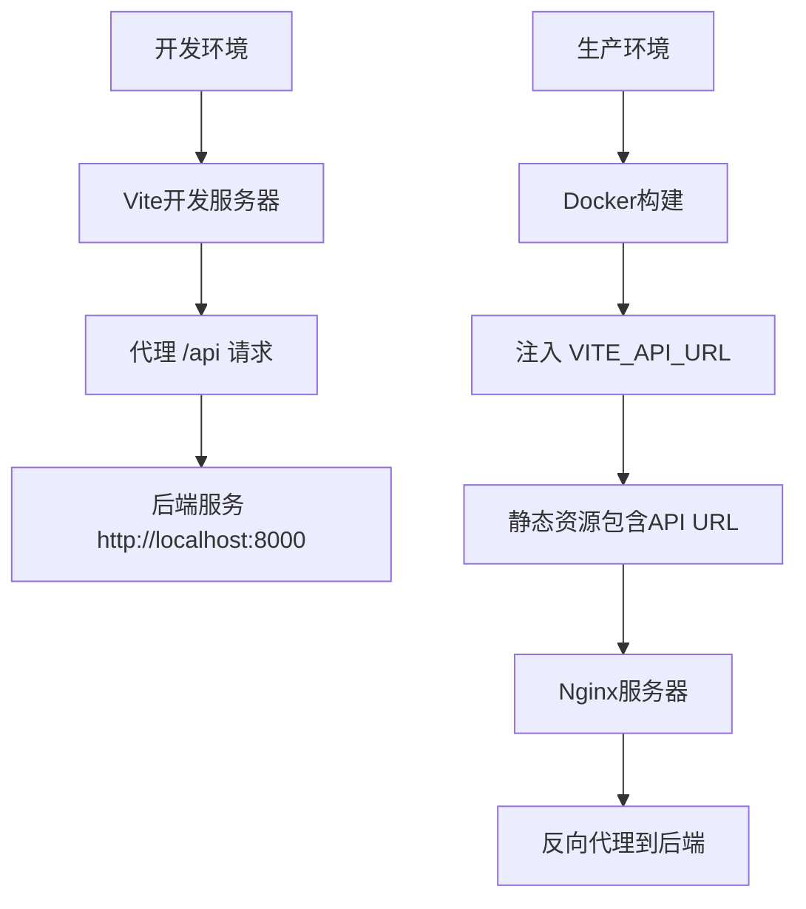
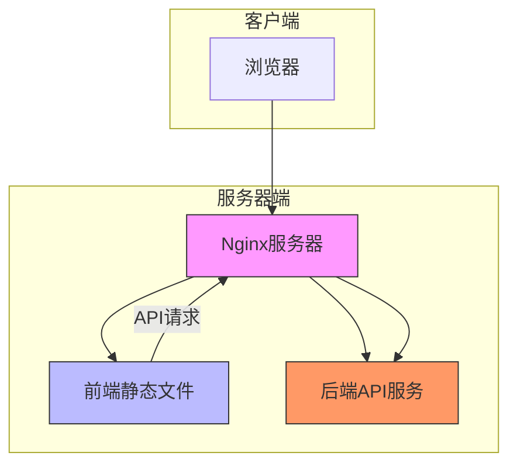

# 环境变量管理

<cite>
**Referenced Files in This Document**  
- [docker-compose.yml](file://docker-compose.yml)
- [frontend/vite.config.ts](file://frontend/vite.config.ts)
- [frontend/src/services/api.ts](file://frontend/src/services/api.ts)
- [frontend/Dockerfile](file://frontend/Dockerfile)
- [frontend/nginx.conf](file://frontend/nginx.conf)
</cite>

## 目录
1. [环境变量注入机制](#环境变量注入机制)
2. [Vite环境变量规范](#vite环境变量规范)
3. [开发与生产环境配置差异](#开发与生产环境配置差异)
4. [代理机制设计原理](#代理机制设计原理)
5. [环境变量最佳实践](#环境变量最佳实践)
6. [扩展应用场景](#扩展应用场景)

## 环境变量注入机制

在Docker Compose部署配置中，前端服务通过`environment`字段定义了`VITE_API_URL=http://localhost:8000/api`环境变量。该变量在构建阶段被Vite构建工具识别并注入到前端代码运行时环境中。这种机制确保了前端应用在容器化部署时能够正确指向后端API服务。

环境变量的注入发生在Docker镜像构建过程中，通过多阶段构建的第一阶段（Node.js构建器）执行`pnpm build`命令时，Vite会自动收集以`VITE_`为前缀的环境变量，并将其嵌入到生成的静态资源中。这种方式实现了配置与代码的分离，同时保证了环境特定配置的灵活性。

**Section sources**
- [docker-compose.yml](file://docker-compose.yml#L56-L57)
- [frontend/Dockerfile](file://frontend/Dockerfile#L19)

## Vite环境变量规范

Vite对环境变量有严格的命名规范要求：所有需要在客户端代码中访问的环境变量必须以`VITE_`为前缀。这一设计是为了明确区分客户端可访问的变量与仅限于服务端使用的敏感变量。在代码中，这些变量通过`import.meta.env.VITE_API_URL`的形式进行访问。

该规范确保了安全性，防止意外暴露敏感的环境变量（如数据库密码、密钥等）到前端代码中。任何不以`VITE_`为前缀的环境变量都不会被Vite注入到客户端代码中，从而避免了潜在的安全风险。这种机制在构建时完成变量替换，生成的静态文件中直接包含具体的URL值。

**Section sources**
- [frontend/src/services/api.ts](file://frontend/src/services/api.ts#L3)
- [docker-compose.yml](file://docker-compose.yml#L56)

## 开发与生产环境配置差异

开发环境与生产环境在API配置上采用了不同的策略。在开发环境中，`vite.config.ts`配置了开发服务器代理，将`/api`请求代理到`http://localhost:8000`，这解决了开发时的跨域问题。而在生产环境中，通过Docker Compose设置的`VITE_API_URL`环境变量直接配置了API基础URL。

这种差异化的配置策略体现了不同环境的需求：开发环境注重便利性和实时性，使用Vite内置代理实现热重载和即时反馈；生产环境则追求稳定性和性能，通过构建时注入的静态配置减少运行时开销。两种方式最终都实现了前端与后端服务的正确通信，但采用了最适合各自环境特性的实现方式。

**Diagram sources**
- [frontend/vite.config.ts](file://frontend/vite.config.ts#L13-L20)
- [docker-compose.yml](file://docker-compose.yml#L56)

**Section sources**
- [frontend/vite.config.ts](file://frontend/vite.config.ts#L13-L20)
- [docker-compose.yml](file://docker-compose.yml#L56)

## 代理机制设计原理

生产环境中使用Nginx代理而非Vite代理是基于性能、安全和架构分离的考虑。Vite代理主要用于开发环境，其轻量级特性适合快速迭代，但不适合生产负载。Nginx作为专业的Web服务器，提供了更强大的性能优化、连接管理、缓存策略和安全特性。

在生产架构中，前端应用被构建为静态文件，由Nginx提供服务。Nginx同时配置了反向代理规则，将`/api`路径的请求转发到后端服务。这种设计实现了环境一致性：无论开发还是生产环境，前端代码都通过相对路径`/api`访问后端，而具体的主机和端口由各环境的代理层处理。

这种架构还增强了安全性，Nginx可以实施更严格的访问控制、速率限制和SSL终止，同时隐藏了后端服务的真实地址。此外，静态文件的缓存和压缩由Nginx高效处理，减轻了应用服务器的负担。

**Diagram sources**
- [frontend/nginx.conf](file://frontend/nginx.conf#L18-L24)
- [frontend/Dockerfile](file://frontend/Dockerfile#L22-L32)

**Section sources**
- [frontend/nginx.conf](file://frontend/nginx.conf#L18-L24)
- [frontend/Dockerfile](file://frontend/Dockerfile#L22-L32)

## 环境变量最佳实践

环境变量管理应遵循以下最佳实践：首先，敏感信息如API密钥、数据库凭证等绝不应以`VITE_`前缀暴露在客户端代码中，这些应通过服务端环境变量管理。其次，应实现多环境配置分离，通过不同的Docker Compose文件或CI/CD变量来管理开发、测试和生产环境的配置差异。

在构建时注入与运行时注入之间需要权衡：构建时注入（如Vite方式）生成的代码更高效，但缺乏灵活性；运行时注入（如通过配置文件或API获取）更灵活但增加复杂性。对于API基础URL这类相对稳定的配置，构建时注入是合适的选择。

此外，建议使用默认值机制，如`import.meta.env.VITE_API_URL || 'http://localhost:8000/api'`，以确保在环境变量未设置时应用仍能正常运行，这提高了代码的健壮性和开发便利性。

**Section sources**
- [frontend/src/services/api.ts](file://frontend/src/services/api.ts#L3)

## 扩展应用场景

环境变量机制可扩展支持功能开关和多租户配置。功能开关可通过布尔型环境变量实现，如`VITE_FEATURE_NEW_UI=true`，在代码中根据此变量决定是否启用新功能界面，便于渐进式发布和A/B测试。

对于多租户场景，可通过环境变量配置租户特定的参数，如`VITE_TENANT_ID`、`VITE_BRAND_NAME`等，使同一套代码能够服务于不同客户。这些变量在构建时根据目标租户注入，生成定制化的前端应用。

更高级的用法包括配置主题、语言包路径、分析服务ID等，通过环境变量实现部署时的个性化定制。这种模式支持"一次构建，多处部署"的DevOps实践，提高了部署效率和一致性。

**Section sources**
- [frontend/src/services/api.ts](file://frontend/src/services/api.ts#L3)
- [docker-compose.yml](file://docker-compose.yml#L56)