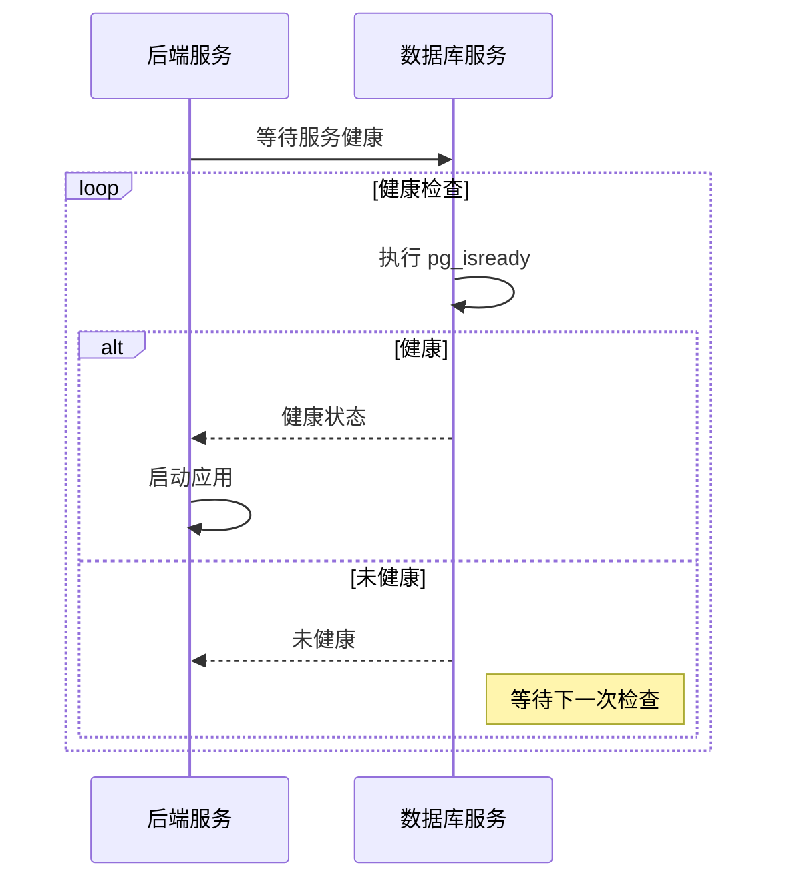
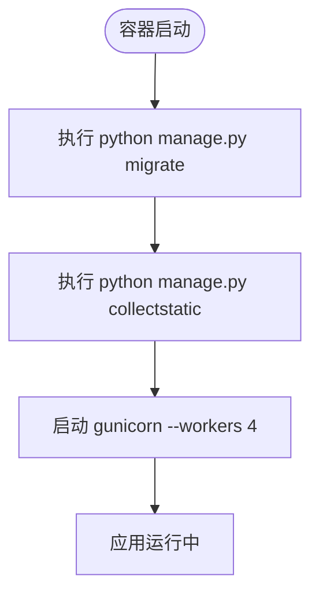

# 后端服务

<cite>
**Referenced Files in This Document**   
- [docker-compose.yml](file://docker-compose.yml)
- [backend/Dockerfile](file://backend/Dockerfile)
- [backend/todo_project/settings.py](file://backend/todo_project/settings.py)
- [backend/manage.py](file://backend/manage.py)
</cite>

## 目录

1. [构建配置](#构建配置)
2. [环境变量配置](#环境变量配置)
3. [卷挂载与持久化](#卷挂载与持久化)
4. [服务依赖与健康检查](#服务依赖与健康检查)
5. [启动命令序列](#启动命令序列)
6. [Docker镜像构建流程](#docker镜像构建流程)
7. [生产环境高可用部署](#生产环境高可用部署)

## 构建配置

后端服务的构建配置定义了镜像的创建方式，通过 `docker-compose.yml` 文件中的 `build` 指令实现。该服务使用 `./backend` 目录作为构建上下文，并指定 `Dockerfile` 作为构建指令文件。这种配置确保了构建过程能够访问后端项目的所有源代码和依赖文件。

**Section sources**
- [docker-compose.yml](file://docker-compose.yml#L21-L25)

## 环境变量配置

后端服务通过环境变量实现安全和灵活的配置管理。在 `docker-compose.yml` 文件中，关键环境变量包括：

- **DEBUG**: 设置为 "False" 以禁用调试模式，确保生产环境的安全性
- **SECRET_KEY**: 用于Django应用加密的密钥，应在生产环境中替换为安全的随机值
- **DATABASE_URL**: 定义数据库连接字符串，指向PostgreSQL服务
- **CORS_ALLOWED_ORIGINS**: 配置跨域资源共享白名单，允许指定的前端域名访问API

这些环境变量在运行时注入容器，并通过 `django-environ` 库在 `settings.py` 中解析，实现了配置与代码的分离。

**Section sources**
- [docker-compose.yml](file://docker-compose.yml#L26-L31)
- [backend/todo_project/settings.py](file://backend/todo_project/settings.py#L13-L21)

## 卷挂载与持久化

后端服务通过卷（volumes）配置实现数据的持久化和共享，确保关键数据在容器重启后不会丢失。配置包含三种类型的卷：

- **代码卷**: `./backend:/app` 实现主机代码与容器的同步，便于开发时的热重载
- **静态资源卷**: `static_volume:/app/staticfiles` 用于持久化Django收集的静态文件
- **媒体文件卷**: `media_volume:/app/media` 用于存储用户上传的媒体文件

在 `settings.py` 中，`STATIC_ROOT` 和 `MEDIA_ROOT` 分别指向 `/app/staticfiles` 和 `/app/media`，与卷挂载路径保持一致，确保文件的正确存储和访问。

```mermaid
graph TD
A[主机文件系统] --> B[容器文件系统]
B --> C[/app]
C --> D[staticfiles]
C --> E[media]
D --> F[静态资源]
E --> G[用户上传文件]
H[static_volume] --> D
I[media_volume] --> E
```

**Diagram sources**
- [docker-compose.yml](file://docker-compose.yml#L32-L35)
- [backend/todo_project/settings.py](file://backend/todo_project/settings.py#L110-L114)

**Section sources**
- [docker-compose.yml](file://docker-compose.yml#L32-L35)
- [backend/todo_project/settings.py](file://backend/todo_project/settings.py#L110-L114)

## 服务依赖与健康检查

后端服务通过 `depends_on` 指令与数据库服务建立依赖关系，确保数据库完全就绪后再启动应用。`db` 服务配置了健康检查机制，使用 `pg_isready` 命令验证数据库的可用性。

健康检查配置包括：
- **测试命令**: `pg_isready -U todo_user` 验证用户连接
- **检查间隔**: 每10秒执行一次检查
- **超时时间**: 5秒内必须响应
- **重试次数**: 最多重试5次

只有当数据库服务通过健康检查后，后端服务才会开始启动，这种机制有效避免了因数据库未就绪导致的应用启动失败。



**Diagram sources**
- [docker-compose.yml](file://docker-compose.yml#L15-L20)
- [docker-compose.yml](file://docker-compose.yml#L38-L40)

**Section sources**
- [docker-compose.yml](file://docker-compose.yml#L15-L20)
- [docker-compose.yml](file://docker-compose.yml#L38-L40)

## 启动命令序列

后端服务的启动命令序列定义了应用初始化的完整流程，通过 `command` 指令在容器启动时依次执行关键操作：

1. **数据库迁移**: `python manage.py migrate` 应用所有数据库迁移，确保数据模型与数据库结构同步
2. **静态文件收集**: `python manage.py collectstatic --noinput` 收集所有Django应用的静态文件到 `STATIC_ROOT`
3. **应用服务器启动**: 使用 `gunicorn` 以4个工作进程启动WSGI应用

该序列确保了应用在启动前完成所有必要的初始化步骤，避免了因数据库结构不匹配或静态文件缺失导致的问题。



**Diagram sources**
- [docker-compose.yml](file://docker-compose.yml#L41-L44)
- [backend/manage.py](file://backend/manage.py#L7-L22)

**Section sources**
- [docker-compose.yml](file://docker-compose.yml#L41-L44)
- [backend/manage.py](file://backend/manage.py#L7-L22)

## Docker镜像构建流程

后端Docker镜像的构建流程在 `Dockerfile` 中定义，遵循最佳实践以创建轻量且安全的生产镜像。构建过程包括：

- 使用 `python:3.11-slim` 作为基础镜像，减少镜像体积
- 安装 `uv` 包管理工具以高效安装依赖
- 复制项目文件并使用 `uv pip install` 安装生产依赖
- 预先执行 `collectstatic` 收集静态文件
- 暴露8000端口供外部访问
- 使用 `gunicorn` 作为生产级WSGI服务器

`uv.lock` 文件确认了 `gunicorn` 作为生产依赖被正确安装，确保了应用服务器的稳定运行。

**Section sources**
- [backend/Dockerfile](file://backend/Dockerfile#L1-L26)

## 生产环境高可用部署

后端服务在生产环境中的部署模式体现了高可用性和可维护性的设计原则。通过Docker Compose编排，服务实现了：

- **配置分离**: 环境变量与代码分离，便于不同环境的配置管理
- **数据持久化**: 关键数据通过命名卷持久化，避免容器重启导致的数据丢失
- **依赖管理**: 明确的服务依赖和健康检查确保了正确的启动顺序
- **自动化初始化**: 启动命令序列自动完成数据库迁移和静态文件收集
- **生产级服务器**: 使用 `gunicorn` 以多工作进程模式运行，提高并发处理能力

这种部署模式确保了后端服务的稳定性、可扩展性和可维护性，为生产环境提供了可靠的运行基础。

**Section sources**
- [docker-compose.yml](file://docker-compose.yml#L21-L44)
- [backend/Dockerfile](file://backend/Dockerfile#L1-L26)