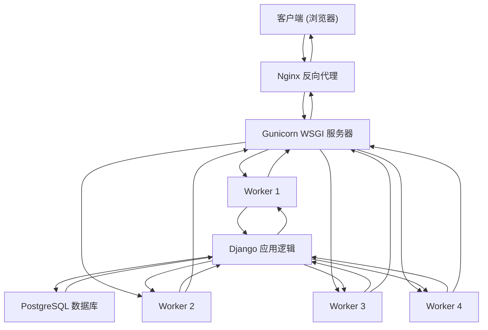

# 启动流程

<cite>
**本文档引用文件**  
- [docker-compose.yml](file://docker-compose.yml)
- [backend/Dockerfile](file://backend/Dockerfile)
- [backend/manage.py](file://backend/manage.py)
- [backend/todo_project/wsgi.py](file://backend/todo_project/wsgi.py)
- [backend/todo_project/settings.py](file://backend/todo_project/settings.py)
- [backend/uv.lock](file://backend/uv.lock)
</cite>

## 目录
1. [启动命令链解析](#启动命令链解析)
2. [Dockerfile与docker-compose.yml的指令关系](#dockerfile与docker-composeyml的指令关系)
3. [服务依赖与健康检查机制](#服务依赖与健康检查机制)
4. [常见启动失败排查路径](#常见启动失败排查路径)
5. [总结](#总结)

## 启动命令链解析

`docker-compose.yml`中backend服务的`command`字段定义了容器启动时执行的完整命令链：

```bash
sh -c "python manage.py migrate && python manage.py collectstatic --noinput && gunicorn --bind 0.0.0.0:8000 --workers 4 todo_project.wsgi:application"
```

该命令链由三个核心操作组成，通过`&&`连接，确保前一个命令成功执行后才执行下一个。

### 数据库迁移（migrate）

`python manage.py migrate`用于将Django应用中的迁移文件（migrations）应用到数据库，实现数据库模式的同步。项目中各应用（如users、tasks、projects、tags）均包含多个迁移文件（如`0001_initial.py`、`0002_initial.py`等），这些文件记录了模型（models）的变更历史。

执行`migrate`时，Django会检查数据库中的`django_migrations`表，判断哪些迁移尚未应用，并按顺序执行相应的SQL语句，确保数据库结构与代码中的模型定义保持一致。

**Section sources**
- [backend/manage.py](file://backend/manage.py#L1-L22)
- [backend/apps/users/migrations/0001_initial.py](file://backend/apps/users/migrations/0001_initial.py)
- [backend/apps/tasks/migrations/0001_initial.py](file://backend/apps/tasks/migrations/0001_initial.py)
- [backend/apps/projects/migrations/0001_initial.py](file://backend/apps/projects/migrations/0001_initial.py)
- [backend/apps/tags/migrations/0001_initial.py](file://backend/apps/tags/migrations/0001_initial.py)

### 静态资源收集（collectstatic）

`python manage.py collectstatic --noinput`负责将分散在各个Django应用（apps）和第三方包中的静态文件（如CSS、JavaScript、图片）集中复制到一个统一的目录中，以便Web服务器高效提供服务。

根据`settings.py`中的配置：
```python
STATIC_ROOT = BASE_DIR / 'staticfiles'
```
所有静态文件将被收集到`/app/staticfiles`目录下。`--noinput`参数表示在非交互模式下运行，不提示确认，适合自动化流程。

`docker-compose.yml`中通过卷（volume）将此目录映射为`static_volume`，前端Nginx容器可直接访问该卷以提供静态资源服务。

**Section sources**
- [backend/todo_project/settings.py](file://backend/todo_project/settings.py#L100-L105)
- [backend/Dockerfile](file://backend/Dockerfile#L19)
- [docker-compose.yml](file://docker-compose.yml#L34)

### WSGI应用启动（gunicorn）

`gunicorn --bind 0.0.0.0:8000 --workers 4 todo_project.wsgi:application`使用Gunicorn作为WSGI服务器来运行Django应用。

- `--bind 0.0.0.0:8000`：绑定到所有网络接口的8000端口，允许容器外部访问。
- `--workers 4`：启动4个工作进程（worker processes），以并行处理请求，提升应用的并发处理能力。工作进程数通常设置为CPU核心数的1-2倍。
- `todo_project.wsgi:application`：指定WSGI应用的入口点。`wsgi.py`文件中定义了`application`对象，它是Django应用与WSGI服务器之间的标准接口。

Gunicorn作为生产级的Python WSGI HTTP服务器，负责接收HTTP请求，将其转发给Django应用处理，并返回响应。



**Diagram sources**
- [backend/todo_project/wsgi.py](file://backend/todo_project/wsgi.py#L1-L11)
- [backend/Dockerfile](file://backend/Dockerfile#L25)
- [docker-compose.yml](file://docker-compose.yml#L44)

**Section sources**
- [backend/todo_project/wsgi.py](file://backend/todo_project/wsgi.py#L1-L11)
- [backend/Dockerfile](file://backend/Dockerfile#L24-L25)
- [backend/uv.lock](file://backend/uv.lock#L178-L197)

## Dockerfile与docker-compose.yml的指令关系

Docker镜像的启动行为由`CMD`指令定义，而容器的启动行为则由`docker-compose.yml`中的`command`指令控制。两者关系遵循**覆盖原则**。

在`backend/Dockerfile`中，最后一行定义了默认的启动命令：
```Dockerfile
CMD ["gunicorn", "--bind", "0.0.0.0:8000", "--workers", "4", "todo_project.wsgi:application"]
```

然而，在`docker-compose.yml`中，`backend`服务显式指定了`command`：
```yaml
command: >
  sh -c "python manage.py migrate &&
         python manage.py collectstatic --noinput &&
         gunicorn --bind 0.0.0.0:8000 --workers 4 todo_project.wsgi:application"
```

`docker-compose.yml`中的`command`会**完全覆盖**Dockerfile中的`CMD`指令。这意味着，当使用`docker-compose up`启动容器时，执行的是`docker-compose.yml`中定义的复合命令链，而不是Dockerfile中单一的Gunicorn启动命令。这种设计允许在编排层面定义更复杂的、包含初始化步骤的启动流程，而Dockerfile则保持其通用性和可复用性。

**Section sources**
- [backend/Dockerfile](file://backend/Dockerfile#L25)
- [docker-compose.yml](file://docker-compose.yml#L41-L44)

## 服务依赖与健康检查机制

为了确保应用的稳定启动，`docker-compose.yml`通过`depends_on`和`healthcheck`实现了精确的服务启动顺序控制。

### 依赖声明

`backend`服务通过`depends_on`声明了对`db`服务的依赖：
```yaml
depends_on:
  db:
    condition: service_healthy
```

这表示`backend`容器的启动将**等待**`db`容器达到“健康”（healthy）状态后才开始执行其`command`。

### 健康检查

`db`服务配置了`healthcheck`：
```yaml
healthcheck:
  test: ["CMD-SHELL", "pg_isready -U todo_user"]
  interval: 10s
  timeout: 5s
  retries: 5
```

- `test`: 使用`pg_isready`命令检查PostgreSQL数据库是否接受连接。
- `interval`: 每10秒检查一次。
- `timeout`: 检查命令5秒内无响应则超时。
- `retries`: 连续5次检查失败后，容器状态才被标记为不健康。

此机制确保了只有当数据库进程完全启动并准备好接受连接时，`db`服务才会被标记为“健康”。此时，`backend`服务才会开始执行其启动命令链。这从根本上避免了`python manage.py migrate`命令因数据库未就绪而失败的问题。


**Diagram sources**
- [docker-compose.yml](file://docker-compose.yml#L15-L20)
- [docker-compose.yml](file://docker-compose.yml#L38-L40)

**Section sources**
- [docker-compose.yml](file://docker-compose.yml#L15-L20)
- [docker-compose.yml](file://docker-compose.yml#L38-L40)

## 常见启动失败排查路径

尽管有完善的启动流程，但仍可能遇到问题。以下是常见故障的排查路径。

### 数据库迁移冲突

**现象**：`migrate`命令执行失败，日志中出现`django.db.migrations.exceptions.InconsistentMigrationHistory`或SQL错误。

**排查路径**：
1.  **检查迁移文件一致性**：确保所有开发环境和生产环境的迁移历史一致。避免在不同分支上创建同名迁移文件。
2.  **检查数据库状态**：进入`todo-backend`容器，手动执行`python manage.py showmigrations`，查看哪些迁移已应用。
3.  **解决冲突**：若存在冲突，可能需要手动编辑迁移文件或使用`--fake`参数标记迁移为已应用（需谨慎）。

**Section sources**
- [backend/manage.py](file://backend/manage.py#L1-L22)
- [docker-compose.yml](file://docker-compose.yml#L42)

### 静态文件权限问题

**现象**：`collectstatic`命令失败，提示`PermissionError`。

**排查路径**：
1.  **检查卷权限**：确保`static_volume`卷的挂载目录在宿主机上有正确的读写权限。
2.  **检查容器内用户**：确认执行`collectstatic`命令的用户（通常是root）对`/app/staticfiles`目录有写权限。Dockerfile中未指定`USER`，默认为root，通常无此问题。

**Section sources**
- [backend/Dockerfile](file://backend/Dockerfile#L19)
- [docker-compose.yml](file://docker-compose.yml#L34)

### Gunicorn配置错误

**现象**：`gunicorn`启动失败，无法绑定端口或工作进程崩溃。

**排查路径**：
1.  **检查端口占用**：确认宿主机的8000端口未被其他进程占用。
2.  **检查WSGI模块路径**：验证`todo_project.wsgi:application`路径是否正确。检查`wsgi.py`文件是否存在且`application`变量已定义。
3.  **检查依赖**：确保`gunicorn`已正确安装。`uv.lock`文件显示`gunicorn>=21.2.0`是项目依赖，应已通过`RUN uv pip install --system -r pyproject.toml`安装。

**Section sources**
- [backend/todo_project/wsgi.py](file://backend/todo_project/wsgi.py#L1-L11)
- [backend/Dockerfile](file://backend/Dockerfile#L16)
- [backend/uv.lock](file://backend/uv.lock#L178-L197)

## 总结

`docker-compose.yml`中backend服务的`command`命令链是一个精心设计的生产环境启动流程。它首先通过`migrate`同步数据库模式，再通过`collectstatic`准备静态资源，最后由`gunicorn`以多进程模式启动应用。该`command`覆盖了Dockerfile中的`CMD`，提供了更灵活的启动控制。通过`depends_on`结合`service_healthy`条件，系统确保了数据库完全就绪后才执行数据库操作，有效避免了启动时序问题。理解这一流程对于维护和排查Django应用的容器化部署至关重要。