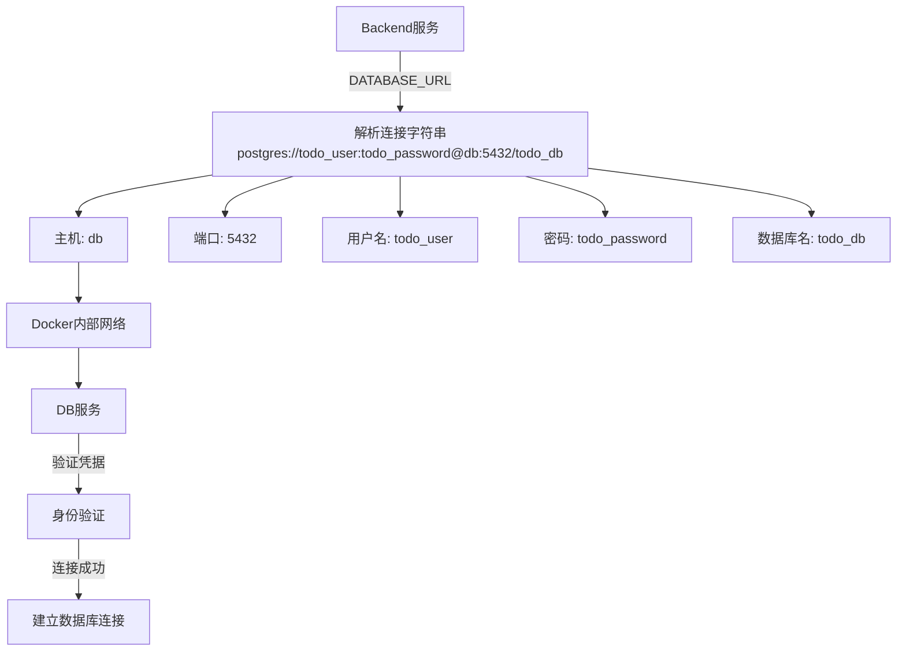
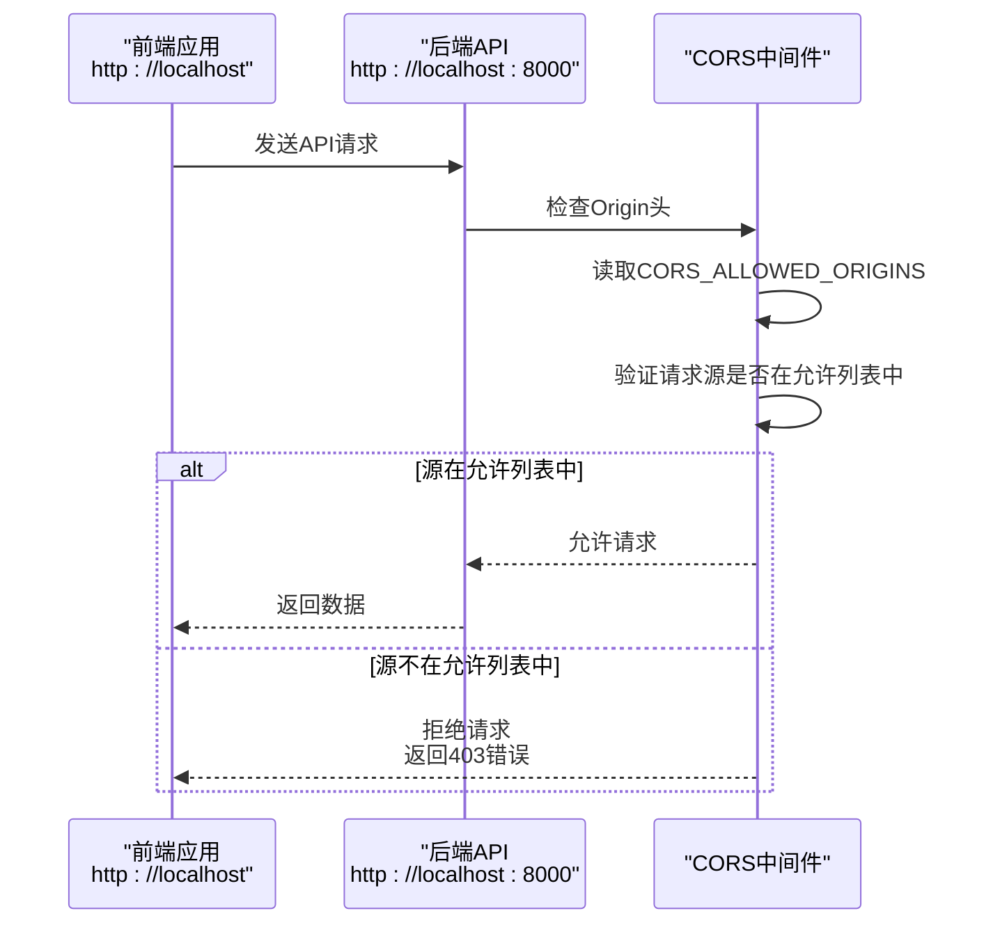

# 环境变量配置

<cite>
**Referenced Files in This Document**   
- [docker-compose.yml](file://docker-compose.yml)
- [settings.py](file://backend/todo_project/settings.py)
- [Dockerfile](file://backend/Dockerfile)
</cite>

## 目录
1. [环境变量配置概述](#环境变量配置概述)
2. [核心环境变量详解](#核心环境变量详解)
3. [数据库连接配置](#数据库连接配置)
4. [跨域资源共享配置](#跨域资源共享配置)
5. [生产环境安全实践](#生产环境安全实践)

## 环境变量配置概述

在Django项目中，环境变量是实现配置分离和安全管理的关键机制。本项目通过`docker-compose.yml`文件为backend服务定义了一系列环境变量，这些变量在运行时被Django的`django-environ`库读取并应用于应用程序配置。这种配置方式实现了开发、测试和生产环境之间的隔离，同时避免了敏感信息硬编码在代码中。

环境变量的加载流程如下：Docker容器启动时，`docker-compose.yml`中定义的环境变量被注入到backend容器中；Django应用启动时，`settings.py`文件中的`environ.Env`实例读取这些环境变量，并根据预定义的类型转换规则将其应用于相应的配置项。

**Section sources**
- [docker-compose.yml](file://docker-compose.yml#L26-L32)
- [settings.py](file://backend/todo_project/settings.py#L12-L18)

## 核心环境变量详解

### DEBUG
`DEBUG`环境变量控制Django应用的调试模式。当设置为`"True"`时，应用会显示详细的错误页面和调试信息，便于开发过程中的问题排查；在生产环境中应设置为`"False"`以避免敏感信息泄露。该变量在`settings.py`中被定义为布尔类型，默认值为`False`。

### SECRET_KEY
`SECRET_KEY`是Django用于加密签名的核心密钥，用于保护会话、密码重置令牌等安全敏感功能。此密钥必须保持绝对机密，且在生产环境中应使用足够长的随机字符串。在当前配置中，该值为占位符，部署生产环境时必须更换为强随机密钥。

### ALLOWED_HOSTS
`ALLOWED_HOSTS`定义了允许访问Django应用的主机名列表，是防止HTTP Host头攻击的重要安全措施。配置中包含`localhost`、`127.0.0.1`和`backend`，分别对应本地开发访问、容器内访问和Docker网络内部服务通信。生产环境中应明确列出所有合法的域名。

**Section sources**
- [docker-compose.yml](file://docker-compose.yml#L27-L30)
- [settings.py](file://backend/todo_project/settings.py#L20-L27)

## 数据库连接配置

### DATABASE_URL环境变量

`DATABASE_URL`环境变量采用标准的PostgreSQL连接字符串格式，实现了backend服务与db服务之间的通信配置。其格式为`postgres://用户名:密码@主机:端口/数据库名`，在本项目中具体值为`postgres://todo_user:todo_password@db:5432/todo_db`。

**Diagram sources**
- [docker-compose.yml](file://docker-compose.yml#L30)
- [settings.py](file://backend/todo_project/settings.py#L83-L84)

### Django中的数据库配置

在`settings.py`文件中，`DATABASES`配置项使用`env.db()`方法解析`DATABASE_URL`环境变量。`django-environ`库自动将连接字符串转换为Django兼容的数据库配置字典，包括引擎类型、主机、端口、用户名、密码和数据库名称等参数。这种配置方式不仅简化了数据库连接的设置，还支持多种数据库后端的无缝切换。

**Section sources**
- [settings.py](file://backend/todo_project/settings.py#L82-L85)

## 跨域资源共享配置

### CORS_ALLOWED_ORIGINS环境变量

`CORS_ALLOWED_ORIGINS`环境变量定义了允许跨域访问API的前端源列表，是实现前后端分离架构安全通信的关键配置。当前配置允许`http://localhost`、`http://localhost:80`和`http://127.0.0.1`三个源访问后端API，覆盖了常见的本地开发场景。

**Diagram sources**
- [docker-compose.yml](file://docker-compose.yml#L31)
- [settings.py](file://backend/todo_project/settings.py#L150-L154)

### Django中的CORS配置

项目通过`django-cors-headers`第三方包实现跨域资源共享控制。在`settings.py`中，`CORS_ALLOWED_ORIGINS`配置项使用`env.list()`方法将环境变量中的逗号分隔字符串解析为Python列表。同时，`CORS_ALLOW_CREDENTIALS = True`允许跨域请求携带认证信息（如cookies），这对于需要用户认证的应用至关重要。`corsheaders.middleware.CorsMiddleware`中间件在请求处理流程中拦截并处理CORS相关头信息。

**Section sources**
- [settings.py](file://backend/todo_project/settings.py#L52-L53)
- [settings.py](file://backend/todo_project/settings.py#L150-L156)

## 生产环境安全实践

### 环境变量管理策略

在生产环境中，直接在`docker-compose.yml`文件中明文存储敏感信息存在安全风险。推荐采用以下三种安全实践：

1. **.env文件**: 将敏感环境变量移至`.env`文件中，并在`docker-compose.yml`中通过`env_file`指令引用。`.env`文件应添加到`.gitignore`中，避免提交到版本控制系统。

2. **Secret Manager**: 使用云平台提供的密钥管理服务（如AWS Secrets Manager、Google Cloud Secret Manager或Azure Key Vault），在容器启动时动态注入环境变量。

3. **Kubernetes Secrets**: 在Kubernetes环境中，使用Secrets资源存储敏感信息，并通过环境变量或卷挂载的方式提供给Pod。

### 安全配置建议

- **SECRET_KEY管理**: 生产环境的`SECRET_KEY`应使用`openssl rand -base64 32`等工具生成的强随机字符串，并定期轮换。
- **数据库凭据**: 数据库用户名和密码应遵循最小权限原则，避免使用超级用户账户。
- **HTTPS强制**: 生产环境中应配置反向代理（如Nginx）强制HTTPS，并在Django设置中启用`SECURE_SSL_REDIRECT = True`。
- **环境隔离**: 为开发、测试和生产环境维护独立的配置文件和数据库实例，避免数据污染和配置冲突。

**Section sources**
- [docker-compose.yml](file://docker-compose.yml#L26-L32)
- [settings.py](file://backend/todo_project/settings.py#L12-L18)