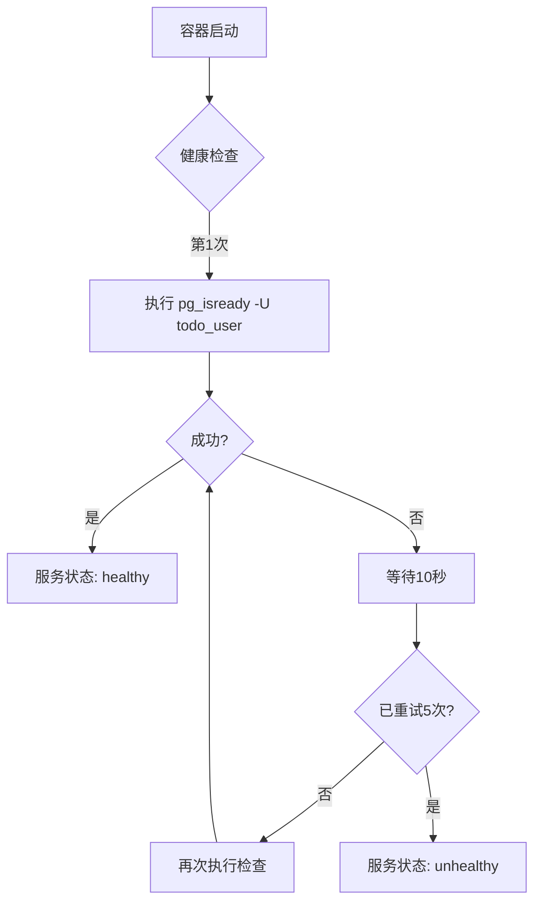

# 数据库服务

<cite>
**Referenced Files in This Document**   
- [docker-compose.yml](file://docker-compose.yml)
- [docker-compose.dev.yml](file://docker-compose.dev.yml)
</cite>

## 目录

1. [数据库服务](#数据库服务)
2. [生产环境数据库配置](#生产环境数据库配置)
3. [开发环境数据库配置](#开发环境数据库配置)
4. [健康检查机制](#健康检查机制)
5. [数据持久化策略](#数据持久化策略)
6. [服务依赖与稳定性](#服务依赖与稳定性)

## 生产环境数据库配置

`docker-compose.yml` 文件中的 `db` 服务定义了生产环境下的数据库配置。该服务使用 `postgres:15-alpine` 镜像，这是一个轻量级的 PostgreSQL 15 版本，基于 Alpine Linux 构建，适用于资源受限的环境。

数据库通过环境变量设置了初始数据库名称（`POSTGRES_DB`）、用户名（`POSTGRES_USER`）和密码（`POSTGRES_PASSWORD`），分别为 `todo_db`、`todo_user` 和 `todo_password`。这些配置确保了应用能够以预定义的凭据连接到数据库。

**Section sources**
- [docker-compose.yml](file://docker-compose.yml#L4-L10)

## 开发环境数据库配置

在 `docker-compose.dev.yml` 文件中，`db` 服务的配置与生产环境基本一致，但存在关键差异以支持开发需求。容器名称被设置为 `todo-db-dev`，便于在本地环境中区分开发与生产实例。

更重要的是，数据卷使用了独立的 `postgres_data_dev` 命名卷，路径为 `/var/lib/postgresql/data`。这种设计实现了开发数据与生产数据的完全隔离，防止开发过程中的数据操作影响生产环境或团队成员之间的数据冲突。

**Section sources**
- [docker-compose.dev.yml](file://docker-compose.dev.yml#L4-L12)

## 健康检查机制

数据库服务配置了基于 `pg_isready` 命令的健康检查机制，用于判断 PostgreSQL 实例是否已准备好接受连接。健康检查的配置如下：

- **测试命令**：`pg_isready -U todo_user`，使用指定用户检查数据库就绪状态
- **检查间隔**：每 10 秒执行一次检查（`interval: 10s`）
- **超时时间**：每次检查最多等待 5 秒（`timeout: 5s`）
- **重试次数**：最多重试 5 次（`retries: 5`）

该机制确保了只有当数据库服务完全启动并可连接时，依赖它的其他服务（如 `backend`）才会开始启动，从而避免了因数据库未就绪导致的应用启动失败。

**Diagram sources**
- [docker-compose.yml](file://docker-compose.yml#L15-L19)
- [docker-compose.dev.yml](file://docker-compose.dev.yml#L15-L19)

## 数据持久化策略

为确保数据库数据在容器重启后不丢失，`db` 服务通过 Docker 命名卷（Named Volume）实现数据持久化。在生产环境中，数据被挂载到名为 `postgres_data` 的卷，映射至容器内的 `/var/lib/postgresql/data` 目录，这是 PostgreSQL 默认的数据存储路径。

命名卷由 Docker 管理，独立于容器生命周期，即使容器被删除或重建，数据仍保留在卷中。该策略为应用提供了稳定可靠的数据存储支持，是生产环境部署的关键保障。

**Diagram sources**
- [docker-compose.yml](file://docker-compose.yml#L11-L12)
- [docker-compose.yml](file://docker-compose.yml#L59)

## 服务依赖与稳定性

`backend` 服务通过 `depends_on` 指令明确依赖 `db` 服务，并设置了 `service_healthy` 条件。这意味着后端应用仅在数据库服务通过健康检查后才会启动。

此依赖关系确保了应用启动顺序的正确性，避免了因数据库未准备就绪而导致的连接错误或迁移失败。结合数据持久化和健康检查机制，整个系统实现了高稳定性，能够可靠地为前端应用提供数据支持。

**Section sources**
- [docker-compose.yml](file://docker-compose.yml#L38-L40)