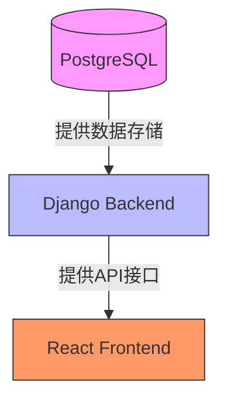

# 服务编排

<cite>
**Referenced Files in This Document**   
- [docker-compose.yml](file://docker-compose.yml)
- [docker-compose.dev.yml](file://docker-compose.dev.yml)
- [backend/Dockerfile](file://backend/Dockerfile)
- [frontend/Dockerfile](file://frontend/Dockerfile)
- [backend/todo_project/settings.py](file://backend/todo_project/settings.py)
- [frontend/src/services/api.ts](file://frontend/src/services/api.ts)
</cite>

## 目录
1. [核心服务解析](#核心服务解析)
2. [PostgreSQL服务详解](#postgresql服务详解)
3. [Backend服务剖析](#backend服务剖析)
4. [Frontend服务分析](#frontend服务分析)
5. [开发与生产配置对比](#开发与生产配置对比)
6. [服务依赖关系](#服务依赖关系)
7. [环境变量配置](#环境变量配置)
8. [启动流程与命令链](#启动流程与命令链)

## 核心服务解析

本项目通过Docker Compose编排了三个核心服务：db（PostgreSQL数据库）、backend（Django后端应用）和frontend（React前端应用）。这些服务协同工作，构成了完整的全栈应用架构。每个服务都有明确的职责和配置，确保了系统的可维护性和可扩展性。

**Section sources**
- [docker-compose.yml](file://docker-compose.yml#L3-L62)

## PostgreSQL服务详解

PostgreSQL服务作为系统的数据存储核心，采用了`postgres:15-alpine`镜像，具有轻量级和高效率的特点。该服务通过数据卷`postgres_data`实现了数据的持久化存储，确保容器重启后数据不会丢失。健康检查机制使用`pg_isready`命令对数据库进行状态检测，配置了5次重试机会，保证了服务的稳定性和可靠性。

**Section sources**
- [docker-compose.yml](file://docker-compose.yml#L4-L20)

## Backend服务剖析

Backend服务基于Django框架构建，其构建上下文位于`./backend`目录。服务通过环境变量进行关键配置，包括数据库连接、安全密钥和跨域资源共享（CORS）设置。启动命令链按照严格的顺序执行：首先运行数据库迁移（migrate），然后收集静态文件（collectstatic），最后启动Gunicorn服务器。这种顺序确保了应用在启动前已完成所有必要的初始化工作。

**Section sources**
- [docker-compose.yml](file://docker-compose.yml#L21-L45)
- [backend/Dockerfile](file://backend/Dockerfile#L1-L26)

## Frontend服务分析

Frontend服务是一个React应用，通过VITE_API_URL环境变量与后端API进行通信。该服务依赖于backend服务，确保在后端服务启动并健康后才开始运行。前端应用通过axios库与后端进行HTTP通信，并实现了JWT令牌的自动刷新机制，提高了用户体验和安全性。

**Section sources**
- [docker-compose.yml](file://docker-compose.yml#L46-L57)
- [frontend/Dockerfile](file://frontend/Dockerfile#L1-L33)
- [frontend/src/services/api.ts](file://frontend/src/services/api.ts#L1-L59)

## 开发与生产配置对比

开发配置（docker-compose.dev.yml）与生产配置的主要差异体现在调试和开发便利性上。开发配置专注于数据库服务，提供了独立的数据卷`postgres_data_dev`，便于开发环境的数据隔离。而生产配置则包含了完整的前后端服务编排，配置了更严格的安全设置和生产级的运行参数，如关闭调试模式和使用生产级的密钥。

**Section sources**
- [docker-compose.yml](file://docker-compose.yml#L1-L62)
- [docker-compose.dev.yml](file://docker-compose.dev.yml#L1-L23)

## 服务依赖关系

服务间的依赖关系通过`depends_on`指令明确声明。backend服务依赖于db服务，并且设置了`service_healthy`条件，确保数据库完全就绪后才启动应用。frontend服务依赖于backend服务，保证了前端应用在后端API可用后才开始运行。这种依赖关系的明确声明避免了服务启动时序问题，提高了系统的稳定性。

**Diagram sources**
- [docker-compose.yml](file://docker-compose.yml#L39-L40)
- [docker-compose.yml](file://docker-compose.yml#L53-L54)

**Section sources**
- [docker-compose.yml](file://docker-compose.yml#L38-L57)

## 环境变量配置

环境变量在服务配置中扮演着关键角色。backend服务使用DATABASE_URL连接数据库，SECRET_KEY用于加密操作，CORS_ALLOWED_ORIGINS配置了允许的跨域请求来源。frontend服务通过VITE_API_URL环境变量确定后端API的地址。这些环境变量的使用使得配置与代码分离，提高了应用的灵活性和安全性。

**Section sources**
- [docker-compose.yml](file://docker-compose.yml#L26-L32)
- [docker-compose.yml](file://docker-compose.yml#L55-L57)
- [backend/todo_project/settings.py](file://backend/todo_project/settings.py#L20-L21)
- [backend/todo_project/settings.py](file://backend/todo_project/settings.py#L150-L154)
- [frontend/src/services/api.ts](file://frontend/src/services/api.ts#L3)

## 启动流程与命令链

Backend服务的启动流程设计严谨，通过命令链确保了正确的初始化顺序。首先执行`python manage.py migrate`应用数据库迁移，确保数据模型与数据库结构一致。然后运行`python manage.py collectstatic --noinput`收集所有静态文件到指定目录。最后启动Gunicorn服务器处理HTTP请求。这种分步启动策略避免了因初始化不完整导致的服务故障。

**Section sources**
- [docker-compose.yml](file://docker-compose.yml#L41-L44)
- [backend/Dockerfile](file://backend/Dockerfile#L19)