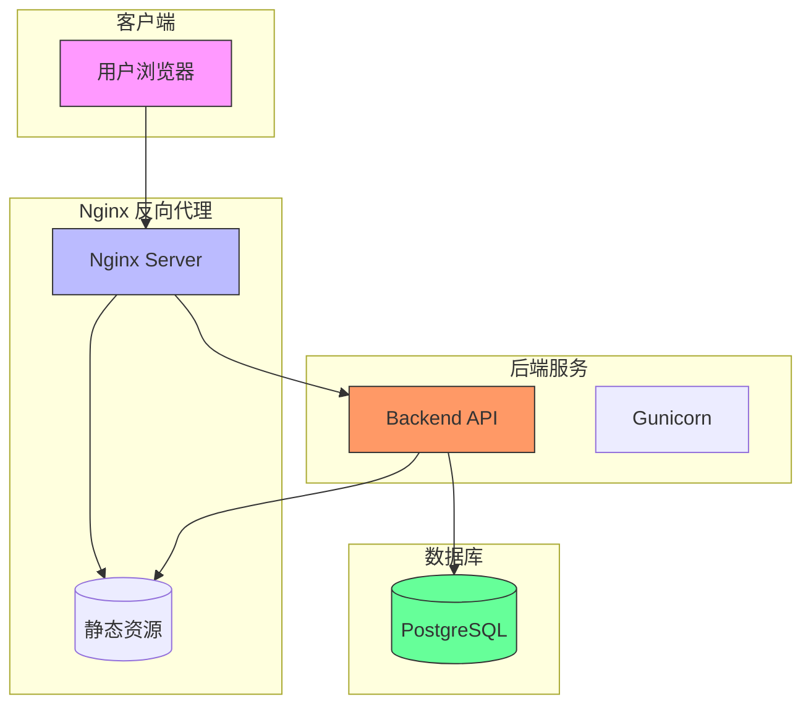
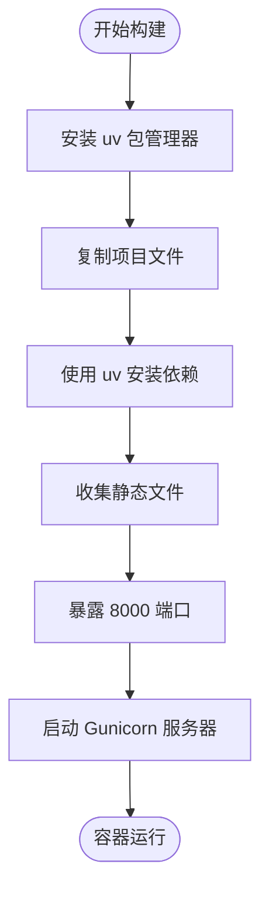
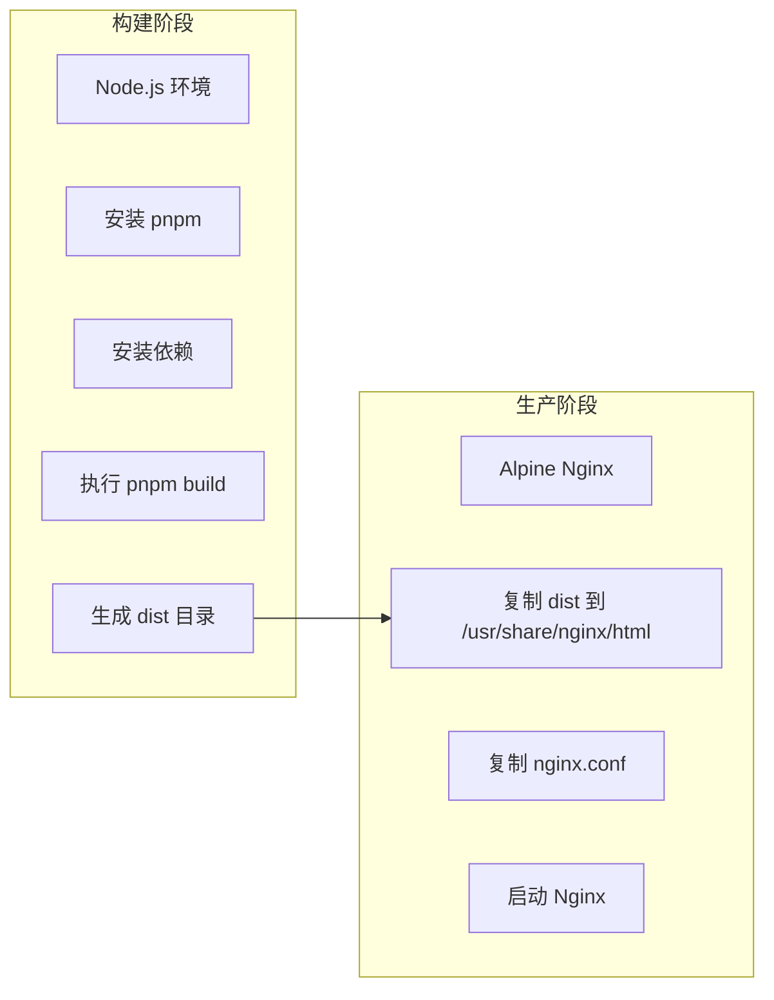

# 部署

<cite>
**本文档中引用的文件**  
- [docker-compose.yml](file://docker-compose.yml)
- [backend/Dockerfile](file://backend/Dockerfile)
- [frontend/Dockerfile](file://frontend/Dockerfile)
- [frontend/nginx.conf](file://frontend/nginx.conf)
- [backend/todo_project/settings.py](file://backend/todo_project/settings.py)
- [backend/todo_project/wsgi.py](file://backend/todo_project/wsgi.py)
- [frontend/vite.config.ts](file://frontend/vite.config.ts)
- [docker-compose.dev.yml](file://docker-compose.dev.yml)
- [Makefile](file://Makefile)
</cite>

## 目录
1. [简介](#简介)
2. [生产环境部署架构](#生产环境部署架构)
3. [Docker Compose 服务协同机制](#docker-compose-服务协同机制)
4. [后端多阶段构建与 Gunicorn 配置](#后端多阶段构建与-gunicorn-配置)
5. [前端构建流程与 Nginx 服务集成](#前端构建流程与-nginx-服务集成)
6. [Nginx 反向代理与静态资源配置](#nginx-反向代理与静态资源配置)
7. [生产环境最佳实践](#生产环境最佳实践)
8. [开发与生产环境部署差异](#开发与生产环境部署差异)
9. [总结](#总结)

## 简介

本部署文档详细说明如何将 Todo 应用部署到生产环境。系统采用 Docker Compose 编排前端、后端和数据库服务，通过 Nginx 实现反向代理和静态资源服务。文档涵盖多阶段构建、Gunicorn 配置、环境变量管理、日志与监控等关键部署实践，确保系统在生产环境中的稳定性与安全性。

## 生产环境部署架构

**图示来源**  
- [docker-compose.yml](file://docker-compose.yml#L3-L62)
- [frontend/nginx.conf](file://frontend/nginx.conf#L1-L32)

## Docker Compose 服务协同机制

`docker-compose.yml` 定义了三个核心服务：数据库（db）、后端（backend）和前端（frontend），它们通过网络和依赖关系协同工作。

- **数据库服务**：使用 `postgres:15-alpine` 镜像，配置了持久化卷 `postgres_data` 和健康检查机制，确保数据库准备就绪后再启动依赖服务。
- **后端服务**：基于本地 `backend` 目录构建，依赖数据库服务健康状态（`service_healthy`），通过环境变量配置数据库连接和安全设置。
- **前端服务**：基于 `frontend` 目录构建，依赖后端服务启动完成，通过 Nginx 提供静态资源服务和 API 反向代理。

服务间通过 Docker 内部网络通信，前端通过 `http://backend:8000` 访问后端 API，实现前后端解耦。

**本节来源**  
- [docker-compose.yml](file://docker-compose.yml#L3-L62)

## 后端多阶段构建与 Gunicorn 配置

后端采用单阶段 Docker 构建，但集成了依赖安装、静态资源收集和运行时配置。

**图示来源**  
- [backend/Dockerfile](file://backend/Dockerfile#L1-L26)
- [backend/todo_project/settings.py](file://backend/todo_project/settings.py#L80-L120)

### Gunicorn 服务器配置

后端通过 Gunicorn 作为 WSGI 服务器运行，配置如下：
- 绑定地址：`0.0.0.0:8000`，允许外部访问
- 工作进程数：4 个 worker，提升并发处理能力
- 应用入口：`todo_project.wsgi:application`，符合 Django WSGI 规范

Gunicorn 在生产环境中提供比 Django 开发服务器更优的性能和稳定性。

**本节来源**  
- [backend/Dockerfile](file://backend/Dockerfile#L24-L25)
- [backend/todo_project/wsgi.py](file://backend/todo_project/wsgi.py#L1-L11)

## 前端构建流程与 Nginx 服务集成

前端 Dockerfile 采用多阶段构建策略，分离构建环境与运行环境。

**图示来源**  
- [frontend/Dockerfile](file://frontend/Dockerfile#L1-L33)
- [frontend/vite.config.ts](file://frontend/vite.config.ts#L1-L23)

构建阶段使用 Node.js 安装依赖并执行 `pnpm build` 生成生产级静态资源，生产阶段使用轻量级 Nginx 镜像部署，显著减小镜像体积并提升安全性。

**本节来源**  
- [frontend/Dockerfile](file://frontend/Dockerfile#L1-L33)

## Nginx 反向代理与静态资源配置

`nginx.conf` 配置了反向代理规则和静态资源优化策略。

### 反向代理规则

- `/api` 路径请求被代理到后端服务 `http://backend:8000`
- 设置了 `Host`、`X-Real-IP`、`X-Forwarded-For` 等头部信息，确保后端能正确识别客户端信息

### 静态资源服务

- 根路径 `/` 使用 `try_files $uri $uri/ /index.html` 支持前端路由（SPA）
- 静态资源（JS、CSS、图片等）设置 1 年缓存，提升加载性能
- 启用 Gzip 压缩，减少传输体积

**本节来源**  
- [frontend/nginx.conf](file://frontend/nginx.conf#L1-L32)

## 生产环境最佳实践

### 环境变量管理

- 使用 `.env` 文件管理敏感信息（如 `SECRET_KEY`、数据库密码）
- 生产环境中应避免在 `docker-compose.yml` 中硬编码敏感信息
- `SECRET_KEY` 必须在生产环境中更换为高强度随机字符串

### 日志收集

- 建议将容器日志重定向到集中式日志系统（如 ELK 或 Loki）
- Django 可配置日志处理器输出到 stdout，便于 Docker 收集

### 监控设置

- 为关键服务配置健康检查（如数据库的 `pg_isready`）
- 使用 Prometheus + Grafana 监控系统性能
- 前端可集成 Sentry 等错误监控工具

**本节来源**  
- [docker-compose.yml](file://docker-compose.yml#L27-L31)
- [backend/todo_project/settings.py](file://backend/todo_project/settings.py#L1-L49)

## 开发与生产环境部署差异

| 特性 | 开发环境 | 生产环境 |
|------|----------|----------|
| **数据库** | 使用 `docker-compose.dev.yml`，无持久化卷 | 使用 `docker-compose.yml`，有持久化卷 |
| **前端服务** | Vite 开发服务器，端口 5173 | Nginx 静态服务，端口 80 |
| **后端服务** | Django 开发服务器 | Gunicorn 生产服务器 |
| **构建方式** | 直接挂载源码，热重载 | 多阶段构建，生成优化镜像 |
| **API 代理** | Vite 配置代理到 `localhost:8000` | Nginx 反向代理到 `backend:8000` |
| **静态资源** | 动态生成，无缓存 | 预构建，长期缓存 |

**本节来源**  
- [docker-compose.dev.yml](file://docker-compose.dev.yml#L1-L23)
- [vite.config.ts](file://frontend/vite.config.ts#L15-L19)
- [docker-compose.yml](file://docker-compose.yml#L46-L57)

## 总结

本部署方案通过 Docker Compose 实现了前后端分离架构的高效部署。后端采用 Gunicorn 提升性能，前端通过多阶段构建优化镜像，Nginx 实现反向代理与静态资源服务。建议在生产部署时加强环境变量管理、日志收集和系统监控，确保应用的高可用性与可维护性。