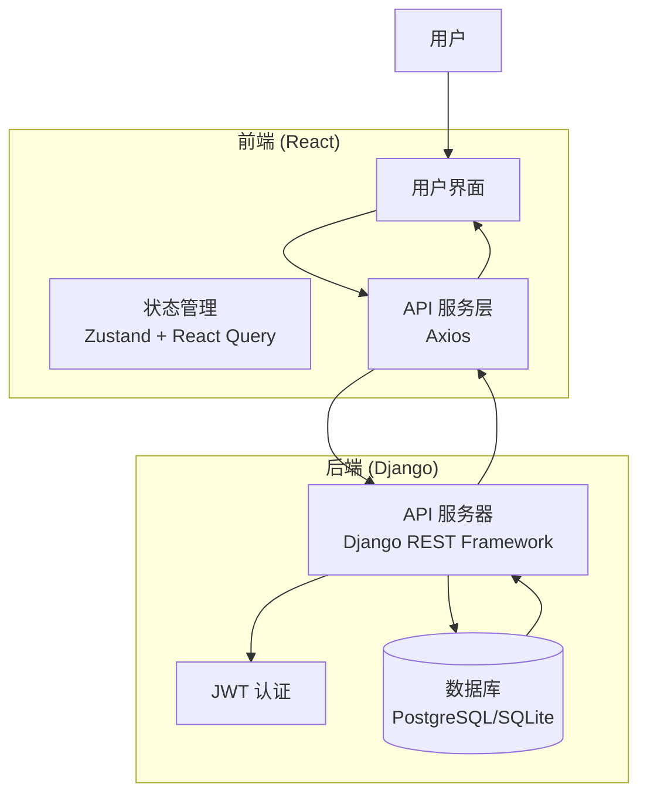

# 项目概述

<cite>
**本文档引用的文件**  
- [README.md](file://README.md)
- [PROJECT_OVERVIEW.md](file://PROJECT_OVERVIEW.md)
- [IMPLEMENTATION_SUMMARY.md](file://IMPLEMENTATION_SUMMARY.md)
- [backend/todo_project/settings.py](file://backend/todo_project/settings.py)
- [backend/apps/users/models.py](file://backend/apps/users/models.py)
- [backend/apps/tasks/models.py](file://backend/apps/tasks/models.py)
- [backend/apps/projects/models.py](file://backend/apps/projects/models.py)
- [backend/apps/tags/models.py](file://backend/apps/tags/models.py)
- [frontend/package.json](file://frontend/package.json)
- [frontend/src/types/index.ts](file://frontend/src/types/index.ts)
</cite>

## 目录
1. [项目简介](#项目简介)  
2. [核心功能模块](#核心功能模块)  
3. [技术架构与选型](#技术架构与选型)  
4. [系统上下文图](#系统上下文图)  
5. [前后端协同工作机制](#前后端协同工作机制)  
6. [目标用户群体](#目标用户群体)  
7. [整体业务流程](#整体业务流程)

## 项目简介

ChewyQoderProject 是一个功能完整的全栈任务管理系统，旨在提供与滴答清单（TickTick）相似的用户体验。系统支持任务的层级管理、多维度组织（项目/分组/标签）、时间规划等核心功能，帮助用户高效管理日常任务与工作流程。

本项目采用现代化技术栈，后端基于 Django 5.x 与 Django REST Framework 构建 RESTful API，前端使用 React 19 + TypeScript 实现响应式用户界面，通过 Vite 构建工具提升开发效率。系统支持用户认证、任务管理、项目管理、标签管理四大核心模块，具备良好的可扩展性与可维护性。

项目已实现完整的开发与生产环境部署方案，通过 Docker 容器化技术实现一键部署，支持 PostgreSQL 与 SQLite 两种数据库配置，适用于开发测试与生产上线。

**Section sources**  
- [README.md](file://README.md#L1-L321)  
- [PROJECT_OVERVIEW.md](file://PROJECT_OVERVIEW.md#L1-L216)

## 核心功能模块

### 用户管理
系统提供完整的用户生命周期管理功能，包括用户注册、登录、JWT 认证、用户信息维护等。用户通过邮箱唯一标识，支持头像与个人简介设置。后端使用 `djangorestframework-simplejwt` 实现安全的 Token 认证机制，前端通过 Zustand 管理认证状态，确保用户会话安全。

### 任务管理
任务管理是系统的核心功能，支持以下特性：
- 任务的增删改查（CRUD）操作
- 任务状态管理（待办、进行中、已完成）
- 优先级设置（无、低、中、高）
- 截止时间与开始时间规划
- 标星收藏功能
- 子任务支持（父子任务关系）
- 拖拽排序与任务分组
- 任务完成时间自动记录

任务模型支持与项目、标签的多对多关联，实现灵活的任务组织方式。

### 项目管理
项目模块用于对任务进行分类与分组管理，主要功能包括：
- 项目创建与编辑
- 项目颜色标识（视觉区分）
- 项目收藏功能（快速访问）
- 任务归属项目管理
- 项目内任务排序

每个项目归属于特定用户，支持按项目查看任务列表，提升任务组织效率。

### 标签管理
标签模块提供灵活的任务分类能力，支持：
- 标签创建与管理
- 为任务添加多个标签
- 按标签筛选任务
- 标签颜色标识
- 自动去重（同名标签合并）

系统通过 `TaskTag` 中间模型实现任务与标签的多对多关联，支持在任务描述中输入 `#标签名` 自动提取并创建标签。

**Section sources**  
- [README.md](file://README.md#L158-L183)  
- [PROJECT_OVERVIEW.md](file://PROJECT_OVERVIEW.md#L32-L57)  
- [backend/apps/tasks/models.py](file://backend/apps/tasks/models.py#L4-L72)  
- [backend/apps/projects/models.py](file://backend/apps/projects/models.py#L4-L29)  
- [backend/apps/tags/models.py](file://backend/apps/tags/models.py#L4-L54)  
- [frontend/src/types/index.ts](file://frontend/src/types/index.ts#L22-L45)

## 技术架构与选型

### 后端技术栈
- **框架**: Django 5.x + Django REST Framework
- **认证**: JWT（djangorestframework-simplejwt）
- **API 文档**: drf-spectacular（OpenAPI/Swagger）
- **数据库**: PostgreSQL（生产环境）/ SQLite（开发环境）
- **包管理**: uv
- **服务器**: Gunicorn（生产环境）
- **跨域支持**: django-cors-headers
- **环境管理**: django-environ

Django 后端采用模块化设计，分为 `users`、`tasks`、`projects`、`tags` 四个应用，每个应用包含完整的 MVC 结构。REST Framework 提供序列化、权限控制、过滤与分页功能，确保 API 安全性与可扩展性。

### 前端技术栈
- **框架**: React 19 + TypeScript
- **构建工具**: Vite
- **样式**: TailwindCSS
- **状态管理**: Zustand（全局状态）+ React Query（服务端状态）
- **路由**: React Router v6
- **包管理**: pnpm
- **拖拽排序**: React Beautiful DnD
- **日期处理**: dayjs

前端采用组件化架构，通过 React Query 实现数据缓存与自动同步，Zustand 管理用户认证状态，确保应用响应迅速、状态一致。

### 部署技术
- **容器化**: Docker + Docker Compose
- **Web 服务器**: Nginx（反向代理与静态文件服务）
- **数据库**: PostgreSQL
- **多阶段构建**: 前后端分别构建镜像

系统提供 `docker-compose.yml`（生产）与 `docker-compose.dev.yml`（开发）两套配置，支持快速启动与部署。

**Section sources**  
- [README.md](file://README.md#L5-L32)  
- [PROJECT_OVERVIEW.md](file://PROJECT_OVERVIEW.md#L9-L31)  
- [backend/todo_project/settings.py](file://backend/todo_project/settings.py#L29-L48)  
- [frontend/package.json](file://frontend/package.json#L1-L63)

## 系统上下文图

**Diagram sources**  
- [README.md](file://README.md#L34-L65)  
- [backend/todo_project/settings.py](file://backend/todo_project/settings.py#L123-L137)  
- [frontend/src/services/api.ts](file://frontend/src/services/api.ts)

## 前后端协同工作机制

系统采用前后端分离架构，通过 RESTful API 进行数据交互：

1. **用户认证流程**：
   - 前端提交用户名密码至 `/api/token/`
   - 后端验证后返回 JWT Access Token 与 Refresh Token
   - 前端存储 Token 并在后续请求中通过 `Authorization` 头传递
   - Token 过期后自动刷新

2. **数据同步机制**：
   - 前端使用 React Query 管理服务端状态
   - 任务、项目、标签数据自动缓存与刷新
   - 数据变更后自动重新获取，确保视图一致性

3. **错误处理**：
   - 后端返回标准化错误响应
   - 前端统一拦截 401 状态码并跳转登录
   - 网络异常与 API 错误通过 Toast 提示用户

4. **跨域处理**：
   - 后端通过 `django-cors-headers` 允许前端域名访问
   - 支持凭证传递（cookies、Authorization 头）

**Section sources**  
- [README.md](file://README.md#L206-L240)  
- [backend/todo_project/urls.py](file://backend/todo_project/urls.py#L1-L26)  
- [frontend/src/services/auth.ts](file://frontend/src/services/auth.ts)  
- [frontend/src/services/api.ts](file://frontend/src/services/api.ts)

## 目标用户群体

本系统主要面向以下用户群体：
- **个人用户**：需要管理日常任务、学习计划、生活事项的个人用户
- **团队协作**：小型团队或项目组进行任务分配与进度跟踪（未来可扩展）
- **开发者**：作为全栈开发学习项目，展示现代化技术栈实践
- **生产力工具爱好者**：追求高效、美观、易用的任务管理体验

系统设计注重用户体验，界面简洁直观，操作流畅，适合各类用户快速上手。

**Section sources**  
- [README.md](file://README.md#L3-L4)  
- [PROJECT_OVERVIEW.md](file://PROJECT_OVERVIEW.md#L1-L8)

## 整体业务流程

1. **用户注册与登录**：
   - 新用户填写用户名、邮箱、密码完成注册
   - 已注册用户通过 JWT 认证登录系统

2. **任务创建与管理**：
   - 用户创建任务，设置标题、描述、优先级、截止时间
   - 可将任务归入项目、添加标签、设置子任务
   - 通过拖拽调整任务顺序

3. **任务执行与完成**：
   - 在任务列表中查看待办任务
   - 点击任务查看详情并更新状态
   - 完成任务后标记为“已完成”，系统记录完成时间

4. **数据组织与筛选**：
   - 按项目查看所属任务
   - 按标签筛选相关任务
   - 通过搜索功能快速定位任务

5. **系统设置与维护**：
   - 管理个人资料与偏好设置
   - 创建与管理项目、标签
   - 查看任务统计与历史记录

系统通过清晰的业务流程设计，确保用户能够高效完成任务管理的核心目标。

**Section sources**  
- [README.md](file://README.md#L158-L183)  
- [PROJECT_OVERVIEW.md](file://PROJECT_OVERVIEW.md#L32-L57)  
- [IMPLEMENTATION_SUMMARY.md](file://IMPLEMENTATION_SUMMARY.md#L1-L249)